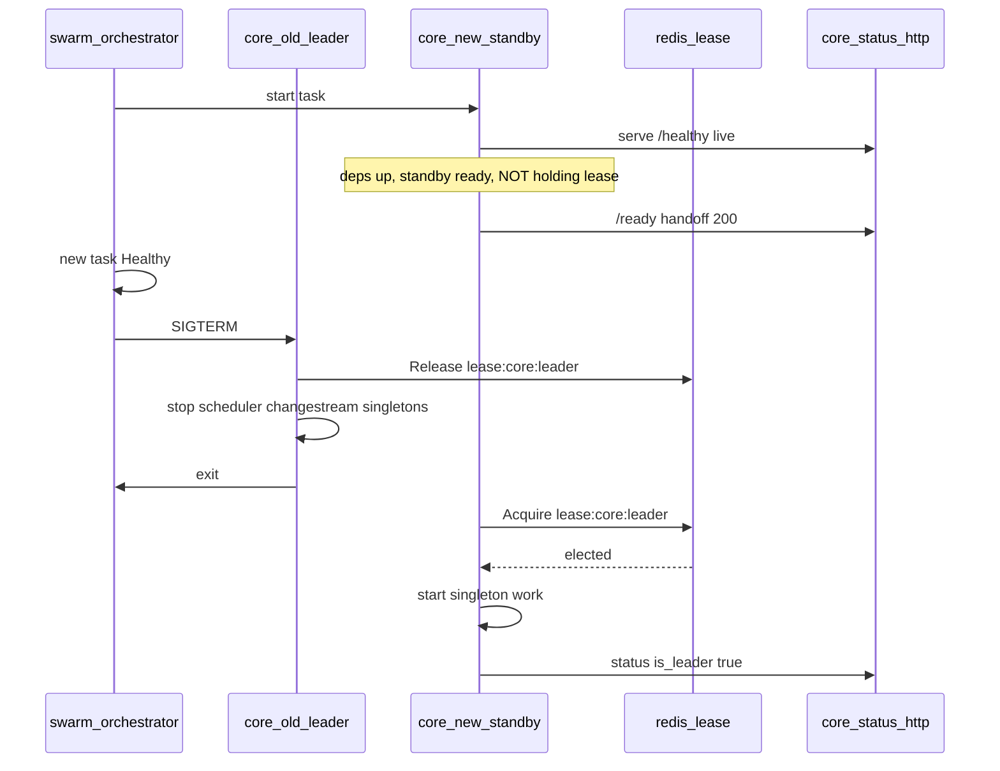
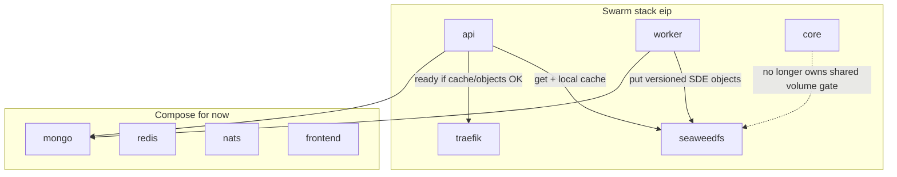

---
name: core rebuild seaweedfs
overview: Rebuild core around SeaweedFS (static-data bucket via objectstore), /healthy+/ready, Redis leader lease; stack fragments per layer; make update-data for any data-layer service; app train is app-fragment-only.
todos:
  - id: lock-remaining
    content: "SeaweedFS: fragments, update-data, static-data bucket, /healthy+/ready"
    status: completed
  - id: slice-objectstore-swarm
    content: "Slice 1: data-layer stack fragment + SeaweedFS; bring-up order; make update-data SERVICE=; provision static-data bucket"
    status: completed
  - id: slice-worker-publish
    content: "Slice 2: Worker SDE publish to static-data bucket (live_data/previous_versions layout)"
    status: completed
  - id: slice-api-ready
    content: "Slice 3: API objectstore fetch/cache + /healthy + /ready (Traefik on ready)"
    status: completed
  - id: slice-strip-core-gate
    content: "Slice 4: Remove core EnsureSDEStaticDataReady / file ready as global gate"
    status: completed
  - id: slice-core-swarm
    content: "Slice 5: Core on Swarm in app fragment; stop-first + /healthy+/ready"
    status: completed
  - id: slice-core-leader-lease
    content: "Slice 6: core /ready=handoff; lease guardrails; SIGTERM release; start-first"
    status: completed
  - id: docs-roadmap-rewrite
    content: "Rewrite ROADMAP #9/#10: fragments, SeaweedFS/objectstore, ready/lease"
    status: completed
isProject: false
---

# Core rebuild: SeaweedFS + readiness (not a Swarm stepping stone)

> Workspace copy: [docs/swarm/CORE_REBUILD.md](docs/swarm/CORE_REBUILD.md).
>
> **Object store = SeaweedFS** (`eip_seaweedfs`) + shared Go package `objectstore`. S3-compatible API on overlay `seaweedfs:8333`. Bucket layout `static-data` / `live_data/` etc.
>
> **Progress:** slices 1–6 completed. Soak/test core `start-first` handoff rolls.

## Direction (locked)

This track is a **rebuild/update of core's role**, not a minimal "get core into Swarm" wedge.

- **Commit to SeaweedFS** as the static-data source of truth, plus the **api/worker** fetch/publish paths via `objectstore`.
- **SeaweedFS lives on Swarm** from day one; **provisioned by scripts** inside existing bring-up; **no parallel `make data-*` family**.
- **App train never touches the data layer** (SeaweedFS now; mongo/redis/nats or Swarm successors later). Exclusion is by **layer**, not a growing per-service denylist on rebuild/release.
- **Single network for now:** keep attachable overlay [`eip`](docs/swarm/NETWORK.md). Multi-network split parked.
- **Singletons** stay in scope; Redis lease + workload registry; can trail object-store slices.

This revises the old "hybrid Compose data plane forever" line: SeaweedFS is the first durable store on Swarm; mongo/redis/nats may follow later under the same **order + don't cross-roll** rules. Public UX still hides Compose-vs-Swarm.

## Core primary / singleton leadership (locked)

### Does Swarm expose "primary" or hand off to the replacement?

**No.** Docker Swarm does not give application containers a leadership API or a "you are primary now; old task step down" signal.

| Swarm feature | Use for core? |
|---------------|----------------|
| `replicas: 1` + `order: stop-first` | At most one task; gap while old drains and new boots. Interim only (**current slice 5**). |
| `order: start-first` + healthcheck | Target roll: Swarm starts new -> waits until new is Healthy -> SIGTERM old. That health gate is how Docker causes the old task to release and shut down. |
| Template env (`{{.Task.Slot}}`, `{{.Task.ID}}`, ...) | Identity / metrics only — not a mutex. |
| Docker socket | Controller later may observe tasks. Do not mount into core for election. |

### Locked mechanism: Redis lease + Swarm health gate

**Lease** = who may run singleton work (SoT).
**Swarm healthcheck** = when the replacement may displace the old task.
**Status HTTP** = thin probes for Docker (controller routes later on the same server).



**Deadlock trap:** Docker healthcheck must **not** require holding the lease. If new waits to become leader before Healthy, old never gets SIGTERM -> stuck forever.

| Probe | Who calls it | Passes when | Must NOT require |
|-------|--------------|-------------|------------------|
| Swarm/Docker healthcheck | Swarm update_config | Process up + deps OK + ready to take over as standby | Holding `lease:core:leader` |
| Simple status (v1) | Docker / smoke | Same thin probes as api-style `/healthy`/`/ready` | Controller payload |
| Controller / handoff data | Future | Parked — add routes later on same server | — |

**Handoff contract (locked):**

1. New core boots -> connects mongo/redis/nats -> starts simple status HTTP -> loops trying `RunWhileHeld` on `lease:core:leader`.
2. **Guardrail:** scheduler, changestream, singleton catalog must not start until the lease is held.
3. Status reports handoff-ready once standby prerequisites pass. Swarm healthcheck -> `/ready` 200 (**not** `is_leader`).
4. Swarm marks new Healthy -> SIGTERM old.
5. Old on SIGTERM: release lease first, stop singleton work, exit within `stop_grace_period`.
6. New acquires lease -> then start scheduler/changestream/singleton catalog.

**One leader lease first** (`lease:core:leader`). Nested per-job leases remain defense in depth inside the catalog.

**Roll order target:** `start-first` once status/health + lease guardrails exist. Slice 5 uses `stop-first` until slice 6 lands.

### Guardrails (locked) — what needs them

| Workload | Decision |
|----------|----------|
| Command mode (`tasks ...`) | Out of band — one-shot |
| Telemetry / ConnectServices / metrics | Standby OK |
| **mongoindex.EnsureIndexes** | **Keep on core boot; remove from worker** (avoid N workers racing). Not lease-gated. Better Mongo owner later. |
| EnsureSDEStaticDataReady | **Removed** — SeaweedFS + api/worker `objectstore` |
| CheckRefreshTokenKeyringCoverage | Soft report only — unknown versions already warn+nil; infra errors log and continue |
| ReportSchemaVersionLag | Any replica OK |
| **scheduler / changestream / singleton catalog** | **Lease-gated workloads** — start only while leader held |
| WriteCoreReadyMarker | Replaced with thin HTTP handoff-ready |
| Thin status HTTP | Standby OK |

### Expandable workload gating (locked shape, v1 one owner)

Registry of workloads (`Name`, `LeaseKey`, `Start`/`Stop`). v1: core holds `lease:core:leader` and runs all three. Later: different containers may claim different lease keys without rewriting workloads.

```text
Standby (core v1):  deps + EnsureIndexes + status HTTP + acquire loop (+ soft reports)
Leader (core v1):   + all registered workloads for this binary
SIGTERM:            release lease(s) -> stop those workloads -> exit
```

## How SeaweedFS is set up (locked defaults)

| Decision | Choice |
|----------|--------|
| Placement | Swarm service `seaweedfs` in **data fragment** [`docker-stack.data.yml`](docker-stack.data.yml) |
| Network | Attach to existing `eip` only; DNS alias `seaweedfs` |
| Persistence | Named volume `eve-industry-planner_seaweedfs_data` |
| Image | `chrislusf/seaweedfs` (pin tag; `weed mini`) |
| S3 API | Internal only — `http://seaweedfs:8333` on `eip`. No public Traefik route |
| Console | Not public in v1 |
| Credentials | `.env` (`S3_ACCESS_KEY` / `S3_SECRET_KEY`); `swarm-secrets-sync` can refresh; real `docker secret` later (#3) |
| Bucket | Name **`static-data`** (+ `static-data-test`); provisioned by `scripts/swarm/provision-s3.sh` |
| Object layout | **Same tree as today under that bucket** — e.g. `live_data/`, `previous_versions/`, `version.json` at the usual relative paths. Later: more buckets for other data domains |
| Client | Go `services/shared/core/objectstore` (`OpenStaticData*`); SDE path helpers in `shared/core/sde` |
| Cutover | **Hard cut** — no volume dual-write/dual-read of `static_data_files` for SDE |
| Make surface | Existing verbs + order; **`make update-data SERVICE=seaweedfs`** — generic data-layer service update |
| Layer encoding | **Stack fragments** — `docker-stack.data.yml` / app stack; membership = what lives in that fragment |
| Health HTTP | **`/healthy`** and **`/ready`** on app services — simple, tool-friendly |



## Status HTTP (locked — `/healthy` + `/ready`)

| Path | Meaning | Typical use |
|------|---------|-------------|
| **`/healthy`** | Process is alive (deps connectable enough not to kill the task) | Swarm/Docker **healthcheck** — must not fail forever while waiting on data/lease |
| **`/ready`** | May take traffic / handoff role for this service | Traefik (api); for core = **handoff-ready standby** (not "I hold the lease") |

- Internal only in v1 for core (not public Traefik); api `/ready` used by Traefik healthcheck.
- Same two paths across services as we add them; richer controller JSON later on adjacent routes if needed.
- **Core deadlock rule unchanged:** `/ready` for Swarm replace must not require holding `lease:core:leader`.

## Object-store decisions (locked)

### 1. Provision via scripts — not bootstrap containers

**No large `make data-*` surface.** Merge into existing scripts; get **order** right.

| Command class | Behaviour |
|---------------|-----------|
| **Bring-up** (`make up` / `make dev`) | Ordered: **data-layer fragment** up + provision (SeaweedFS + `static-data` bucket) **before** app-layer fragment |
| **Day-2 app train** (`rebuild`, `release`, `dev-release`) | **App-layer fragment only** — never rolls data-layer services |
| **Day-2 sync** (`swarm-sync`, `swarm-secrets-sync`) | Env/checks as today; may refresh data-layer env without app-train dual-warm |
| **`make update-data`** | **Generic** targeted update for **one data-layer service** — e.g. `SERVICE=seaweedfs` now; later `SERVICE=mongo` without new make taxonomy |

Provision: `scripts/swarm/provision-s3.sh` from bring-up / `update-data`. Credentials in `.env` first.

### 2. Hard cut + bucket layout

- Bucket: **`static-data`**.
- Keys: recreate current folder layout inside the bucket (`live_data/`, `previous_versions/`, root meta/`version.json` as today).
- Future domains get **new buckets**, not a dump into `static-data`.

### 3. Layer membership = fragments

| Fragment | Contains (direction) |
|----------|----------------------|
| **Data** | SeaweedFS now; later other durable stores as they move to Swarm |
| **App** | api, websocket, worker, ws-router, traefik, core, … |

```text
Bring-up:     data fragment ready + provision -> app fragment
App train:    app fragment only
update-data:  one service from data fragment
```

## Implementation slices (ordered)

1. **Data fragment + SeaweedFS + `update-data`** — **done**
2. **Object contract + worker publish** — **done**
3. **API consume + cache + `/healthy` + `/ready`** — **done** (Traefik gates on `/ready`)
4. **Strip core static gate** — **done**
5. **Core onto Swarm (app fragment)** — **done** (stop-first; `/healthy` + `/ready`)
6. **Core leader lease + handoff** — **pending** — `/ready` = handoff-ready; lease guardrails; `start-first`
7. **Later:** controller routes; multi-network; grow data fragment

## Explicitly parked

- Overlay split (`public` / `app` / `data` / `obs`)
- Real Docker Swarm `secret` objects for S3 creds (`.env` first)
- Folding mongo/redis/nats onto Swarm (same order + don't-cross-roll when that lands)
- Swarm bootstrap/init containers for SeaweedFS
- Parallel public `make data-*` taxonomy (rejected — use bring-up order + one generic `update-data`)
- Stuffing unrelated domains into the `static-data` bucket (use more buckets later)
- Swarm-native primary / Docker-socket election
- Public SeaweedFS / S3 console via Traefik
- Controller-rich status and peer handoff-data exchange
- Multi-active scheduler/changestream redesign
- Dual-write static volume + object store

## Docs impact (when implementing)

Update ROADMAP #9/#10 / Phase B/C; document bring-up order, **fragment-per-layer**, `update-data`, `/healthy`+/`/ready`, and `static-data` bucket layout in MAKE/ENV/STACK/BIND_MOUNTS. (STACK/MAKE already partially updated.)

## Roadmap alignment

| Roadmap item | How it ties in |
|--------------|----------------|
| **#9** Core Swarm singleton | Slice 5 — core in **app fragment**; stop-first first, then start-first after leases |
| **#10** Ready without Compose depends_on | Per-service **`/healthy` + `/ready`**; api owns static readiness; core `/ready` = handoff-ready standby |
| **#11 / #12** Lease-gate scheduler + changestream | Slice 6 — under `lease:core:leader` + workload registry |
| **#13** start-first hot-swap | Slice 6 end state |
| **#5 / STACK** split | **Fragment-per-layer** — data vs app |
| **#17 / #23 / #33** make surface / app train | **App train = app fragment only**; **`make update-data`** for data fragment |
| **#22** Data-plane updates | Pattern now with SeaweedFS + `update-data` |
| **#3 / BIND_MOUNTS** static volume | Hard cut off `static_data_files` for SDE — objects in SeaweedFS `static-data` |

### Do not pull in (stay separate)

Capacity controller (#18/#19/…), WS deepen (#8/#20/#21), obs addon (#34), frontend on Swarm (#16), real docker secrets (#3), full test harness redesign, moving mongo/redis/nats onto Swarm.
