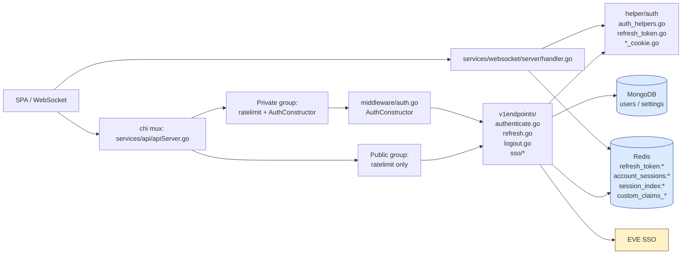
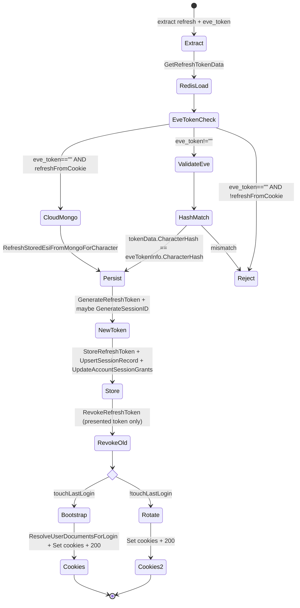
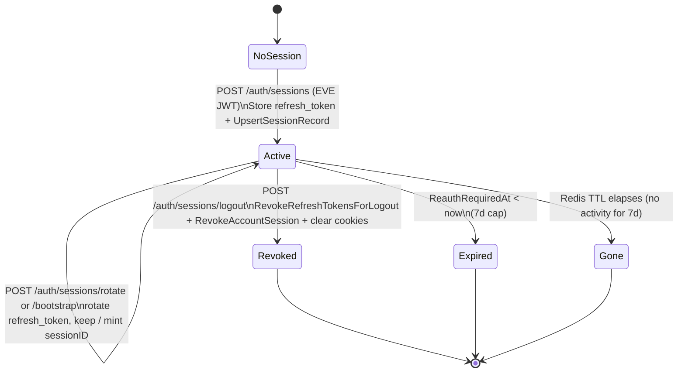

# Authentication — Backend

How the Go API and websocket services authenticate every request, how the EVE SSO and planner session endpoints work, what lives in Redis, and how the deprecated internal JWT layer was replaced with cookie + Redis session lookup.

> Companion docs: **[README.md](./README.md)** for overview / wire contracts, **[FRONTEND.md](./FRONTEND.md)** for SPA detail, **[ROADMAP.md](./ROADMAP.md)** for full-stack backlog and test matrix.

---

## 1. Architecture



**One-line model**: middleware reads `eip_session` → resolves to `(accountID, sessionID, AccountSession)` in Redis → attaches to context. Handlers consume identity via `helper.RequireAccountID(r)` and `auth.ExtractSessionID(r)`; no JWT signing happens server-side.

---

## 2. Middleware — `AuthConstructor`

Defined in `services/api/middleware/auth.go`:

```go
func AuthConstructor(redisClient *redis.Client) MiddlewareConstructor {
    return func(next http.Handler) http.Handler {
        return http.HandlerFunc(func(w http.ResponseWriter, r *http.Request) {
            identity, err := auth.ExtractAccountSession(r.Context(), r, redisClient)
            if err != nil {
                // session_missing | session_revoked | reauth_required | <fallback to session_missing>
                writeAuthError(w, http.StatusUnauthorized, code)
                return
            }
            if err := auth.TouchAccountSession(r.Context(), redisClient,
                identity.AccountID, identity.SessionID, identity.Session.AppVersion); err != nil {
                writeAuthError(w, http.StatusUnauthorized, "session_missing")
                return
            }
            ctx := auth.WithAuthIdentity(r.Context(), identity.AccountID, identity.SessionID)
            next.ServeHTTP(w, r.WithContext(ctx))
        })
    }
}
```

**Error payload**:

```json
{ "code": "session_missing | session_revoked | reauth_required", "message": "Unauthorized" }
```

**Per-request side effect**: `TouchAccountSession` updates `LastSeenAt` on the session row so dashboards / cleanup tools can see live sessions.

**Wiring**: in `services/api/apiServer.go` the router exposes two groups:

- `publicRoutes` — only rate limiting.
- `privateGroup` — rate limiting + `AuthConstructor(clients.Redis)`.

All `/api/v1/auth/sessions[/rotate|/bootstrap]` and the SSO exchange/refresh endpoints are **public** (they must run before a session exists). `/api/v1/auth/sessions/logout` is **private** (a session must exist to revoke it).

---

## 3. Redis key layout

Defined in `services/api/helper/auth/refresh_token.go`.

### 3.1 Key prefixes & TTLs

```go
RefreshTokenKeyPrefix    = "refresh_token:"          // 7d TTL
SessionKeyPrefix         = "session:"                 // 7d TTL  (legacy individual rows; see UpsertSessionRecord)
AccountSessionsKeyPrefix = "account_sessions:"        // 7d TTL  (primary; map of sessions per account)
SessionIndexKeyPrefix    = "session_index:"           // 7d TTL  (reverse lookup)
CorporationKeyPrefix     = "custom_claims_corporations:"  // 30d TTL
AllianceKeyPrefix        = "custom_claims_alliances:"     // 30d TTL

RefreshTokenTTL = 7 * 24 * time.Hour
SessionTTL      = RefreshTokenTTL
CorporationTTL  = 30 * 24 * time.Hour
```

### 3.2 `RefreshTokenData` (`refresh_token:<token>`)

```go
type RefreshTokenData struct {
    CharacterHash string
    AccountID     string
    Scopes        []string
    Corporations  CorporationIDs // []int64 (lenient unmarshal: bad shapes -> empty)
    Alliances     AllianceIDs    // []int64
    SessionID     string         // empty on legacy rows; refresh handler backfills
    SessionStart  time.Time      // first time this device/session chain was bound
    SessionSeenAt time.Time      // last refresh time on this chain
    AppVersion    string         // SPA build version (X-App-Version, "unknown" if absent)
}
```

### 3.3 `AccountSessionsRecord` (`account_sessions:<accountID>`)

```go
type AccountSession struct {
    SessionID        string
    CharacterHash    string
    AppVersion       string
    StartedAt        time.Time
    LastSeenAt       time.Time
    ReauthRequiredAt time.Time
    RevokedAt        *time.Time     // nil = active
    Grants           SessionGrants  // { CorporationIDs []int64, AllianceIDs []int64 }
}

type AccountSessionsRecord struct {
    AccountID     string
    Grants        SessionGrants
    Sessions      map[string]AccountSession
    GrantsVersion int64
    UpdatedAt     time.Time
}
```

One account may hold N concurrent sessions (e.g. multiple devices). `ReauthRequiredAt = StartedAt + RefreshTokenTTL`.

### 3.4 `session_index:<sessionID>` → `<accountID>`

Plain string value. Lets the middleware go from a `sessionID` (carried by the cookie) to an `accountID` without scanning, then drill into `account_sessions:<accountID>[sessionID]`.

### 3.5 Helper functions

Defined in `services/api/helper/auth/refresh_token.go`:

| Function | Purpose |
|---|---|
| `GenerateRefreshToken()` / `GenerateSessionID()` | Mint opaque UUIDs (fallback to URL-base64 of 32 random bytes). |
| `StoreRefreshToken(ctx, client, token, data)` | Set `refresh_token:<token>` with the 7d TTL. |
| `GetRefreshTokenData(ctx, client, token)` | Fetch; returns `ErrRefreshTokenNotFound` if absent. |
| `RevokeRefreshToken(ctx, client, token)` | DEL key. |
| `UpsertSessionRecord(ctx, client, SessionRecord)` | Add / merge the session row into `account_sessions:<accountID>`. Also writes `session_index:<sessionID>`. |
| `TouchAccountSession(ctx, client, accountID, sessionID, appVersion)` | Update `LastSeenAt` (and optionally `AppVersion`) for one session row. |
| `RevokeAccountSession(ctx, client, accountID, sessionID)` | Remove the session row; delete `session_index:<sessionID>`. |
| `ResolveAccountSessionBySessionID(ctx, client, sessionID)` | Two-step: read `session_index:<sessionID>`, then load the session out of `account_sessions:<accountID>`. |
| `UpdateAccountSessionGrants(ctx, client, accountID, corps, alliances)` | Refresh the cached grants on every active session row. |
| `GetCorporations` / `GetAlliances` | Read the `custom_claims_*` caches; lenient on malformed JSON. |

---

## 4. Identity context

Defined in `services/api/helper/auth/auth_helpers.go`:

```go
type AccountSessionIdentity struct {
    AccountID string
    SessionID string
    Session   AccountSession
}

func WithAuthIdentity(ctx context.Context, accountID, sessionID string) context.Context
func AccountIDFromContext(ctx context.Context) string
func SessionIDFromContext(ctx context.Context) string

func ExtractAccountID(r *http.Request) (string, error)  // reads context only
func ExtractSessionID(r *http.Request) (string, error)  // reads context only

// "Hot" version: cookie + Redis directly (used by middleware + WS upgrade)
func ExtractAccountSession(ctx, r, redisClient) (*AccountSessionIdentity, error)
```

`ExtractAccountSession` returns one of these errors (mapped to `code` in `AuthConstructor`):

- `session_missing` — no `eip_session` cookie, or no Redis row.
- `session_revoked` — `RevokedAt != nil`.
- `reauth_required` — `ReauthRequiredAt < now`.
- other — coerced to `session_missing` for the client.

**Handler-side helpers** in `services/api/helper/httpGuards.go`:

```go
func RequireAccountID(w http.ResponseWriter, r *http.Request) (string, bool)
func RequireMethod(w http.ResponseWriter, r *http.Request, m string) bool
```

`RequireAccountID` returns the context-stored account id or writes `401`. Handlers consume identity through this pair — they never look at the cookie directly.

---

## 5. Cookies

| Name | File | HttpOnly | Path | Constants |
|---|---|---|---|---|
| `eip_session` | `services/api/helper/auth/session_cookie.go` | yes | `/` | `AppSessionCookieName`. MaxAge = `RefreshTokenTTL` seconds. `Secure`, `SameSite=Lax`. |
| `eip_app_refresh` | `services/api/helper/auth/app_refresh_cookie.go` | yes | `/api/v1/auth` | `AppRefreshCookieName`. Scoped to auth paths so the value is never sent on data endpoints. |
| `eip_esi_oauth_storage` | `services/api/helper/auth/esi_oauth_storage_cookie.go` | **no** | `/` | `EsiOAuthStorageCookieName` + `EsiOAuthStorageServer`/`EsiOAuthStorageClient`. |

`SetEsiOAuthStorageCookieFromUserCloud(userCloudAccounts bool)` is the helper login/refresh handlers use; it normalises the value to `"server"` or `"client"`.

---

## 6. Endpoints

### 6.1 `POST /api/v1/auth/sessions` (public) — `AuthHandler`

File: `services/api/v1endpoints/authenticate.go`.

```go
const (
    maxTokenLength        = 8192   // EVE SSO access JWT
    maxRefreshTokenLength = 512    // planner refresh token
)
```

**Steps** (numbered to match the code):

1. `config.LoadConfig()` (env-driven).
2. `RequireMethod(POST)`.
3. `extractTokenFromRequest(r)` → JSON `{ token }`; rejects empty / `> 8KB`.
4. `auth.ValidateEveTokenAndExtractHash(ctx, tokenString, cfg.EveSSOClientID)` → verifies CCP's signing key, extracts `CharacterHash` (`owner` claim) + scopes.
5. `accountID = auth.GetAccountIDFromCharacterHash(characterHash)`.
6. `extractAppVersion(r)` reads `X-App-Version` (`"unknown"` if blank).
7. `GetCorporations` / `GetAlliances` from Redis caches.
8. `GenerateRefreshToken()` + `GenerateSessionID()`.
9. `StoreRefreshToken(refresh_token:<token>, RefreshTokenData{…})`.
10. `UpsertSessionRecord(account_sessions:<accountID>[sessionID])` (also writes `session_index:`).
11. `UpdateAccountSessionGrants` (best-effort).
12. `ResolveUserDocumentsForLogin` (Mongo) → user document + application settings + first-login flag.
13. **Cloud branch** (`userOut.UserCloudAccounts`): `BuildCloudLinkedCharactersForLogin` decrypts stored ESI refresh tokens with `cfg.RefreshTokenKeyring` and freshens an ESI access token for each linked character. `StripRefreshTokensFromUserDocumentForClient` removes secrets from the response body.
14. **NATS task** (cloud only, JetStream available): `UpdateAccountSessionGrants` task to recompute corp/alliance membership across all character access tokens.
15. Build `SessionBootstrapResponse{ kind:"session_bootstrap", … }`.
16. **Set cookies**: `SetAppSessionCookie(sessionID)`; cloud → `SetAppRefreshCookie(refreshToken)` + `response.RefreshToken = ""`; always `SetEsiOAuthStorageCookieFromUserCloud(userOut.UserCloudAccounts)`.
17. Headers `Content-Type: application/json`, `Cache-Control: no-store`, `Pragma: no-cache`.
18. `200 OK` + JSON body.

### 6.2 `POST /api/v1/auth/sessions/rotate` and `/bootstrap` (public) — `refreshHandler`

File: `services/api/v1endpoints/refresh.go`. `RotateHandler` and `BootstrapHandler` are thin wrappers passing `touchLastLogin = false / true`.

**Credential extraction** (`extractRefreshCredentials`):

- JSON body `RefreshRequest { refresh_token, eve_token }`.
- Body `refresh_token` **wins** over the `eip_app_refresh` cookie.
- `refreshFromCookie = true` only when the body was empty *and* the cookie supplied the token.

**State machine** (refresh.go body):



Key implementation notes:

- **`eve_token == ""` is only legal when `refreshFromCookie`** (cookie cloud resume). The handler then calls `RefreshStoredEsiFromMongoForCharacter` to mint a fresh ESI access from the encrypted Mongo refresh token. Errors map to `cloud_esi_not_found` / `cloud_stored_esi_internal` / `Stored ESI refresh invalid` etc.
- **`eve_token != ""`**: validated with `auth.ValidateEveTokenAndExtractHash`; `tokenData.CharacterHash` **must** match `eveTokenInfo.CharacterHash`, else `401 Invalid token`.
- **Session backfill**: legacy `refresh_token:` rows may lack `SessionID`. The handler mints one (`refresh_backfill` flow on rotate, `login_refresh` on bootstrap) and stamps `SessionStart`.
- **Only the presented token is revoked** (`RevokeRefreshToken(refreshToken)`). Other devices' refresh-token rows are untouched — they each rotate themselves on their own cadence.
- **Bootstrap path** reloads `ResolveUserDocumentsForLogin` + cloud linked characters (same logic as login).
- **Cookie writes**: always `SetAppSessionCookie(updatedTokenData.SessionID)`; when `refreshFromCookie` → `SetAppRefreshCookie(newRefreshToken)`; on bootstrap → also `SetEsiOAuthStorageCookieFromUserCloud(userOut.UserCloudAccounts)`.
- **Response body**: `refresh_token` is **omitted** in the JSON when `refreshFromCookie` (cookie carries the new value); when the SPA supplied the token in the body, the new value is returned in the body.

### 6.3 `POST /api/v1/auth/sessions/logout` (private) — `LogoutHandler`

File: `services/api/v1endpoints/logout.go`.

```mermaid
sequenceDiagram
    autonumber
    participant C as Client
    participant M as middleware.AuthConstructor
    participant H as LogoutHandler
    participant R as Redis

    C->>M: POST /logout (Cookie eip_session, eip_app_refresh; body { refresh_token? })
    M->>R: ExtractAccountSession + TouchAccountSession
    M-->>H: ctx with WithAuthIdentity
    H->>H: RequireMethod(POST)
    H->>H: RequireAccountID -> account_id
    H->>H: extractLogoutRefreshTokenFromRequest (body or eip_app_refresh)
    H->>R: GetRefreshTokenData(token)
    R-->>H: tokenData
    alt tokenData.AccountID != account_id
        H-->>C: 401 Unauthorized
    else
        H->>H: sessionID = SessionIDFromContext || tokenData.SessionID
        H->>R: RevokeRefreshTokensForLogout(presented, sessionID)\n  Del refresh_token:* + session_refresh index
        H->>R: RevokeAccountSession(account_id, sessionID)
        H->>C: Set-Cookie clear eip_app_refresh, eip_esi_oauth_storage, eip_session
        H-->>C: 204 No Content
    end
```

**Revocation order**: `RevokeRefreshTokensForLogout` (`services/api/helper/auth/session_persist.go`) runs **before** `RevokeAccountSession`. It deletes the presented `refresh_token:<token>`, clears `session_refresh:<session_id>` when it points at a different token (stale cookie after rotation), and scans for a legacy row still bound to the same `session_id`. Subsequent `POST /auth/sessions/rotate` or `/bootstrap` with a captured refresh value returns `401 Invalid token`.

**Mongo ESI refresh secrets** (`users.refreshTokens`) are unchanged on logout — only planner session material in Redis and auth cookies are cleared.

### 6.4 `POST /api/v1/eve-sso/tokens/exchange` (public) — `EveSSOExchangeHandler`

File: `services/api/v1endpoints/sso/exchangeHandler.go`.

**Steps**:

1. `loadSSOConfigOrRespond` (cfg with `EveSSOClientID` + `EveSSOClientSecret`).
2. `ensurePostMethod`.
3. `extractAuthCodeFromRequest` → JSON `{ auth_code, account_type? }`; rejects empty or `> maxAuthCodeLength`.
4. `validateSSOCredentialsOrRespond` — confirms env credentials are non-empty.
5. `ctx, cancel := context.WithTimeout(ctx, 30s)`.
6. `exchangeAuthCodeForEveSSOTokens(ctx, clientID, secret, authCode)` → POSTs CCP's token endpoint.
7. Reject empty `access_token`.
8. `extractCharacterHashFromEveSSOAccessToken` (best-effort; degraded on parse error → log + continue).
9. Encode `EveSSOTokenPayload { access_token, refresh_token, token_type, expires_in }`.

**No planner state is touched.** This endpoint exists purely so the SPA never has to embed `EVE_CLIENT_SECRET`.

### 6.5 `POST /api/v1/eve-sso/tokens/refresh` (public) — `EveSSORefreshHandler`

File: `services/api/v1endpoints/sso/refreshHandler.go`. Same shape as exchange, but with `RefreshEveSSOAccessToken` — CCP's `grant_type=refresh_token`. Response is the same `EveSSOTokenPayload`. Used by the SPA only for **local** (browser-stored) ESI refresh material; cloud accounts go through `cloudStoredEsiRefresh.go` instead.

---

## 7. WebSocket upgrade auth

File: `services/websocket/server/handler.go` → `HandleWS`.

**Pre-upgrade auth steps** (mirrors API middleware):

```go
1. if apihelperauth.ReadAppSessionCookie(r) == "" -> 401 session_missing
2. if s.ServiceClients == nil || .Redis == nil    -> 503 Service unavailable
3. identity, err := apihelperauth.ExtractAccountSession(reqCtx, r, redis)
   if err -> 401 with err.Error()  (session_missing|session_revoked|reauth_required)
4. apihelperauth.TouchAccountSession(...)         -> 401 if it fails
5. enforce per-user connection cap (closes oldest)
6. upgrader.Upgrade(w, r, nil)
7. build Client{ AccountID, SessionID, Scopes, granted*IDs from identity.Session.Grants }
8. send { type:"connected", clientID } over the new socket
```

**No JWT verification.** The deleted `services/websocket/sso/{jwks,jwt,types}.go` would have parsed a custom RSA-signed token; the new implementation shares the *exact same* `auth.ExtractAccountSession` as the REST middleware so there is **one** identity check in the codebase.

Multiple tabs share one `sessionID`; the WS layer does **not** evict by session id — each tab gets its own `Client` keyed by an opaque `clientID = fmt.Sprintf("%p", conn)`.

---

## 8. Encryption / signing

| Material | Mechanism | Where |
|---|---|---|
| **EVE ESI access JWT** | Verified with CCP's JWKS via `services/api/helper/sso` (`ValidateEveTokenAndExtractHash`). Audience claim is `cfg.EveSSOClientID`. | `auth_helpers.go` |
| **Planner refresh token** | Opaque random UUID. Stored as plaintext JSON in Redis with a 7d TTL. **No** at-rest encryption — Redis is the trust boundary. | `refresh_token.go` |
| **Planner session id** | Opaque random UUID. Stored inside `account_sessions:<accountID>`. Cookie value is the session id directly. | `refresh_token.go` |
| **ESI refresh token at rest** (cloud accounts only) | AES-GCM via a keyring from env (`REFRESH_TOKEN_AES_KEY`, optional `REFRESH_TOKEN_AES_KEY_VERSION`, optional `REFRESH_TOKEN_AES_LEGACY_KEYS`). Lives in Mongo `users.refreshTokens`. | `services/shared/core/crypto/keyrings/refresh_token.go` |
| **Internal JWT** | **REMOVED.** The old `services/shared/core/internaljwt/{jwt,key_cache,rsa_keys}.go` and `services/api/v1endpoints/jwks.go` are deleted. `Config` still has `AuthSecret` / `ExternalJWT*` fields, but no handler references them — they are reserved / legacy. | — |

---

## 9. Config

File: `services/shared/core/config/config.go`. `LoadConfig` populates a `Config` struct from environment variables. Auth-relevant fields:

| Field | Env var(s) | Notes |
|---|---|---|
| `EveSSOClientID` | `EVE_CLIENT_ID` | Required for SSO + token validation (`aud`/`azp`). |
| `EveSSOClientSecret` | `EVE_CLIENT_SECRET` | Required for SSO token requests. |
| Redis | `REDIS_HOST`, `REDIS_PORT`, `REDIS_PASSWORD` | All auth state lives here. |
| `RefreshTokenKeyring` | `REFRESH_TOKEN_AES_KEY` (+ optional `*_VERSION`, `*_LEGACY_KEYS`) | AES-GCM keyring for Mongo-stored ESI refresh; built by `keyrings.NewRefreshTokenKeyringSpec()`. |

---

## 10. `services/shared/firebaseadmin`

Firebase **Admin** SDK wiring lives here, but **is not part of per-request authentication**.

- `client.go` — `getFirebaseApp`, `GetFirestoreClient`, `GetAuthClient`, `Close`. Lazy singletons. Env: `GOOGLE_APPLICATION_CREDENTIALS` (path), `FIREBASE_PROJECT_ID` (optional override).
- `auth_recency.go` — `AccountHasAuthActivitySince`, `DefaultRecencyForActiveAccounts`. Reads `firebase.Auth.GetUser(...)` for migration filtering.
- `client_test.go` — `Test_getFirebaseApp_withoutFirebaseProjectID`: writes a fake service-account JSON to a temp file, clears `FIREBASE_PROJECT_ID`, asserts the app initialises (project id can be embedded in the JSON).

There is **no `VerifyIDToken` or `CustomToken` call anywhere in this package**: the planner does not mint or verify Firebase tokens at runtime.

---

## 11. Routing table

From `services/api/apiServer.go`:

| Path | Method | Group | Handler |
|---|---|---|---|
| `/api/v1/auth/sessions` | POST | public | `v1endpoints.AuthHandler` |
| `/api/v1/auth/sessions/rotate` | POST | public | `v1endpoints.RotateHandler` |
| `/api/v1/auth/sessions/bootstrap` | POST | public | `v1endpoints.BootstrapHandler` |
| `/api/v1/auth/sessions/logout` | POST | **private** (`AuthConstructor`) | `v1endpoints.LogoutHandler` |
| `/api/v1/eve-sso/tokens/exchange` | POST | public | `ssoendpoints.EveSSOExchangeHandler` |
| `/api/v1/eve-sso/tokens/refresh` | POST | public | `ssoendpoints.EveSSORefreshHandler` |
| `/ws` | GET (Upgrade) | (`services/websocket/server`) | `Server.HandleWS` (cookie + Redis check) |

Every other private handler under `services/api/v1endpoints/**` is wrapped by `AuthConstructor` and consumes identity via `helper.RequireAccountID(w, r)` (account) and `auth.ExtractSessionID(r)` (session, used by document-lock, group / job-document mutations, and watchlist updates).

---

## 12. Failure / status mapping

| Trigger | API response |
|---|---|
| No `eip_session` cookie / Redis row missing | `401 {"code":"session_missing"}` |
| `AccountSession.RevokedAt != nil` | `401 {"code":"session_revoked"}` |
| `ReauthRequiredAt < now` (7d cap) | `401 {"code":"reauth_required"}` |
| Refresh: `refresh_token:` row missing | `401 "Invalid token"` |
| Refresh: `eve_token` invalid / expired (text varies) | `401 <error message>` |
| Refresh: `eve_token == ""` and `!refreshFromCookie` | `400 "eve_token is required …"` |
| Refresh: cloud Mongo ESI missing | `401 "Invalid token"` (mapped) |
| Logout: presented refresh token's account does not match session account | `401 "Unauthorized"` |
| Login: EVE JWT validation failure | `401 <auth.GetEveTokenErrorMessage(err)>` |
| Login / refresh: Redis error | `500 "Internal server error"` |

---

## 13. Lifecycle on a single session



---

## 14. Testing notes

- **`services/shared/firebaseadmin/client_test.go`** — only ensures the Admin app can boot without `FIREBASE_PROJECT_ID`; not auth-flow coverage.
- **No JWT signing tests exist** because there is no internal JWT to sign — the previous tests under `internaljwt/` are deleted along with the module.
- **Integration tests for cookies, Redis CRUD, and the refresh state machine** live alongside their handler packages (search for `*_test.go` under `services/api/v1endpoints/`).
- **EVE JWT validation** uses CCP's live JWKS; for tests, mock the verifier through the helpers in `services/api/helper/sso`.

---

## 15. Operational notes

- **Redis is in the critical path of every authenticated request.** A Redis outage degrades to `401 {"code":"session_missing"}` (middleware returns this when `TouchAccountSession` fails). Consider a circuit breaker if you need to keep the SPA reachable during partial outages.
- **Cookie scope matters.** `eip_app_refresh` is deliberately scoped to `/api/v1/auth` so even an XSS bug on a data route cannot exfiltrate the refresh value. Keep this invariant when adding new auth paths.
- **No public JWKS endpoint.** Anything that previously hit `/.well-known/jwks.json` for the planner's internal key has been removed; consumers should not exist.
- **Cleanup**: `auth.RunAuthSessionMaintenance` (worker cron every 4h via `pruneExpiredAccountSessions`, core singleton `auth-session-maintenance` hourly) prunes expired `account_sessions` rows, deletes orphan `session_index:*` keys, and revokes `refresh_token:*` rows whose `session_id` is missing from `account_sessions`. Set `AUTH_SESSION_CLEANUP_DRY_RUN=true` to log counts without deleting. **Logout** revokes the presented planner refresh row immediately; maintenance still catches orphans from crashed tabs or partial failures. Bulk revoke per account remains **#21** (admin endpoint).
- **Grants caching**: `custom_claims_corporations:<accountID>` and `custom_claims_alliances:<accountID>` are *advisory* — the websocket scope checks fall back to `identity.Session.Grants`, which `UpdateAccountSessionGrants` refreshes on every login / rotate / bootstrap.

---

## 16. Files

| Path | Role |
|---|---|
| `services/api/middleware/auth.go` | `AuthConstructor` |
| `services/api/middleware/requestlogging.go` | `X-Request-ID`, Hijack/Flush for WS upgrade |
| `services/api/helper/auth/auth_helpers.go` | Context keys, EVE JWT validation, `ExtractAccountSession` |
| `services/api/helper/auth/refresh_token.go` | Redis types, key prefixes, TTLs, CRUD |
| `services/api/helper/auth/session_persist.go` | Session verify helpers; `RevokeRefreshTokensForLogout` |
| `services/api/helper/auth/session_persist_test.go` | Logout refresh revocation tests |
| `services/api/helper/auth/session_cookie.go` | `eip_session` cookie |
| `services/api/helper/auth/app_refresh_cookie.go` | `eip_app_refresh` cookie |
| `services/api/helper/auth/esi_oauth_storage_cookie.go` | `eip_esi_oauth_storage` cookie |
| `services/api/helper/headers.go` | `X-WS-Client-ID`, `X-Session-ID` constants |
| `services/api/helper/httpGuards.go` | `RequireAccountID`, `RequireMethod` |
| `services/api/helper/request_context.go` | `PopulateRequestMeta` for downstream logs/metrics |
| `services/api/v1endpoints/authenticate.go` | `AuthHandler` |
| `services/api/v1endpoints/refresh.go` | `RotateHandler` / `BootstrapHandler` / `refreshHandler` |
| `services/api/v1endpoints/logout.go` | `LogoutHandler` |
| `services/api/v1endpoints/session_types.go` | JSON contracts (`SessionBootstrapResponse`, `SessionRotateResponse`) |
| `services/api/v1endpoints/sso/exchangeHandler.go` | `EveSSOExchangeHandler` |
| `services/api/v1endpoints/sso/refreshHandler.go` | `EveSSORefreshHandler` |
| `services/api/v1endpoints/sso/helpers.go` / `requestParsers.go` / `types.go` | SSO request/credential helpers, length caps |
| `services/api/apiServer.go` | Route table; wires public vs private groups |
| `services/websocket/server/handler.go` | `HandleWS` — shared cookie+Redis auth on upgrade |
| `services/shared/core/config/config.go` | Env loader |
| `services/shared/core/crypto/keyrings/refresh_token.go` | AES-GCM keyring for Mongo-stored ESI refresh |
| `services/shared/firebaseadmin/client.go` / `auth_recency.go` / `client_test.go` | Firebase Admin SDK (migration / Firestore admin reads, not request auth) |

### Deleted (reference)

- `services/api/v1endpoints/jwks.go`
- `services/shared/core/internaljwt/{jwt,key_cache,rsa_keys}.go`
- `services/websocket/sso/{jwks,jwt,types}.go`

All replaced by the shared `helper/auth` package described above.
