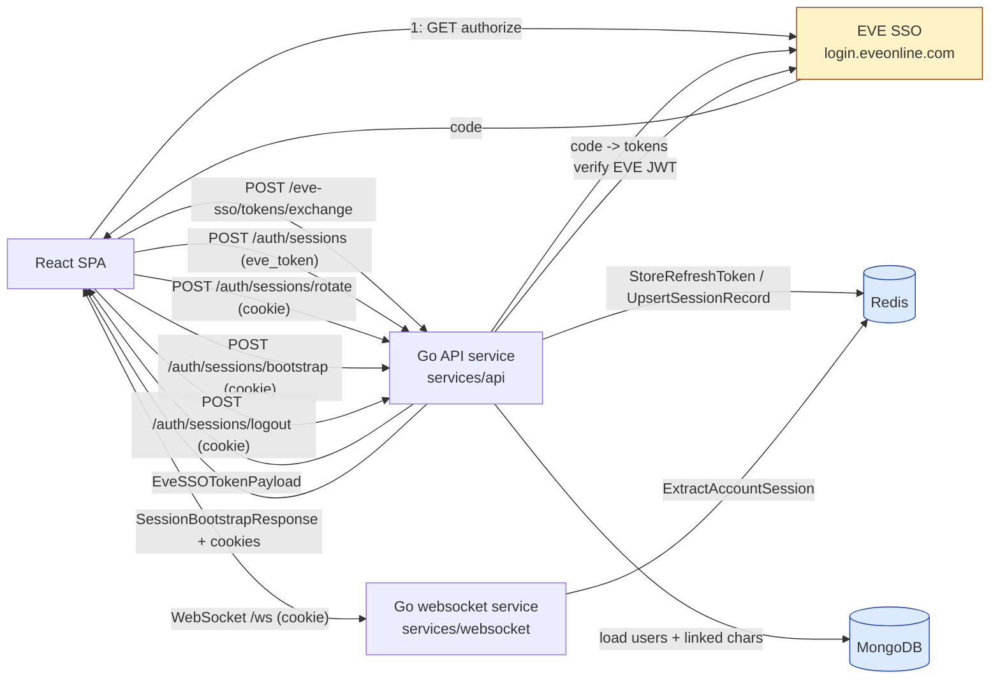
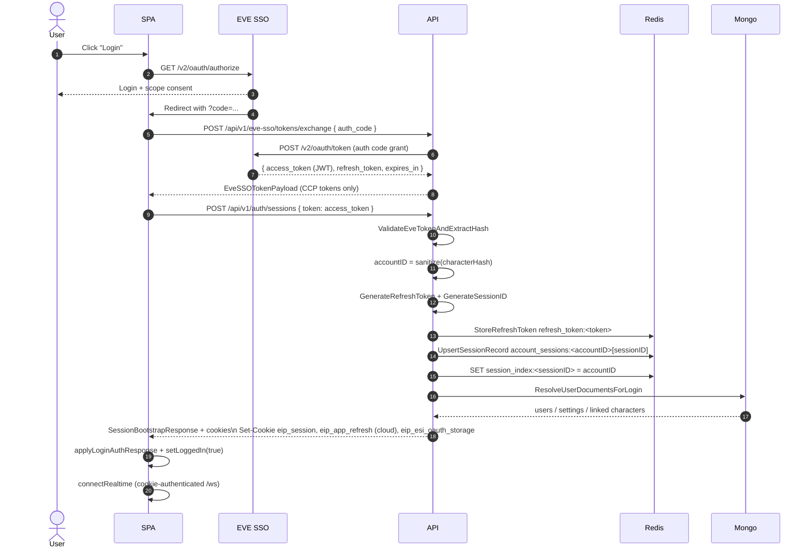
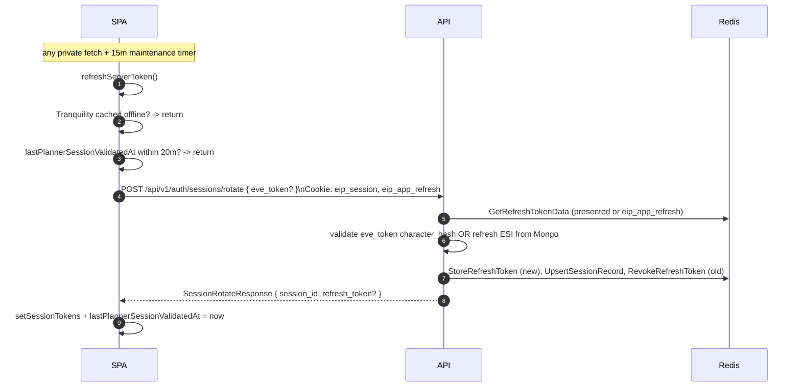
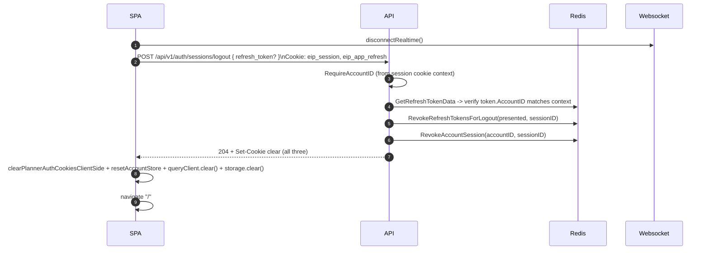
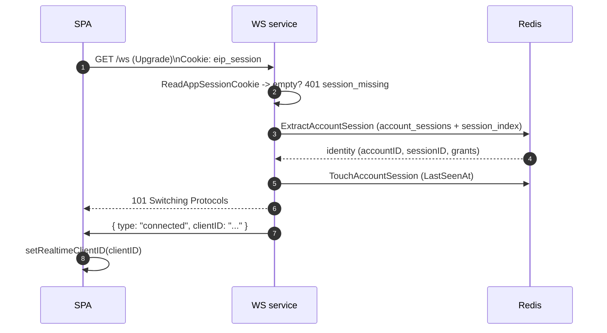

# Authentication & Session System

End-to-end documentation for the planner's authentication and session-handling subsystem after the migration **off** of internal API-issued JWTs and **onto** Redis-backed session cookies + EVE SSO.

> Documentation is split into four files:
>
> - **README.md** (this file) — vocabulary, cross-stack architecture, the wire contract, end-to-end flows, environment, and a file index.
> - **[FRONTEND.md](./FRONTEND.md)** — React app: bootstrap modes, Zustand actions, request-time auth, refresh cooldown, Tranquility gate, signout, realtime auth.
> - **[BACKEND.md](./BACKEND.md)** — Go API: middleware, Redis key layout, handler-by-handler contracts, refresh state machine, websocket upgrade auth.
> - **[ROADMAP.md](./ROADMAP.md)** — full-system backlog: EVE SSO, Redis sessions, HTTP/WS, ESI maintenance, SPA, tests, ops, and related rollouts (see system map there).
> - **[Frontend lifecycles roadmap](../frontend-lifecycles/ROADMAP.md)** — move SPA auth/character maintenance clocks out of React `useEffect` into a boot-time supervisor.

---

## 1. Vocabulary

| Term | Definition |
|---|---|
| **EVE SSO** | CCP's OAuth 2.0 server at `login.eveonline.com`. Issues `access_token` (JWT, ~20m) and `refresh_token` (opaque, long-lived). |
| **ESI access JWT** | The short-lived OAuth access token CCP returns. Verified locally with EVE's JWKS. Carries the **character hash** in the `owner` claim. |
| **ESI refresh token** | The long-lived OAuth refresh secret. **For cloud accounts** it lives encrypted in Mongo `users.refreshTokens`; **for local accounts** it lives in browser `localStorage["Auth"]`. |
| **Account ID** | Derived **deterministically** from the EVE main character hash by stripping non-alphanumeric characters (`auth.GetAccountIDFromCharacterHash`). Same across logins/devices. |
| **Planner session** | One row inside `account_sessions:<accountID>` in Redis, identified by `sessionID`. Represents one logged-in app session (one device / tab group). |
| **Session ID** | An opaque UUID generated server-side (`auth.GenerateSessionID`). Sent to the browser only as the value of the **`eip_session`** HttpOnly cookie. |
| **Planner refresh token** | A separate opaque UUID stored in Redis under `refresh_token:<token>` with metadata. Used to **rotate the planner session**. *Not* an EVE SSO token. For cloud accounts it lives in the HttpOnly **`eip_app_refresh`** cookie; for local accounts the SPA holds the raw string in Zustand. |
| **Reauth required at** | `started_at + RefreshTokenTTL` (7 days). After this, the session is treated as expired and `AuthConstructor` rejects with `reauth_required`. |
| **Bootstrap** | A login-equivalent rotate that **also** reloads user docs / linked characters. Used by the SPA after a cold reload to re-hydrate state without a fresh EVE SSO round-trip. |
| **Rotate** | A pure session rotate (Redis row replaced, new session id) without re-loading the Mongo user document. Used by the periodic cooldown timer. |
| **Cloud account** | `users.userCloudAccounts === true`. ESI refresh material lives in Mongo (encrypted) so the user can sign in from any device without browser-stored OAuth credentials. |
| **Local account** | `users.userCloudAccounts === false` (or undefined). ESI refresh token is held by the browser in `localStorage["Auth"]`. |
| **Tranquility gate** | A React Query–backed cache of EVE's `/status/` endpoint that **defers** planner / ESI refresh activity while CCP's server is known offline. |

---

## 2. What changed (compared to the previous system)

The previous implementation issued an **internal RSA-signed JWT** from the API and exposed JWKS endpoints for the websocket service to verify it.

The current implementation **does not issue any internal JWTs**. All API and websocket calls authenticate against a **shared session cookie** that the middleware resolves against Redis on every request.

**Removed source files (gone in this version):**

- `services/api/v1endpoints/jwks.go`
- `services/shared/core/internaljwt/jwt.go`
- `services/shared/core/internaljwt/key_cache.go`
- `services/shared/core/internaljwt/rsa_keys.go`
- `services/websocket/sso/jwks.go`
- `services/websocket/sso/jwt.go`
- `services/websocket/sso/types.go`
- `frontend/src/Hooks/App/useCheckEveServerStatus.js` (replaced by `useTranquilityServerStatusQuery`).

**Implication:** every request — API and `/ws` — is authenticated by the `eip_session` cookie + Redis lookup. There is no JWT signing key to rotate, no JWKS to publish, and no client-side bearer token to manage for *planner-internal* auth.

---

## 3. Cross-stack architecture



**One-line model**: the only identity material the browser holds is the `eip_session` cookie (and for cloud users, the `eip_app_refresh` cookie). Everything else flows through Redis on the server.

---

## 4. Identity primitives

### 4.1 Account ID

```
accountID = sanitize(characterHash)         // strip non-[a-zA-Z0-9]
```

Computed by `auth.GetAccountIDFromCharacterHash` in `services/api/helper/auth/auth_helpers.go`. Deterministic per EVE character, stable across sessions / devices.

### 4.2 Session ID

Opaque UUID (or 32 random bytes URL-base64 if UUID generation fails) produced by `auth.GenerateSessionID()` — actually delegates to `auth.GenerateRefreshToken()` in `services/api/helper/auth/refresh_token.go`. Sent to the browser only as the `eip_session` cookie value.

### 4.3 Planner refresh token

Same generator as `sessionID`; distinct value. Stored as the key of `refresh_token:<token>` in Redis with a `RefreshTokenData` body (account id, character hash, scopes, corp/alliance grants cache, current `sessionID`, app version, timestamps).

---

## 5. Cookies

| Name | HttpOnly | Path | TTL | Purpose |
|---|---|---|---|---|
| **`eip_session`** | yes | `/` | 7d (`RefreshTokenTTL`) | Carries the **sessionID**. Sole identity material for API + WS. |
| **`eip_app_refresh`** | yes | `/api/v1/auth` | 7d | Carries the **planner refresh token** (cloud accounts only). Scoped to auth paths so it is never exposed to other endpoints. |
| **`eip_esi_oauth_storage`** | **no** | `/` | 7d | Non-secret routing hint: `"server"` (cloud-stored ESI refresh) or `"client"` (browser-stored). Read by the SPA on cold reload (`utils/authGuard.js`) to decide whether to attempt cookie-cloud resume. |

All three are `Secure` + `SameSite=Lax`. Login / rotate / bootstrap **set**; logout **clears**.

---

## 6. End-to-end flows

### 6.1 First login (EVE OAuth code → planner session)



### 6.2 Cookie cloud resume (cold reload, no SSO round-trip)

```mermaid
sequenceDiagram
    autonumber
    actor U as User
    participant S as SPA
    participant A as API
    participant R as Redis
    participant M as Mongo

    U->>S: Open app (no `Auth` localStorage, eip_app_refresh + eip_session present)
    S->>S: useAuthUrlLogin -> mode "cookieCloudResume"
    S->>A: POST /api/v1/auth/sessions/bootstrap { eve_token: "" }\nCookie: eip_app_refresh; eip_session
    A->>R: GetRefreshTokenData(eip_app_refresh)
    R-->>A: RefreshTokenData
    A->>M: RefreshStoredEsiFromMongoForCharacter (main)
    M-->>A: fresh ESI access token
    A->>R: StoreRefreshToken (new), UpsertSessionRecord, RevokeRefreshToken (old)
    A-->>S: SessionBootstrapResponse incl. linked_characters[main.access_token]\nSet-Cookie eip_session (rotated), eip_app_refresh (rotated)
    S->>S: applyLoginAuthResponse + setLoggedIn(true)
```

### 6.3 Periodic rotate (cooldown-driven)



### 6.4 Logout



### 6.5 WebSocket upgrade



---

## 7. Wire contracts

### 7.1 `POST /api/v1/eve-sso/tokens/exchange`

```json
{ "auth_code": "<from EVE redirect>", "account_type": "main" }
```

Response — exactly the CCP token payload, **no Firebase / no planner identity**:

```json
{
  "access_token": "<ESI access JWT>",
  "refresh_token": "<EVE OAuth refresh>",
  "token_type": "Bearer",
  "expires_in": 1199
}
```

### 7.2 `POST /api/v1/auth/sessions` (initial login)

Request:

```json
{ "token": "<ESI access JWT>" }
```

Headers: `X-App-Version: <semver|unknown>` (optional).

Response (`SessionBootstrapResponse`, abbreviated):

```jsonc
{
  "kind": "session_bootstrap",
  "esi_oauth_storage": "server" | "client",
  "account_id": "<sanitized hash>",
  "session_id": "<uuid>",
  "main_character_hash": "<hash>",
  "refresh_token": "<planner refresh>",       // omitted for cloud users (cookie carries it)
  "reauth_required_at": 1736000000,            // unix seconds, started_at + 7d
  "first_login": false,
  "user_document": { /* users collection projection, refresh tokens stripped */ },
  "application_settings": { /* settings collection */ },
  "linked_characters": [                        // cloud: each row carries an ESI access token
    { "characterHash": "...", "access_token": "...", "token_type": "Bearer", "expires_in": 1199 }
  ]
}
```

Set cookies: `eip_session`, `eip_app_refresh` (cloud only), `eip_esi_oauth_storage`. Headers `Cache-Control: no-store`.

### 7.3 `POST /api/v1/auth/sessions/rotate`

Request:

```jsonc
{
  "refresh_token": "<planner refresh>",   // optional if eip_app_refresh cookie present
  "eve_token": "<ESI access JWT>"           // optional for cloud (server falls back to Mongo)
}
```

Response (`SessionRotateResponse`):

```json
{
  "kind": "session_rotate",
  "account_id": "...",
  "session_id": "<new uuid>",
  "main_character_hash": "...",
  "refresh_token": "<new planner refresh>",
  "reauth_required_at": 1736000000
}
```

### 7.4 `POST /api/v1/auth/sessions/bootstrap`

Same request shape as `/rotate`. Same response **shape** as `/sessions` (full `SessionBootstrapResponse`, `kind: "session_bootstrap"`). Used by the SPA on cold reload for cloud-account cookie resume and for returning-user flows that need fresh user documents.

### 7.5 `POST /api/v1/auth/sessions/logout` (private)

Requires a valid `eip_session` cookie (private route — wrapped by `AuthConstructor`).

Request:

```jsonc
{ "refresh_token": "<planner refresh>" }  // optional if eip_app_refresh cookie present
```

Response: `204 No Content` + `Set-Cookie` clears for all three auth cookies (`Max-Age=0`).

Server-side: `RevokeRefreshTokensForLogout` deletes `refresh_token:<presented>` (and any indexed/scanned row for the same `session_id`), then `RevokeAccountSession` removes the `account_sessions` row and `session_index`. The SPA also calls `clearPlannerAuthCookiesClientSide()` so `eip_esi_oauth_storage` is removed even if the HTTP call fails (HttpOnly cookies require a successful logout response with `credentials: "same-origin"`).

### 7.6 `POST /api/v1/eve-sso/tokens/refresh`

Direct passthrough to CCP's refresh-token grant. Used by the SPA only for **local** (browser-stored) ESI refresh material.

```jsonc
{ "refresh_token": "<EVE OAuth refresh>" }
```

Response: same shape as `/exchange`.

---

## 8. Redis key map

| Key | Body | TTL | Purpose |
|---|---|---|---|
| `refresh_token:<token>` | `RefreshTokenData` JSON (account id, character hash, scopes, corps/alliances cache, session id, app version, timestamps) | 7d | Planner refresh token row. One per active device chain. |
| `account_sessions:<accountID>` | `AccountSessionsRecord` (map of `sessionID → AccountSession`, grants) | 7d | All currently active planner sessions for an account. |
| `session_index:<sessionID>` | `<accountID>` (string) | 7d | Fast `sessionID → accountID` reverse lookup. |
| `custom_claims_corporations:<accountID>` | JSON `[int64]` | 30d | Cached corporation grants for this account. |
| `custom_claims_alliances:<accountID>` | JSON `[int64]` | 30d | Cached alliance grants for this account. |

See [BACKEND.md §3](./BACKEND.md#3-redis-key-layout) for the full struct definitions and the helper functions that read/write them.

---

## 9. Environment variables

| Variable | Required | Purpose |
|---|---|---|
| `EVE_CLIENT_ID` | yes | EVE SSO OAuth client id (used to mint exchange + refresh requests, and as the `azp` claim audience when verifying ESI JWTs). |
| `EVE_CLIENT_SECRET` | yes | EVE SSO OAuth client secret. |
| `REDIS_HOST`, `REDIS_PORT`, `REDIS_PASSWORD` | yes | Backing store for sessions and refresh tokens. |
| `REFRESH_TOKEN_AES_KEY` | yes for cloud | Base64 AES key (16/24/32 bytes) for encrypting **ESI** refresh tokens stored in Mongo. |
| `REFRESH_TOKEN_AES_KEY_VERSION` | no | Active key version for the keyring (default `"v1"`). |
| `REFRESH_TOKEN_AES_LEGACY_KEYS` | no | JSON `{ "<version>": "<base64 key>" }` for legacy decryption. |
| `GOOGLE_APPLICATION_CREDENTIALS` | no | Firebase Admin SDK service-account JSON path. Used **only** for migrations / Firestore admin reads, **not** for per-request auth. |
| `FIREBASE_PROJECT_ID` | no | Override for Firebase project id; optional when embedded in the service-account JSON. |

---

## 10. File index

### Backend (`services/`)

- `api/middleware/auth.go` — `AuthConstructor` (cookie → Redis → context).
- `api/helper/auth/auth_helpers.go` — context keys, EVE JWT validation, `ExtractAccountSession`.
- `api/helper/auth/refresh_token.go` — Redis types, key prefixes, TTLs, CRUD.
- `api/helper/auth/session_cookie.go` — `eip_session` cookie helpers.
- `api/helper/auth/app_refresh_cookie.go` — `eip_app_refresh` cookie helpers.
- `api/helper/auth/esi_oauth_storage_cookie.go` — `eip_esi_oauth_storage` cookie helpers.
- `api/helper/httpGuards.go` — `RequireAccountID`, `RequireMethod`.
- `api/helper/request_context.go` — `PopulateRequestMeta` (account + session id + WS client id).
- `api/helper/headers.go` — `X-WS-Client-ID`, `X-Session-ID` constants.
- `api/v1endpoints/authenticate.go` — `AuthHandler` (POST `/auth/sessions`).
- `api/v1endpoints/refresh.go` — `RotateHandler` + `BootstrapHandler`.
- `api/v1endpoints/logout.go` — `LogoutHandler`.
- `api/v1endpoints/session_types.go` — `SessionBootstrapResponse`, `SessionRotateResponse`.
- `api/v1endpoints/sso/exchangeHandler.go` — `EveSSOExchangeHandler`.
- `api/v1endpoints/sso/refreshHandler.go` — `EveSSORefreshHandler`.
- `api/v1endpoints/sso/helpers.go`, `requestParsers.go`, `types.go` — shared SSO parsing + length caps.
- `websocket/server/handler.go` — WS upgrade auth via shared cookie + Redis.
- `shared/core/config/config.go` — env-driven `Config` (EVE creds, Redis, refresh keyring).
- `shared/firebaseadmin/client.go` + `auth_recency.go` — Firebase Admin singletons (migration use, not request auth).

### Frontend (`frontend/src/`)

- `App.jsx`, `AppWrapper.jsx` — root wiring (QueryClientProvider, refresh hooks, realtime).
- `queryClient.js` — shared React Query client (60s default `staleTime`).
- `routes/__root.jsx` — first-login redirect.
- `routes/_protected.jsx` — `beforeLoad: requireAuth`.
- `routes/signout.jsx` — orchestrated logout (realtime → API → store → cache → storage → client cookie clear).
- `utils/authGuard.js` — `requireAuth`, `allowPublicAccess`, cloud-resume cookie hint.
- `Functions/Auth/plannerAuthCookies.js` — cookie names/paths; client-side expiry on sign-out.
- `Zustand/account/account.js` — account slice defaults / state shape.
- `Zustand/account/tokenActions.js` — session merge / rotate / ESI maintenance.
- `Functions/Auth/sessionClient.js` — raw `fetch` calls to session endpoints.
- `Functions/Auth/serverTokens.js` — re-export aliases.
- `Functions/Auth/appLoginFlow.js` — login mode resolvers + post-login hydration.
- `Functions/Auth/authRefreshTranquilityGate.js` — refresh deferral helper.
- `Functions/Endpoints/Pirivate/applyPrivateHeaders.js` — pre-rotate + cookie + `X-WS-Client-ID` headers.
- `Functions/EveESI/fetchTranquilityStatus.js` — `/status/` ESI fetch.
- `Hooks/React Query/tranquilityServerStatus.js` — Tranquility query options + key.
- `Hooks/App/useRefreshESITokens.js` — maintenance + stagger timers.
- `Realtime/realtimeClient.js` — `/ws` singleton + session resume.
- `Realtime/useAccountWebSocket.js` — connect/disconnect lifecycle.
- `Components/Auth/Hooks/useAuthUrlLogin.js` — login mode chooser at startup.

---

## 11. Failure modes & status codes

| Condition | API response | Notes |
|---|---|---|
| `eip_session` missing on private route | `401 { "code": "session_missing" }` | Middleware-level; the SPA does **not** auto-redirect on 401. The frontend `requireAuth` guard is purely state-based (`account.isLoggedIn`). |
| Session row missing / `RevokedAt` set | `401 { "code": "session_revoked" }` | Cleaned up by logout or admin tooling. |
| `ReauthRequiredAt` past now | `401 { "code": "reauth_required" }` | Hard 7-day cap; user must run the full SSO flow again. |
| `refresh_token` Redis row missing on rotate/bootstrap/logout | `401 "Invalid token"` | Most often: the token was rotated by another tab/device. |
| Wrong account on logout | `401 "Unauthorized"` | The presented refresh token's `account_id` must match the session-cookie account. |
| Tranquility cached offline (frontend) | refresh path returns early | No HTTP issued; existing cookies remain valid until they expire. |

---

For implementation detail, jump to:

- **[FRONTEND.md](./FRONTEND.md)** — how the SPA orchestrates these flows.
- **[BACKEND.md](./BACKEND.md)** — how the API and websocket service enforce identity.
- **[ROADMAP.md](./ROADMAP.md)** — open issues, pickup order, and links to encryption/authz rollouts.
