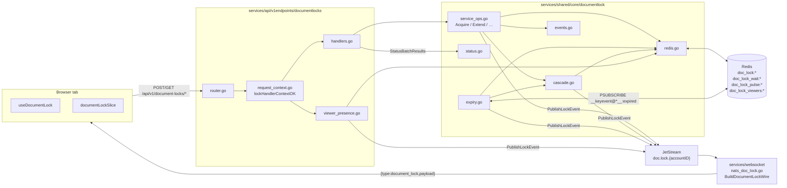

# Backend — document lock

Authoritative lock state, transition enforcement, cascade handling and TTL
promotion live in **`services/shared/core/documentlock`**. Redis is the source
of truth; the API HTTP package is a thin adapter; JetStream broadcasts to the
websocket service which fans out to the SPA.

Source tree:

```
services/shared/core/documentlock/
  deps.go              Deps + DepsFromServiceClients (Redis, Mongo, JetStream)
  redis.go             Key layout, LockRecord, Get/Set/Delete + waitlist + PromoteWaitlistHead
  viewer.go            AddViewer / RemoveViewer / PruneAndCountViewers
  presence_ingress.go  HandleViewerArrived/Departed Ingress (shared by HTTP + WS)
  status.go            StatusPayloadForDoc / StatusBatchResults (+ sentinel errors)
  status_pipeline.go   statusBatchFetch — one-pipeline batched reads (locks + viewers + waitlist)
  payload.go           LockPayload + ExtendExtras JSON fragments
  events.go            Event/reason constants, LockPayloadEventKey, BuildHandoffCompletedPayload, BuildGroupCascadePayload
  publish.go           PublishDocLockNotification → JetStream doc.lock.{accountID}
  notify.go            PublishLockEvent (injects accountID, calls publish)
  cascade.go           Decide{HandoffCascade,StaleAfterGrant}Release + cascade driver + Release* helpers
  cascade_pipeline.go  pipelinedDecideAndReleaseJobLocks — batched GET → decide → DEL for group→jobs cascade
  holder_require.go      RequireHolder, CollectLockHeldElsewhereRejects — API write-path holder checks (pipelined GET)
  expiry.go            RunExpirySubscriber + promoteWaitlistHeadOnExpiry (lease-gated)
  service.go           Service{Deps} + NewService
  service_ops.go       Acquire / Extend / Release / HandOver / RequestAccess / ClaimHandoff / WaitlistPulse
  *_test.go            redis, events, cascade predicate, etc.

services/api/v1endpoints/documentlocks/
  router.go            HTTP route table
  request_context.go   auth + body parse preamble (lockHandlerContextOK)
  handlers.go          thin HTTP wrappers → documentlock.Service
  lock_json.go         writeExtendJSON for /extend response shape
  viewer_presence.go   /viewer-arrived /viewer-departed (delegates to documentlock.Handle…Ingress)

services/core/singleton/service.go       Generic singleton-job runner used by core (Job + StartService)
services/core/singleton/jobs.go          Catalog of registered singleton jobs (DoclockExpirySubscriberJob, allJobs, Start)
services/core/main.go                    singleton.Start(clients) on core boot
services/shared/core/redis/lease/lease.go Reusable single-leader primitive (SET NX + CAS renew)

services/websocket/server/
  nats_doc_lock.go              doc.lock JetStream consumer (per-replica durable)
  natslogic/locks.go            BuildDocumentLockWire (flat-envelope wrapper)
  doc_lock_lock_state_batch.go  WS handler for `document_lock_lock_state_batch` frame
  doc_lock_presence_ws.go       WS handlers for waitlist-pulse / viewer-arrived / viewer-departed
  reader.go                     dispatches incoming WS frames to the handlers above
```

Frontend pairing: [FRONTEND.md](./FRONTEND.md). Cross-stack overview / wire
contract: [README.md](./README.md).

## Architecture



## HTTP surface

Mounted from `router.go` at `/api/v1/document-locks/{action}`.

| Method | Path | Body | Status | Notes |
|---|---|---|---|---|
| POST | `/acquire` | `{collection,docID}` | 201 granted / 200 contended | Returns `acquired`, `held`, `expiresAtUnix`, `ttlSeconds`, `viewerCount`. Group `/acquire` also runs `ReleaseStaleDependentJobLocksAfterGroupGrant`. |
| POST | `/extend` | `{collection,docID}` | 200 | Cycle: 3 free renewals → 4th renewal probes alive waitlist head; if waitlist empty, `cycle_reset` rebinds **solo** (long TTL). Returns `holding`, `expiresAtUnix`, `extendCount`, `handoffPending`, `probeTargetSessionID`, `probeExpiresAtUnix`, `cycleReset`, `leaseMode`. |
| — | Solo / contested rebind | — | — | **Acquire** grants `leaseMode: solo` (24 h TTL). **Viewer arrived** or **request queued** rebinds holder to contested (5 min), overriding solo like cross-session pressure. **Last viewer departed** with empty waitlist rebinds solo. See `lease_rebind.go`. |
| POST | `/release` | `{collection,docID}` | 204 | Holder-only. Deletes the row + publishes `released` (`holder_release`). **Does not** promote waitlist or passive viewers (unlike TTL expiry or `/hand-over`). See roadmap **#38**. |
| POST | `/force-release` | `{collection,docID}` | 204 / 404 / 400 | Same `accountID` as holder, different session. Deletes lock + waitlist; publishes `released { reason: force_released_same_account }`. Group → `ReleaseDependentJobLocksOnGroupHandoff` for evicted holder. |
| POST | `/hand-over` | `{collection,docID}` | 200 transferred / **409** noop (not holder) / 204 released | Holder accepts request snackbar. Promotes alive waitlist head atomically; **409** + `{error: doc_lock_hand_over_noop}` when caller is not the Redis holder; falls back to plain `released { reason: hand_over_no_queue }` when no live requester (**204** empty body). Group → cascade. |
| POST | `/request` | `{collection,docID}` | 201 auto-grant / 200 already mine / 202 queued | Returns `accessRequestGranted` on grant. Group auto-grant → `ReleaseStaleDependentJobLocksAfterGroupGrant`. |
| POST | `/lock-state-batch` | `{jobDocIDs,groupDocIDs}` | 200 | Both arrays ≤ 500. Returns `jobResults`, `groupResults` maps. WebSocket alternate: `document_lock_lock_state_batch` frame (see § WebSocket frame alternates). |
| GET | `/lock-state?collection=&docID=` | — | 200 | Per-doc lookup. Same shape as one row of `/lock-state-batch`. |
| POST | `/claim-handoff` | `{collection,docID}` | 200 / 409 / 400 | Probe target acknowledges and takes the lock. Group → cascade. |
| POST | `/waitlist-pulse` | `{collection,docID}` | 204 | Refreshes `doc_lock_pulse:…:sessionID` (waitlist liveness). |
| POST | `/viewer-arrived` | `{collection,docID}` | 204 | Viewer registers; ZADD + publish `viewer_joined` when newly added. Holder requests are no-op. WebSocket alternate: `document_lock_viewer_arrived` frame. |
| POST | `/viewer-departed` | `{collection,docID}` | 204 | ZREM + publish `viewer_left` when removal hit. Also reachable via `navigator.sendBeacon`. WebSocket alternate: `document_lock_viewer_departed` frame. |

### Lock-gated private resource writes

Some cookie-authenticated JSON routes (not under `/document-locks/*`) call
`documentlock.CollectLockHeldElsewhereRejects` before Mongo when Redis is
configured: pipelined `GET` on each doc’s `LockKey`, compare holder to the
requester’s session. Missing / empty session → **401**. Any doc in the batch
held by another session → **409** with JSON
`{ "error": "lock_held_elsewhere", "collection": "<mongo collection>", "rejected": [ { "docID", "holderSessionID", "lockExpiresAtUnix" }, … ] }`
and **no** Mongo write for that request (atomic-on-rejection). When `Redis` is
nil, enforcement is skipped (same as earlier advisory behaviour).

| Route | Lock collection checked |
|---|---|
| `PUT` / `DELETE` `/api/v1/groups` | `user_job_groups` |
| `PUT` / `DELETE` `/api/v1/job-documents` | `user_job_documents` |
| `PUT` `/api/v1/archived-jobs` | `user_job_documents` (live per-job locks) |

Intentionally not gated: `POST /api/v1/document-locks/force-release` and other
admin-style bypasses.

Auth + body parse share the `lockHandlerContextOK(w, r, redis)` helper —
every mutating handler bails immediately if the helper writes a 4xx/5xx.

### WebSocket frame alternates

Four HTTP endpoints have a WebSocket-frame equivalent over the open `/ws`
socket; the SPA prefers the WS path when the socket is connected (cheaper, no
HTTP overhead) and falls back to HTTP otherwise. Both paths reach the same
`documentlock.Service` / `presence_ingress.go` helpers, so behaviour is
identical.

| WS frame `type` | Backend handler | HTTP equivalent |
|---|---|---|
| `document_lock_lock_state_batch` | `services/websocket/server/doc_lock_lock_state_batch.go::handleDocumentLockLockStateBatch` — re-uses `documentlock.StatusBatchResults`; replies with `document_lock_lock_state_batch_ack`. | `POST /lock-state-batch` |
| `document_lock_waitlist_pulse` | `doc_lock_presence_ws.go::handleDocumentLockWaitlistPulseWS` → `Service.WaitlistPulse`. | `POST /waitlist-pulse` |
| `document_lock_viewer_arrived` | `doc_lock_presence_ws.go::handleDocumentLockViewerArrivedWS` → `documentlock.HandleViewerArrivedIngress`. | `POST /viewer-arrived` |
| `document_lock_viewer_departed` | `doc_lock_presence_ws.go::handleDocumentLockViewerDepartedWS` → `documentlock.HandleViewerDepartedIngress`. | `POST /viewer-departed` |

The frame dispatcher lives in `services/websocket/server/reader.go` (`switch
msgType` block); `Client.AccountID` and `Client.SessionID` come from the
upgrade-time session validation so the frames carry no auth.

## Redis key layout

`redis.go` declares the prefixes; `keyPartSep = "\x1e"` keeps the parts
unambiguous (Mongo collection names and doc ids cannot contain this byte).

| Key | Type | TTL | Purpose |
|---|---|---|---|
| `doc_lock:{accountID}\x1e{collection}\x1e{docID}` | string (JSON `LockRecord`) | `DefaultLockTTL` (5 min) | Canonical lock row. The accountID is embedded so the expiry subscriber can route keyspace notifications back to the owning account. |
| `doc_lock_wait:{accountID}\x1e{collection}\x1e{docID}` | list (`sessionID` strings) | — (managed by LREM) | Request queue. RPUSH on `/request`, peeked alive and LREM on grant. |
| `doc_lock_pulse:{accountID}\x1e{collection}\x1e{docID}\x1e{sessionID}` | string `"1"` | `WaitlistPulseTTL` (2 min) | Liveness check for a waitlist entry. Set by `/request`, refreshed by `/waitlist-pulse` (client) and `PeekWaitlistHeadAlive` filters stale heads. |
| `doc_lock_viewers:{accountID}\x1e{collection}\x1e{docID}` | sorted set (member=`sessionID`, score=`now+TTL`) | per-member score sweep | Passive viewer registry. ZADD on `/viewer-arrived`, ZREM on `/viewer-departed`, `pruneAndCountViewers` ZREMRANGEBYSCORE on every `/lock-state` read. |

### `LockRecord`

```go
// services/shared/core/documentlock/redis.go
type LockRecord struct {
    HolderSessionID      string `json:"holderSessionID"`
    AccountID            string `json:"accountID"`
    ExpiresAtUnix        int64  `json:"expiresAtUnix"`
    ExtendCount          int    `json:"extendCount,omitempty"`
    ProbeTargetSessionID string `json:"probeTargetSessionID,omitempty"`
    ProbeExpiresAtUnix   int64  `json:"probeExpiresAtUnix,omitempty"`
}
```

`GetLock` defensively re-deletes the row if it reads a record with
`ExpiresAtUnix` already in the past (covers cases where Redis hasn't yet
processed the TTL).

## Constants

```go
DefaultLockTTL                    = 5 * time.Minute        // lease + Redis key TTL
MaxExtensionsBeforeHandoffConsult = 3                      // extends before probing waitlist
ProbeAckWaitSeconds               = 20                     // claim window for probe target
WaitlistPulseTTL                  = 2 * time.Minute        // alive marker for waitlist entries
ViewerPresenceTTL                 = 5 * time.Minute        // ZSET score window
MaxStatusBatchDocs                = 500                    // per array cap
```

The frontend mirrors these in
`frontend/src/Functions/DocumentLock/documentLockTimings.js`; pulses and
extend intervals are set below their respective TTLs.

## Handler context (`request_context.go`)

Every mutating handler starts the same way:

```go
hc, ok := lockHandlerContextOK(w, r, clients.Redis)
if !ok {
    return  // 4xx/5xx already written
}
// hc.Ctx, hc.AccountID, hc.SessionID, hc.Collection, hc.DocID, hc.Redis
```

The helper validates:

- `accountID` from JWT (writes 401 otherwise);
- `session_id` claim present (400);
- body parses + `collection` and `docID` non-empty (400);
- `clients.Redis != nil` (503).

This is the only place where the preamble error responses are written, so
every handler keeps the same shape: 4xx/5xx for missing prerequisites,
business logic from there on.

## Lease extension state machine

`Service.Extend` in `documentlock/service_ops.go` is the only place a
`LockRecord` mutates its extend / probe fields (the HTTP `handleExtend` in
`v1endpoints/documentlocks/handlers.go` just delegates). The decision tree:

```mermaid
flowchart TD
  Start([POST /extend]) --> Auth[lockHandlerContextOK]
  Auth --> Load[GetLock]
  Load --> HolderMatch{Holder == us?}
  HolderMatch -- no --> EarlyOut[200 holding:false]
  HolderMatch -- yes --> ProbeExpired{Probe set<br/>and past expiry?}
  ProbeExpired -- yes --> ClearProbe[RemoveFromWaitlist<br/>(stale probe target);<br/>clear probe fields]
  ClearProbe --> ProbeStillActive
  ProbeExpired -- no --> ProbeStillActive
  ProbeStillActive{Probe still<br/>active in window?}
  ProbeStillActive -- yes --> ExtendOnly[SetLock new exp<br/>200 handoffPending=true]
  ProbeStillActive -- no --> FreeExtends{ExtendCount<br/>< 3?}
  FreeExtends -- yes --> Bump[++ExtendCount<br/>SetLock new exp<br/>200 handoffPending=false]
  FreeExtends -- no --> Peek[PeekWaitlistHeadAlive]
  Peek --> HasHead{Alive head?}
  HasHead -- no --> Reset[ExtendCount=0<br/>SetLock new exp<br/>200 cycleReset=true]
  HasHead -- yes --> Probe[ProbeTarget=head<br/>ProbeExpires=now+20s<br/>SetLock<br/>PublishLockEvent handoff_probe<br/>200 handoffPending=true]
```

The client mirrors the cycle: every 3 renewals it expects the next `/extend`
to either reset (no queue) or probe (queue exists). The probe target receives
the WS event, auto-fires `/claim-handoff`, and the lock atomically transfers
on the server.

## Handoff (`PromoteWaitlistHead`)

`redis.go::PromoteWaitlistHead` is the shared atomic transfer used by
`Service.HandOver` (driving `/hand-over`) and the expiry subscriber. It:

1. Peeks the alive waitlist head (`PeekWaitlistHeadAlive` filters stale heads
   by checking their `doc_lock_pulse:…` key).
2. Returns `(head, &rec, true, nil)` after writing a new `LockRecord` with
   `HolderSessionID = head`, fresh `ExpiresAtUnix`, zero `ExtendCount` and
   no probe fields. The waitlist `LREM` is best-effort — if it fails the next
   pulse-check filters the stale entry anyway.
3. Returns `(_, _, false, nil)` when no live head exists; callers decide
   whether to plain-`/release` (handover) or publish `expired` (subscriber).

The returned record is what callers feed to `BuildHandoffCompletedPayload` so
all three publish sites emit a uniform shape (see [events.go](#events--reasons) in `documentlock`).

## Cascade

```mermaid
flowchart LR
  GroupHandoff["group lock rotates<br/>(handoff or TTL promotion)"]
  CD["cascadeReleaseDependentJobLocks<br/>(driver in documentlock/cascade.go)"]
  Helper["pipelinedDecideAndReleaseJobLocks<br/>(documentlock/cascade_pipeline.go)"]
  P1["Phase 1: ONE pipeline<br/>GET per jobID"]
  Decide["Decide…Release(rec) → (release?, attribTo)"]
  P2["Phase 2: ONE pipeline<br/>DEL chosen lock keys"]
  Build["BuildGroupCascadePayload<br/>(documentlock/events.go)"]
  Pub["PublishLockEvent group_cascade<br/>(one event, releases[])"]

  GroupHandoff --> CD
  CD -->|"LoadGroupByID(Mongo) →<br/>IncludedJobIDs"| Helper
  Helper --> P1
  P1 --> Decide
  Decide --> P2
  P2 --> Build
  Build --> Pub
```



Two predicates live in `documentlock/cascade.go`:

- **`DecideHandoffCascadeRelease(rec, oldHolderSessionID)`** — used by
  `Service.HandOver` (`/hand-over`) and `Service.ClaimHandoff`
  (`/claim-handoff`) via `ReleaseDependentJobLocksOnGroupHandoff`. Releases
  per-job locks held by the *old group holder* only; jobs belonging to anyone
  else stay put.
- **`DecideStaleAfterGrantRelease(rec, newGroupHolderSessionID)`** — used by
  `Service.RequestAccess` (auto-grant on orphaned group), `Service.Acquire`
  (first-grant), and the TTL-promotion path in `expiry.go` via
  `ReleaseStaleDependentJobLocksAfterGroupGrant`. Releases per-job locks held
  by *anyone other than* the new group holder. The previous holder's session
  id isn't available in these paths (the record was already evicted by
  Redis), so the rule is "anything misaligned with the new owner".

Both predicates feed the internal `cascadeReleaseDependentJobLocks` driver,
which loads the group's `IncludedJobIDs` from Mongo and then hands off to
`pipelinedDecideAndReleaseJobLocks` (in `documentlock/cascade_pipeline.go`).
The pipelined helper does the Redis side in **two round-trips regardless
of group size**:

1. one pipeline issues `GET` for every job ID;
2. the predicate runs in Go against the parsed records (expired records
   bypass the predicate — keys will TTL out independently);
3. a second pipeline `DEL`s only the lock keys the predicate chose.

The publish step issues **one** `document_lock_group_cascade` JetStream
message (`BuildGroupCascadePayload`) carrying every release in a single
`releases[]` array. There is no per-job `document_lock_released` burst —
the batched event is the sole notification for the cascade. The frontend
handlers in `useLockScopeSync.js` / `useDocumentLock.js` apply all
releases in one Zustand transaction.

The cascade is failure-tolerant: redis pipeline errors are logged but
never unwind the parent handoff, and the JetStream publish is best-effort.
The worst case is that the next planner-sync sweep reconciles instead of
being immediate.

## TTL expiry subscriber

The doc-lock TTL expiry subscriber is a **singleton workload** and lives in
the Swarm `core` service (`eip_core`, `replicas: 1` with lease-gated
`start-first` handoff). It runs under its own nested Redis lease
(`lease:doclock:expiry-subscriber`) on every core replica so mid-roll
overlap cannot produce duplicate `document_lock_expired` /
`handoff_completed` events. Primary-gated work (scheduler / changestream)
is separate — see [CORE_REBUILD.md](../swarm/CORE_REBUILD.md).

```
core/main.go
  ─▶ singleton.Start(clients)
       └─▶ singleton/jobs.go::allJobs(clients)
              └─▶ singleton.DoclockExpirySubscriberJob(deps) → singleton.Job
                     ├─ Name:     "doclock-expiry-subscriber"
                     ├─ LeaseKey: "lease:doclock:expiry-subscriber"
                     └─ Run:      documentlock.RunExpirySubscriber(deps)
       └─▶ singleton.StartService(redis, jobs...)
              └─▶ lease.RunWhileHeld(...)
                     └─▶ documentlock.RunExpirySubscriber(scoped, deps)
                            └─▶ rdb.PSubscribe(scoped, "__keyevent@*__:expired")
```

`core/singleton` is a generic singleton-job runner — anything that should
run on exactly one core replica at a time (today: the doc-lock expiry
subscriber; tomorrow: batch-cascade flushers, cluster-wide sweeps) is
registered as a `singleton.Job` in `singleton/jobs.go`. The doc-lock
package itself stays infrastructure-agnostic and just exposes
`RunExpirySubscriber`.

Requires `notify-keyspace-events Ex` on the Redis instance (already set in
`docker-compose.yml`'s `redis.command`).

`lease.RunWhileHeld` (`shared/core/redis/lease`) uses a `SET key value NX EX ttl` to acquire the
lease and a CAS Lua script (`if get == value then pexpire ttl`) to renew it.
If the renewer can't reach Redis twice in a row, or if a peer has taken over
the key, the scoped context passed to `RunExpirySubscriber` is cancelled,
PSubscribe closes cleanly, and the outer loop re-attempts acquisition with
backoff + jitter. Defaults: TTL 15s, renew every 5s, acquire backoff 5s.

On each expired key:

1. `ParseExpiredLockKey` filters out anything that isn't a `doc_lock:` row.
2. `promoteWaitlistHeadOnExpiry` (internal wrapper over `PromoteWaitlistHead`)
   tries to install the alive waitlist head. `PromoteWaitlistHead` is itself
   a single atomic Redis EVAL (see `documentlock/atomic.go::promoteWaitlistScript`),
   so even if two replicas somehow raced past the lease the transition still
   has exactly one winner.
3. If promoted → publish `handoff_completed { reason: ttl_promotion }`.
   Otherwise → publish `expired { reason: ttl }`.
4. If the collection is `user_job_groups` and a promotion happened, run
   `ReleaseStaleDependentJobLocksAfterGroupGrant` so per-job locks held by
   the dead holder don't linger.

All publishes route through `documentlock.PublishLockEvent` (which adds
`accountID` and calls `documentlock.PublishDocLockNotification`), so the wire
shape is uniform with handler-driven events.

## Viewer presence

Viewer-set ops live in `documentlock/viewer.go`; the HTTP handlers in
`api/v1endpoints/documentlocks/viewer_presence.go` and the WebSocket frames
in `documentlock/presence_ingress.go` both go through the same helpers.

A passive viewer is anyone showing the doc read-only because another session
holds the lock. The data:

- ZSET `doc_lock_viewers:{accountID}\x1e{collection}\x1e{docID}` with
  `member = sessionID, score = now + ViewerPresenceTTL`.
- `AddViewer` ZADDs and returns `newlyAdded` so we only publish on a real
  transition (not on a re-mount within the TTL).
- `RemoveViewer` ZREMs and returns `wasPresent` for the same reason.
- `PruneAndCountViewers` ZREMRANGEBYSCORE-then-ZCARD; called on every
  `/lock-state` and `/lock-state-batch` read so the count returned to clients
  is always fresh.

Holders are deliberately *not* tracked as viewers: `/viewer-arrived` reads
the current `LockRecord` and bails if the requester is the holder. This
guards against a transient `readOnly` burst (during a sync) accidentally
adding the holder's own sessionID to the viewer set.

## Status payload

`documentlock/status.go::StatusPayloadForDoc(ctx, rdb, accountID, collection,
docID)` builds the row returned by both `/lock-state` and each entry in
`/lock-state-batch`:

```jsonc
// rec present
{
  "held": true,
  "holderSessionID": "...",
  "expiresAtUnix": 1731435678,
  "ttlSeconds": 300,
  "secondsRemaining": 248,
  "extendCount": 1,
  "viewerCount": 2,
  "waitlistLen": 0,
  "probeTargetSessionID": "...",   // omitted unless probe active
  "probeExpiresAtUnix": 1731435700
}

// rec nil (no holder)
{ "held": false, "viewerCount": 0 }
```

Frontend mapping:
`frontend/src/Functions/DocumentLock/applyDocumentLockStatusFromPayload.js`.

`/lock-state-batch` (`documentlock/status.go::StatusBatchResults`) produces:

```json
{ "jobResults": { "<docID>": <statusRow>, ... },
  "groupResults": { "<docID>": <statusRow>, ... } }
```

with caps `len(jobDocIDs) <= 500` and `len(groupDocIDs) <= 500`. Error
cases use sentinel errors (`ErrStatusBatchEmpty`, `ErrStatusBatchTooMany`,
`ErrLocksUnavailable`) so the websocket handler can reuse the same body.

Both `StatusPayloadForDoc` and `StatusBatchResults` delegate Redis IO to
`statusBatchFetch` in `documentlock/status_pipeline.go`. That helper issues
**one pipeline per collection bucket** containing four commands per doc
(`GET`, viewer `ZREMRANGEBYSCORE`, viewer `ZCARD`, waitlist `LLEN`).
For a 50-doc batch the wall-time cost is one round-trip
(common case) or two if any record had to be opportunistically `DEL`-ed
because its `expiresAtUnix` lies in the past — formerly this was
`3 × 50 = 150` sequential RTTs.

## Events / reasons

`documentlock/events.go` is the single declaration point. The websocket service
does not add or rename types; it wraps the JetStream body in the flat document
described in [§ Publish path](#publish-path) (see `BuildDocumentLockWire`).

```go
LockEventAcquired         = "document_lock_acquired"
LockEventReleased         = "document_lock_released"
LockEventRequested        = "document_lock_requested"
LockEventExpired          = "document_lock_expired"
LockEventHandoffProbe     = "document_lock_handoff_probe"
LockEventHandoffCompleted = "document_lock_handoff_completed"
// presence (published by viewer_presence.go / presence_ingress.go):
LockViewerEventJoined     = "document_lock_viewer_joined"
LockViewerEventLeft       = "document_lock_viewer_left"

// JSON field name on every doc-lock payload (JetStream + WS fan-out):
LockPayloadEventKey = "event"

// reasons (string field on the event):
LockHandoffReasonHolderHandover = "holder_handover"
LockHandoffReasonTTLPromotion   = "ttl_promotion"      // documentlock/expiry.go
LockReleaseReasonHolderRelease = "holder_release"    // documentlock/service_ops.go Release
LockReleaseReasonHandOverNoQueue   = "hand_over_no_queue"
LockReleaseReasonGroupHandoffCascade = "group_handoff_cascade"  // documentlock/cascade.go (GROUP_CASCADE payload)
LockExpiryReasonTTL = "ttl"                            // documentlock/expiry.go
```

`LockPayloadEventKey` is the *domain* discriminator. The outer WebSocket frame
`type` is always `"document_lock"` (the channel tag) — never one of the
domain event strings. Keep this naming distinction whenever you add a new
event: the constant goes on `event`, not on `type`.

`BuildHandoffCompletedPayload(collection, docID, newHolderSessionID,
expiresAtUnix, opts)` centralises the `handoff_completed` shape:

```go
type HandoffCompletedOpts struct {
    PreviousHolderSessionID string  // omitted on TTL promotion (record evicted)
    Reason                  string  // empty on /claim-handoff
}
```

Each emitted payload is uniform across the three sites (`/hand-over`,
`/claim-handoff`, expiry subscriber) but only includes optional fields when
set.

## Publish path

`documentlock/notify.go::PublishLockEvent(ctx, js, accountID, payload)` is the
single publish funnel. It:

1. Injects `accountID` into the payload (also encoded by subject, but kept
   on the body so the frontend's CustomEvent detail is self-contained).
2. Calls `documentlock.PublishDocLockNotification` (`publish.go`) which writes
   to `doc.lock.{accountID}` on JetStream. The domain discriminator must be
   present on the payload under `LockPayloadEventKey` (`"event"`).

The websocket service consumes `doc.lock.>` on a per-replica durable
(`nats_doc_lock.go`), unmarshals the JetStream body, and `BuildDocumentLockWire`
re-emits **one flat JSON object** for the WS fan-out:

```json
{
  "type": "document_lock",
  "event": "document_lock_handoff_completed",
  "accountID": "…",
  "collection": "…",
  "docID": "…",
  "sessionID": "…",
  "expiresAtUnix": 1731435678
}
```

Outer `type` is the WS channel tag; the domain discriminator lives on `event`.
There is no nested `payload` field — `BuildDocumentLockWire` copies every field
from the JetStream body except the source `event` / `type` and re-injects
`event` from `LockPayloadEventKey`. The wrapper also returns
`suppressSessionID` so `broadcastRawToAccount` can echo-suppress the originating
tab (see `subscription.go`). The flat envelope is the only shape ever emitted
or accepted; `innerLockEventName` reads the discriminator from
`LockPayloadEventKey` (no legacy `type` fallback).

## Testing

| Test file | Covers |
|---|---|
| `documentlock/redis_test.go` | `ParseExpiredLockKey`, `SetLock`/`GetLock`/`DeleteLock` round-trips, waitlist helpers, pulse-driven alive-head filter, `PromoteWaitlistHead`, `LockHeldByOther`. Uses `miniredis`. |
| `documentlock/cascade_predicate_test.go` | `DecideHandoffCascadeRelease` and `DecideStaleAfterGrantRelease` predicate tables. |
| `documentlock/status_pipeline_test.go` | `statusBatchFetch` correctness against `miniredis` — unheld baseline, held-with-viewers+waitlist payload, viewer pruning, expired-record opportunistic DEL, ordering, and the `StatusBatchResults` job/group routing + sentinel errors. |
| `documentlock/cascade_pipeline_test.go` | `pipelinedDecideAndReleaseJobLocks` against `miniredis` — partial-release routing, predicate input shape, expired-record bypass, blank-id filtering, nil-guard contracts. |
| `documentlock/events_test.go` | `BuildHandoffCompletedPayload` shapes (claim-handoff / hand-over / TTL-promotion / no-opts) plus `BuildGroupCascadePayload` for the cascade event body. |
| `services/websocket/server/natslogic/locks_test.go` | `BuildDocumentLockWire` flat-envelope conversion and echo-suppress sessionID extraction. |

`miniredis` is used for any test touching key layout / TTL semantics so the
suite runs without a real Redis. Cascade tests split into pure predicate
tests (`cascade_predicate_test.go`, no Mongo/Redis), Redis-side pipeline
tests (`cascade_pipeline_test.go`, miniredis-backed), and pure payload
builder tests (`events_test.go`); the JetStream publish step is exercised
through the publish-payload list helper without needing a real NATS.

## Ops + deployment notes

- **Redis keyspace events.** `notify-keyspace-events Ex` is required for the
  TTL subscriber. Without it, expired leases still vacate (Redis evicts the
  row), but the waitlist promotion + `expired`/`handoff_completed` events
  never publish — the system falls back to the client-side 45 s status
  heartbeat and feels sluggish.
- **Single-leader subscriber.** `RunExpirySubscriber` runs in the `core`
  service under a Redis lease (`lease:doclock:expiry-subscriber`), so only
  one replica processes expirations at a time. The atomic Lua scripts in
  `documentlock/atomic.go` make duplicate runs safe (idempotent peek + CAS
  write), but the lease makes duplicate runs *unnecessary* and removes the
  extra JetStream publish per event. See
  `services/shared/core/redis/lease/lease.go` for the primitive.
- **JetStream stream.** Lock events use the shared `doc.update` JetStream
  stream under subject prefix `doc.lock.>` (see
  `natscore.EnsureDocUpdateStream`). Consumer durable name comes from
  `natslogic.DocLockConsumerConfig()` and includes the replica suffix so
  every websocket replica gets every event.
- **No durable retention requirement.** Lock events are inherently transient
  — late delivery only matters for the 5 s read-only grace window. Subjects
  use `AckExplicit` with delivery-count metrics but no replay strategy.

## Adding a new lock-aware endpoint

To extend the system with a new mutating endpoint:

1. **Add the route** in `router.go`.
2. **Use the handler context.**

```go
func handleNewThing(w http.ResponseWriter, r *http.Request, clients *shared.ServiceClients) {
    hc, ok := lockHandlerContextOK(w, r, clients.Redis)
    if !ok {
        return
    }
    // … hc.Ctx, hc.AccountID, hc.SessionID, hc.Collection, hc.DocID, hc.Redis
}
```

3. **Delegate to `documentlock.Service`.** Don't reach for the Redis
   primitives in handler code — instantiate via `documentlock.NewService(...)`
   and call `Acquire` / `Extend` / `Release` / `HandOver` / `RequestAccess`
   / `ClaimHandoff` / `WaitlistPulse`. If you need a primitive directly, use
   the exported helpers (`GetLock`, `SetLock`, `DeleteLock`,
   `PromoteWaitlistHead`, `PeekWaitlistHeadAlive`, `TouchWaitlistPulse`) —
   they centralise the JSON round-trip and TTL semantics.
4. **Publish through `documentlock.PublishLockEvent`.** Any new event payload
   should carry `event` (`LockPayloadEventKey`), `collection`, `docID` at
   minimum. If it's a handoff variation, use `BuildHandoffCompletedPayload`.
   If it's a new event/reason, add the constant to `documentlock/events.go`
   *and* `frontend/src/Functions/DocumentLock/documentLockEvents.js` in the
   same change.
5. **If it transfers group ownership**, call
   `ReleaseDependentJobLocksOnGroupHandoff` (when you know the old holder id)
   or `ReleaseStaleDependentJobLocksAfterGroupGrant` (when you only know the
   new holder).
6. **Test it.** Predicate-shaped logic lives in named functions for a
   reason — they're easy to drive from the existing `*_test.go` files (see
   `documentlock/redis_test.go`, `cascade_predicate_test.go`,
   `events_test.go`). Add `miniredis`-backed integration coverage for any
   new key shape.

## Common pitfalls

- **Forgetting the cascade on a new group-handoff path.** Any path that
  transfers a `user_job_groups` lock must call one of the two cascade
  helpers, or per-job locks held by the old holder linger until their own
  TTL (5 min) fires.
- **Touching the waitlist without a pulse refresh.** Both
  `PeekWaitlistHeadAlive` and `Service.ClaimHandoff` (`/claim-handoff`) filter
  heads by pulse. If a new code path enqueues a session without
  `TouchWaitlistPulse`, that session will be silently skipped on every probe.
- **Adding a new event type backend-only.** Frontend hooks branch on the
  `event` string; an unknown event is silently dropped. Add the constant to
  both sides in the same change and update the contract table in
  [README.md](./README.md).
- **Reading `LockRecord` directly from Redis in another package.** Cross-package
  consumers must go through `documentlock` helpers (`GetLock`, `SetLock`,
  `DeleteLock`, `LockHeldByOther`, `PromoteWaitlistHead`, …) so the JSON
  round-trip and TTL semantics remain centralised.
- **Adding a new N-doc read path that loops over `StatusPayloadForDoc`
  or `GetLock`.** The `/lock-state-batch` and cascade-release paths both
  pipeline their Redis IO into one or two round-trips via
  `status_pipeline.go` / `cascade_pipeline.go`. Any new bulk-read code path
  should reuse `statusBatchFetch` (or a similarly pipelined helper) instead
  of re-introducing the N×RTT regression those files were written to fix.
- **Treating `accountID` in the payload as redundant.** The NATS subject
  also encodes it, but the publish funnel injects it onto the payload so the
  frontend CustomEvent's `detail` is self-contained — don't strip it.
- **Putting the domain event string on `type`.** The outer `type` is the WS
  channel tag (`"document_lock"`). The domain discriminator (`document_lock_*`)
  lives on `event` (`LockPayloadEventKey`) — `BuildDocumentLockWire` rejects
  any payload that doesn't carry it.
