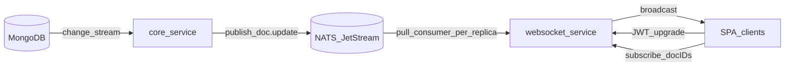
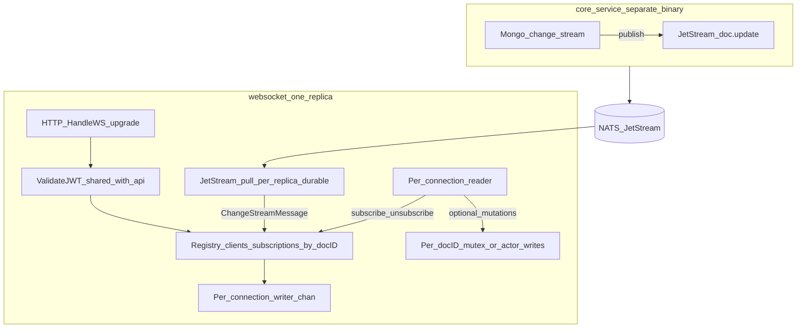
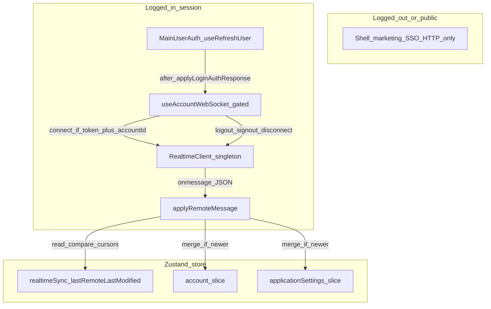
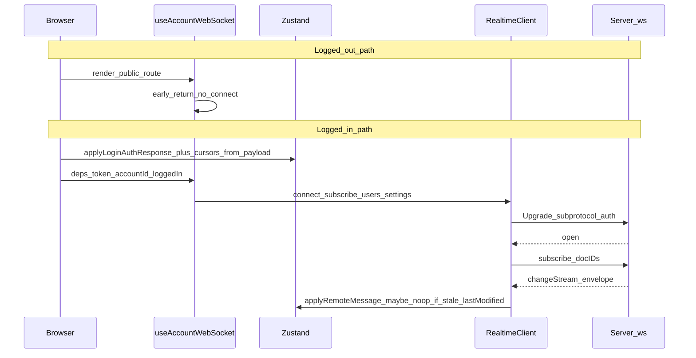
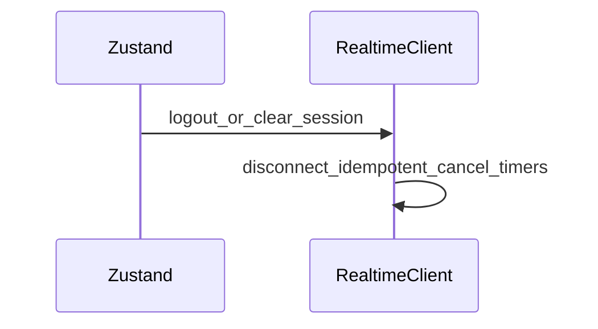

> **In-repo snapshot:** this file is the version-controlled plan draft. To replace it from another markdown file, run **`./scripts/sync-websocket-migration-plan.sh <path-to-plan.md>`** from the repository root.

> **Update (2026-04-19):** The JetStream **`doc.subscribe`** consumer, API **`AutoSubscribe`**, and changestream subscription publishes were **removed**. Per-document interest is **WebSocket `subscribe` / `unsubscribe` only**. The YAML todos / body below may still describe the old dual-path design until this snapshot is updated—see **[INTERACTIONS.md](./INTERACTIONS.md)** and **[IMPLEMENTATION.md](./IMPLEMENTATION.md)** for current behavior.

# WebSocket realtime: users + application_settings

## What already exists (use as input, not as the final shape)

- **Change stream → NATS**: [`services/core/changestream/watcher.go`](services/core/changestream/watcher.go) watches the whole DB and publishes JSON payloads to subjects `doc.update.{collection}.{docID}` (e.g. `doc.update.users.<accountID>`, `doc.update.application_settings.<accountID>`). This runs in the **`core`** service ([`services/core/main.go`](services/core/main.go)), not in the websocket process.
- **Websocket prototype**: [`services/websocket/server/server.go`](services/websocket/server/server.go) wires NATS consumers, per-document queues, subscribe/unsubscribe, and **heartbeats** (app-level `ping`/`pong` in [`services/websocket/server/reader.go`](services/websocket/server/reader.go); WebSocket Ping frames in [`services/websocket/server/writer.go`](services/websocket/server/writer.go)). **Treat the current coordinator / pond / pooled-worker layout as replaceable**—prefer **no fixed internal worker pool**; use **straightforward goroutines** plus **explicit per-`docID` serialization** for writes, and **scale out with more websocket replicas / larger containers** instead of tuning pool sizes (refactor again only if metrics show a bottleneck).
- **Auth (canonical vs outdated)**: **[`services/api`](services/api)** (especially [`services/api/helper/auth`](services/api/helper/auth), [`services/api/middleware/auth.go`](services/api/middleware/auth.go), and login/refresh handlers) is the **source of truth** for internal JWT issuance, validation, expiry, and related token behavior. **[`services/websocket/auth`](services/websocket/auth)** and the WS upgrade path are **outdated copies**—before any refactor, **read and match the API**; do not preserve websocket-specific quirks for their own sake. The HMAC / external-token [`Authenticator`](services/shared/core/auth/auth.go) in [`services/shared/core/auth`](services/shared/core/auth) remains a separate concern—do not conflate it with internal RS256 tokens. **Plan**: extract the **API** internal-JWT implementation into `services/shared/...` (e.g. `shared/core/internaljwt`), switch **api** to import that module, then point **websocket** at the same shared code and delete the duplicated websocket auth files except **websocket-only** upgrade glue (subprotocol/query token extraction, connection limits) in the websocket package.
- **Client subscribe contract**: JSON `{"type":"subscribe","docIDs":["users.<accountID>","application_settings.<accountID>"]}` enqueues per `docID` and registers the connection on the matching outgoing queue ([`services/websocket/server/reader.go`](services/websocket/server/reader.go) + [`services/websocket/server/processor.go`](services/websocket/server/processor.go) `handleSubscribeRequest`). These `docID`s align with NATS extraction (`user.account123` style is `users.<id>` because the subject is `doc.update.users.<id>` → remainder `users.<id>` per [`services/shared/core/nats/nats.go`](services/shared/core/nats/nats.go) `ExtractIDFromSubject` examples).
- **Multi-tab / multi-client per account**: [`services/websocket/server/subscription.go`](services/websocket/server/subscription.go) tracks `userConnections[accountID]` as a set of client IDs; `SubscribeClientToDocument` fans out to **all** connections for that account (used for INSERT broadcasts). A JSON **`subscribe`** from the browser applies to **that connection only** (other tabs do not inherit until they send their own subscribe or receive an INSERT autosubscribe).
- **Ingress**: Traefik routes `PathPrefix(/ws)` to the websocket container ([`docker-compose.yml`](docker-compose.yml)), so the browser can use **same-origin** `wss://<host>/ws` in production-like setups.

## Backend service model (target shape)

The **websocket** process is a **stateless edge** for browser connections: it **authenticates**, **tracks subscriptions**, **fans out** Mongo-driven events from NATS, and (optionally) **accepts ordered writes** per document. It does **not** run the Mongo change stream—that stays in **[`services/core`](services/core)** ([`changestream/watcher.go`](services/core/changestream/watcher.go)).

### Deployment and dependencies

- **Binary:** [`services/websocket`](services/websocket) — HTTP server on configured port (e.g. `WS_PORT`), path **`/ws`** ([`services/websocket/main.go`](services/websocket/main.go), [`server/handler.go`](services/websocket/server/handler.go)).
- **Required:** NATS JetStream (+ Mongo client if you keep **sync** or server-side writes on this service). **Redis** may remain for other features per existing [`ConnectServices`](services/shared/deps/services.go) wiring—trim only if nothing else needs it.
- **Horizontal scale:** **N replicas** behind Traefik (or a future gateway); each replica runs the **same** logic with **its own** NATS durable consumer name (see **Critical gap for “any instance” scalability** above).

### In-memory structures (per replica, not shared across pods)

- **Connections:** `map[clientID]*Client` — each `Client` holds `*websocket.Conn`, **`Send chan []byte`** (writer goroutine), `accountID`, `subscribedDocs` set.
- **Account → clients:** `map[accountID]set[clientID]` — fan-out for “all tabs for this account” when needed.
- **Doc → subscribers:** `map[docID]set[clientID]` where `docID` is **`{collection}.{mongoId}`** (e.g. `users.<accountID>`) — matches NATS subject suffix from [`ExtractIDFromSubject`](services/shared/core/nats/nats.go).
- **Ordered writes:** **`sync.Mutex` per `docID`** or **one goroutine + channel per `docID`** — no shared pond pool required (see **Per-document ordering for websocket writes** below).

### Data paths

1. **Browser → websocket (control plane):** reader parses **`ping` / `pong`**, JSON **`subscribe` / `unsubscribe`** ([`reader.go`](services/websocket/server/reader.go)); optional future **document mutation** messages go through the **per-`docID` ordered** path then Mongo.
2. **NATS → websocket (read replica fan-out):** [`nats_subscriptions.go`](services/websocket/server/nats_subscriptions.go) pulls **`doc.update.>`** (and optionally **`doc.subscribe.>`** for API-triggered subscribe); payload is the published **`ChangeStreamMessage`** JSON; server routes by **`docID`** to **subscribers** on this replica only ([`processor.go` outgoing / broadcast](services/websocket/server/processor.go)).
3. **Mongo → NATS (other process):** unchanged — **`core`** publishes on every DB change; websocket **never** competes with `core` for the change stream.

### Subscription registry — dual paths (SPA requests + autosubscribe)

**Requirement:** the SPA may **send document subscription requests** over the WebSocket at any time (baseline docs at login, **additional `{collection}.{docId}`** subscriptions when a screen needs them—e.g. planner rows, groups, watchlist—**unsubscribe** when leaving). **In parallel**, keep the **internal autosubscribe** path so HTTP/API flows can register connected clients without the browser sending JSON first (today: JetStream **`doc.subscribe.{accountID}`** handled in [`nats_subscriptions.go`](services/websocket/server/nats_subscriptions.go), wired from API handlers such as [`applicationSettingsDoc.go`](services/api/v1endpoints/applicationSettingsDoc.go) when `AutoSubscribe` is set).

**Registry invariants (each replica; see also [`subscription.go`](services/websocket/server/subscription.go)):**

- **`accountID → set(clientID)`** — every open tab/socket for that account (multi-client per account).
- **`clientID → accountID`** — set at upgrade from validated JWT claims.
- **`clientID → set(docID)`** — which logical documents this connection cares about (`subscribedDocs`).
- **`docID → set(clientID)`** — reverse index for NATS-driven **broadcast** to every subscribed socket on this replica (`users.<id>`, `application_settings.<id>`, and any future **`{collection}.{docId}`** the client or autosubscribe registers).

**Two ways those maps get updated (both stay supported):**

1. **Client-initiated:** JSON **`subscribe` / `unsubscribe`** from the browser ([`reader.go`](services/websocket/server/reader.go)). Frontend: expose **`realtimeClient.subscribeDocIDs` / `unsubscribeDocIDs`** so features do not duplicate message shapes.
2. **Autosubscribe (internal):** API publishes **`doc.subscribe.{accountID}`** with `collection` + `docIDs`; websocket applies **`SubscribeClientToDocument`** (or equivalent) for **all** active connections for that account so **every tab** stays in sync—**avoid** subscribing only the “first” client when product expectation is account-wide fan-out (align implementation when touching [`SubscribeSingleClientToDocument`](services/websocket/server/subscription.go) call sites).

**New document creation (general, not jobs-only):** when Mongo emits an **INSERT** for any collection that participates in this pipeline, the change-stream publisher includes **`accountID`** on the NATS payload (from document root or `_meta.accountID`, per [`watcher.go`](services/core/changestream/watcher.go)). Websocket **INSERT** handling already **broadcasts once to all account clients** and **auto-subscribes** those clients to the new logical key **`{collection}.{newDocId}`** so subsequent **UPDATE**/**DELETE** events on that document reach every tab without a separate client subscribe ([`processor.go` outgoing INSERT branch](services/websocket/server/processor.go), [`subscription.go`](services/websocket/server/subscription.go)). When adding collections (jobs, groups, watchlist, …), **reuse the same** `docID` / subject shape and account metadata so **document creation** stays one consistent pattern—not a jobs-specific special case.

### Auth (API-aligned)

- **Validate** browser JWT using **shared** internal JWT package (extracted from API); **handler** only extracts token from **subprotocol** or query ([`handler.go`](services/websocket/server/handler.go)).
- Reject missing/invalid token with **401** on upgrade; no socket object created.

### Optional components to keep or slim

- **`sync` package** ([`services/websocket/sync`](services/websocket/sync)) — today handles client **resync** requests; keep if the product still needs “full document fetch over WS”; otherwise defer or replace with **HTTP GET** from the API for simplicity.

## Per-document ordering for websocket writes

If the websocket accepts **document mutations** (PATCH-style messages, bulk ops, etc.), **all operations for a given `docID` must run strictly in arrival order** so Mongo sees a consistent sequence (and so change-stream echoes line up with client expectations). The prototype used **per-`docID` queues + pond workers** ([`services/websocket/server/processor.go`](services/websocket/server/processor.go), [`services/websocket/server/coordinator.go`](services/websocket/server/coordinator.go)); **keep only the ordering idea**, not necessarily pools or coordinators.

**Phase-1 direction (per your preference):** avoid **dedicated worker pools**—use something minimal such as **one goroutine per `docID`** draining a channel (or a **`sync.Mutex` per `docID`** around the write path), and let the **process use OS threads / memory as needed**; add **more websocket containers** under the load balancer for fan-out. **Reintroduce bounded pools or backpressure** only if production shows goroutine/memory pressure or Mongo overload.

Outbound **broadcast** can stay a simple “for each subscriber, non-blocking send to client writer channel” pattern; it does not need the same machinery as inbound writes.

## Critical gap for “any instance” scalability

Today [`services/websocket/server/nats_subscriptions.go`](services/websocket/server/nats_subscriptions.go) creates **durable** JetStream consumers with fixed names (`ConsumerDocUpdates`, `doc-subscribe-consumer`). In JetStream, a **durable consumer is a single queue point**: multiple websocket replicas sharing the same durable will **compete** for `Fetch`, meaning **only one replica** reliably receives each `doc.update.*` message — the others will miss broadcasts to their local sockets.

**Required change** (pick one; the first is smallest):

1. **Per-replica durable name** (recommended): include a stable per-process suffix (`HOSTNAME`, Kubernetes pod UID, or explicit `WS_CONSUMER_NAME` env) in `Durable` for both consumers in `nats_subscriptions.go`, keeping the same `FilterSubject`. Each replica then gets independent delivery cursor; all instances receive all doc updates.
2. **Alternative**: replace JetStream pull for `doc.update.>` with NATS-core fan-out (no competing consumer), at the cost of losing replay/buffering semantics.

Also validate **consumer lifecycle** on deploy (old durables left behind are harmless but noisy; document cleanup or TTL strategy).

**Correctness does not require sticky routing**: once each websocket replica has its **own** JetStream consumer (above), every instance receives `doc.update.*` and can push to **its** connected clients—no need to pin “all traffic for account X” to one pod for realtime to work.

## Deferred: Traefik / account affinity / API gateway (not Phase-1)

**Idea (optional later):** route `/ws` (and possibly API) so that **requests for the same account tend to hit the same replica**—e.g. Traefik **sticky sessions** (cookie), **consistent hash** on a header (would require the edge to know `account_id` after auth, which is awkward for anonymous paths), or a dedicated **API gateway** that terminates auth then sets routing metadata. That can reduce cross-instance edge cases (debugging, rate limits, future in-memory state) but adds **operational and config complexity**.

**Decision for this migration:** treat that as **out of scope for now**—ship **per-replica NATS consumers + stateless websocket** first; revisit Traefik rules or a gateway **only if** you later need affinity for reasons other than broadcast correctness (e.g. colocating WS with a per-pod cache).

**Gateway-ready posture (design now, no gateway yet):** keep a **clean insertion surface** so an API gateway can sit **in front of** Traefik (or replace it) later without rewriting app logic.

- **Paths and origins:** prefer the SPA calling **same-origin** relative URLs for HTTP (`/api/v1/...`) and WebSocket (`/ws` or `/ws/...`), as today—so a gateway can terminate TLS, enforce policies, and **forward unchanged path prefixes** to upstreams. If you introduce an absolute API/WS base URL, centralize it in **one config** (e.g. Vite env) so swapping to `https://gateway.example` is a deployment change, not a scatter of string literals.
- **Auth at the edge:** websocket auth already uses **standard** `Upgrade` + **subprotocol** (or query fallback)—patterns gateways and reverse proxies support; avoid custom framing that only Traefik understands.
- **No Traefik-isms in code:** do not depend on Traefik-specific headers or middleware behavior inside Go or the SPA; treat Traefik as **replaceable** routing/TLS in [`docker-compose.yml`](docker-compose.yml).
- **Stateless services:** keep API and websocket **horizontally scalable** (JWT validation, NATS fan-out)—so a future gateway can **round-robin** or add its own stickiness without breaking correctness.

## Frontend work (new; no WS client exists today)

Goal: **one connection per browser tab** (or one global — see note below), **not recreated on React render**, with reconnect + heartbeat.

### Client-side model (how it looks from the browser)

Think of **four pieces** (only the first three run when **logged in**):

1. **`RealtimeClient` (module singleton)** — Owns the `WebSocket` reference for the tab; **never** stored in Zustand. Resolve **same-origin** `/ws` (or a **single env-backed base URL**) so a future gateway swap is one config change (see **Gateway-ready posture** under deferred Traefik / gateway above).
2. **`useAccountWebSocket` (thin hook)** — **Gates** `connect`: runs only when `isLoggedIn` **and** `accessToken` **and** `accountId`; **early-return** when logged out or on public-only usage so the app **never** depends on WS. Effect deps = **narrow primitives** (or refs)—not the whole store—see **Zustand vs singleton** below.
3. **`applyRemoteMessage` (pure router)** — Maps `ChangeStreamMessage`-shaped JSON → Zustand actions; **before merge**, compares `document._meta.lastModified` to **`lastRemoteLastModified` cursors** in the store (see **Monotonic `lastModified`** below); skips stale/duplicate events.
4. **Zustand** — Domain slices (`account`, `applicationSettings`, …) plus a **small `realtimeSync` (or equivalent) slice** holding **ISO or ms cursors per doc**; updated from **login**, **PUT success**, and **accepted** WS applies. UI components **only read** these slices; they **do not** open sockets per screen.

The **logged-out** subgraph is intentionally **isolated** from `RealtimeClient`: no edges means **no WebSocket path** for public shells until the user enters the logged-in subgraph.

**Where it “sits” if not in Zustand:** in **module scope** inside e.g. [`frontend/src/Realtime/realtimeClient.js`](frontend/src/Realtime/realtimeClient.js)—a **`let` + functions**, **`class` with a module-private instance**, or **`getRealtimeClient()`** that returns the same object for every importer. That lives in the **normal JS bundle** for the tab: **one instance per browser tab** (each tab loads its own bundle and its own singleton). It is **not** on `window` unless you add that for debugging; it is **not** inside React context—hooks only **call into** the module. Hot Module Replacement in dev can reset module state (socket reconnects); production has no HMR.

### Application lifecycle (still works with a module singleton)

Separation from Zustand does **not** isolate the client from the app lifecycle—it just means **lifecycle is explicit**, not “whatever the store last rendered.”

- **Login / refresh:** auth code or `useAccountWebSocket` calls **`connect(...)`** after `applyLoginAuthResponse` (or when `access_token` / `accountId` change). Optional: `useUsersStore.subscribe` comparing `accessToken` / `accountId` / `isLoggedIn` to call **`reconnect`** / **`disconnect`** without putting the socket in state.
- **Logout / session expiry:** [`frontend/src/routes/signout.jsx`](frontend/src/routes/signout.jsx) (and any **401 handler**) calls **`disconnect()`** so the next visitor does not inherit a half-open socket or backoff loop.
- **In-app navigation:** client-side route changes **do not unload** the module—the socket **stays up** across pages until logout or tab close, which is usually what you want for realtime.
- **Full page reload / tab close:** browser tears down the `WebSocket`; the module may still exist until reload completes—`beforeunload` / `pagehide` optional for clean close, not strictly required.
- **React Strict Mode (dev):** effects can mount/unmount/mount again—make **`connect` idempotent** (if already open with same token, no-op) and **`disconnect` in effect cleanup** safe so double-invocation does not flap endlessly.

**Suggested files (illustrative, not prescriptive):**

- **[`frontend/src/Realtime/realtimeClient.js`](frontend/src/Realtime/realtimeClient.js)** (or `.ts`) — Singleton: `WebSocket`, same-origin `/ws` resolution, reconnect backoff, app-level `ping`, `onmessage` → `applyRemoteMessage`; **`disconnect()`** idempotent for logout.
- **[`frontend/src/Realtime/applyRemoteMessage.js`](frontend/src/Realtime/applyRemoteMessage.js)** — Pure router: envelope + **read `lastRemoteLastModified` from `getState()`** → if `document._meta.lastModified` is newer, dispatch merges and **bump cursors**; else no-op. Unit-test with fake store.
- **[`frontend/src/Realtime/useAccountWebSocket.js`](frontend/src/Realtime/useAccountWebSocket.js)** — Gate with `if (!isLoggedIn || !accessToken || !accountId) { disconnect(); return; }` then `connect`; deps only on those primitives/refs; **`disconnect`** on cleanup and signout.
- **`realtimeSync` slice** (e.g. colocated in [`frontend/src/Zustand/usersStore.js`](frontend/src/Zustand/usersStore.js) or `realtimeSync.js` + wired into store) — Serializable **per-doc cursors** only; **not** the socket.

**Connection states the UI may care about (optional):** `disconnected` / `connecting` / `connected` / `reconnecting` / `error` — either expose from the singleton via a tiny **subscribe API** (`realtimeClient.onStatus(cb)`) or mirror into Zustand **only if** you need a global banner; avoid storing the whole `WebSocket` in Zustand.

### Zustand vs singleton — avoiding reconnect storms

Builds on the **Client-side model** above: the hook and store stay **decoupled** from the socket reference.

If the **socket or `RealtimeClient` instance** were kept in Zustand, then yes: **any** `set()` that replaces that slice (or a parent object holding it) would change **reference identity**, and a `useEffect` that depends on the client object would **re-run** and look like a forced **reconnect**. The same pitfall appears if you subscribe with `useUsersStore()` **without a selector** and put the whole store in the effect dependency array — unrelated updates (large `applicationSettings` merges, job arrays, etc.) would retrigger the effect.

**Intended split:**

- **`RealtimeClient` lives outside Zustand** (module singleton). Its reference is **stable for the tab lifetime**; `connect` / `disconnect` are explicit methods, not derived from store shape.
- **Zustand holds only domain data + small sync cursors** (e.g. ISO string or ms for `lastRemoteLastModified` per doc). Updating those does **not** recreate the socket; the singleton’s `onmessage` handler calls `set` on the store like any other writer.
- **`useAccountWebSocket`** (or login one-shot): `useEffect` dependencies should be **narrow primitives** — `accessToken`, `accountId` — or **refs** updated when those change, **never** the whole store object or the socket instance. Reconnect **only** when auth identity or token string meaningfully changes (login, refresh, logout), not when `applicationSettings` deep-merges from a remote event.

**Token refresh:** read the new `access_token` inside the same narrow effect or from a ref set by a store subscription callback; call `realtimeClient.reconnect(newToken)` once — do not put the client in the dependency list.

### Logged-out and public usage — websocket **off**

Realtime is **optional**: users who are **not logged in** must **never** open `/ws` (no token); **public routes** (marketing, SSO entry, read-only flows that use only public APIs) must work **without** a socket. The SPA must **not** assume a connection exists for rendering shells, lists, or navigation.

- **Gate `connect`**: only call when **`isLoggedIn`** (or equivalent) **and** `accessToken` **and** `accountId` are present. [`useAccountWebSocket`](frontend/src/Realtime/useAccountWebSocket.js) (or equivalent) should **early-return** when logged out—no connect attempt, no reconnect loop.
- **Logout**: call **`disconnect()`** (idempotent: safe if already disconnected); cancel timers/backoff. Wire from [`frontend/src/routes/signout.jsx`](frontend/src/routes/signout.jsx) and any session-expiry path so the socket is **always** closed when auth clears.
- **No hard dependency**: do not `throw` or block UI on `realtimeClient.connected`; features that need freshness can degrade to **next login**, **manual refresh**, or existing **HTTP GET** without requiring WS.
- **Server already enforces** anonymous disconnect: [`services/websocket/server/handler.go`](services/websocket/server/handler.go) rejects upgrades without a valid JWT—client-side gating is mainly to avoid noise, errors, and useless reconnect attempts.

**Recommended shape**

- Add a small **module-singleton** class (not React state), e.g. [`frontend/src/Realtime/realtimeClient.js`](frontend/src/Realtime/realtimeClient.js):
  - Resolve the WS URL from **`new URL("/ws", window.location.origin)`** (or a **single env-backed base**) so a future gateway can change hostname/path policy without touching call sites.
  - `connect({ accessToken, accountId })` builds `WebSocket` with subprotocol `auth.${btoa_unpadded(accessToken)}` (match server: base64url raw).
  - On `open`, send subscribe for `users.${accountId}` and `application_settings.${accountId}`; expose **`subscribeDocIDs` / `unsubscribeDocIDs`** for later screens (any **`{collection}.{id}`** the UI loads) so subscription stays **client-driven** where autosubscribe is not used.
  - **Reconnect policy**: exponential backoff on abnormal close; **re-subscribe** after reconnect.
  - **Token rotation**: subscribe to store / auth refresh path — when `access_token` changes (refresh), either reconnect with new subprotocol or close+reconnect (simplest).
  - **Heartbeat**: periodic `"ping"` string messages (server responds `"pong"` through the writer queue) plus rely on browser auto **Pong** replies to server **Ping** frames (gorilla default behavior).
  - **Lifecycle**: `disconnect()` on logout; ensure [`frontend/src/routes/signout.jsx`](frontend/src/routes/signout.jsx) closes the socket after clearing listeners.

**Where to wire it**

- After successful login once account state is applied: [`frontend/src/Components/Auth/MainUserAuth.jsx`](frontend/src/Components/Auth/MainUserAuth.jsx) (and parity path [`frontend/src/Hooks/useRefreshUser.jsx`](frontend/src/Hooks/useRefreshUser.jsx)).
- Avoid putting the client inside `useFirebase()` (that hook will re-run); call a singleton from a **one-shot** login effect or a dedicated `useAccountWebSocket` hook that only keys off `accountID` + `accessToken` with refs/guards.

**Note on “multiple clients per account”**

- Multiple **browser tabs** naturally create multiple websocket connections; that matches the server model.
- If you literally want **one socket shared across tabs**, that requires `SharedWorker`/BroadcastChannel coordination — likely unnecessary; default multi-tab is correct.

## Applying server payloads to Zustand

Server messages are JSON matching `ChangeStreamMessage` from [`services/core/changestream/watcher.go`](services/core/changestream/watcher.go): fields like `collection`, `operationType`, `document`, `changeEvent`.

### Monotonic `lastModified` (avoid stale remote overwrites)

The **`realtimeSync` / `lastRemoteLastModified` cursors** in the client-side model are what **`applyRemoteMessage`** compares before mutating `account` or `applicationSettings`.

Server models use **`_meta.lastModified`** (see [`services/shared/models/metaData.go`](services/shared/models/metaData.go) and account docs in [`services/shared/models/accountDocuments.go`](services/shared/models/accountDocuments.go)) as the document version cursor. The client must **mirror that** so a websocket delivery cannot **roll back** UI state to an older snapshot after the user (or another tab) has already moved forward.

**Track in app (per logical document, Phase-1: `users` + `application_settings` for the current account):**

- Persist **`lastRemoteLastModified`** (or equivalent) alongside store state—either a tiny **`realtimeSync` slice** on [`frontend/src/Zustand/usersStore.js`](frontend/src/Zustand/usersStore.js) (or adjacent module) keyed by `collection + docId`, or fields on the slices you already update. Values are parsed from ISO strings on incoming `document._meta.lastModified` (and updated from **login payload** and **successful PUT** responses so the cursor matches the server after local saves).

**Apply rule in [`frontend/src/Realtime/applyRemoteMessage.js`](frontend/src/Realtime/applyRemoteMessage.js) (or inside store actions):**

- Let `tRemote` = `new Date(document._meta.lastModified)`. Let `tApplied` = last applied for that doc.
- If **`tRemote <= tApplied`**, **no-op** (or log in dev): the event is duplicate, reorder, or older than what the client already merged.
- If **`tRemote > tApplied`**, run merge into Zustand, then set **`tApplied = tRemote`**.
- **Local edits in flight:** when the user starts a save (PUT), optionally set a **`pendingLocalSave`** flag or bump a **`localWriteEpoch`**; ignore or queue remote applies until the PUT returns and you set `lastRemoteLastModified` from the **response body** (authoritative). That prevents “same info” from a slow WS echo from overwriting unsaved or just-saved local state.

**Future collections (jobs, groups, watchlist, …):** same pattern—**one monotonic `_meta.lastModified` per document** wherever the server model uses shared `MetaData` ([`metaData.go`](services/shared/models/metaData.go)).

- **`application_settings`**: reuse merge logic from [`frontend/src/Zustand/applicationSettings/core.js`](frontend/src/Zustand/applicationSettings/core.js) (`mergeApplicationSettingsState`) via a new action, e.g. `applicationSettings.actions.applyRemoteDocument(doc)`, **guarded by the rule above**, stripping Mongo-only fields if needed and preserving `actions` on the slice.
- **`users`**: today login maps `user_document` into account fields via [`frontend/src/Zustand/account/tokenActions.js`](frontend/src/Zustand/account/tokenActions.js) `linkedSetsFromUserDocument` (comment notes full doc isn’t stored). Add an explicit **`applyUserDocumentFromMongo(doc)`** (or reuse/refactor `linkedSetsFromUserDocument`) **with the same lastModified guard**.

**DELETE handling**: ensure `operationType === "delete"` maps to a safe client state (likely rare for these singleton docs; still handle to avoid stale UI); clears or resets the cursor as appropriate.

## Optional / later (not Phase-1)

- **Traefik / gateway account pinning** — covered in the **Deferred: Traefik / account affinity** section above; skip until there is a concrete pain.
- **Autosubscribe vs all tabs:** API AutoSubscribe ([`applicationSettingsDoc.go`](services/api/v1endpoints/applicationSettingsDoc.go) → [`nats_subscriptions.go`](services/websocket/server/nats_subscriptions.go)) should use **`SubscribeClientToDocument`** for account-wide parity with browser **`subscribe`** when the product expects **every** connected tab to receive updates; reserve single-client subscribe only if there is a deliberate “requesting tab only” semantics.

## Open decisions and hardening (clarifications worth adding)

These are **gaps or sharp edges** the plan implies but does not spell out end-to-end—address during implementation or design review.

- **Subscribe authorization:** when the SPA sends **`subscribe` with `docIDs`**, the server must **reject or ignore** any `docID` whose **`_meta.accountID` / owner** does not match the **JWT `account_id`** (defense in depth beyond “obscure ids”). Same for future writes over WS. Not yet explicit in the backend section.
- **`users.<accountID>` identity:** confirm **`users` collection `_id`** is always the same string as JWT `account_id` (plan assumes it; login path does—still worth an explicit invariant in code comments).
- **DELETE / replace without `fullDocument`:** change stream **delete** events may carry weaker **`document`** / `lastModified` for the client rule—define behavior: drop local row, clear cursor, or refetch via **HTTP GET** when `operationType === "delete"` or when `document` is missing.
- **Internal JWT lifetime vs WS:** API tokens are **short-lived** (~20m); plan mentions refresh—add an explicit rule: **reconnect or subprotocol re-handshake** before expiry (or on 401 from WS if you add server-initiated close), so tabs do not sit on a dead socket silently.
- **NATS / core outage:** if JetStream or `core` is down, WS may **connect** but deliver nothing—decide **minimal UX** (optional status banner from `onStatus`, backoff cap, user-visible “live updates unavailable”).
- **Envelope versioning (optional):** a top-level **`v` or `schema`** field on WS payloads helps evolve types without breaking old clients during rollout.
- **Todo sequencing (suggested):** **`nats-per-replica-consumers`** before multi-replica verification; **`shared-internal-jwt`** early so WS and API do not drift during the rest of the work; frontend + Zustand can proceed in parallel once NATS fan-out is correct in staging.

## Verification

- **Logged out / public:** browse the app without logging in—**no** WebSocket connection attempts (DevTools Network → WS empty or absent); no console reconnect spam; sign-in still works after visiting public routes first.
- Local: open two browsers/tabs, change application settings via existing PUT flow, observe both receive WS payload and store updates.
- Scale test (staging): **two websocket replicas** + single user; confirm both receive the same doc update after the JetStream consumer change.
