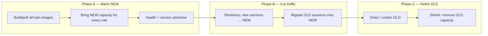
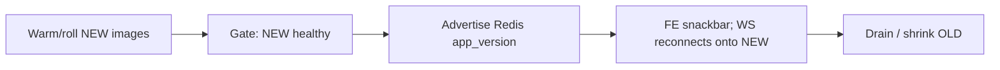

# App-train rolling release (#23)

> Part of [ROADMAP.md](./ROADMAP.md). Absorbs deferred rolling-playbook **#6**.
> Primitives: [MAKE.md](./MAKE.md), [WEBSOCKET.md](./WEBSOCKET.md), [WS_ROUTER.md](./WS_ROUTER.md),
> [TRAEFIK.md](./TRAEFIK.md).

## What is the app train?

Every **our** app image at one **`APP_VERSION`** (GHCR live, or local per-role bake tags `${APP_VERSION}-<timestamp>` in `.eip-local-build.env`):

| Role | Runtime | Image |
|------|---------|--------|
| api | Swarm `eip_api` | `…-api` |
| websocket | Swarm `eip_websocket` | `…-websocket` |
| worker | Swarm `eip_worker` | `…-worker` |
| ws-router | Swarm `eip_ws-router` | `…-ws-router` |
| core | Swarm `eip_core` (stop-first before dual-warm; start-first day-2) | `…-core` |
| frontend | Swarm `eip_frontend` (dual-warm in `WARM_ORDER`) | `…-frontend` |

**Out of band:** Traefik, mongo, redis, nats, exporters, Grafana…

**Never** ship a normal version with `make up` / `make dev` on a healthy install (data-plane bounce risk).

---

## Problem with “role order = release order”

Rolling **api → websocket → worker → …** *in place* creates a **mixed-version mesh**:

- NEW frontend talking to OLD api  
- NEW api talking to OLD websocket placement  
- No clear answer to “is this request on the new train?”

That is fine for a **dev force-roll** (`make rebuild`). It is **wrong** as the release model.

Release intent:

1. **Warm** a full **NEW** cohort (all needed roles at the new version) **without** taking user traffic  
2. **Prove** version identity on those tasks  
3. **Cut** traffic onto NEW (sticky so a session is all-NEW or all-OLD, not mixed)  
4. **Drain / shrink** OLD  

Warm order ≠ cutover order. They are different phases.

---

## Version identity (must exist before cutover)

Operators and routers need a hard answer: **which train is this request/socket on?**

| Surface | Today | Target for cutover |
|---------|--------|--------------------|
| HTTP | Client may send `X-App-Version`; API stores session `app_version` | Every api/ws response (or `connected`) echoes **process** `APP_VERSION` / baked release |
| WS | `connected` includes `slot` + **process** `app_version` (bake); PUBLISH → `{type:app_version}` for advertised SoT | Same train tag as FE/API on bake; snackbar uses advertised fan-out |
| Frontend | Baked `VITE_APP_VERSION` / app config `app_version_number` | Same string as Swarm train tag; outdated → snackbar (WS still reconnects) |
| Placement | Redis tenant → slot | Prefer **newest** bake among eligible slots; OLD SPA may use NEW backends |
| Observability | OTLP release bake | Label scrapes / logs with `app_version` |

**Rule:** cutover does not start until NEW cohort tasks **advertise** the target version and OLD tasks still advertise the previous one (inspectable via health, `connected`, or logs).

Train stickiness (design target):

- Cookie or header e.g. `eip_app_train=<version>` (or `old`/`new` during wave)  
- Set when frontend boots from app config / build  
- Router prefers **newest** backends on (re)place; look-ahead cordon + evacuate retire OLD  
- Mid-wave: reconnects → NEW; OLD columns drain via cordon phases  

---

## Phases (proposed default)



### Phase A — Warm NEW (no user cut yet)

Bring **NEW** capacity for the whole train **beside** OLD. Peak ≈ **2R per Swarm role** (full NEW cohort + full OLD), then scale back to **R** after drain.

**Warm order (capacity only — may be parallel later):**

1. Build/pull **all** train images for target `APP_VERSION`  
2. Optional Traefik (only if edge image/flags change)  
3. Roll **core** (Swarm **stop-first**) **before** dual-warm — data plane stays up.
4. **Dual-warm Swarm** (`WARM_ORDER`: frontend, worker, api, websocket, ws-router): scale each role **R → 2R**, roll start-first until **bake = R** NEW beside **R** OLD (full NEW cohort before any OLD tear-down). No Compose FE-first / PASS1. Advances use a short `EIP_RELEASE_ADVANCE_GAP` then re-stall — **not** delay `0` (that races every pending replica and can wipe OLD websockets).  
5. **Advertise** once NEW cohort exists.  
6. **Drain OLD:** look-ahead cordon + advance until dual capacity is all NEW, then **scale 2R → R**.  

**Gate A:** exactly **R** tasks report target `app_version`; **R** still report previous. Smoke NEW **internally** (curl to task IP / docker exec) without flipping public stickiness.

### Phase B — Cut traffic (version-aware)

**Cut order ≠ warm order.** Unrefreshed browser tabs keep **OLD** JS until reload — do not expect
API alone to “upgrade” them.

Default proposal:

| Step | Action | Why |
|------|--------|-----|
| B1 | NEW **api** (+ NEW **ws**) ready; stickiness so NEW loads use NEW backends | Avoid NEW-FE → OLD-API |
| B2 | Point public **frontend** at NEW (so `/api/v1/app-config` from the path clients already hit advertises **NEW** `app_version_number`) | Unlocks existing FE update check |
| B3 | **Tap existing version check** (below) — OLD tabs get “refresh to update” | Users migrate without inventing a new prompt |
| B4 | Migrate **websocket** as tabs refresh / evacuate remaining OLD slots | Org co-location onto NEW |
| B5 | **worker** dual-consume already | Shrink OLD worker last |

#### Release order (images first, then notify, then shrink OLD)



| Step | Command / action |
|------|------------------|
| 1. Set target | `.env` `APP_VERSION=X.Y.Z` |
| 2–3. Ship | **Public:** `make release` · **Dev:** `make dev-release` (roll NEW then advertise) |
| 4. Users refresh | Existing snackbar; WS reconnects (prefer NEW slots) |
| 5. Shrink OLD | Evacuate leftover WS / scale down OLD capacity |

**`make swarm-sync` is not part of this** — capacity only. Version ship is **`release` / `dev-release`**.

#### Two surfaces (same `app_version` string)

| Surface | What | How |
|---------|------|-----|
| **Bake / roll images** | Container identity | GH Action / `make dev-release` / rebuild |
| **Advertise current** | Browsers’ “must be on” | End of `release`/`dev-release`, or `make advertise` |

```bash
# Public
make release

# Dev
make dev-release
make advertise                 # nudge only
make advertise ARGS='--dry-run'
```

Escape hatch: `make app-version-ops ARGS='set 0.9.0'`.

#### Frontend update check (poll + WS nudge — same snackbar)

| Piece | Where |
|-------|--------|
| Config SoT | `.env` `APP_VERSION` (required) |
| Bake | Image `APP_VERSION` / `__APP_VERSION__` at build |
| Advertise | Redis via **`make release` / `make dev-release`** (or `make advertise`) — **not** `make swarm-sync` |
| Poll | `useAppConfig` → `GET /api/v1/app-config` |
| WS | `connected.app_version` + PUBLISH `{type:"app_version"}` |
| Compare | `considerRemoteAppVersion` |
| UX | `showVersionUpdateSnackbar` |
| Safety | Outdated SPA **keeps** reconnecting `/ws` (prefer NEW bake); refresh still needed for NEW assets |

### Phase C — Drain / shrink OLD

1. Wait until OLD FE traffic decays: version snackbar driven reloads + natural session end  
2. Confirm placement/API idle on OLD (optional evacuate any leftover WS)  
3. Scale Swarm roles (incl. frontend) back to steady `R` (remove OLD tasks)  
4. Leave data plane untouched  

**Do not** force-kill OLD api while many tabs still bake OLD `__APP_VERSION__` and have dismissed
the snackbar — either wait, or escalate (re-show dialog / shorter poll) using the **same** update
path.

---

## Swarm constraint (unchanged)

One Swarm service → one desired image. Mixed OLD/NEW during the wave is a **temporary** dual-warm converge at **≈2R** (full NEW cohort beside full OLD), then drain + scale back to **R** — not a permanent split. Dual services (`eip_api` + `eip_api_next`) are a possible later implementation; v1 assumes **2R warm + stickiness + evacuate**.

---

## vs current `make release` / `make dev-release`

| | Target (full APP_TRAIN) | Now |
|--|-------------------------|-----|
| Build all before cut | Yes | **Yes** (build/pull entire train first; `make dev-release` uses `--no-cache`) |
| Core before elastic dual-warm | Core stop-first; FE on Swarm dual-warm | **Yes** — core service update (stop-first), then dual-warm incl. frontend, then advertise |
| Dual-warm (2R) before advertise | Full NEW beside OLD (FE in `WARM_ORDER`) | **Yes** — scale to 2R, roll until bake≥R NEW, advertise, drain OLD, scale back to R |
| Column advance without wiping OLD | One NEW slot per advance | **Yes** — `ADVANCE_GAP` (default 20s) then re-stall; never `--update-delay 0` (races remaining tasks) |
| Operator gates | None (unattended) | **Yes** — no pauses; wave runs to completion |
| Final converge | Finish OLD only | **Yes** — finish dual bake then scale to R; **no `--force`** when already baked |
| Advertise once after first healthy NEW cohort | Yes | **Yes** — before any OLD tear-down |
| Look-ahead cordon (next OLD only) | Soft cut | **Yes** — remaining OLD keep serving until flagged; reconnects prefer NEW |
| Reconcile during stall | Safe | **Yes** — skip no-op scale; `--detach` so CLI never waits on stalled rolling-update converge |
| WS place during wave | Prefer newest bake | **Yes** — reassign sticky off OLD onto newest eligible; OLD SPA may use NEW |
| Controller soft dual-run → soak → hard cut | Later (#18) | **Documented placeholder only** |
| HTTP train cookie | Later | Open |

`make rebuild` remains the **dev fine-tune** path (default = `dev_app_services` Swarm roles incl. frontend; Docker **cache**; data plane **`--no-recreate`** on default; `SERVICES=` any Swarm/Compose name — explicit extras **force-recreate**; Swarm promotes per-role `TAG_*` only when that role’s `:bake` digest changes; no advertise). `make dev-release` / `make release` use **`--no-cache`** for version rolls. Day-2 config: **`make swarm-sync`** (YAML); secrets: **`make swarm-secrets-sync`**.

### Controller soft cutover placeholder (#18 / later)

Warm NEW beside OLD **without** cordon as the primary tool; advertise; controller moves users as they refresh; soak window; then **hard cut** with FE messaging. Same for api; workers stay a swap. Not implemented in `release.sh` yet.

## Commands (today)

```bash
# Public — bump APP_VERSION in .env, then:
make release

# Dev — same, with local builds:
make dev-release
make dev-release ARGS='--dry-run'
make rebuild                              # full app train (cache; no advertise)
make rebuild SERVICES=websocket           # scoped
make rebuild SERVICES=mongo,grafana       # explicit force-recreate
make advertise                            # ops escape: Redis nudge

make app-version-ops ARGS='get'
make ws-placement-ops ARGS='status'
make ws-placement-ops ARGS='evacuate websocket-1 websocket-3'
```

---

## Related

| Target / doc | Role |
|--------------|------|
| `make release` | Public ship (#23) — GHCR roll + advertise |
| `make dev-release` | Dev ship (#23) — local roll + advertise |
| `make advertise` | Ops escape — Redis nudge only |
| `make rebuild` | Dev fine-tune — full app train / any `SERVICES=` |
| `make swarm-sync` | Capacity only — **not** version ship |
| `make app-version-ops` | Escape hatch for Redis SoT |
| `make ws-placement-ops` | WS cutover (#21) |
| [WEBSOCKET.md](./WEBSOCKET.md) | Drain / evacuate |
| [WS_ROUTER.md](./WS_ROUTER.md) | Placement / prefer-newest |
| FE `considerRemoteAppVersion` | Poll + WS → snackbar; WS still reconnects |
| GH Action `APP_VERSION` | Bake identity into published images |
