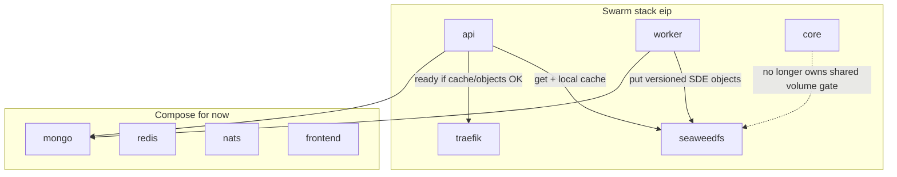

# Core rebuild: SeaweedFS + readiness (not a Swarm stepping stone)

> Synced from `.cursor/plans/core_rebuild_minio_c5bc1754.plan.md` (filename legacy; content is SeaweedFS).
>
> **Object store = SeaweedFS** (`eip_seaweedfs`) + shared Go package `objectstore`. S3-compatible API on overlay `seaweedfs:8333`. Bucket layout `static-data` / `live_data/` etc.
>
> **Progress:** slices 1–6 **complete and validated**. ROADMAP **#9–#14** + **#28** done — core boxed off (primary lease, `start-first`, Redis changestream resume, dual-publisher failover tests in `core/leadership`, `make cli`). **Next (outside this doc):** ROADMAP **#3** / **#18** track.

## Direction (locked)

This track is a **rebuild/update of core's role**, not a minimal "get core into Swarm" wedge.

- **Commit to SeaweedFS** as the static-data source of truth, plus the **api/worker** fetch/publish paths via `objectstore`.
- **SeaweedFS lives on Swarm** from day one; **provisioned by scripts** inside existing bring-up; **no parallel `make data-*` family**.
- **App train never touches the data layer** (mongo/redis/nats/SeaweedFS/Prometheus on the Swarm data fragment). Exclusion is by **layer**, not a growing per-service denylist on rebuild/release.
- **Networks:** attachable overlay [`eip`](docs/swarm/NETWORK.md) for app/data DNS; per-consumer stack overlays **`eip-docker-*`** for socket proxies only (Traefik / ws-router / #18).
- **Singletons** stay in scope; Redis lease + workload registry; can trail object-store slices.

Data plane (mongo/redis/nats/SeaweedFS/Prometheus) lives on the Swarm **data fragment**; app train on the **app fragment**. Same **order + don't cross-roll** rules. Preferred host UX is **`eip`** (not Compose-vs-Swarm).

## Core primary / singleton leadership (locked)

### Does Swarm expose "primary" or hand off to the replacement?

**No.** Docker Swarm does not give application containers a leadership API or a "you are primary now; old task step down" signal.

| Swarm feature | Use for core? |
|---------------|----------------|
| `replicas: 1` + `order: stop-first` | At most one task; gap while old drains and new boots. Interim only (slice 5). |
| `order: start-first` + healthcheck | **Current (slice 6):** Swarm starts new -> waits until new is Healthy -> SIGTERM old. That health gate is how Docker causes the old task to release and shut down. |
| Template env (`{{.Task.Slot}}`, `{{.Task.ID}}`, ...) | Identity / metrics only — not a mutex. |
| Docker socket | Controller later may observe tasks. Do not mount into core for election. |

### Locked mechanism: Redis lease + Swarm health gate

**Lease** = who may run singleton work (SoT).
**Swarm healthcheck** = when the replacement may displace the old task.
**Orchestration probes** (`shared/orchestrationprobes`) = thin Docker probes on `:19100` (`/healthy`, `/ready` only). Gated NATS health census bus exists (`Enabled=false`) for a later fleet poll — not primary handoff.

**Primary controller** (`core/primarycontroller`) owns Redis `lease:core:primary` and notifies managed services via channels. **Service manager** (`core/servicemanager`) applies those states (standby ack / leader start). `/ready` is a pull aggregator (`core/health`): deps + primarycontroller loop + singleton runners + managed changeover. Failed leader start sticks unready + logs why; lease released on shutdown and after unhealthy grace. **SDE ensure** runs on every core replica (not primary-gated, not health-gated).

```mermaid
sequenceDiagram
  participant Swarm as swarm_orchestrator
  participant Old as core_old_leader
  participant New as core_new_standby
  participant Redis as redis_lease
  participant Probes as core_probes_19100
  Swarm->>New: start task
  New->>Probes: serve /healthy live
  Note over New: deps up, standby ready, NOT holding lease
  New->>Probes: /ready handoff 200
  Swarm->>Swarm: new task Healthy
  Swarm->>Old: SIGTERM
  Old->>Redis: Release lease:core:primary
  Old->>Old: stop scheduler changestream + persist resume tokens
  Old->>Swarm: exit
  New->>Redis: Acquire lease:core:primary
  Redis-->>New: elected
  New->>New: start scheduler + changestream StartAfter resume
  Note over New: primary held; /ready stays standby-shaped for next roll
```

**Deadlock trap:** Docker healthcheck must **not** require holding the lease. If new waits to become leader before Healthy, old never gets SIGTERM -> stuck forever.

| Probe | Who calls it | Passes when | Must NOT require |
|-------|--------------|-------------|------------------|
| Swarm/Docker healthcheck | Swarm update_config | Process up + deps OK + ready to take over as standby | Holding `lease:core:primary` |
| Simple status (v1) | Docker / smoke | Same thin probes as api-style `/healthy`/`/ready` | Holding the lease |

**Primary handoff data (Redis):** changestream resume tokens under `eip:core:handoff:v1:cs:resume:{groupID}` (one key per collection group). New primary opens Mongo `StartAfter` that token. At-least-once; rare duplicates OK.

**Handoff contract (locked):**

1. New core boots -> connects mongo/redis/nats -> starts orchestration probes -> election loop on `lease:core:primary`.
2. **Guardrail:** scheduler + changestream start only while primary held (`servicemanager`). Nested singleton jobs keep their own leases on every replica.
3. `/ready` is handoff-ready standby (deps + election loop + managed changeover ack). Swarm healthcheck -> `/ready` 200 (**not** `is_leader`).
4. Swarm marks new Healthy -> SIGTERM old.
5. Old on SIGTERM: release primary lease, stop managed workloads, exit within `stop_grace_period`.
6. New acquires primary -> scheduler/changestream start under leader.

**Primary lease:** `lease:core:primary`. Nested per-job leases remain defense in depth inside the singleton catalog.

**Roll order:** `start-first` (slice 6).

### Guardrails (locked) — what needs them

| Workload | Decision |
|----------|----------|
| Command mode (`tasks ...`) | Out of band — one-shot |
| Telemetry / ConnectServices / metrics | Standby OK |
| **Application Mongo indexes / RS / users / preimages** | **Not on core** — owned by admintool `dataplane.EnsureMongo` / `eip ensure-mongo` (`IndexSpecs`, `PreimageCollections` in `admintool/internal/dataplane/mongo`). `eip up`/`dev` Ready gates app deploy. Legacy `mongo-setup.sh` is not the SoT. |
| EnsureSDEStaticDataReady | **Removed** — SeaweedFS + api/worker `objectstore` |
| CheckRefreshTokenKeyringCoverage | Soft report only — unknown versions already warn+nil; infra errors log and continue |
| ReportSchemaVersionLag | Any replica OK |
| **scheduler / changestream** | **Primary-gated** — start only while `lease:core:primary` held |
| **singleton catalog** | Runs on every replica; each job has its own nested Redis lease |
| WriteCoreReadyMarker | Replaced with thin HTTP `/ready` on `:19100` |
| Orchestration probes | Standby OK (`/healthy` + `/ready` only) |

### Expandable workload gating (locked shape, v1 one owner)

```text
Standby (core v1):  deps + probes + primary election loop + singleton runners (+ soft reports)
Leader (core v1):   + scheduler + changestream (servicemanager)
SIGTERM:            release lease:core:primary -> stop managed workloads -> exit
```

## How Mongo is ensured (locked — admintool)

| Decision | Choice |
|----------|--------|
| Placement | Swarm service `mongo` in **data fragment** [`docker-stack.data.yml`](../../docker-stack.data.yml) |
| CMD | Auth-first `mongod --replSet rs0 --auth --keyFile` (no dual-boot setup script) |
| Keyfile host SoT | `./mongo-keyfile` (+ `.bak`); `EnsureKeyfile` / `eip restore-mongo-keyfile` / `eip rekey-mongo` |
| Caller SoT | [`dataplane.EnsureMongo`](../../admintool/internal/dataplane/ensure_mongo.go) → `mongo.Ensure` |
| Steps | Keyfile → wait PRIMARY → users → preimages (`PreimageCollections`) → indexes (`IndexSpecs`) → Check |
| Bring-up | `eip up` / `eip dev`: data deploy → Ready (`EnsureS3` ‖ `EnsureMongo`) → app deploy |
| Day-2 | `eip ensure-s3` / `eip ensure-mongo` (also after index SoT changes when not running full up/dev); rebuild/secrets rematerialize skip Ready |
| Not on core | No `EnsureIndexes` / index create on standby boot |

Details: [docs/admintool/ENGINEERING.md](../admintool/ENGINEERING.md), [VARIABLES.md](../admintool/VARIABLES.md).

## How SeaweedFS is set up (locked defaults)

| Decision | Choice |
|----------|--------|
| Placement | Swarm service `seaweedfs` in **data fragment** [`docker-stack.data.yml`](docker-stack.data.yml) |
| Network | Attach to existing `eip` only; DNS alias `seaweedfs` |
| Persistence | Named volume `eve-industry-planner_seaweedfs_data` |
| Image | `chrislusf/seaweedfs` (pin tag; `weed mini`) |
| S3 API | Internal only — `http://seaweedfs:8333` on `eip`. No public Traefik route |
| Console | Not public in v1 |
| Credentials | `.env` (`S3_ACCESS_KEY` / `S3_SECRET_KEY`); `swarm-secrets-sync` can refresh; real `docker secret` later (#3) |
| Bucket | Name **`static-data`** (+ `static-data-test`); ensured by admintool `dataplane.EnsureS3` / `eip ensure-s3` |
| Object layout | **Same tree as today under that bucket** — e.g. `live_data/`, `previous_versions/`, `version.json` at the usual relative paths. Later: more buckets for other data domains |
| Client | Go `services/shared/core/objectstore` (`OpenStaticData*`); SDE path helpers in `shared/core/sde` |
| Cutover | **Hard cut** — no volume dual-write/dual-read of `static_data_files` for SDE |
| Make surface | Existing verbs + order; **`make update-data SERVICE=seaweedfs`** — generic data-layer service update |
| Layer encoding | **Stack fragments** — `docker-stack.data.yml` / app stack; membership = what lives in that fragment |
| Health HTTP | **`/healthy`** and **`/ready`** on app services — simple, tool-friendly |



## Orchestration probes (locked — `/healthy` + `/ready` on `:19100`)

Shared package: [`services/shared/orchestrationprobes`](../../services/shared/orchestrationprobes). **Every app role** (api, core, worker, websocket, ws-router) listens on fixed **`:19100`** (container-local; not host-published; not a Traefik router target). Traffic stays on 4000/4001/8080.

| Path | Meaning | Typical use |
|------|---------|-------------|
| **`/healthy`** / **`/health`** | Process is alive | Swarm/Docker **liveness** alias |
| **`/ready`** | May take traffic / handoff role for this service | Swarm healthcheck + Traefik `healthcheck.port=19100` (api, ws-router); core = **handoff-ready standby** (not "I hold the lease") |

- Probes are **not** on the public mux (api `/api`, ws-router `/ws` proxy).
- **Core deadlock rule unchanged:** `/ready` for Swarm replace must not require holding `lease:core:primary`.

### Control-plane NATS (sibling patterns — do not conflate)

Same NATS server, core pub/sub (not JetStream). Shared envelope helpers later; **different shapes per job:**

| Job | Pattern | Notes |
|-----|---------|-------|
| **Fleet health census** | Controller poll: Publish `health.command.ping` + inbox gather | No queue group; every replica Responds `HealthStatus`. Bus scaffold exists, **Enabled=false** until #18 |
| **WS client dump / 1:1 ask** | `Request` / `Respond` to a known slot | Later `rpc.` / `ws.control.query.*` |
| **Push drain** | One-way fan-out notify | Replaces Redis `eip:ws:drain:v1`; not request-gather |

Rejected for health: JetStream `health.>`, service-push heartbeats as the primary census, queue group on the ping subject.

## Object-store decisions (locked)

### 1. Ensure via admintool — not bootstrap containers

**Preferred:** `eip up` / `eip dev` (data → Ready → app). Buckets via `dataplane.EnsureS3` (concurrent with `EnsureMongo` in Ready).

| Command class | Behaviour |
|---------------|-----------|
| **Bring-up** (`eip up` / `eip dev`) | Ordered: **data-layer fragment** up → Ready (`EnsureS3` ‖ `EnsureMongo`) → **app-layer fragment** |
| **Day-2 ensure** | `eip ensure-s3` / `eip ensure-mongo` without full up/dev |
| **Day-2 app train** (`eip rebuild`, Make `release` / `dev-release`) | **App-layer fragment only** — never rolls data-layer services; rematerialize skips Ready |
| **Day-2 sync** (`eip sync` / `eip secrets`) | Env/checks; may refresh data-layer env without app-train dual-warm |

Credentials in `.env` first (`S3_ACCESS_KEY` / `S3_SECRET_KEY`).

### 2. Hard cut + bucket layout

- Bucket: **`static-data`**.
- Keys: recreate current folder layout inside the bucket (`live_data/`, `previous_versions/`, root meta/`version.json` as today).
- Future domains get **new buckets**, not a dump into `static-data`.

### 3. Layer membership = fragments

| Fragment | Contains (direction) |
|----------|----------------------|
| **Data** | SeaweedFS now; later other durable stores as they move to Swarm |
| **App** | api, websocket, worker, ws-router, traefik, core, … |

```text
Bring-up:     data fragment ready + provision -> app fragment
App train:    app fragment only
update-data:  one service from data fragment
```

## Implementation slices (ordered)

1. **Data fragment + SeaweedFS + `update-data`** — **done**
2. **Object contract + worker publish** — **done**
3. **API consume + cache + `/healthy` + `/ready`** — **done** (Traefik gates on `/ready`)
4. **Strip core static gate** — **done**
5. **Core onto Swarm (app fragment)** — **done** (stop-first interim; `/healthy` + `/ready`)
6. **Core primary lease + handoff** — **done + validated** — `primarycontroller` / `servicemanager`; `/ready` = handoff-ready standby; SIGTERM release; `start-first`; gocron job ctx cancel; changestream Redis resume tokens + cancel watch on lose-primary
7. **Later (not blocking):** grow data fragment; further overlay splits if needed (`eip-docker-*` for socket proxies already landed)

## Explicitly parked (still possible later)

- Overlay split (`public` / `app` / `data` / `obs`) beyond socket-proxy nets
- Real Docker Swarm `secret` objects for S3 creds (`.env` first) — ROADMAP **#3**
- ~~Folding mongo/redis/nats onto Swarm~~ **done** (data fragment; EnsureMongo for mongo desired state)
- Swarm bootstrap/init containers for SeaweedFS
- Stuffing unrelated domains into the `static-data` bucket (use more buckets later)
- Public SeaweedFS / S3 console via Traefik
- Optional core `replicas: 2` warm standby (still single-primary via lease)

## Rejected / superseded (not backlog)

- Parallel public `make data-*` taxonomy → bring-up order + `make update-data`
- Swarm-native primary / Docker-socket election → Redis `lease:core:primary`
- Peer HTTP / `registerExtra` handoff on `:19100` → Redis changestream resume tokens; probes stay thin `/healthy`+`/ready`
- Multi-active scheduler/changestream → out of scope; single-primary is the design
- Dual-write static volume + object store → hard cut to SeaweedFS `static-data`
- Compose `core-ready` file + `depends_on: core` → Swarm `/ready` on `:19100`

## Docs impact

ROADMAP #9–#14 / Phase B/C closed. Bring-up order, **fragment-per-layer**, `update-data`, `/healthy`+/`/ready`, Redis handoff resume, and `static-data` bucket layout live in MAKE/ENV/STACK/BIND_MOUNTS/NETWORK.

## Roadmap alignment

| Roadmap item | How it ties in |
|--------------|----------------|
| **#9** Core Swarm singleton | Slice 5 — **done** — core in **app fragment** |
| **#10** Ready without Compose depends_on | **done** — per-service **`/healthy` + `/ready`**; api owns static readiness; core `/ready` = handoff-ready standby |
| **#11 / #12** Lease-gate scheduler + changestream | Slice 6 — **done** — under `lease:core:primary` + `servicemanager`; #12 Redis resume + watch cancel |
| **#13** start-first hot-swap | Slice 6 — **done** — `docker-stack.yml` + validated live roll |
| **#14** Core CLI under Swarm | **done** — `make cli` / `scripts/swarm/ops/core-cli.sh` (core-only) |
| **#28** Core failover tests | **done** — unit/miniredis + `core/leadership` dual-publisher harness (clean-Stop takeover bound; crash/TTL via `lease` tests) |
| **#5 / STACK** split | **Fragment-per-layer** — data vs app |
| **#17 / #23 / #33** make surface / app train | **App train = app fragment only**; **`make update-data`** for data fragment |
| **#22** Data-plane updates | Pattern now with SeaweedFS + `update-data` |
| **#3 / BIND_MOUNTS** static volume | Hard cut off `static_data_files` for SDE — objects in SeaweedFS `static-data` |

### Do not pull in (stay separate)

Capacity controller (#18/#19/…), WS deepen (#8/#20/#21), obs addon (#34), secrets/config + frontend track (#3/#16), broader Swarm test suite (#25–#27/#29). Mongo ensure owned by admintool (`EnsureMongo`).
