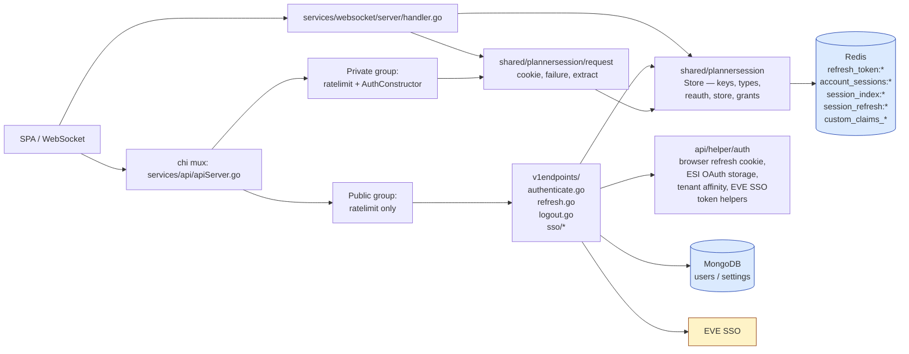
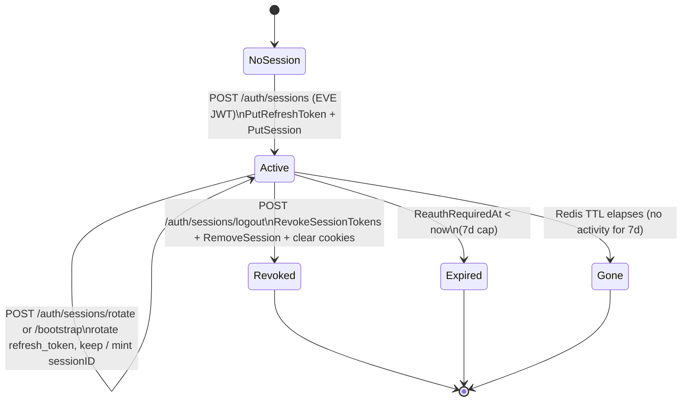

# Authentication — Backend

How the Go API and websocket services authenticate every request, how the EVE SSO and planner session endpoints work, what lives in Redis, and how the deprecated internal JWT layer was replaced with cookie + Redis session lookup.

> Companion docs: **[overview.md](./overview.md)** for overview / wire contracts, **[spa.md](../../../frontend/auth/spa.md)** for SPA detail.

---

## 1. Architecture



**One-line model**: middleware reads the session cookie (or header/query param — see § Cookies) → resolves to a `request.Identity` in Redis through `shared/plannersession` → attaches to context. Handlers consume identity via `helper.AuthenticatedAccountID(r)` / `helper.RequireAccountID(w, r)` and `helper.AuthenticatedSessionID(r)`; no JWT signing happens server-side.

`shared/plannersession` is a service-boundary package: `core`, `worker` and `websocket` reach the same session state `api` does by importing it, not by importing `api`. Package layout and the rule that keeps it that way → [`../../../technical-rules.md`](../../../technical-rules.md) § Service boundaries.

---

## 2. Middleware — `AuthConstructor`

Defined in `services/api/middleware/auth.go`:

```go
func AuthConstructor(redisClient *eipredis.Redis) httpmiddleware.MiddlewareConstructor {
    sessions := plannersession.NewStore(redisClient)
    return func(next http.Handler) http.Handler {
        return http.HandlerFunc(func(w http.ResponseWriter, r *http.Request) {
            identity, err := sessionreq.ExtractSession(r.Context(), r, sessions)
            if err != nil {
                if sessionreq.IsInfrastructureError(err) || dependency.IsUnavailable(err) {
                    // Redis unreachable: 503, not 401 — see § Failure / status mapping.
                    respondAuthDependencyUnavailable(w, r, ...)
                    return
                }
                writeAuthError(w, http.StatusUnauthorized, detailCode) // session_missing | session_revoked | reauth_required
                return
            }
            if err := sessions.Touch(r.Context(), identity.AccountID, identity.SessionID, identity.Session.AppVersion); err != nil {
                // dependency outage -> 503; otherwise session_missing -> 401
                ...
            }
            ctx := sessionreq.WithIdentity(r.Context(), identity.AccountID, identity.SessionID)
            next.ServeHTTP(w, r.WithContext(ctx))
        })
    }
}
```

**Error payload**:

```json
{ "code": "session_missing | session_revoked | reauth_required", "message": "Unauthorized" }
```

A Redis outage does not report as one of those codes — `plannersession.ErrNoStore` wraps `eipredis.ErrNoClient`, so `dependency.IsUnavailable` recognises it and the middleware answers `503` instead of misclassifying the dependency failure as the caller's fault.

**Per-request side effect**: `Store.Touch` updates `LastSeenAt` on the session row so dashboards / cleanup tools can see live sessions.

**Wiring**: in `services/api/apiServer.go` the router exposes two groups:

- `publicRoutes` — only rate limiting.
- `privateGroup` — rate limiting + `AuthConstructor(clients.Redis)`.

All `/api/v1/auth/sessions[/rotate|/bootstrap]` and the SSO exchange/refresh endpoints are **public** (they must run before a session exists). `/api/v1/auth/sessions/logout` is **private** (a session must exist to revoke it).

---

## 3. Redis key layout

Defined in `services/shared/plannersession/keys.go` (prefixes and TTLs) and `types.go` (stored shapes).

### 3.1 Key prefixes & TTLs

```go
RefreshTokenKeyPrefix        = "refresh_token:"       // 7d TTL
AccountSessionsKeyPrefix     = "account_sessions:"     // 7d TTL (every session an account holds, as one row)
SessionIndexKeyPrefix        = "session_index:"        // 7d TTL (session_id -> account_id)
SessionRefreshIndexKeyPrefix = "session_refresh:"       // 7d TTL (session_id -> its current refresh token)
CorporationKeyPrefix         = "custom_claims_corporations:"  // 30d TTL
AllianceKeyPrefix            = "custom_claims_alliances:"     // 30d TTL

RefreshTokenTTL = 7 * 24 * time.Hour
SessionTTL      = RefreshTokenTTL
CorporationTTL  = 30 * 24 * time.Hour
```

Six families, and they are not independent: a session is one row under `AccountSessionsKeyPrefix` plus two indexes that point at it, and a refresh token is a row of its own that the session-refresh index names. `Store` exists to keep a write that touches more than one of them from landing only some — its own test, `TestOperationsLeaveTheKeysTheyOwe`, pins that invariant directly rather than only reading back what was just written.

### 3.2 `RefreshTokenData` (`refresh_token:<token>`)

```go
type RefreshTokenData struct {
    CharacterHash string
    AccountID     string
    Scopes        []string
    Corporations  CorporationIDs // []int64 (lenient unmarshal: bad shapes -> empty)
    Alliances     AllianceIDs    // []int64
    SessionID     string         // empty on legacy rows; refresh handler backfills
    SessionStart  time.Time      // first time this device/session chain was bound
    SessionSeenAt time.Time      // last refresh time on this chain
    AppVersion    string         // SPA build version (X-App-Version, "unknown" if absent)
}
```

### 3.3 `AccountRecord` (`account_sessions:<accountID>`)

```go
type Session struct {
    SessionID        string
    CharacterHash    string
    AppVersion       string
    StartedAt        time.Time
    LastSeenAt       time.Time
    ReauthRequiredAt time.Time
    RevokedAt        *time.Time            // nil = active
    Grants           models.SessionGrants  // { CorporationIDs []int64, AllianceIDs []int64 }
}

type AccountRecord struct {
    AccountID     string
    Grants        models.SessionGrants
    Sessions      map[string]Session
    GrantsVersion int64
    UpdatedAt     time.Time
}
```

One account may hold N concurrent sessions (e.g. multiple devices). `ReauthRequiredAt = StartedAt + RefreshTokenTTL`.

### 3.4 `session_index:<sessionID>` → `<accountID>`

Plain string value. Lets the middleware go from a `sessionID` to an `accountID` without scanning, then drill into `account_sessions:<accountID>[sessionID]`.

### 3.5 `session_refresh:<sessionID>` → `<token>`

Plain string value. Lets a tab that lost its refresh token recover the live one for its session without scanning every `refresh_token:*` row.

### 3.6 `Store` methods

Defined in `services/shared/plannersession/store.go`. The store is the whole API — nothing outside the package reads or writes these keys directly.

| Method | Purpose |
|---|---|
| `GenerateRefreshToken()` / `GenerateSessionID()` | Mint opaque UUIDs (fallback to URL-base64 of 32 random bytes). |
| `PutRefreshToken(ctx, token, data)` | Set `refresh_token:<token>` with the 7d TTL. |
| `RefreshToken(ctx, token)` | Fetch; returns `(data, found bool, err)` — a missing token is `found == false`, not an error. |
| `DeleteRefreshToken(ctx, token)` | DEL key. |
| `PutSession(ctx, accountID, session)` | Add / merge the session row into `account_sessions:<accountID>`. Also writes `session_index:<sessionID>` and `session_refresh:<sessionID>`. |
| `Touch(ctx, accountID, sessionID, appVersion)` | Update `LastSeenAt` (and optionally `AppVersion`) for one session row. |
| `RemoveSession(ctx, accountID, sessionID)` | Remove the session row; delete its indexes. |
| `ResolveSession(ctx, sessionID)` | Two-step: read `session_index:<sessionID>`, then load the session out of `account_sessions:<accountID>`. |
| `RevokeSessionTokens(ctx, presentedToken, sessionID)` | Revoke every refresh token a scan attributes to the session, not only the one the index names. |
| `SetGrants` / `RepairGrants` | Refresh the cached grants on every active session row, or repair a legacy or drifted grants shape. |
| `Corporations` / `Alliances` | Read the `custom_claims_*` caches; lenient on malformed JSON. |

`shared/plannersession/request` reads a session off an HTTP request (cookie/header/query → `Store.ResolveSession` → identity); `shared/plannersession/maintenance` runs the orphan refresh-token sweep — see § Cleanup.

---

## 4. Identity context

Defined in `services/shared/plannersession/request/extract.go`:

```go
type Identity struct {
    AccountID string
    SessionID string
    Session   plannersession.Session
}

func WithIdentity(ctx context.Context, accountID, sessionID string) context.Context
func AccountIDFromContext(ctx context.Context) string
func SessionIDFromContext(ctx context.Context) string

// Cookie/header/query + Store lookup, used by middleware and WS upgrade
func ExtractSession(ctx, r, store) (*Identity, error)
func TryExtractSession(ctx, r, store) (*Identity, bool)
```

`ExtractSession` returns a `SessionError` classified into one of these codes (mapped to `code` in `AuthConstructor`):

- `session_missing` — no session id presented, or no Redis row.
- `session_revoked` — `RevokedAt != nil`.
- `reauth_required` — `ReauthRequiredAt < now`.
- an infrastructure error (`IsInfrastructureError` true, or wraps `dependency.IsUnavailable`) — the store had no connection; the caller degrades to `503` rather than reporting `session_missing`.

**Handler-side helpers** in `services/api/helper/httpGuards.go`:

```go
func AuthenticatedAccountID(r *http.Request) string  // context only, no write
func AuthenticatedSessionID(r *http.Request) string
func RequireAccountID(w http.ResponseWriter, r *http.Request) (string, bool) // writes 401 when empty
func RequireMethod(w http.ResponseWriter, r *http.Request, m string) bool
```

Handlers consume identity through this pair — they never look at the cookie/header directly.

---

## 5. Cookies

| Name | File | HttpOnly | Path | Constants |
|---|---|---|---|---|
| `eip_session` | `services/shared/plannersession/request/cookie.go` | yes | `/` | `SessionCookieName`. MaxAge = `RefreshTokenTTL` seconds. `Secure`, `SameSite=Lax`. The primary identity cookie; `request.SessionID(r)` also accepts the per-tab `X-Session-ID` header or `planner_session_id` query param first, so a request carrying one of those does not need the cookie. |
| `eip_app_refresh` | `services/api/helper/auth/app_refresh_cookie.go` | yes | `/api/v1/auth` | `AppRefreshCookieName`. Scoped to auth paths so the value is never sent on data endpoints. |
| `eip_esi_oauth_storage` | `services/api/helper/auth/esi_oauth_storage_cookie.go` | **no** | `/` | `EsiOAuthStorageCookieName` + `EsiOAuthStorageServer`/`EsiOAuthStorageClient`. |

`SetEsiOAuthStorageCookieFromUserCloud(userCloudAccounts bool)` is the helper login/refresh handlers use; it normalises the value to `"server"` or `"client"`.

---

## 6. Endpoints

### 6.1 `POST /api/v1/auth/sessions` (public) — `AuthHandler`

File: `services/api/v1endpoints/authenticate.go`.

```go
const (
    maxTokenLength        = 8192   // EVE SSO access JWT
    maxRefreshTokenLength = 512    // planner refresh token
)
```

**Steps** (numbered to match the code):

1. `config.LoadConfig()` (env-driven).
2. `RequireMethod(POST)`.
3. `extractTokenFromRequest(r)` → JSON `{ token }`; rejects empty / `> 8KB`.
4. `auth.ValidateEveTokenAndExtractHash(ctx, tokenString, cfg.EveSSOClientID)` → verifies CCP's signing key, extracts `CharacterHash` (`owner` claim) + scopes.
5. `accountID = plannersession.AccountIDFromCharacterHash(characterHash)`.
6. `extractAppVersion(r)` reads `X-App-Version` (`"unknown"` if blank).
7. `sessions.Corporations` / `sessions.Alliances` from the Redis caches.
8. `plannersession.GenerateRefreshToken()` + `plannersession.GenerateSessionID()`.
9. `sessions.PutRefreshToken(ctx, token, plannersession.RefreshTokenData{…})`.
10. `sessions.PutSession(ctx, accountID, plannersession.Session{…})` (also writes the session indexes).
11. `sessions.SetGrants` (best-effort).
12. `ResolveUserDocumentsForLogin` (Mongo) → user document + application settings + first-login flag.
13. **Cloud branch** (`userOut.UserCloudAccounts`): `BuildCloudLinkedCharactersForLogin` decrypts stored ESI refresh tokens with `cfg.RefreshTokenKeyring` and freshens an ESI access token for each linked character. `StripRefreshTokensFromUserDocumentForClient` removes secrets from the response body.
14. **NATS task** (cloud only, JetStream available): `UpdateAccountSessionGrants` task to recompute corp/alliance membership across all character access tokens.
15. Build `SessionBootstrapResponse{ kind:"session_bootstrap", … }`.
16. **Set cookies**: `SetAppSessionCookie(sessionID)`; cloud → `SetAppRefreshCookie(refreshToken)` + `response.RefreshToken = ""`; always `SetEsiOAuthStorageCookieFromUserCloud(userOut.UserCloudAccounts)`.
17. Headers `Content-Type: application/json`, `Cache-Control: no-store`, `Pragma: no-cache`.
18. `200 OK` + JSON body.

### 6.2 `POST /api/v1/auth/sessions/rotate` and `/bootstrap` (public) — `refreshHandler`

File: `services/api/v1endpoints/refresh.go`. `RotateHandler` and `BootstrapHandler` are thin wrappers passing `touchLastLogin = false / true`.

**Credential extraction** (`extractRefreshCredentials`):

- JSON body `RefreshRequest { refresh_token, eve_token }`.
- Body `refresh_token` **wins** over the `eip_app_refresh` cookie.
- `refreshFromCookie = true` only when the body was empty *and* the cookie supplied the token.

Key implementation notes:

- **`eve_token == ""` is only legal when `refreshFromCookie`** (cookie cloud resume). The handler then calls `RefreshStoredEsiFromMongoForCharacter` to mint a fresh ESI access from the encrypted Mongo refresh token. A missing row or a refusal from EVE SSO is terminal for the client and answers `401 {"code":"session_revoked"}`; a keyring, decrypt or persist failure is ours and answers `500`.
- **`eve_token != ""`**: validated with `auth.ValidateEveTokenAndExtractHash`; `tokenData.CharacterHash` **must** match `eveTokenInfo.CharacterHash`, else `401 Invalid token`.
- **Session backfill**: legacy `refresh_token:` rows may lack `SessionID`. The handler mints one (`refresh_backfill` flow on rotate, `login_refresh` on bootstrap) and stamps `SessionStart`.
- **Missing token**: `sessions.RefreshToken` reports a missing row as `found == false` rather than an error; the handler turns that back into `plannersession.ErrRefreshTokenNotFound` so its `401` and log fields are unchanged from before the move.
- **Only the presented token is revoked** (`sessions.DeleteRefreshToken(ctx, refreshToken)`). Other devices' refresh-token rows are untouched — they each rotate themselves on their own cadence.
- **Bootstrap path** reloads `ResolveUserDocumentsForLogin` + cloud linked characters (same logic as login).
- **Cookie writes**: always `SetAppSessionCookie(updatedTokenData.SessionID)`; when `refreshFromCookie` → `SetAppRefreshCookie(newRefreshToken)`; on bootstrap → also `SetEsiOAuthStorageCookieFromUserCloud(userOut.UserCloudAccounts)`.
- **Response body**: `refresh_token` is **omitted** in the JSON when `refreshFromCookie` (cookie carries the new value); when the SPA supplied the token in the body, the new value is returned in the body.

### 6.3 `POST /api/v1/auth/sessions/logout` (private) — `LogoutHandler`

File: `services/api/v1endpoints/logout.go`.

```mermaid
sequenceDiagram
    autonumber
    participant C as Client
    participant M as middleware.AuthConstructor
    participant H as LogoutHandler
    participant S as plannersession.Store

    C->>M: POST /logout (Cookie eip_session, eip_app_refresh; body { refresh_token? })
    M->>S: ExtractSession + Touch
    M-->>H: ctx with WithIdentity
    H->>H: RequireMethod(POST)
    H->>H: RequireAccountID -> account_id
    H->>H: extractLogoutRefreshTokenFromRequest (body or eip_app_refresh)
    H->>S: RefreshToken(token)
    S-->>H: tokenData, found
    alt not found, or tokenData.AccountID != account_id
        H-->>C: 401 Unauthorized
    else
        H->>H: sessionID = SessionIDFromContext || tokenData.SessionID
        H->>S: RevokeSessionTokens(presented, sessionID)\n  revokes every token the session's index or a scan names
        H->>S: RemoveSession(account_id, sessionID)
        H->>C: Set-Cookie clear eip_app_refresh, eip_esi_oauth_storage, eip_session
        H-->>C: 204 No Content
    end
```

**Revocation order**: `Store.RevokeSessionTokens` runs **before** `Store.RemoveSession`. It revokes the presented token and every other refresh token a scan attributes to the same session — not just the one the session-refresh index names — so a token minted by an earlier rotate that fell out of the index cannot outlive logout. Subsequent `POST /auth/sessions/rotate` or `/bootstrap` with a captured refresh value returns `401 {"code":"session_revoked"}`, which the SPA treats as terminal.

**Mongo ESI refresh secrets** (`users.refreshTokens`) are unchanged on logout — only planner session material in Redis and auth cookies are cleared.

### 6.4 `POST /api/v1/eve-sso/tokens/exchange` (public) — `EveSSOExchangeHandler`

File: `services/api/v1endpoints/sso/exchangeHandler.go`.

**Steps**:

1. `loadSSOConfigOrRespond` (cfg with `EveSSOClientID` + `EveSSOClientSecret`).
2. `ensurePostMethod`.
3. `extractAuthCodeFromRequest` → JSON `{ auth_code, account_type? }`; rejects empty or `> maxAuthCodeLength`.
4. `validateSSOCredentialsOrRespond` — confirms env credentials are non-empty.
5. `ctx, cancel := context.WithTimeout(ctx, 30s)`.
6. `exchangeAuthCodeForEveSSOTokens(ctx, clientID, secret, authCode)` → POSTs CCP's token endpoint.
7. Reject empty `access_token`.
8. `extractCharacterHashFromEveSSOAccessToken` (best-effort; degraded on parse error → log + continue).
9. Encode `EveSSOTokenPayload { access_token, refresh_token, token_type, expires_in }`.

**No planner state is touched.** This endpoint exists purely so the SPA never has to embed `EVE_CLIENT_SECRET`.

### 6.5 `POST /api/v1/eve-sso/tokens/refresh` (public) — `EveSSORefreshHandler`

File: `services/api/v1endpoints/sso/refreshHandler.go`. Same shape as exchange, but with `RefreshEveSSOAccessToken` — CCP's `grant_type=refresh_token`. Response is the same `EveSSOTokenPayload`. Used by the SPA only for **local** (browser-stored) ESI refresh material; cloud accounts go through `cloudStoredEsiRefresh.go` instead.

---

## 7. WebSocket upgrade auth

File: `services/websocket/server/handler.go` → `HandleWS`.

The upgrade refuses through `sessionreq.WriteCodedError`, the same writer the API middleware and the
rotate handler use, so a rejected upgrade answers the `{"code","message"}` JSON body rather than plain
text.

**Pre-upgrade auth steps** (mirrors API middleware):

```go
1. if s.Stack == nil || s.Stack.Redis == nil          -> 503 Service unavailable
2. sessions := plannersession.NewStore(s.Stack.Redis)
3. identity, err := sessionreq.ExtractSession(reqCtx, r, sessions)
   if err -> reject with the classified code (session_missing|session_revoked|reauth_required)
              or 503 when the error is an infrastructure error
4. sessions.Touch(...)                                 -> reject if it fails
5. enforce per-user connection cap (closes oldest)
6. upgrader.Upgrade(w, r, nil)
7. build Client{ AccountID, SessionID, Scopes, granted*IDs from identity.Session.Grants }
8. send { type:"connected", clientID } over the new socket
```

**No JWT verification.** The deleted `services/websocket/sso/{jwks,jwt,types}.go` would have parsed a custom RSA-signed token; the websocket service shares the *exact same* `shared/plannersession` and `shared/plannersession/request` packages as the REST middleware, so there is **one** identity check in the codebase and no import from `websocket` into `api` to get it.

Multiple tabs share one `sessionID`; the WS layer does **not** evict by session id — each tab gets its own `Client` keyed by an opaque `clientID = fmt.Sprintf("%p", conn)`.

---

## 8. Encryption / signing

| Material | Mechanism | Where |
|---|---|---|
| **EVE ESI access JWT** | Verified with CCP's JWKS via `services/shared/evesso` (`ValidateEveTokenAndExtractHash`). Audience claim is `cfg.EveSSOClientID`. | `services/api/helper/auth/evetoken.go` |
| **Planner refresh token** | Opaque random UUID. Stored as plaintext JSON in Redis with a 7d TTL. **No** at-rest encryption — Redis is the trust boundary. | `services/shared/plannersession/store.go` |
| **Planner session id** | Opaque random UUID. Stored inside `account_sessions:<accountID>`. Cookie value is the session id directly. | `services/shared/plannersession/store.go` |
| **ESI refresh token at rest** (cloud accounts only) | AES-GCM via a keyring from env (`REFRESH_TOKEN_AES_KEY`, optional `REFRESH_TOKEN_AES_KEY_VERSION`, optional `REFRESH_TOKEN_AES_LEGACY_KEYS`). Lives in Mongo `users.refreshTokens`. | `services/shared/core/crypto/keyrings/refresh_token.go` |
| **Internal JWT** | **REMOVED.** The old `services/shared/core/internaljwt/{jwt,key_cache,rsa_keys}.go` and `services/api/v1endpoints/jwks.go` are deleted. `Config` still has `AuthSecret` / `ExternalJWT*` fields, but no handler references them — they are reserved / legacy. | — |

---

## 9. Config

File: `services/shared/core/config/config.go`. `LoadConfig` populates a `Config` struct from environment variables. Auth-relevant fields:

| Field | Env var(s) | Notes |
|---|---|---|
| `EveSSOClientID` | `EVE_CLIENT_ID` | Required for SSO + token validation (`aud`/`azp`). |
| `EveSSOClientSecret` | `EVE_CLIENT_SECRET` | Required for SSO token requests. |
| Redis | `REDIS_HOST`, `REDIS_PORT`, `REDIS_PASSWORD` | All auth state lives here. |
| `RefreshTokenKeyring` | `REFRESH_TOKEN_AES_KEY` (+ optional `*_VERSION`, `*_LEGACY_KEYS`) | AES-GCM keyring for Mongo-stored ESI refresh; built by `keyrings.NewRefreshTokenKeyringSpec()`. |

---

## 10. Routing table

From `services/api/apiServer.go`:

| Path | Method | Group | Handler |
|---|---|---|---|
| `/api/v1/auth/sessions` | POST | public | `v1endpoints.AuthHandler` |
| `/api/v1/auth/sessions/rotate` | POST | public | `v1endpoints.RotateHandler` |
| `/api/v1/auth/sessions/bootstrap` | POST | public | `v1endpoints.BootstrapHandler` |
| `/api/v1/auth/sessions/logout` | POST | **private** (`AuthConstructor`) | `v1endpoints.LogoutHandler` |
| `/api/v1/eve-sso/tokens/exchange` | POST | public | `ssoendpoints.EveSSOExchangeHandler` |
| `/api/v1/eve-sso/tokens/refresh` | POST | public | `ssoendpoints.EveSSORefreshHandler` |
| `/ws` | GET (Upgrade) | (`services/websocket/server`) | `Server.HandleWS` (cookie/header + Redis check) |

Every other private handler under `services/api/v1endpoints/**` is wrapped by `AuthConstructor` and consumes identity via `helper.RequireAccountID(w, r)` (account) and `helper.AuthenticatedSessionID(r)` (session, used by document-lock, group / job-document mutations, and watchlist updates).

---

## 11. Failure / status mapping

| Trigger | API response |
|---|---|
| No session id presented / Redis row missing | `401 {"code":"session_missing"}` |
| `Session.RevokedAt != nil` | `401 {"code":"session_revoked"}` |
| `ReauthRequiredAt < now` (7d cap) | `401 {"code":"reauth_required"}` |
| Redis unreachable while resolving or touching a session | `503 "Service temporarily unavailable"` — classified through `dependency.IsUnavailable`, not folded into `session_missing` |
| Refresh: `refresh_token:` row missing | `401 {"code":"session_revoked"}` |
| Refresh: `eve_token` invalid / expired (text varies) | `401 <error message>` |
| Refresh: `eve_token == ""` and `!refreshFromCookie` | `400 "eve_token is required …"` |
| Refresh: cloud Mongo ESI missing, or stored ESI refused by SSO | `401 {"code":"session_revoked"}` |
| Logout: presented refresh token missing, or its account does not match the session account | `401 "Unauthorized"` |
| Login: EVE JWT validation failure | `401 <auth.GetEveTokenErrorMessage(err)>` |
| Login / refresh: Redis error | `500 "Internal server error"` |

---

## 12. Lifecycle on a single session



---

## 13. Testing notes

- **No JWT signing tests exist** because there is no internal JWT to sign — the previous tests under `internaljwt/` are deleted along with the module.
- **Session, request-side and maintenance tests** live with the package that owns them: `services/shared/plannersession/*_test.go`, `services/shared/plannersession/request/*_test.go`, `services/shared/plannersession/maintenance/*_test.go`. Test depth → [`../../../testing/services/shared.md`](../../../testing/services/shared.md).
- **Integration tests for the browser auth flow, cookies, and the refresh state machine** live alongside their handler packages (search for `*_test.go` under `services/api/v1endpoints/` and `services/api/helper/auth/`).
- **Cross-service agreement on what a stored session means** — that the API's login write, the websocket's upgrade read, the worker's grants update and the core's maintenance sweep all see the same thing — is proved by `testing/sessionhandover`, not by any one service's suite.
- **EVE JWT validation** uses CCP's live JWKS; for tests, point `EVE_SSO_BASE_URL` at `testing/evessofake`, which signs verifiable tokens.

---

## 14. Operational notes

- **Redis is in the critical path of every authenticated request.** A Redis outage now degrades to `503 {"code":"service_unavailable"}` rather than being folded into `401 session_missing` — `plannersession.ErrNoStore` wraps `eipredis.ErrNoClient`, so `dependency.IsUnavailable` recognises it. Consider a circuit breaker if you need to keep the SPA reachable during partial outages.
- **Cookie scope matters.** `eip_app_refresh` is deliberately scoped to `/api/v1/auth` so even an XSS bug on a data route cannot exfiltrate the refresh value. Keep this invariant when adding new auth paths.
- **No public JWKS endpoint.** Anything that previously hit `/.well-known/jwks.json` for the planner's internal key has been removed; consumers should not exist.
- **Cleanup**: `shared/plannersession/maintenance.Run` revokes refresh tokens whose session no longer exists, on an hourly `core` singleton lease (`AuthSessionMaintenanceJob`, lease `lease:auth:session-maintenance`). Set `AUTH_SESSION_CLEANUP_DRY_RUN=true` to log counts without revoking.

  It only sweeps orphan refresh tokens, not expired sessions or stranded session indexes, because those two clean themselves: an expired session is dropped by every read and write of its `account_sessions:` record, a stranded `session_index:` entry is deleted the moment anything tries to resolve it, and every key carries a TTL regardless. A refresh token has none of that — nothing deletes it on the way past, and its TTL is anchored to when it was minted while a session's reauth deadline runs from when the session started. A session rotated late in its window is pruned on schedule while the token it issued keeps a fresh TTL and stays live behind it, with nothing left to resolve — that is the gap the sweep closes. **Logout** revokes the presented planner refresh row immediately (and every other token a scan attributes to the session); maintenance still catches what a crashed tab or a partial failure left behind. Bulk revoke of every session an account holds is not built.
- **Grants caching**: `custom_claims_corporations:<accountID>` and `custom_claims_alliances:<accountID>` are *advisory* — the websocket scope checks fall back to `identity.Session.Grants`, which `Store.SetGrants` refreshes on every login / rotate / bootstrap.

---

## 15. Files

| Path | Role |
|---|---|
| `services/api/middleware/auth.go` | `AuthConstructor` |
| `services/shared/httpmiddleware/requestlogging.go` | `X-Request-ID`, Hijack/Flush for WS upgrade |
| `services/shared/httpmiddleware/requeststarttime.go` | Request start time on the context, composed outside `otelhttp` |
| `services/shared/plannersession/keys.go` | Redis key prefixes and TTLs |
| `services/shared/plannersession/types.go` | `RefreshTokenData`, `Session`, `AccountRecord` |
| `services/shared/plannersession/reauth.go` | Reauth deadline math (pure — no I/O) |
| `services/shared/plannersession/record.go` | Record normalise + prune rules |
| `services/shared/plannersession/store.go` | `Store` — owns the keyspace |
| `services/shared/plannersession/grants.go` | `SetGrants`, `RepairGrants` |
| `services/shared/plannersession/request/cookie.go` | `eip_session` cookie + per-tab header/query resolution |
| `services/shared/plannersession/request/failure.go` | Client-facing code constants, failure classification and log fields |
| `services/shared/plannersession/request/response.go` | `WriteCodedError` — the only writer of a planner auth refusal |
| `services/shared/plannersession/request/extract.go` | Context identity, `ExtractSession` / `TryExtractSession` |
| `services/shared/plannersession/maintenance/sweep.go` | Orphan refresh-token sweep, `RunLoop` |
| `services/shared/plannersession/maintenance/verify.go` | `VerifySessionPersisted`, `RevokeTokenBestEffort` |
| `services/api/helper/auth/app_refresh_cookie.go` | `eip_app_refresh` cookie |
| `services/api/helper/auth/esi_oauth_storage_cookie.go` | `eip_esi_oauth_storage` cookie |
| `services/api/helper/auth/tenant_affinity_cookie.go` | Tenant-affinity cookie (browser auth flow) |
| `services/api/helper/auth/refresh_credential_log.go` | Refresh-credential failure logging |
| `services/api/helper/auth/refresh_token_rotation.go` | Presented-token resolution for rotate/bootstrap |
| `services/api/helper/auth/evetoken.go` | EVE ESI JWT validation, error messages |
| `services/api/helper/headers.go` | `X-WS-Client-ID`, `X-Session-ID` constants |
| `services/api/helper/httpGuards.go` | `AuthenticatedAccountID`, `AuthenticatedSessionID`, `RequireAccountID`, `RequireMethod` |
| `services/api/helper/request_context.go` | `PopulateRequestMeta` for downstream logs/metrics |
| `services/api/v1endpoints/authenticate.go` | `AuthHandler` |
| `services/api/v1endpoints/refresh.go` | `RotateHandler` / `BootstrapHandler` / `refreshHandler` |
| `services/api/v1endpoints/logout.go` | `LogoutHandler` |
| `services/api/v1endpoints/session_types.go` | JSON contracts (`SessionBootstrapResponse`, `SessionRotateResponse`) |
| `services/api/v1endpoints/sso/exchangeHandler.go` | `EveSSOExchangeHandler` |
| `services/api/v1endpoints/sso/refreshHandler.go` | `EveSSORefreshHandler` |
| `services/api/v1endpoints/sso/helpers.go` / `requestParsers.go` / `types.go` | SSO request/credential helpers, length caps |
| `services/api/apiServer.go` | Route table; wires public vs private groups |
| `services/websocket/server/handler.go` | `HandleWS` — shared cookie/header + Redis auth on upgrade |
| `services/core/singleton/jobs.go` | `AuthSessionMaintenanceJob` — hourly sweep singleton |
| `services/shared/core/config/config.go` | Env loader |
| `services/shared/core/crypto/keyrings/refresh_token.go` | AES-GCM keyring for Mongo-stored ESI refresh |

### Deleted (reference)

- `services/api/v1endpoints/jwks.go`
- `services/shared/core/internaljwt/{jwt,key_cache,rsa_keys}.go`
- `services/websocket/sso/{jwks,jwt,types}.go`

The session kernel, request-side reading and maintenance sweep replaced by `shared/plannersession` (and its `request` / `maintenance` subpackages) all lived in `services/api/helper/auth` before. `services/api/helper/auth` now holds only the browser auth flow (refresh-cookie rotation, ESI OAuth storage, tenant affinity) and the EVE SSO token helpers.
