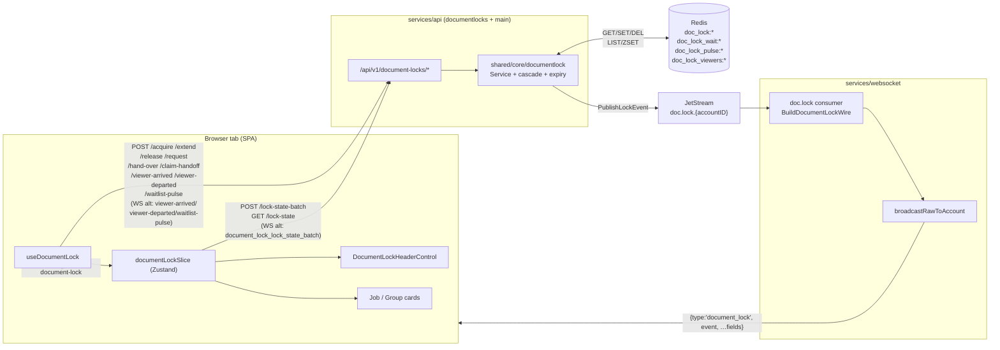
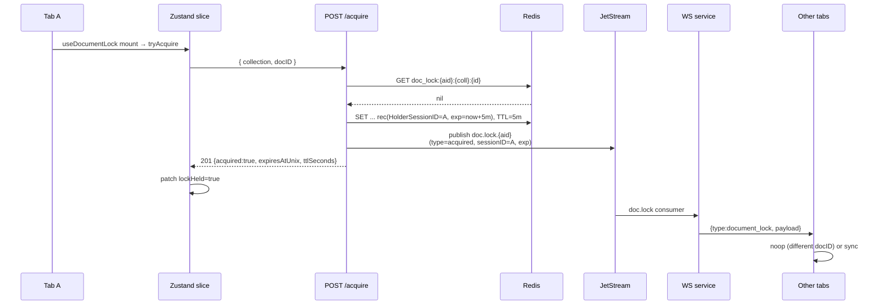
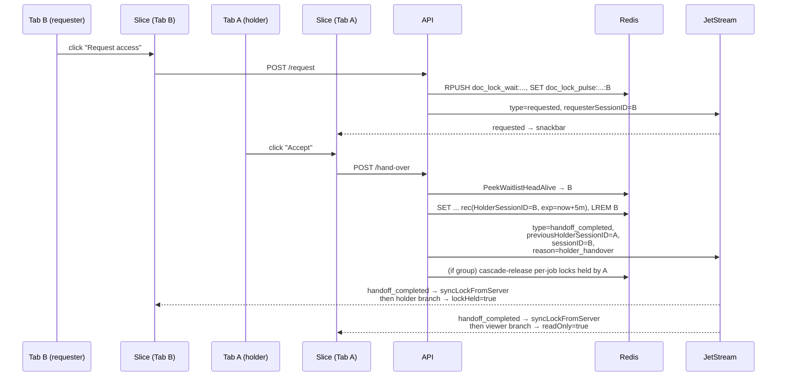
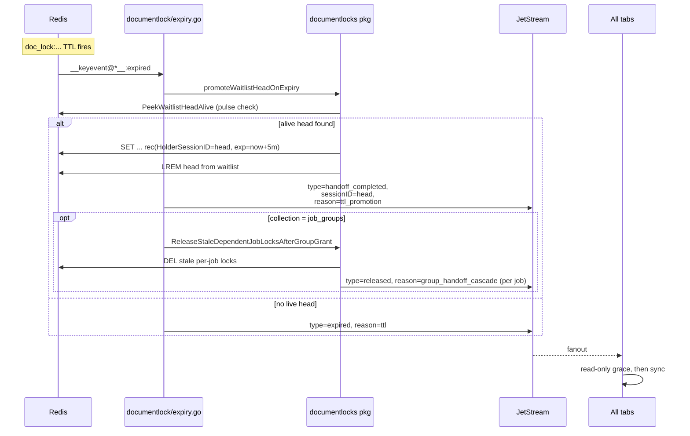
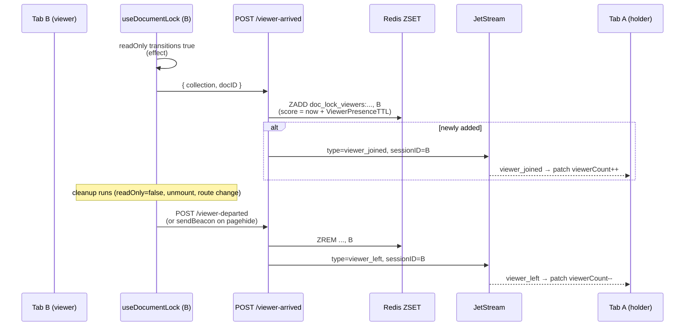

# Document lock system

Cross-tab edit coordination for `job_documents` (planner jobs) and
`job_groups` (job groups). Other sessions on the same account can see who is
editing, queue for access, watch passively, and take over cleanly when the
holder leaves or their lease expires.

The system spans three services and the SPA:

- **`services/shared/core/documentlock`** — Redis-backed lock state, transitions,
  cascade, TTL-expiry subscriber, JetStream publish helpers, and `Service` API
  used by the HTTP layer and API `main`.
- **`services/api/v1endpoints/documentlocks`** — REST routes and thin HTTP handlers
  (auth, JSON encode/decode) delegating to `documentlock`.
- **`services/websocket`** — receives lock events on JetStream subject
  **`doc.lock.{accountID}`** and fans them out to every connected tab.
- **`services/core`** — not involved (locks are not Mongo documents).
- **`frontend/src/{Hooks,Functions,Components,Zustand,Events}/DocumentLock`** —
  Zustand mirror, hook, header affordance, scope-aware UI gating.

This README is the cross-stack overview. Implementation detail lives in:

- [spa.md](../../../frontend/document-lock/spa.md) — Zustand slices, hooks, components, event flow.
- [locks.md](./locks.md) — HTTP endpoints, Redis key layout, handlers,
  cascade, expiry subscriber, viewer presence.
- [ROADMAP.md](./roadmap.md) — backlog and strategy: **multi-tenant** locks (account / corporation / alliance) plus **account-scoped** hardening (observability, tests, polish). Replaces the old `IMPROVEMENTS.md`.

## Vocabulary

| Term | Meaning |
|------|---------|
| **`collection`** | Mongo logical collection the lock guards: `job_documents` or `job_groups`. |
| **`docID`** | Document id within `collection` (jobID or groupID). |
| **`sessionID`** | JWT `session_id` claim. Identifies *one tab*; not the user, not the device. Two tabs of the same account have different sessionIDs and can fight for the same lock. |
| **Holder** | The session in `LockRecord.HolderSessionID`. Has exclusive write access. |
| **Viewer** | A session showing the doc in read-only mode (lock held by someone else). Registered in a Redis ZSET; the holder gets a contention affordance when `viewerCount > 0`. |
| **Waitlist** | Redis list of sessions queued to take over via the "Request access" flow. The head is promoted on holder-handover and on TTL expiry. |
| **Lease** | A holder's TTL window (`DefaultLockTTL` = 5 min). Renewed by `/extend` while the tab is visible. After 3 consecutive renewals the holder consults the waitlist (handoff probe). |
| **Handoff probe** | `/extend` selects the next-in-line as `ProbeTargetSessionID`, publishes `document_lock_handoff_probe`; the targeted client auto-claims via `/claim-handoff`. |
| **Cascade** | When a *group* lock rotates (handoff or TTL promotion), per-job locks held by the old session are force-released. See [BACKEND.md § Cascade](./locks.md#cascade). |
| **Read-only grace** | Client-side 5 s window after a held lock vanishes during which the UI stays read-only — bridges the gap until a `handoff_completed` / `acquired` event confirms the new owner. |
| **Quiet solo UI** | Uncontested holder: no header icon, no “you gained ownership” toast on solo open, no grey vacant icon flash while acquire runs. Contention uses `scopeHasOtherSessionContention` (viewers, waitlist, read-only, etc.). See [FRONTEND.md § Snackbars](../../../frontend/document-lock/spa.md#snackbars). |

## High-level architecture



**One sentence:** Redis is the source of truth, **`documentlock`** enforces transitions,
JetStream broadcasts every transition through the websocket service to every
tab on the same account, and each tab mirrors what it cares about into
Zustand.

## Wire contract (frontend ↔ backend)

### Domain event strings

Domain discriminator lives on the JSON field **`event`** (constant
`documentlock.LockPayloadEventKey` on the backend,
`DOCUMENT_LOCK_DOMAIN_EVENT_KEY` on the frontend).

| Frontend constant (`documentLockEvents.js`) | Backend constant (`documentlock/events.go` / HTTP viewer handlers / `documentlock/expiry.go`) | Emitted by |
|---|---|---|
| `DOCUMENT_LOCK_DOMAIN_EVENTS.ACQUIRED` (`document_lock_acquired`) | `LockEventAcquired` | `/acquire`, `/request` auto-grant |
| `DOCUMENT_LOCK_DOMAIN_EVENTS.RELEASED` (`document_lock_released`) | `LockEventReleased` | `/release`, `/hand-over` fallback, cascade |
| `DOCUMENT_LOCK_DOMAIN_EVENTS.REQUESTED` (`document_lock_requested`) | `LockEventRequested` | `/request` (lock contended) |
| `DOCUMENT_LOCK_DOMAIN_EVENTS.EXPIRED` (`document_lock_expired`) | `LockEventExpired` | TTL with no live waitlist head |
| `DOCUMENT_LOCK_DOMAIN_EVENTS.HANDOFF_PROBE` (`document_lock_handoff_probe`) | `LockEventHandoffProbe` | `/extend` after 3 renewals while waitlist is alive |
| `DOCUMENT_LOCK_DOMAIN_EVENTS.HANDOFF_COMPLETED` (`document_lock_handoff_completed`) | `LockEventHandoffCompleted` | `/hand-over`, `/claim-handoff`, TTL promotion |
| `DOCUMENT_LOCK_DOMAIN_EVENTS.GROUP_CASCADE` (`document_lock_group_cascade`) | `LockEventGroupCascade` | One event per group→jobs cascade in `documentlock/cascade.go` — see [§ Group cascade event](#group-cascade-event). |
| `DOCUMENT_LOCK_DOMAIN_EVENTS.VIEWER_JOINED` (`document_lock_viewer_joined`) | `LockViewerEventJoined` | `/viewer-arrived` (newly added) |
| `DOCUMENT_LOCK_DOMAIN_EVENTS.VIEWER_LEFT` (`document_lock_viewer_left`) | `LockViewerEventLeft` | `/viewer-departed` (removal hit) |

Each payload also includes `accountID`, `collection`, `docID`, plus a subset of
`sessionID`, `holderSessionID`, `requesterSessionID`, `probeTargetSessionID`,
`expiresAtUnix`, `previousHolderSessionID`, `reason`.

### Fan-out envelope (server → SPA)

The websocket service emits one **flat** JSON object: the outer `type` is the
realtime channel tag and the domain discriminator is `event` at the top level
(there is **no nested `payload`**):

```json
{
  "type": "document_lock",
  "event": "document_lock_handoff_completed",
  "accountID": "…",
  "collection": "job_documents",
  "docID": "…",
  "sessionID": "…",
  "expiresAtUnix": 1731435678,
  "previousHolderSessionID": "…",
  "reason": "ttl_promotion"
}
```

Wrapper: `services/websocket/server/natslogic/locks.go::BuildDocumentLockWire`.
Frontend normalisation (`documentLockWireToDetail` in `realtimeClient.js`)
sets both `detail.event` and `detail.type` on the dispatched
`eip-document-lock` CustomEvent.

### WebSocket frame types (client ↔ server)

The frontend's `DOCUMENT_LOCK_FRAME_TYPES` (`documentLockEvents.js`) declares the
non-domain frame discriminators that share the same `/ws` socket. Each
client → server frame has an HTTP equivalent — the SPA prefers the WS form when
the socket is open and falls back to HTTP otherwise.

| Frame `type` | Direction | HTTP equivalent | Notes |
|---|---|---|---|
| `document_lock` (`CHANNEL`) | server → client | — | Fan-out envelope (table above). |
| `document_lock_lock_state_batch` (`LOCK_STATE_BATCH`) | client → server | `POST /lock-state-batch` | Per-page batch refresh; correlated by `requestId`. |
| `document_lock_lock_state_batch_ack` (`LOCK_STATE_BATCH_ACK`) | server → client | — | Reply to the batch above. |
| `document_lock_waitlist_pulse` (`WAITLIST_PULSE`) | client → server | `POST /waitlist-pulse` | Refreshes `doc_lock_pulse:…:sessionID`. |
| `document_lock_viewer_arrived` (`VIEWER_ARRIVED`) | client → server | `POST /viewer-arrived` | Passive viewer joins. |
| `document_lock_viewer_departed` (`VIEWER_DEPARTED`) | client → server | `POST /viewer-departed` | Passive viewer leaves. |

### Group cascade event

When a group lock rotates (handoff, TTL-promotion, or `RequestAccess`
auto-grant on an orphaned group), the cascade in
`documentlock/cascade.go` evicts per-job locks held by the previous
group holder and publishes **one** `document_lock_group_cascade` event
carrying every release in a single payload:

```json
{
  "type": "document_lock",
  "event": "document_lock_group_cascade",
  "accountID": "…",
  "groupCollection": "job_groups",
  "groupID": "group-1",
  "collection": "job_documents",
  "reason": "group_handoff_cascade",
  "releases": [
    { "docID": "job-a", "sessionID": "sess-old" },
    { "docID": "job-b", "sessionID": "sess-old" }
  ]
}
```

The frontend handlers (`useLockScopeSync.js`, `useDocumentLock.js`)
apply every entry in `releases` inside one Zustand transaction — N scope
patches end up as one re-render, with no per-job `/lock-state` refetch.
The cascade does NOT emit per-job `document_lock_released` events;
this single batched event is the sole notification.

`reason` strings for the main domain events:

| Reason | Emitted on | Frontend constant |
|---|---|---|
| `group_handoff_cascade` | `document_lock_group_cascade` from `documentlock/cascade.go` | `DOCUMENT_LOCK_RELEASE_REASONS.GROUP_HANDOFF_CASCADE` |
| `holder_release` | `released` from voluntary `POST /release` (`Service.Release`) | `DOCUMENT_LOCK_RELEASE_REASONS.HOLDER_RELEASE` |
| `force_released_same_account` | `released` from `POST /force-release` (`Service.ForceReleaseSameAccount`) | `DOCUMENT_LOCK_RELEASE_REASONS.FORCE_RELEASED_SAME_ACCOUNT` |
| `hand_over_no_queue` | `released` from `/hand-over` (requester gone) | `DOCUMENT_LOCK_RELEASE_REASONS.HAND_OVER_NO_QUEUE` |
| `ttl` | `expired` from TTL keyspace event | `DOCUMENT_LOCK_EXPIRY_REASONS.TTL` |
| `holder_handover` | `handoff_completed` from `/hand-over` | `DOCUMENT_LOCK_HANDOFF_REASONS.HOLDER_HANDOVER` |
| `ttl_promotion` | `handoff_completed` from `documentlock/expiry.go` | `DOCUMENT_LOCK_HANDOFF_REASONS.TTL_PROMOTION` |

## End-to-end flows

### Acquire (uncontested)



### Acquire (contested → read-only)

The non-holder branch returns `200 {held:true, acquired:false,
holderSessionID, viewerCount}`. The hook patches `readOnly: true` and on the
next frame fires off `/viewer-arrived` (see [Viewer presence](#viewer-presence)).

### Holder accepts a request (`/hand-over`)



### Lease expiry with alive waitlist (TTL promotion)



### Read-only grace (client-side)

When a tab learns the lock is gone but the next holder hasn't been announced
yet (TTL race), it keeps `readOnly: true` for a 5 s grace window. Any
`acquired` / `handoff_completed` arriving in that window cancels the grace and
installs the new holder. If nothing arrives, the grace expires and the UI
becomes editable so the user isn't trapped on a dead lock.

Frontend code: `frontend/src/Functions/DocumentLock/readOnlyGrace.js`
and per-hook timer in `useDocumentLock.js`.

### Viewer presence



A holder shows the header lock affordance whenever
`viewerCount > 0` even without an explicit request. This is the "passive
viewer" contention signal added so silent observers still trigger the holder's
awareness UI.

### Snackbars and solo quiet UI

Beyond the header icon, the SPA uses snackbars for some lock transitions
([FRONTEND.md § Snackbars](../../../frontend/document-lock/spa.md#snackbars)):

- **Holder** — non-dismissible access-request toast (WS `requested`) with hand-over actions.
- **Holder** — lease nudge with **Renew now** when ≤ 30 s remain (`LOCK_LOW_REMAINING_NUDGE_SEC`).
- **Holder** — one info toast when passive viewers go from none → at least one (`useLockPassiveViewerSnackbar`); not per additional viewer.
- **Any tab** — gained/lost ownership toasts from `useLockVacancySnackbar` when another session was involved; solo acquire on open stays silent.
- **User actions** — slice toasts for request/grant, force-release, hand-over errors, claim-handoff.

`lockScopeBootstrapped` on the scope prevents a brief grey “vacant / take over”
header icon while the first `POST /acquire` is still in flight.

## Constants — frontend / backend mapping

Frontend timings live in
`frontend/src/Functions/DocumentLock/documentLockTimings.js`. Backend lease /
TTL values live in `services/shared/core/documentlock/redis.go` and
`services/shared/core/documentlock/viewer.go`.

| Concept | Frontend | Backend | Notes |
|---|---|---|---|
| Lease length | `LOCK_LEASE_MS` = 5 min | `DefaultLockTTL` = 5 min | Must match. |
| Holder extend cadence | `LOCK_EXTEND_INTERVAL_MS` = 5 min | n/a | Triggered while tab visible + holder. |
| Low-lease nudge / header pulse | `LOCK_LOW_REMAINING_NUDGE_SEC` = 30 s | n/a | Snackbar + icon pulse when segment is almost up. |
| Passive-viewer header flash | `LOCK_PASSIVE_VIEWER_FLASH_MS` = 3.5 s | n/a | Icon pulse when holder’s `viewerCount` goes 0 → ≥1. |
| Lock status sync heartbeat | `LOCK_STATUS_SYNC_INTERVAL_MS` = 45 s | n/a | Self-heal for any missed WS event. |
| Post-expiry resync | `LOCK_EXPIRY_RESYNC_INTERVAL_MS` = 15 s | n/a | After cached `expiresAtUnix` passes. |
| Expiry slack | `LOCK_EXPIRY_SLACK_SECONDS` = 2 | n/a | Absorbs client/server clock skew. |
| Waitlist pulse cadence | `LOCK_WAITLIST_PULSE_INTERVAL_MS` = 35 s | `WaitlistPulseTTL` = 2 min | Client must refresh below TTL. |
| Read-only grace | `LOCK_READONLY_GRACE_MS` = 5 s | n/a | Bridges TTL-expiry races. |
| Scope-sync debounce | `LOCK_SCOPE_SYNC_DEBOUNCE_MS` = 200 ms | n/a | Coalesces planner churn. |
| Lock-state batch ceiling | `MAX_STATUS_BATCH_DOC_IDS` = 500 | `MaxStatusBatchDocs` = 500 | Per-array cap on `/lock-state-batch` (jobs + groups). Constant names predate the route rename and are kept for back-compat. |
| Planner chunk | `PLANNER_PAGE_JOB_CHUNK_MAX` = 450 | n/a | Reserve slack for groups in first chunk. |
| Probe ack window | n/a | `ProbeAckWaitSeconds` = 20 | Queued client must `/claim-handoff` in this window. |
| Extends per cycle | n/a | `MaxExtensionsBeforeHandoffConsult` = 3 | After this many, `/extend` probes waitlist. |
| Viewer presence TTL | n/a | `ViewerPresenceTTL` = 5 min | Defensive sweep for crashed tabs. |

## Where every file lives

### Backend

```
services/shared/core/documentlock/
  deps.go                 — Deps + DepsFromServiceClients (Redis, Mongo, JetStream)
  redis.go                — Redis key layout, LockRecord, waitlist + PromoteWaitlistHead helpers
  viewer.go               — viewer ZSET (AddViewer / RemoveViewer / PruneAndCountViewers)
  presence_ingress.go     — HandleViewerArrivedIngress / HandleViewerDepartedIngress (shared by HTTP + WS)
  status.go               — StatusPayloadForDoc, StatusBatchResults (+ sentinel errors)
  status_pipeline.go      — statusBatchFetch (one Redis pipeline per batch: GET, viewer ZREM/ZCARD, waitlist LLEN)
  payload.go              — LockPayload, ExtendExtras (HTTP JSON fragments)
  events.go               — domain event names, reason constants, LockPayloadEventKey ("event"), BuildHandoffCompletedPayload
  publish.go / notify.go  — JetStream doc.lock publish + PublishLockEvent
  cascade.go              — group → per-job cascade + ReleaseStale* / ReleaseDependent*
  cascade_pipeline.go     — pipelinedDecideAndReleaseJobLocks (two-pipeline GET-then-DEL for group→jobs cascade)
  expiry.go               — Redis __keyevent@*__:expired listener + waitlist promotion (RunExpirySubscriber; lease-gated)
  atomic.go               — Lua-script transitions (Acquire/Extend/Release/HandOver/Request/Claim/Promote)
  service.go / service_ops.go — Service (Acquire, Extend, Release, HandOver, RequestAccess, ClaimHandoff, WaitlistPulse)
  *_test.go               — redis, events, cascade predicates, atomic concurrency, status/cascade pipelines

services/shared/redis/
  lease.go                — Reusable single-leader primitive (SET NX + CAS renew/release)

services/api/v1endpoints/documentlocks/
  router.go               — HTTP route table (/lock-state, /lock-state-batch, /acquire, /extend, /release, /hand-over, /request, /claim-handoff, /waitlist-pulse, /viewer-arrived, /viewer-departed)
  request_context.go      — auth + body parse preamble (lockHandlerContextOK)
  handlers.go             — thin HTTP → documentlock.Service
  lock_json.go            — writeExtendJSON for /extend responses
  viewer_presence.go      — /viewer-arrived / viewer-departed HTTP handlers (delegate to documentlock.Handle…Ingress)

services/core/singleton/service.go      — generic singleton-job runner (Job + StartService)
services/core/singleton/jobs.go         — catalogue of singleton jobs (DoclockExpirySubscriberJob, Start)
services/core/main.go                   — singleton.Start(clients) on core startup

services/websocket/server/
  nats_doc_lock.go              — doc.lock JetStream consumer
  natslogic/locks.go            — BuildDocumentLockWire (flat-envelope wrapper)
  doc_lock_lock_state_batch.go  — WS handler for `document_lock_lock_state_batch`
  doc_lock_presence_ws.go       — WS handlers for waitlist-pulse / viewer-arrived / viewer-departed
  reader.go                     — frame dispatcher for the above
```

### Frontend

```
frontend/src/Functions/DocumentLock/
  documentLockKey.js                — (collection, docID) → scope key
  documentLockCollections.js        — USER_JOBS_COLLECTION / USER_JOB_GROUPS_COLLECTION
  documentLockEvents.js             — DOCUMENT_LOCK_DOMAIN_EVENTS + DOCUMENT_LOCK_FRAME_TYPES + reason/event-key constants
  documentLockTimings.js            — timing constants
  documentLockScope.js              — ScopedDocumentLockState, merge, scopeHasOtherSessionContention
  documentLockAcquireFeedback.js    — suppressDocumentLockVacancyNotice (dedupe with slice grants)
  documentLockSelectors.js          — selectScopedDocumentLock / selectDocumentLockReadOnly / filterUnlockedDocumentIDs
  documentLockHeaderSelectors.js    — selectors for DocumentLockHeaderControl
  documentLockStatusFields.js       — numberOrNull, buildGrantedHolderPatch
  applyDocumentLockStatusFromPayload.js — applies a /lock-state row to Zustand
  readOnlyGrace.js                  — shared grace predicate + patch

frontend/src/Hooks/DocumentLock/
  useDocumentLock.js                — the engine (mount per scope)
  useLockVacancySnackbar.js           — gained/lost ownership toasts (contention-gated)
  useLockExtendNudgeSnackbar.js       — low-lease renew nudge
  useLockPassiveViewerSnackbar.js     — solo → passive viewer info toast (0 → ≥1)
  useLockAcquireRelease.js            — mount acquire, bootstrap flag, vacancy self-heal
  useLockExtendLoop.js                — extend interval + renew-request listener
  useRegisterHeaderDocumentLockUI.js — page-level header context
  useLockScopeSync.js               — batch sync core for planner pages
  useJobPlannerJobLockSync.js       — planner job-only sync hook
  useJobPlannerPageLockSync.js      — planner job+group sync hook
  plannerLockScopeFromApi.js        — single-scope refresh helper
  useDocumentLockState.js           — ID-shaped hooks for cards (useJobLockReadOnly etc.)

frontend/src/Components/DocumentLock/
  DocumentLockHeaderControl.jsx     — header icon + popover
  LockGatedTooltip.jsx              — uniform "Another session holds the edit lock" copy

frontend/src/Zustand/
  documentLockSlice.js              — scopes map + actions (request, accept, hand-over, claim)
  headerDocumentLockUISlice.js      — registrations array (which scope drives the header)

frontend/src/Events/
  snackbarEvents.js                 — showDocumentLockAccessRequestSnackbar, showDocumentLockExtendNudgeSnackbar
  headerDocumentLockEvents.js       — imperative API for the header slice
  editJobReleaseRequestEvents.js    — release-request handler registry (edit-job ↔ slice)

frontend/src/Functions/Endpoints/Private/documentLockClient.js — REST client functions + WS-batch path

frontend/src/Components/Edit Job/Edit Job Hooks/useActiveJobDocumentLock.js
                                    — reducer-shaped hooks for the Edit Job page
                                      (useActiveJobReadOnly, useActiveGroupReadOnly, useSiblingLinkLock,
                                       useActiveJobPersistGate)
```

For per-layer detail see [spa.md](../../../frontend/document-lock/spa.md) and [locks.md](./locks.md).
