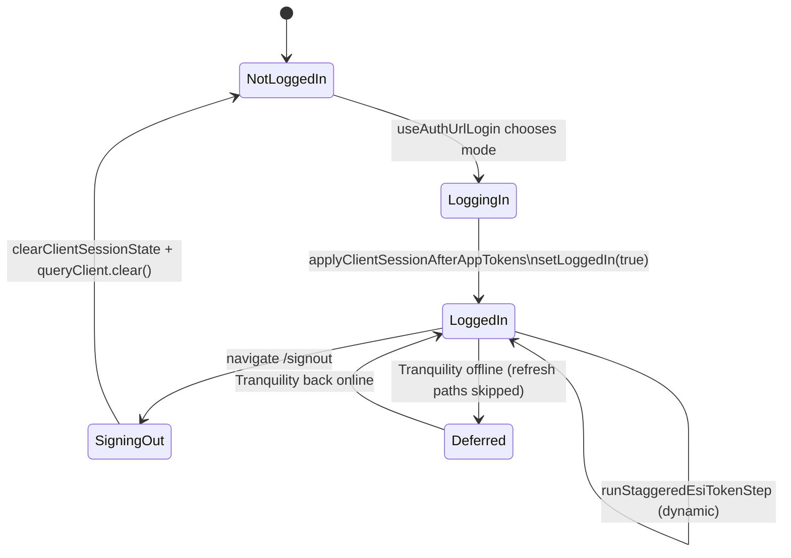

# Authentication — Frontend

How the React SPA establishes, maintains, and tears down planner sessions; how every private fetch picks up identity; how the realtime layer authenticates; and the role of the Tranquility status gate.

> Companion docs: **[README.md](../../backend/api/auth/overview.md)** for overview and wire contracts; **[BACKEND.md](../../backend/api/auth/sessions.md)** for server-side detail; **[Frontend lifecycles roadmap](../lifecycles/roadmap.md)** for moving maintenance timers out of React.

---

## 1. Account slice — Zustand state shape

Defined in `frontend/src/Zustand/account/account.js` (defaults) and `frontend/src/Zustand/account/tokenActions.js` (actions). All slices live under `useUsersStore` (`frontend/src/Zustand/usersStore.js`).

### 1.1 Identity fields

| Field | Type | Notes |
|---|---|---|
| `accountID` | `string \| null` | Sanitised character hash. Set by `applyLoginAuthResponse`. |
| `mainCharacterHash` | `string \| null` | EVE character hash for the main character. |
| `sessionID` | `string \| null` | Planner session id for **this tab** (mirrors `sessionStorage` via `tabSessionStorage.js`). |
| `lastPlannerSessionValidatedAt` | `number \| null` | `Date.now()` of the last successful login / rotate / bootstrap. Drives the rotate cooldown. |
| `refreshToken` | `string \| null` | Per-tab planner refresh token (mirrors `sessionStorage`; sent in JSON on bootstrap/rotate). |
| `refreshTokenEXP` | `number \| null` | Optional epoch-seconds expiry mirrored from the server. |
| `isLoggedIn` | `boolean` | The single source of truth used by route guards. Flipped by `setLoggedIn(true)` after `applyClientSessionAfterAppTokens` resolves. |
| `isFirstTimeLogin` | `boolean` | `first_login` from the server (login-only). |
| `hasCompletedFirstLoginFlow` | `boolean` | From `users` document; gates the `/first-login` redirect in `__root.jsx`. |
| `linkedCharacterHashesFromBootstrapSession` | `string[] \| null` | Captured from cloud login `linked_characters` so the hydrator can adopt all alts before any subsequent fetch. |
| `linkedBootstrapHydrationPending` | `boolean` | True until `runPostLoginAccountSync` has consumed the bootstrap. |
| `characters`, `corporations` | typed arrays | Hydrated by post-login sync, not by login itself. |

### 1.2 Action surface (`tokenActions` factory)

| Action | Role |
|---|---|
| `applyLoginAuthResponse(response, mainCharacterHash)` | Single Zustand transaction. Mirrors the `SessionBootstrapResponse` (or rotate response) onto the account slice + `applicationSettings` slice. Detects cloud vs local via `esi_oauth_storage`. Persists `session_id` + `refresh_token` to **tab** `sessionStorage`. |
| `clearLinkedBootstrapHydrationPending()` | Called by `runPostLoginAccountSync` when bootstrap hydration finishes. |
| `applyUserDocumentFromRemote(doc)` | Realtime updates to the `users` collection (linked sets, `userCloudAccounts`, etc.). |
| `setSessionTokens(partial)` | Merge `{ sessionID?, refreshToken?, refreshTokenEXP? }` after a successful rotate. |
| `refreshServerToken()` | The **only** call site allowed to hit `/auth/sessions/rotate`. Single-flight, cooldown-gated, Tranquility-gated. |
| `runStaggeredEsiTokenStep()` | One character per tick; rotated by `useRefreshESITokens`. |
| `runEsiTokenIntervalMaintenance()` | 15-minute maintenance pass: corporation claims + `refreshServerToken()`. |
| `runScheduledTokenRefresh()` | Bulk ESI refresh (all characters in parallel) + claims + `refreshServerToken()`. Reserved for exceptional flows (e.g. post-bulk-import). |

---

## 2. App bootstrap

Mount order (page load → authenticated UI):

```mermaid
flowchart TB
    Idx[index.jsx mounts <AppWrapper/>]
    AppWrap[AppWrapper.jsx\nQueryClientProvider + RouterProvider]
    Root[__root.jsx beforeLoad\nrequiresFirstLoginFlow -> /first-login]
    App[App.jsx renders Outlet]
    Hooks[useAppConfig\nuseRefreshESITokens\nuseAccountWebSocket\nuseTranquilityServerStatusQuery\nuseFetchStaticDataFiles]
    AuthRoute[/auth -> MainUserAuth]
    Login[useAuthUrlLogin chooses mode]
    Apply[applyClientSessionAfterAppTokens]
    Done[setLoggedIn(true) + connectRealtime]

    Idx --> AppWrap --> Root --> App --> Hooks
    Root -. unauthenticated user navigates to /auth .-> AuthRoute --> Login --> Apply --> Done
```

**Login modes** (`useAuthUrlLogin`, `frontend/src/Components/Auth/Hooks/useAuthUrlLogin.js`):

1. URL contains `?code=…` → `runAppLogin({ mode: "oauthCode", authCode })`.
2. `localStorage["Auth"]` exists → `runAppLogin({ mode: "eveClientRefresh", eveClientRefreshToken })`.
3. Tab has stored refresh (`sessionStorage`) or cloud OAuth hint → `runAppLogin({ mode: "cookieCloudResume" })` (POSTs `/auth/sessions/bootstrap` with per-tab `refresh_token` + `X-Session-ID`; cloud may omit `eve_token`).
4. Otherwise → EVE SSO redirect (new tab gets a **new** planner session).

All successful modes converge on `applyClientSessionAfterAppTokens` (`frontend/src/Functions/Auth/appLoginFlow.js`), which:

1. Runs `applyLoginAuthResponse` (unless the mode already did).
2. For cloud accounts, calls `persistCloudMainEsiRefreshToken` to push the main ESI refresh token into Mongo and clear `localStorage["Auth"]`.
3. Flips `setLoggedIn(true)`.
4. Hydrates `character.getPublicCharacterData`, builds the corporation object, runs `triggerCharacterDataPrefetch`.
5. Emits the user-data update event for legacy listeners.
6. Clears the in-memory job array (`jobData.actions.clearJobArray()`).
7. Awaits `runPostLoginAccountSync` (linked-character bootstrap + remote alt ESI tokens).
8. Kicks off `bootstrapWatchlistLoginStep`, `bootstrapJobGroupsLoginStep`, `bootstrapJobDocumentsLoginStep` (fire-and-forget).

After `setLoggedIn(true)`, `useAccountWebSocket` reacts to `[isLoggedIn, accountID]` and calls `connectRealtime({ accountId })` (see §6).

---

## 3. Request-time authentication

All private API calls go through `requestWithPrivateHeaders` (`frontend/src/Functions/Endpoints/Private/applyPrivateHeaders.js`).

### 3.1 Single fetch path

```
requestWithPrivateHeaders(URL, options, config)
  └── executePrivateRequestSingle (retry shell)
        └── executePrivateFetchOnce
              ├── await refreshServerToken() unless config.skipSessionRefresh   // §4; logout sets skip
              └── fetch(URL, applyPrivateHeaders(options, config))                      // §3.2
```

Pass **`skipSessionRefresh: true`** on calls that must not rotate the planner session first (today: `logoutPlannerSession`). Pass **`retry: false`** when retries would be unsafe or redundant (logout).

### 3.2 Headers added by `applyPrivateHeaders`

```js
{
  ...options.headers,
  ...(config.requestName && { "X-Request-Name": config.requestName }),
  ...(getRealtimeClientID() && { "X-WS-Client-ID": getRealtimeClientID() }),
}
```

`credentials` is forced to `"same-origin"` (unless the caller already set it) so the browser attaches the `eip_session` cookie. **There is no `Authorization` header**: the previous "Bearer" comment is stale; the implementation is cookie-only.

`X-WS-Client-ID` (read from `Realtime/wsClientIdentity.js`) is only added once `/ws` has sent its `connected` message. The backend uses it for echo suppression on document-lock and document-edit broadcasts.

### 3.3 Retry & batching

- **Retry policy** (`withRequestRetries` / `apiRateLimitRetryConfig`): 408 / 429 / 5xx. On **429**, the client waits for the API fixed-window **`Retry-After`** header (seconds, set in `services/api/middleware/ratelimiter.go` from `X-RateLimit-Reset`), then retries. Applied by default on all `requestWithPrivateHeaders` and `fetchWithPublicHeaders` calls unless `config.retry: false`. The "never retry" sentinel `PRIVATE_AUTH_TOKEN_UNAVAILABLE` is defined but no current code path throws it.
- **Batching**: pass `config.batch = { size, arrayKey, mergeResponseJsonArrays?, failure? }` to split a JSON-body array across chunks (`Promise.allSettled`). Typical sizes mirror backend handler limits: 100 / 200.

---

## 4. Refresh flow — `refreshServerToken()`

Defined in `frontend/src/Zustand/account/tokenActions.js`. This is the **only** code path that hits `/api/v1/auth/sessions/rotate`.

### 4.1 Decision flow

```mermaid
flowchart TD
    start[refreshServerToken called]
    tq{Tranquility cached offline?\n(see §5)}
    inflight{inflightRefreshServerTokenPromise set?}
    cooldown{sessionID set AND now - lastPlannerSessionValidatedAt < 20m?}
    cloud{cloud account?\n(applicationSettings.userCloudAccounts)}
    haveRefresh{refreshToken OR cloud cookie likely present?}
    eveTok{cloud AND ESI expired/missing within 60s skew?}
    httpRotate[POST /api/v1/auth/sessions/rotate]
    apply[setSessionTokens + lastPlannerSessionValidatedAt = now]
    skip[return without HTTP]

    start --> tq
    tq -- yes --> skip
    tq -- no --> inflight
    inflight -- yes --> share[await shared promise] --> done[return]
    inflight -- no --> cooldown
    cooldown -- yes --> skip
    cooldown -- no --> haveRefresh
    haveRefresh -- no --> skip
    haveRefresh -- yes --> cloud
    cloud -- yes --> eveTok
    eveTok -- yes --> sendEmpty[eve_token = ""\n(server uses Mongo fallback)]
    eveTok -- no --> sendCurrent[eve_token = mainCharacter.esiAccessToken]
    cloud -- no --> requireToken{mainCharacter.esiAccessToken set?}
    requireToken -- no --> skip
    requireToken -- yes --> sendCurrent

    sendEmpty --> httpRotate
    sendCurrent --> httpRotate
    httpRotate --> apply --> done
```

### 4.2 Guarantees

- **Single-flight**: `inflightRefreshServerTokenPromise` ensures concurrent callers share one HTTP round-trip. Without it, parallel callers would each rotate the Redis row and orphan each other's `refresh_token` rows.
- **Cooldown**: `PLANNER_SESSION_ROTATE_COOLDOWN_MS = max(1, GLOBAL_CONFIG.PLANNER_SESSION_ROTATE_COOLDOWN_MINUTES || 20) * 60 * 1000`. Default 20 minutes (matches `global-config-app.js`). The hot path on every private fetch is a no-op when this hits.
- **Tranquility-aware**: defers when the cached `/status/` says offline — see §5.
- **ESI skew**: `ESI_ACCESS_TOKEN_REFRESH_SKEW_SEC = 60`. For cloud accounts, if the local ESI access token is missing or within 60s of expiry, the SPA sends an empty `eve_token` so the server uses the Mongo-stored refresh token to mint a fresh ESI access internally.

### 4.3 Triggers

| Trigger | Cadence | File |
|---|---|---|
| Every private fetch (`executePrivateFetchOnce`) | per request | `applyPrivateHeaders.js` |
| 15-minute maintenance interval (`DEFAULT_CHARACTER_REFRESH_INTERVAL`) | every 15 min | `Hooks/App/useRefreshESITokens.js` |
| `runScheduledTokenRefresh()` (manual / bulk paths) | ad-hoc | `tokenActions.js` |

Note: realtime reconnects do **not** force a rotate. Session resume is handled by the WS layer (§6).

### 4.4 Response handling

```js
const tokenPatch = { sessionID: response.session_id ?? state.account.sessionID };
if (response.refresh_token) {                       // local account: server returns raw token
  tokenPatch.refreshToken = response.refresh_token;
  tokenPatch.refreshTokenEXP =
    response.refresh_token_exp ?? response.refresh_token_expires_at;
}
get().account.actions.setSessionTokens(tokenPatch);
// stamp the cooldown clock
set((s) => ({ account: { ...s.account, lastPlannerSessionValidatedAt: Date.now(), ... } }));
```

Errors are `console.error`-logged. The account slice does **not** auto-logout on a failed rotate — the next request will retry; only `requireAuth` (driven by `isLoggedIn`) can redirect.

---

## 5. Tranquility status gate

When EVE's Tranquility cluster is offline (extended downtimes, CCP outages), hammering SSO and rotate paths is wasteful and noisy. The gate suppresses planner / ESI refresh activity while the cache says offline.

### 5.1 Components

- **`frontend/src/Functions/EveESI/fetchTranquilityStatus.js`** — `fetchTranquilityStatus()` hits `https://esi.evetech.net/status/?datasource=tranquility` via `fetchWithCustomHeaders`. Returns `{ online: boolean, playerCount?: number }`. Maps rate-limit responses to `createTranquilityRateLimitError(delayMs)`.
- **`frontend/src/Hooks/React Query/tranquilityServerStatus.js`** — defines the query.
  - Query key: `TRANQUILITY_SERVER_STATUS_QUERY_KEY = ["esi", "tranquility-server-status"]`.
  - `staleTime: Infinity`, `gcTime: Infinity`, `refetchOnWindowFocus: false`.
  - `refetchInterval`: **15 min when online**, **5 min when offline**, `false` until the first successful fetch.
  - `retry`: only for `error.message === "TRANQUILITY_RATE_LIMIT"`, up to 50 attempts; backoff from `error.delayMs` or 1s.
  - Helpers: `getTranquilityServerStatusFromCache`, `isTranquilityOnlineFromCache`, `getTranquilityServerStatusQueryState`.
- **`frontend/src/Functions/Auth/authRefreshTranquilityGate.js`** — `shouldDeferAuthRefreshDueToTranquilityOffline(_get)`:

```js
if (data?.online === true) return false;                     // online: do not defer
if (qState?.status !== "success" || !qState.dataUpdatedAt) return false; // never fetched: do not defer
return data?.online === false;                                // success + offline: defer
```

### 5.2 Mounting

`useTranquilityServerStatusQuery()` is called from `App.jsx` so the cache is alive whenever the SPA is mounted. Synchronous consumers (Zustand actions) read the same cache via `getTranquilityServerStatusFromCache()`.

### 5.3 Replacement for `useCheckEveServerStatus`

The deleted hook held its result in component state; the new query lives in React Query so non-React code (Zustand `get`, fetch interceptors) can read the same cache without prop drilling.

---

## 6. Realtime auth integration

### 6.1 `useAccountWebSocket`

```js
useEffect(() => {
  if (!isLoggedIn || !accountID) {
    disconnectRealtime();
    return;
  }
  connectRealtime({ accountId: accountID });
  return () => {
    stashRealtimeSessionResumeHint();
    disconnectRealtime();
  };
}, [isLoggedIn, accountID]);
```

The effect depends only on `[isLoggedIn, accountID]`. Rotating the planner `sessionID` does **not** trigger a reconnect — the existing socket keeps working because the `eip_session` cookie is rotated together with the session and the new value is sent on the next reconnect automatically by the browser.

### 6.2 `realtimeClient.js` essentials

- Singleton WebSocket to `wss://<host>/ws` (or `ws://` on non-https). No query string; the browser attaches `eip_session` on the upgrade.
- On `open`: reads `sessionIdForWs = getSessionIDFromStore()`. Compares to `lastSuccessfulOpenSessionId`. Runs `syncAccountDocumentsFromServer()` when `sessionID` changed vs the last successful open, or when `session_resume` was sent but `resume_ack` did not set `skipBaselineSync`. Refetches planner job documents when `sessionID` changed and this is not the first open.
- **Session resume**: on effect teardown the hook calls `stashRealtimeSessionResumeHint()` (no-op if already logged out). On the next `connectRealtime`, the client sends `{ type: "session_resume", previousClientID }` immediately after open and races a 400ms timeout against the server's `resume_ack`. Baseline singleton GETs also follow `sessionID` change vs the last successful open (see `realtimeClient.js`).
- **Ping**: every `PING_MS = 45_000`ms.
- **Reconnect**: exponential backoff `WS_RECONNECT_BASE_MS = 750` capped at `WS_RECONNECT_MAX_MS = 20_000`. `WS_SESSION_HANDOFF_MS = 25_000` matches the Go server's resume window.

### 6.3 `wsClientIdentity.js` (read-side)

`getRealtimeClientID()` returns the value sent by the server in `{ type: "connected", clientID }`. The SPA uses it as `X-WS-Client-ID` on private API calls so the API knows which tab originated a change and can suppress its own broadcast back to that tab.

---

## 7. Route guards

### 7.1 `requireAuth` (private routes)

```js
export function requireAuth({ location }) {
  const isLoggedIn = useUsersStore.getState().account.isLoggedIn;
  if (!isLoggedIn) {
    throw redirect({ to: '/auth', search: { state: location.pathname } });
  }
}
```

- Pure Zustand read; no network I/O.
- Used by `routes/_protected.jsx` as `beforeLoad`, which guards the entire `/_protected/*` subtree (dashboard, asset-library, accounts, blueprint-library, settings, first-login).
- 401s from the API do **not** redirect the user. The session-state machine relies on `isLoggedIn` being explicitly flipped (login success → true, signout → false). If the server invalidates a session out-of-band, the next refresh will fail and the user will continue to see a "logged in" UI until they explicitly sign out or reload — this is an intentional trade-off to avoid forced redirects during transient outages.

### 7.2 `allowPublicAccess` (public routes that *can* hydrate from auth state)

```js
export function allowPublicAccess({ location }) {
  const isLoggedIn = useUsersStore.getState().account.isLoggedIn;
  if (!isLoggedIn) {
    const existingAuth = localStorage.getItem("Auth");
    if (existingAuth || hasCloudOAuthStorageServerHint()) {
      throw redirect({ to: '/auth', search: { state: location.pathname } });
    }
  }
  return { isLoggedIn };
}
```

`hasCloudOAuthStorageServerHint()` (from `Functions/Auth/plannerAuthCookies.js`) reads the non-HttpOnly **`eip_esi_oauth_storage`** cookie. When it equals `"server"`, the user has cloud-stored ESI material and the SPA can resume via the cookie path; the guard redirects them to `/auth` to rebuild client state and then return. Sign-out clears this cookie client-side so public routes do not loop back into `/auth` after logout.

### 7.3 First-login redirect (`__root.jsx`)

Independent of `requireAuth`. If `getRequiresFirstLoginFlow()` is true (account flag not yet set) and the user is not on `/first-login`, the root route redirects there before mounting anything else.

---

## 8. Signout

`routes/signout.jsx` is a regular TanStack route. Mounting `<SignoutComponent />` runs the orchestrated teardown in a `useEffect`:

```js
async function performSignout() {
  const { refreshToken } = useUsersStore.getState().account;
  try {
    disconnectRealtime();                              // 1. close /ws first
    await logoutServerSession(refreshToken);           // 2. POST /api/v1/auth/sessions/logout

    clearClientSessionState();                          // 3. reset Zustand + clearPlannerAuthCookiesClientSide()
    queryClient.clear();                               // 4. blow away React Query cache

    sessionStorage.clear();                            // 5. local + session storage
    localStorage.removeItem("Auth");
    localStorage.removeItem("originalPath");

    navigate({ to: "/" });                              // 6. SPA navigation home
  } catch (error) {
    // same cleanup as above, then hard reload
    window.location.href = "/";
  }
}
```

### 8.1 `clearClientSessionState`

The internal order is critical:

1. `clearInboundJobDocumentCoalesce()` — drop queued WS-driven job upserts that could otherwise repopulate the store after the reset.
2. `resetAccountStore()` — also calls `realtimeSync?.actions?.reset?.()`.
3. `resetJobDataStore()`.
4. `resetApplicationSettingsStore()`.
5. `resetWorldDataStore()`.
6. `clearPlannerAuthCookiesClientSide()` — expires `eip_esi_oauth_storage` (and best-effort `eip_session` / `eip_app_refresh`; those are HttpOnly and are cleared by the server `Set-Cookie` on a successful logout response).

Account is reset **first** so that any in-flight account GET completing after the reset cannot re-merge stale application settings in the same tick.

### 8.2 Logout request

`logoutPlannerSession` (`sessionClient.js`) uses `requestWithPrivateHeaders` with **`skipSessionRefresh: true`** and **`retry: false`** so logout does not rotate the session first or retry a destructive call. The request uses `credentials: "same-origin"` so the browser applies server `Set-Cookie` clears for HttpOnly cookies.

The body carries the raw `refresh_token` for local accounts when Zustand still holds it; for cloud accounts the server reads the value from `eip_app_refresh`. A `finally` block always runs `clearPlannerAuthCookiesClientSide()` even when the API returns an error.

| Cookie | HttpOnly | Cleared by |
|---|---|---|
| `eip_session` | yes | Server `Set-Cookie` on `204` (requires successful logout fetch) |
| `eip_app_refresh` | yes | Server `Set-Cookie` on `204` |
| `eip_esi_oauth_storage` | no | Server + `clearPlannerAuthCookiesClientSide()` |

---

## 9. Session lifecycle summary



---

## 10. Files

| Path | Role |
|---|---|
| `frontend/src/App.jsx` | Mounts `useRefreshESITokens`, `useAccountWebSocket`, `useTranquilityServerStatusQuery`. |
| `frontend/src/AppWrapper.jsx` | `QueryClientProvider` + router shell. |
| `frontend/src/queryClient.js` | Shared `QueryClient` (60s default `staleTime`). |
| `frontend/src/routes/__root.jsx` | First-login redirect. |
| `frontend/src/routes/_protected.jsx` | `beforeLoad: requireAuth`. |
| `frontend/src/routes/signout.jsx` | Orchestrated logout. |
| `frontend/src/utils/authGuard.js` | `requireAuth`, `allowPublicAccess`. |
| `frontend/src/Functions/Auth/plannerAuthCookies.js` | Cookie constants; `clearPlannerAuthCookiesClientSide`, `hasCloudOAuthStorageServerHint`. |
| `frontend/tests/plannerAuthCookies.test.js` | Client cookie expiry on sign-out. |
| `frontend/src/Zustand/account/account.js` | Account slice defaults. |
| `frontend/src/Zustand/account/tokenActions.js` | Login merge, rotate, ESI maintenance, scheduled refresh. |
| `frontend/src/Zustand/account/index.js` | Barrel exports. |
| `frontend/src/Functions/Auth/appLoginFlow.js` | Login mode resolvers + post-login hydration. |
| `frontend/src/Functions/Auth/sessionClient.js` | Raw `fetch` to `/auth/sessions[/rotate|/bootstrap|/logout]`. |
| `frontend/src/Functions/Auth/serverTokens.js` | Aliases re-exported from `sessionClient`. |
| `frontend/src/Functions/Auth/authRefreshTranquilityGate.js` | Deferral predicate. |
| `frontend/src/Functions/Endpoints/Private/applyPrivateHeaders.js` | Cookie-backed private fetch + header builder + batching. |
| `frontend/src/Functions/EveESI/fetchTranquilityStatus.js` | `/status/` fetch + rate-limit error shape. |
| `frontend/src/Hooks/React Query/tranquilityServerStatus.js` | Query options + cache accessors. |
| `frontend/src/Hooks/App/useRefreshESITokens.js` | Maintenance + stagger timers. |
| `frontend/src/Realtime/realtimeClient.js` | `/ws` singleton, resume, ping, reconnect. |
| `frontend/src/Realtime/useAccountWebSocket.js` | Lifecycle hook for the WS. |
| `frontend/src/Realtime/wsClientIdentity.js` | Stores the server-assigned `clientID`. |
| `frontend/src/Components/Auth/Hooks/useAuthUrlLogin.js` | OAuth code / `Auth` / cookie-resume chooser. |

---

## 11. Pitfalls & operational notes

- **Never call `establishPlannerSession` from the rotate path.** It always issues a fresh `sessionID` and clears the cooldown timer; only login should use it.
- **Never reach into `refreshServerToken` from another tab path.** All rotate work goes through the single Zustand action; the in-flight promise + cooldown depend on it.
- **`X-WS-Client-ID` is best-effort.** It is only sent once `/ws` is open. The backend tolerates missing values; document-lock echo suppression simply behaves as if the change came from another tab.
- **`isLoggedIn` is the only redirect signal.** A 401 from the API does **not** auto-redirect; reload + `useAuthUrlLogin` is the recovery path.
- **Cloud vs local detection** uses `applicationSettings.userCloudAccounts`, derived from `esi_oauth_storage` (`"server"` ⇒ cloud) and the user document. Don't mirror this state separately on the account slice; consume it from settings.
- **Deletion of `useCheckEveServerStatus.js`** moved the gate to React Query. Anywhere that previously called the old hook should now either use `useTranquilityServerStatusQuery()` (for component rendering) or `shouldDeferAuthRefreshDueToTranquilityOffline(get)` (for non-React code).
