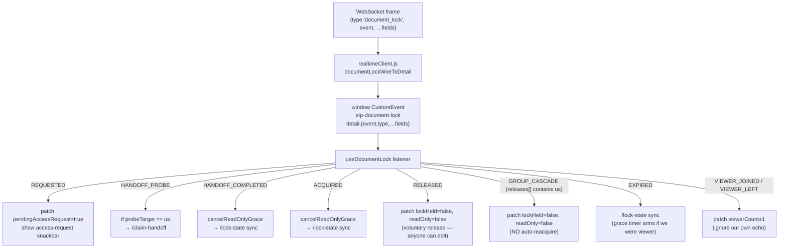
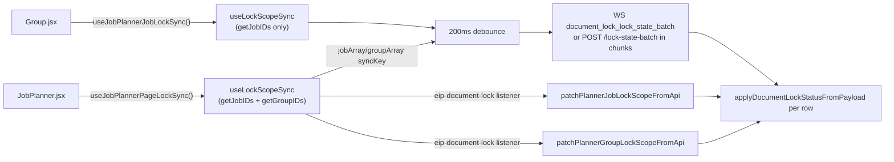

# Frontend — document lock

Per-tab edit gating, lock-state mirror, and the header affordance that lets
you request access, accept hand-overs, or take over an orphaned lock.

Source tree:

```
frontend/src/
  Functions/DocumentLock/      — pure helpers + Zustand selectors + constants
  Hooks/DocumentLock/          — useDocumentLock + sync / snackbar / extend hooks
  Components/DocumentLock/     — header control + LockGatedTooltip
  Components/snackbar.jsx      — DOCUMENT_LOCK_ACCESS_REQUEST, DOCUMENT_LOCK_EXTEND_NUDGE actions
  Events/snackbarEvents.js     — lock snackbar helpers
  Zustand/
    documentLockSlice.js       — scope state + actions
    headerDocumentLockUISlice.js — which scope drives the header
  Events/
    headerDocumentLockEvents.js
    editJobReleaseRequestEvents.js
  Functions/Endpoints/Private/documentLockClient.js — REST/WS client
  Realtime/realtimeClient.js   — WS envelope → CustomEvent dispatch
```

Backend pairing: [locks.md](../../backend/api/document-lock/locks.md). Wire contract: [overview.md](../../backend/api/document-lock/overview.md#wire-contract-frontend--backend).

## State shape

### Per-scope (`documentLockSlice`)

Each `(collection, docID)` pair becomes one entry in
`documentLock.scopes[documentLockKey(collection, docID)]`. The merged
shape:

```js
// frontend/src/Functions/DocumentLock/documentLockScope.js
{
  readOnly: false,                       // another session holds the lock
  lockHeld: false,                       // we hold the lock
  pendingAccessRequest: false,           // someone queued while we hold
  lockExpiresAtUnix: null,               // current lease end, unix seconds
  lockTtlSeconds: null,                  // current lease length
  extendSegmentCount: null,              // renewals used (0..3)
  waitlistLen: null,                     // queue length, drives header copy
  handoffPendingHolder: false,           // probe in flight, hourglass icon
  pendingHandoffOfferClientID: null,     // probe target (sessionID)
  pendingHandoffExpiresAtUnix: null,
  handoffOfferForMe: false,              // probe target == us
  waitingInHandoffQueue: false,          // we POSTed /request, queued
  viewerCount: 0,                        // # passive viewers
  lockScopeBootstrapped: false,          // first mount acquire finished (header orphan gating)
}
```

`scopeHasOtherSessionContention(st)` in `documentLockScope.js` is the shared
predicate for “another session is involved” (read-only because someone else
holds, waitlist, handoff probe, `viewerCount > 0`, etc.). The header
`secondaryContended` check and ownership snackbars both use it so solo editors
stay quiet.

Two scopes can be alive at once (the Edit Job page registers both the job
scope and the parent group scope). Each scope owns its own grace timer, extend
loop, viewer registration and so on.

### Header registrations (`headerDocumentLockUISlice`)

A single array describing which scopes the active page wants reflected in the
header lock icon:

```js
{
  registrations: [
    { collection, docID, enabled, readOnlyMessage, label, treeOwnership }
  ]
}
```

The first **enabled** entry with a non-empty `docID` is the **primary** —
drives icon visibility, popover copy, and the "Request access" / "Take over"
buttons. Subsequent entries surface as secondary rows in the popover and feed
the `secondaryContended` flag so the icon also appears when *they* have
contention (e.g. uncontested job lock but contended parent group).

Ordering rule lives in
`documentLockHeaderSelectors.js::primaryHeaderRegistration`: job scopes win
over group scopes, then registration order.

## The hook: `useDocumentLock(collection, docID, enabled, options?)`

`frontend/src/Hooks/DocumentLock/useDocumentLock.js` is the single hook a page
mounts per editable document. Pages: Edit Job (job + group), Group page,
anywhere else that wants exclusive edit semantics.

Responsibilities, all driven from one mount/unmount:

| Effect | Behaviour |
|---|---|
| **Mount / docID change** | `runTryAcquireGuarded` → `tryAcquire` → 201 (we hold), 200/409 with `held:true` (read-only viewer), or transient lock-vanished → patch cleared. Guard dedupes overlapping mount + vacancy calls. |
| **Vacant-editable self-heal (#21)** | While mounted, if `!lockHeld && !readOnly`, run `runTryAcquireGuarded` again (e.g. after read-only grace ends without a lease, or odd acquire responses). |
| **Unmount / docID change** | Default: cancel grace, `/release` if we held, reset scope. `releaseOnUnmount: false` keeps the Redis lease when leaving the page (group session on edit job or group page). Solo edit job uses default + `yieldEditJobDocumentLocksOnLeave` before navigate. Group locks release only on **Close Group** or handover. |
| **Extend loop** | Every `LOCK_EXTEND_INTERVAL_MS` while we hold, tab is visible, and `scopeHasLeasePressure` → `/extend` → patch new expiry. Off in solo lease mode. |
| **Status sync heartbeat** | Every `LOCK_STATUS_SYNC_INTERVAL_MS` → `/lock-state` (self-heal). |
| **Post-expiry resync** | Every `LOCK_EXPIRY_RESYNC_INTERVAL_MS` while cached `expiresAtUnix` is already past. |
| **Visibility / online** | On `visibilitychange` → resync + maybe `/extend`; on `online` → resync. |
| **Waitlist pulse loop** | While `waitingInHandoffQueue` → `/waitlist-pulse` every `LOCK_WAITLIST_PULSE_INTERVAL_MS`. |
| **Viewer presence** | When `readOnly` or `waitingInHandoffQueue` (job page mounted) → `/viewer-arrived`; cleanup → `/viewer-departed` (+ `sendBeacon` on `pagehide`). |
| **Vacancy snackbars** | `useLockVacancySnackbar` — holder ↔ viewer transitions (see [Snackbars](#snackbars)). |
| **Extend nudge snackbar** | `useLockExtendNudgeSnackbar` — holder warning + “Renew now” when lease ≤ `LOCK_LOW_REMAINING_NUDGE_SEC` (30 s), only under lease pressure (contested). |
| **Passive viewer snackbar** | `useLockPassiveViewerSnackbar` — one info toast when `viewerCount` goes 0 → ≥1 while you remain holder (not per extra viewer). |
| **Mount bootstrap flag** | After the first guarded `tryAcquire` on mount, patch `lockScopeBootstrapped: true` so the header does not flash the grey vacant icon while acquire is in flight. |
| **WS event listener** | Listens on `DOCUMENT_LOCK_CUSTOM_EVENT`; branches on inner `type` (see below). |

### Edit-job: API persist affordances (#20 / #21)

Server-gated writes (`PUT`/`DELETE` job-documents and groups, `PUT` archived-jobs) return **409** with `lock_held_elsewhere` when Redis is configured and another session holds the lock; `applyPrivateHeaders.js` surfaces `DOCUMENT_LOCK_CLIENT_ERROR_LOCK_HELD_ELSEWHERE` after patching scopes. On Edit Job, **save**, **delete**, **leave-dialogue save**, and **sibling job linking** use **`useActiveJobPersistGate`** → **`canEditActiveJob`**. On the group page, mutate side-menu actions and rename use **`useGroupCanEdit` / `useActiveGroupCanEdit`** → **`canEditActiveGroup`**. Both UI helpers share **`canEditLocallyOrAsHolder`**: logged-out allows local edits (no Redis lease); logged-in uses the same holder rules as **`canPersistJobClose`** / **`canPersistGroupClose`**. Job cards still gate “View” on **`readOnly`** only (vacancy must not flip cards while acquire is in flight). Close/save still skips API persist via `isLoggedIn && canPersist*Close(...)`. Other edit-job controls that already disable on **`useActiveJobReadOnly`** are the **documented gated set** for viewer lock (**ROADMAP.md** Done **#22** policy); holder-aware widening is **opportunistic** only if a gap is found later.

### CustomEvent → state mapping



`realtimeClient.js::documentLockWireToDetail` normalises the flat
`{type, event, …fields}` envelope and copies the discriminator onto both
`detail.event` and `detail.type` so listeners can read either field. The
listener inside `useDocumentLock` branches on the discriminator value (a
`document_lock_*` string).

`GROUP_CASCADE` is the only notification the server emits for a
group → jobs cascade: one WS frame carries every release in
`detail.releases[]`. The per-scope listener in `useDocumentLock` checks
whether its `(collection, docID)` shows up in that array and patches
itself directly — no `/lock-state` sync (which would trigger
auto-reacquire on the former holder and defeat the cascade). The
planner-wide listener in `useLockScopeSync.js` consumes the same event
and applies *all* the releases at once through a single
`patchManyDocumentLockScopes` store call, replacing what would otherwise
be N per-job `patchPlannerJobLockScopeFromApi` HTTP refetches.

### `syncLockFromServer` — three branches

When the heartbeat or a WS event triggers a sync, the response shape decides:

1. **`held:true && holderSessionID == me`** → we hold. Patch `lockHeld:true`,
   pick up extend count / waitlist len / probe state. The header reads
   `lockHeld` and shows the holder popover.
2. **`held:true && holderSessionID != me`** → we are a viewer. Patch
   `readOnly:true`, `lockHeld:false`. Pull through `viewerCount`,
   `extendSegmentCount`, `waitlistLen`, probe fields (so the header copy can
   show "queue: N").
3. **`held:false`** — lock vanished. Three sub-branches:
   - we *were* the holder → drop our state and re-`tryAcquire` (TTL race);
   - we *were* a viewer → keep `readOnly:true`, start the grace timer;
   - we *were* neutral → just clear stale fields.

### Read-only grace (`readOnlyGrace.js`)

Two grace timers exist on the client:

- **Per-hook** (inside `useDocumentLock`, one per mounted scope).
- **Module-level planner-only** (inside `applyDocumentLockStatusFromPayload.js`,
  shared `gracePending: Map<scopeKey, timeoutId>`).

Both share the *same predicate and patch* via
`endReadOnlyGraceIfApplicable(collection, docID)` — only the timer-storage
strategy differs. The predicate is "we were a viewer (`readOnly:true,
lockHeld:false, lockExpiresAtUnix:null`) and nothing has confirmed a new
holder during the grace". If the predicate still applies when the timer
fires, the scope is patched to `readOnly: false`. **#21 (mounted scopes):**
that transition to vacant-editable triggers `runTryAcquireGuarded` again so
the tab re-attempts `acquire` without waiting for the next heartbeat.

This is what makes the UI feel calm during a TTL/handoff race: the cards stay
locked for the ~5 s window, then either the new holder arrives (cancel) or
the user gets editable UI back (timer fires).

### `useDocumentLock` options

Optional third argument `options`:

| Option | Default | Used by |
|---|---|---|
| `pendingAccessRequestMessage` | Generic “another tab requested…” | WS `REQUESTED` → holder snackbar |
| `becameOwnerVacantMessage` | “You now hold the edit lock…” | Vacancy hook (contested only) |
| `lostOwnerMessage` | “This tab is now read-only…” | Vacancy hook when holder → viewer |
| `extendNudgeMessage` | “Your edit session is about to end…” | Extend nudge snackbar |
| `passiveViewerMessage` | Default solo→watching copy (or `(count) => string`) | Passive viewer snackbar |

Edit Job and Group pages pass job/group-specific strings via
`useEditJobDocumentLocks.js` / `groupFrame.jsx`.

## Snackbars

Lock-related toasts use `frontend/src/Events/snackbarEvents.js` and
`frontend/src/Components/snackbar.jsx` action types. They complement the header
icon (easy to miss on the first ownership change).

### Quiet solo policy

**Uncontested solo editors** should not be nagged:

- **Header** — no icon while `primaryUncontestedHolder` (bootstrapped holder with
  no `scopeHasOtherSessionContention` on the primary scope).
- **Gained ownership** — `useLockVacancySnackbar` only fires success toasts
  when `scopeHasOtherSessionContention(...)` is true at transition time, **or**
  you became holder from read-only (someone else held). Solo open → acquire
  201 does **not** show “You now hold the edit lock…”.
- **Vacant icon flash** — `orphanedAvailable` requires `lockScopeBootstrapped`
  so the grey “Take over” padlock does not appear during the initial
  `tryAcquire` window (default scope looks vacant before Redis responds).
- **Solo lease (server)** — acquire grants `leaseMode: solo` with a long Redis
  TTL (24 h). The client **does not** run `/extend` or extend-nudge snackbars
  until `scopeHasLeasePressure` is true (same predicate as
  `scopeHasOtherSessionContention`, including passive viewers). The server
  **rebinds** to contested (5 min) when another session opens read-only or
  queues `/request` (extend probe cycle unchanged). **Rebinds** back to solo when
  the last viewer leaves and the waitlist is empty (or `cycle_reset` on extend
  with an empty queue).
- **Contention flip** — `useLockLeaseContentionEffects` calls `syncLockFromServer`
  when lease pressure turns on or off so `lockExpiresAtUnix` matches the server
  rebind (contested 5 min or solo 24 h). It does **not** call `/extend` on
  pressure-on; the contested segment clock starts from server rebind
  (`viewer-arrived` / request queued), and the holder extend loop runs on
  `LOCK_EXTEND_INTERVAL_MS` while contested.

Explicit API grants still use slice snackbars (“Edit access granted.”, etc.).
`suppressDocumentLockVacancyNotice()` (2 s window after those APIs) prevents
duplicate success toasts from the vacancy hook.

### Holder: access request (`DOCUMENT_LOCK_ACCESS_REQUEST`)

`useLockWsListener` on `document_lock_requested` when this tab is the holder
(`lockHeld` in Zustand or `heldRef`). Patches `pendingAccessRequest: true`;
shows a non-auto-hiding info snackbar with **Hand over** (✓) and dismiss.
`requesterSessionID` is **not** compared to our session (JWT session is shared
across tabs). Custom copy via `options.pendingAccessRequestMessage`.

### Holder: passive viewers (`useLockPassiveViewerSnackbar`)

While you hold the lock (`lockHeld && !readOnly`), a single info snackbar
when `viewerCount` transitions **0 → ≥1** (solo editing → someone is watching).
Does **not** repeat for 1 → 2, 2 → 3, etc. Skipped on scope mount if viewers
were already present. Requires `lockScopeBootstrapped` (same as orphan gating).
WS `viewer_joined` / `viewer_left` and `/lock-state` both drive `viewerCount`.
The header lock icon uses the same 0 → ≥1 edge: it **pulses** at holder primary
colour for `LOCK_PASSIVE_VIEWER_FLASH_MS` (3.5 s), then stays static — same
blue as owner; warning remains read-only / queue / handoff only.

### Holder: lease nudge (`DOCUMENT_LOCK_EXTEND_NUDGE`)

`useLockExtendNudgeSnackbar` while holder, not read-only, not
`handoffPendingHolder`, and remaining lease ≤ 30 s. Fires once per “low”
segment (resets when expiry moves out of the band). **Renew now** dispatches
`DOCUMENT_LOCK_RENEW_REQUEST_EVENT`; `useLockExtendLoop` handles it and
calls `flushExtendLease` when the event’s scope matches `keyRef`. Runs inside
`useDocumentLock` so it still fires when the header icon is hidden.

### Ownership transitions (`useLockVacancySnackbar`)

| Transition | Toast | When suppressed |
|---|---|---|
| Holder → read-only viewer | Warning (`lostOwnerMessage`, 6 s) | Never (another session won) |
| Read-only → holder (was queued) | Success: request fulfilled | `suppressDocumentLockVacancyNotice()` |
| Read-only → holder (other session ended) | Success: another session ended | Same suppress window |
| Vacant → holder (first acquire, etc.) | Success (`becameOwnerVacantMessage`) | Suppress **or** no `scopeHasOtherSessionContention` |

### Slice-driven snackbars (`documentLockSlice.js`)

User-initiated flows (not state-edge hooks):

| Action / outcome | Toast |
|---|---|
| `requestAccess` → granted | Success: “Edit access granted.” (+ suppress vacancy) |
| `forceReleaseSameAccountEditLock` → you win / race / errors | Success or warning copy per branch |
| `handOverEditAccess` → 204 / 409 / errors | Warning |
| `claimHandoffProbe` → 200 held | Success: “Edit access granted.” (+ suppress vacancy) |

## Sync hooks — keeping planner / group lists fresh

The Edit Job and Group pages mount `useDocumentLock` for their open document,
which gets you the WS events for that document for free. The planner page and
group page need lock state for **every** card they render — they sync via
batch.



The hook chain:

| Hook | File | Purpose |
|---|---|---|
| `useLockScopeSync` | `Hooks/DocumentLock/useLockScopeSync.js` | Core: debounced batch refresh + single-scope WS refresh + login gating. |
| `useJobPlannerJobLockSync` | `Hooks/DocumentLock/useJobPlannerJobLockSync.js` | Jobs only. Used on the Group page (jobs in the group). |
| `useJobPlannerPageLockSync` | `Hooks/DocumentLock/useJobPlannerPageLockSync.js` | Jobs + groups. Used on the Planner page. Reserves slack in the first chunk for groups. |
| `patchPlannerJobLockScopeFromApi` / `patchPlannerGroupLockScopeFromApi` | `Hooks/DocumentLock/plannerLockScopeFromApi.js` | Single-scope refresh used by the WS listener inside `useLockScopeSync` (avoid re-batching on every fan-out). |

The chunked batch loop sends jobs in pages of `MAX_STATUS_BATCH_DOC_IDS`
(500), with groups attached to the first chunk only — chosen because groups
are far fewer than jobs and one batch always covers the full group set.

## ID-shaped read hooks — `useDocumentLockState.js`

`frontend/src/Hooks/DocumentLock/useDocumentLockState.js` is the parallel of
the Edit Job page's reducer-shaped hooks, but for the planner / group surfaces
that work from raw IDs (`job.jobID`, `group.groupID`, `state.jobData.activeGroupID`).

| Hook | Returns | Used by |
|---|---|---|
| `useJobLockReadOnly(jobID)` | `boolean` | `useDnD::usePlannerJobCardDrag` |
| `useGroupLockReadOnly(groupID)` | `boolean` | Planner group cards, group page wrapper |
| `useActiveGroupLockReadOnly()` | `boolean` | Search bar, group-name editor |
| `useJobCardLockState({ jobID, groupReadOnly })` | `{ cardLocked, jobReadOnly, groupReadOnly, reason }` | All four job-card frames (planner + group page) |

The composite `useJobCardLockState` also returns a pre-composed `reason`
string (`Another session holds the edit lock on this {job|group} — opens in
read-only view.`) so the card frames can pass it straight to a `<Tooltip>`
without duplicating the conditional copy.

## Edit-Job reducer hooks — `useActiveJobDocumentLock.js`

`frontend/src/Components/Edit Job/Edit Job Hooks/useActiveJobDocumentLock.js`
mirrors the same idea for the Edit Job page, which works from a reducer state
shaped like `{ activeJob: { jobID, groupID } }`. The exports:

| Hook | Returns |
|---|---|
| `useActiveJobReadOnly(state)` | Per-job lock boolean. |
| `useActiveGroupReadOnly(state)` | Group lock boolean (false for solo jobs). |
| `useActiveJobOrGroupReadOnly(state)` | `{ readOnly, jobReadOnly, groupReadOnly }` (group wins for `reason` placement). |
| `useSiblingLinkLock(state)` | `{ readOnly, reason }` for sibling-link affordances (purchasing rows, link buttons). |

All of them route through `selectDocumentLockReadOnly` underneath — the
specialisation is purely about how the consumer is shaped.

## Lock-gated tooltip helper

`frontend/src/Components/DocumentLock/LockGatedTooltip.jsx` exports two things:

- `lockReasonText({ scope = "job", action })` — uniform prefix builder that
  every disabled affordance uses. Caller supplies the action clause
  (`"archiving is disabled"`, `"manual transactions are disabled"`, …).
- `<LockGatedTooltip readOnly reason>{children}</LockGatedTooltip>` — when
  `readOnly`, wraps the children in `<Tooltip><span>…</span></Tooltip>` so MUI
  can attach hover listeners to a disabled button; otherwise renders children
  bare for zero overhead on the common path.

This is what gives every disabled lock-gated control consistent copy and
tooltip wiring across the entire Edit Job page, the job planner cards and
the group cards.

## Header control — `DocumentLockHeaderControl.jsx`

Mounted from `Header.jsx`. Subscribes to the primary header registration plus
the per-field selectors in `documentLockHeaderSelectors.js`, plus the full
scopes map for the `secondaryContended` derivation.

### Visibility rule (`showHeaderLockIcon`)

The header stays empty when the **primary** scope is an uncontested holder
(`primaryUncontestedHolder`: bootstrapped, `lockHeld`, not `readOnly`, and
`scopeHasOtherSessionContention` is false — no viewers, queue, handoff, etc.).
Secondary-scope contention still shows the icon. Otherwise it surfaces when
*any* of the following are true on the primary scope:

- `viewerReadOnly` — we are read-only on this scope;
- `inconsistentHolderReadOnly` — held + readOnly (Redis/client disagree, sync settling);
- `handoffPendingHolder` — `/extend` selected a probe target;
- `pendingAccessRequest` — someone queued while we hold;
- `waitlistLen > 0` — queue exists;
- `waitingInHandoffQueue` — we are in the queue;
- `handoffOfferForMe` — probe targets us;
- `orphanedAvailable` — server reports no holder (`orphanedVacantOnServer`) **and**
  `lockScopeBootstrapped` (avoids grey vacant flash during mount acquire);
- `secondaryContended` — any *secondary* registration has
  `scopeHasOtherSessionContention(st)`;
- `hasPassiveViewers` — we hold and someone is silently watching.

`scopeHasOtherSessionContention` in `documentLockScope.js` is the shared
predicate (read-only, waitlist, handoff, `viewerCount > 0`, etc.).

### Icons / colors

| Condition | Icon | Color |
|---|---|---|
| Lease just extended | `CheckCircleOutlined` | `success.main` (1.4 s) |
| `handoffPendingHolder` | `HourglassEmptyOutlined` | `warning.main` |
| `inconsistentHolderReadOnly` / `viewerReadOnly` | `LockOpenOutlined` | `warning.main` |
| `orphanedAvailable` | `LockOpenOutlined` | `text.disabled` |
| `secondaryContended` | `LockOutlined` | `warning.main` |
| Otherwise (we hold) | `LockOutlined` | `primary.main` |

Low-time flash: when `remainingSec ≤ 30` and we are still on the lock (holder
or viewer) the icon pulses 1 Hz at the same colour as the static icon (primary
for holder, warning for read-only viewer). Passive-viewer flash pulses at
holder primary colour for up to `LOCK_PASSIVE_VIEWER_FLASH_MS` after
`viewerCount` goes 0 → ≥1 while you hold the lock. It carries the scope it was
raised for, so a header that has moved to another document is never read as
still watching this one, and it ends as soon as any of what raised it stops
being true — the last viewer leaving, the lock changing hands, or the header
moving to another document — rather than only when the timer runs out.

### Adjust-state-during-render anchor cleanup

The popover anchor would otherwise hold a ref to an icon that has since
unmounted (lock-mode change). Instead of a layout effect (which would paint a
stale frame first), the component computes a `lockSignature` and clears
`anchorEl` during render if the signature changes or the existing anchor was
detached from the DOM. This is the React 19 "adjust state during render"
pattern.

## Slice actions (`documentLockSlice.js`)

Most state changes happen through `patchDocumentLockForScope` from the hook
listener. The slice exposes higher-level actions for snackbar-driven flows:

| Action | When |
|---|---|
| `requestAccess(collection, docID)` | Header popover → "Request access" / "Take over". Routes through `POST /request`, handles the 201 / 200-acquired / 202-queued branches. |
| `pulseWaitlist(collection, docID)` | Driven by the `useDocumentLock` waitlist-pulse loop while `waitingInHandoffQueue`. |
| `acceptAccessRequest(collection, docID)` | Snackbar "Accept" entry point. Routes through `requestEditJobReleaseConfirmation` so the Edit Job page can intercept and open its unsaved-changes dialogue. Three outcomes: `proceed` (dialogue already did the handover), `cancelled` (clear the notice locally), `not-handled` (no dialogue handler → direct hand-over). |
| `yieldDocumentLockOnLeave(collection, docID)` | Silent leave helper: `POST /hand-over` when `pendingAccessRequest` or `waitlistLen > 0`, else `POST /release` when holder; `POST /viewer-departed` when queued/read-only viewer. |
| `yieldEditJobDocumentLocksOnLeave({ jobID, groupID })` | Solo jobs only (`groupID` absent): yields the job lock before navigate. No-op in group context — group + job leases end on group close or `handOverEditAccess`. |
| `resolveDocumentLockApiTarget(collection, docID)` | Maps `job_documents` + group member job → `job_groups` + `groupID`. Used by `requestAccess`, `handOverEditAccess`, `acceptAccessRequest`, and `forceReleaseSameAccountEditLock` so the server runs group handover + per-job cascade. Header primary registration prefers the **group** scope when both register. |
| `handOverEditAccess(collection, docID)` | Calls `POST /hand-over`. **200** → patches former holder read-only. **204** → requester pulse gone; patches lock released locally + warning snackbar. **409** (`doc_lock_hand_over_noop`) → snackbar only (still holder or race). Requires `lockHeld` **or** `pendingAccessRequest` so snackbar accept works if store briefly disagrees. |
| `claimHandoffProbe(collection, docID)` | Driven by `useDocumentLock`'s `HANDOFF_PROBE` branch when our session is the probe target. Calls `POST /claim-handoff`. |
| `clearPendingAccessNotice` / `resetDocumentLockForScope` / `resetAllDocumentLocks` | Housekeeping. |

The Accept flow uses the **release-request handler registry** in
`Events/editJobReleaseRequestEvents.js`. The Edit Job page registers a
handler that opens the unsaved-changes dialogue; group page, archived jobs etc
leave it `null` and the slice falls back to the direct hand-over path.

## REST + WebSocket client surface

`frontend/src/Functions/Endpoints/Private/documentLockClient.js` — fetch
wrappers around `/api/v1/document-locks/*` plus WebSocket-frame shortcuts.
Notable details:

- `getDocumentLockStatusBatch({ jobDocIDs, groupDocIDs })` uses
  `DOCUMENT_LOCK_FRAME_TYPES.LOCK_STATE_BATCH`
  (`document_lock_lock_state_batch` frame, correlated by `requestId` against
  the `document_lock_lock_state_batch_ack` reply) when the socket is open,
  and falls back to `POST /lock-state-batch` otherwise. Same Redis rows both
  ways.
- `getDocumentLockStatus(collection, docID)` is a single-scope wrapper that
  routes through the batch path so the WS shortcut applies to per-scope
  refreshes too. Returns a `Response` shape that mimics the legacy
  single-scope endpoint.
- Viewer presence and waitlist pulses prefer the WS frames
  (`document_lock_viewer_arrived` / `document_lock_viewer_departed` /
  `document_lock_waitlist_pulse`) and fall back to their HTTP equivalents
  when the socket is closed.
- `sendDocumentLockViewerDepartedBeacon` uses `navigator.sendBeacon` so the
  departure still leaves the browser during `pagehide` / `beforeunload`.
- Every fetch uses `requestWithPrivateHeaders` (cookie session +
  `X-WS-Client-ID`) and `retry: false` — these endpoints are stateful and
  idempotent only on the server side, not at the transport level.

## Realtime envelope path

`frontend/src/Realtime/realtimeClient.js` is the only place that translates
the WS envelope into the `eip-document-lock` CustomEvent. The server always
emits the flat `{type, event, …fields}` shape:

```js
// Helper used inside the message handler
function documentLockWireToDetail(parsed) {
  // Flat: { type: "document_lock", event: "document_lock_*", ...fields }
  const ev = parsed.event;
  const name = typeof ev === "string" && ev.trim() !== "" ? ev.trim() : "";
  if (!name) return null;
  const { type: _outer, event: _ev, ...rest } = parsed;
  return { ...rest, event: name, type: name };
}

// Dispatch site
if (parsed.type === DOCUMENT_LOCK_FRAME_TYPES.CHANNEL) {
  const detail = documentLockWireToDetail(parsed);
  if (detail) {
    window.dispatchEvent(
      new CustomEvent(DOCUMENT_LOCK_CUSTOM_EVENT, { detail })
    );
  }
  return;
}
```

The dispatched `detail` always carries the domain event string on **both**
`detail.event` and `detail.type` (alias) so listeners can read either.
Everything downstream listens on `eip-document-lock`. There is no other
in-process pub/sub for lock events.

## Registering a new lock-aware page

To add another document type or page to the system:

1. **Mount the engine.** `useDocumentLock(collection, docID, enabled,
   options?)` once the doc is loaded and the user is logged in. Pass custom
   snackbar strings if the defaults don't fit (see
   [`useDocumentLock` options](#usedocumentlock-options)).
2. **Register the header context.**
   `useRegisterHeaderDocumentLockUI({ collection, docID, enabled,
   readOnlyMessage, label })` so the app bar shows the popover. For pages
   with multiple scopes, pass `{ registrations: [...] }` — the first enabled
   entry is primary, subsequent entries surface as secondary popover rows.
3. **Gate the affordances.** Pull `readOnly` via `selectDocumentLockReadOnly`
   (or one of the wrapper hooks). Wrap disabled controls in
   `<LockGatedTooltip readOnly reason={lockReasonText({ action: "…" })}>`.
4. **(If list view) Sync planner-style.** If the page renders many cards, use
   `useLockScopeSync({ getJobIDs, getGroupIDs, trackGroups, chunkSize })`
   instead of mounting a `useDocumentLock` per card.
5. **(If a release dialogue is needed)**
   `registerEditJobReleaseRequestHandler(async ({ collection, docID }) =>
   …)` to intercept the Accept-Request flow and resolve `proceed` /
   `cancelled` / `not-handled`.

The full Edit Job page mounts both the job scope and the group scope this way
(jobs cascade off groups, so both must register).

## Common pitfalls

- **Forgetting to unregister the header context.** `useRegisterHeaderDocumentLockUI`
  returns the cleanup; the imperative API in `headerDocumentLockEvents.js`
  requires manual `clearHeaderDocumentLockUI()`. Without cleanup the icon
  references a stale doc after route change.
- **Resyncing on `GROUP_CASCADE`.** Don't — it triggers auto-reacquire on
  the former holder. Patch the scope directly; this is the only event
  type where `useDocumentLock` doesn't go through `/lock-state`.
- **Reacting per-job to `GROUP_CASCADE`.** The event is meant to be
  consumed *once* per planner page through
  `patchManyDocumentLockScopes` (see `useLockScopeSync.js`). Adding a
  second N-event loop that calls `patchPlannerJobLockScopeFromApi` per
  release defeats the point of the batched payload — it puts N HTTP
  requests back on the wire.
- **Calling `releaseDocumentLock` directly to "hand over".** The lock will go
  neutral and any session can race in; the requester is not guaranteed to win.
  Always go through `documentLockSlice.handOverEditAccess` (POST `/hand-over`)
  — it atomically transfers ownership on the server.
- **Polling `/lock-state` while the WS is open.** The heartbeat handles
  missed events; per-scope polling on top is wasted load. The sync hooks
  listen on `eip-document-lock` already.
- **Reading the domain event off `detail.type` only.** The dispatched
  CustomEvent carries the discriminator on both `detail.event` *and*
  `detail.type`. New code should prefer `detail.event` to mirror the wire's
  `LockPayloadEventKey`; `detail.type` is kept for back-compat.
- **Adding new event types.** Add the string to *both*
  `documentLockEvents.js` (frontend) *and* `documentlock/events.go` (backend) and handle
  it in `useDocumentLock`'s listener. The contract table in
  [overview.md](../../backend/api/document-lock/overview.md#wire-contract-frontend--backend) must stay current.
- **Orphan icon on every navigation.** If you mount `useDocumentLock` but
  skip acquire (or never patch `lockScopeBootstrapped`), the header may treat
  the scope as orphaned. The engine sets the flag in `useLockAcquireRelease`
  after the first mount attempt.
- **Duplicate ownership toasts.** After an explicit grant API, call
  `suppressDocumentLockVacancyNotice()` (the slice already does) or the
  vacancy hook may also fire on the next `lockHeld` edge.
