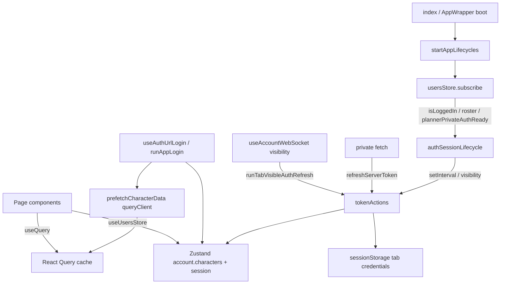

# Frontend lifecycles — roadmap

Move **session / character maintenance clocks** out of the React mount lifecycle into a boot-time supervisor, while keeping **ESI domain data** in React Query and **credentials / Character instances** in Zustand.

Companion docs:

- [Auth FRONTEND](../auth/spa.md) — current SPA bootstrap, rotate, timers
- [Auth hardening](../../migration-plans/auth-hardening/contents.md) — the outstanding auth work, and the audit behind it
- [Auth README](../../backend/api/auth/overview.md) — vocabulary and wire contracts

> Per item: **status** · **size** (S/M/L) · **where** · **why** · **how** · optional **acceptance**.  
> Add **new** open items at the bottom **without renumbering** existing ids.

---

## Goal

| Concern | Owner today | Target owner |
|---------|-------------|--------------|
| ESI access tokens + planner session rotate + corp claims | `useRefreshESITokens` → Zustand `tokenActions` | Boot-time `authSessionLifecycle` → same actions |
| Character objects in Zustand | Zustand | Unchanged |
| Skills / jobs / blueprints / assets / etc. | React Query (`staleTime`, `useQuery`) | Unchanged — do **not** mirror into Zustand |
| Prefetch after login / add-alt | `useCharacterHooks` (mostly plain fns) | Plain module taking `queryClient` |
| OAuth / URL login, signout navigation | React effects | Stay in React (one-shot flows) |
| WebSocket connect + tab visibility wake | `useAccountWebSocket` | Stay in React for connect; wake calls lifecycle / action API |

**Out of scope:** Service Worker or a parallel “background auth runtime” that owns tokens and pushes into Zustand. Browsers throttle background tabs either way; SW cannot see in-memory `Character` instances without IPC; tab-wake + opportunistic private-API refresh already cover resume.

---

## Target layout

```text
frontend/src/
  Lifecycles/
    startAppLifecycles.js          # boot: wire deps, subscribe, start
    authSessionLifecycle.js        # ESI stagger + 15m maintenance + tab wake
    staticDataLifecycle.js         # optional: move useFetchStaticDataFiles here

  Zustand/account/
    tokenActions.js                # unchanged owners of refresh/rotate logic
    characterActions.js

  Functions/
    Auth/...                       # login/session modules stay as-is
    Character/
      prefetchCharacterData.js     # lifted out of useCharacterHooks

  Hooks/App/
    useRefreshESITokens.js         # DELETE after cutover
    useCharacterHooks.js           # thin re-export or delete

  App.jsx                          # no useRefreshESITokens()
```

### Layering

```text
index.jsx / AppWrapper
  └─ startAppLifecycles({ queryClient })   ← once at boot
       ├─ authSessionLifecycle             ← timers + visibility API
       ├─ (optional) staticDataLifecycle
       └─ usersStore.subscribe → start/stop

  └─ React tree
       ├─ App                              ← UI only (no auth intervals)
       ├─ useAuthUrlLogin / signout        ← one-shot navigation flows
       ├─ useAccountWebSocket              ← WS; wake calls lifecycle API
       └─ pages/components
            └─ useQuery(...)               ← ESI domain data (unchanged)
```

### Runtime flow



### Ownership rules

**`authSessionLifecycle.js`**

- Subscribes to `isLoggedIn`, `plannerPrivateAuthReady`, refreshable character count
- Owns the two timers currently in `useRefreshESITokens`
- Exposes `onTabVisible()` for the WS/visibility path
- Starts / stops / rebuilds intervals outside React mount

**`tokenActions.js` (unchanged role)**

- `runStaggeredEsiTokenStep`, `runEsiTokenIntervalMaintenance`, `refreshServerToken`, `runTabVisibleAuthRefresh`
- Single-flight + cooldowns stay here

**React Query (unchanged role)**

- Character / corp ESI payloads (`staleTime`, invalidation)
- Components keep `useQuery`; no mirroring into Zustand

**`prefetchCharacterData.js`**

- Plain module taking `queryClient` + character hash(es)
- Called from login / add-alt / realtime reconcile — not from a hook

**What stays in React on purpose**

- OAuth / URL login effect (`useAuthUrlLogin`)
- Signout route effect
- WebSocket hook (connection tied to UI session; refresh work stays in actions)
- Any hook that only *reads* store / Query for render

---

## Current friction (why)

1. Timers live only while `App` is mounted and logged in — ownership is tied to a component, not the session.
2. Stagger interval effect re-creates `setInterval` when character count changes; maintenance interval does not — easy to get wrong when editing.
3. Multiple overlapping refresh entry points (stagger, 15m maintenance, private-API pre-refresh, visibility wake) are fine with single-flight, but the **scheduler** should be one place.
4. `useCharacterHooks` is a hook wrapper around plain prefetch functions — no React state needed.

---

## Backlog

### #1 — Extract `authSessionLifecycle` from `useRefreshESITokens`

- **Status**: open · **Size**: M  
- **Where**: new `frontend/src/Lifecycles/authSessionLifecycle.js`; call sites in `useRefreshESITokens.js` then `App.jsx`  
- **Why**: move interval ownership out of React without changing refresh semantics.  
- **How**: copy the two-interval logic + roster subscription into a module with `start()` / `stop()` (or subscribe-driven start/stop). Keep calling the same Zustand actions. Leave the hook as a thin adapter that calls `start`/`stop` until #2.  
- **Acceptance**: logged-in stagger + 15m maintenance behave as today; logout clears intervals; roster size change rebuilds stagger only.

### #2 — Boot `startAppLifecycles`; remove hook from `App`

- **Status**: open · **Size**: S  
- **Where**: `frontend/src/Lifecycles/startAppLifecycles.js`; `AppWrapper.jsx` or `index.jsx` after `QueryClient` exists; `App.jsx`  
- **Why**: one supervisor at boot; React stops owning auth clocks.  
- **How**: `startAppLifecycles({ queryClient })` once; delete `useRefreshESITokens` usage from `App`; delete or deprecate the hook file. Wire tab-visible wake to `authSessionLifecycle.onTabVisible()` (or keep calling `runTabVisibleAuthRefresh` directly — same action).  
- **Acceptance**: cold load + login + logout + tab wake match pre-change behaviour; no `useRefreshESITokens` in the tree.

### #3 — Lift character prefetch out of `useCharacterHooks`

- **Status**: open · **Size**: S  
- **Where**: new `frontend/src/Functions/Character/prefetchCharacterData.js` (name flexible); update `useAuthUrlLogin` / `runPostLoginAccountSync` / `AdditionalAccounts` / any other callers  
- **Why**: prefetch is not React state; a hook wrapper obscures the real API.  
- **How**: export plain `prefetchCharacterData` / `prefetchMultipleCharacters` that take `queryClient`. Replace hook call sites. Optionally leave a thin re-export for compatibility.  
- **Acceptance**: login and add-alt still prefetch the same Query keys; no behavioural change to React Query cache policy.

### #4 — Update auth frontend docs

- **Status**: open · **Size**: S  
- **Where**: [spa.md](../auth/spa.md) §§2 / maintenance; [overview.md](../../backend/api/auth/overview.md) file index  
- **Why**: docs currently describe `useRefreshESITokens` as the timer host.  
- **How**: point SPA maintenance at `Lifecycles/*`; keep action names in `tokenActions.js`. Link this roadmap.  
- **Acceptance**: file index and bootstrap diagram match the new boot path.

### #5 — (Optional) Move static-data / similar app polls into lifecycles

- **Status**: open · **Size**: S  
- **Where**: `useFetchStaticDataFiles.js` → `Lifecycles/staticDataLifecycle.js`; optionally similar App-level intervals that only call non-UI work  
- **Why**: same pattern as auth — App mounts intervals that do not need component state.  
- **How**: only move polls that are “while app alive, refresh X on a timer.” Leave Tranquility / config hooks that feed React Query or UI state alone unless the benefit is clear.  
- **Acceptance**: static data still refreshes on the same cadence; `App.jsx` stays free of that interval.

### #6 — Lifecycle unit tests

- **Status**: open · **Size**: M  
- **Where**: `Lifecycles/*.test.js` (or colocated)  
- **Why**: timer start/stop/rebuild is easy to regress without React Testing Library.  
- **How**: fake timers; mock `usersStore` subscribe + actions; assert interval create/clear on login, logout, roster size change; assert single-flight still respected when invoking actions.  
- **Acceptance**: tests cover start/stop, roster rebuild, and no double-interval after subscribe churn.

---

## Recommended pickup order

1. **#1** — extract lifecycle module behind the existing hook (safe intermediate).  
2. **#2** — boot supervisor; remove React timer host.  
3. **#3** — plain prefetch module.  
4. **#4** — docs.  
5. **#6** — tests (can start alongside #1).  
6. **#5** — optional same pattern for other App polls.

---

## Non-goals (do not do)

- Service Worker–owned token refresh writing into Zustand.  
- Duplicating React Query ESI caches into Zustand.  
- Rewriting `tokenActions` single-flight / cooldown logic as part of this move.  
- Moving one-shot login / signout effects into the lifecycle supervisor.
