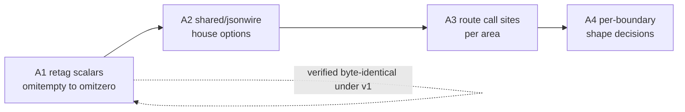

# Go 1.27 adoption — plan

**Status:** Phase 1 (docs) complete; no track work started. Verified against the tree at this update — Tracks A, B and C are all at zero.
**Code in scope:** [`services/`](../../../services/) (all areas), [`testing/`](../../../testing/), [`deployment-tool/`](../../../deployment-tool/)
**Live SoT (until promote):** [backend/core/core.md](../../backend/core/core.md), [backend/api/contents.md](../../backend/api/contents.md), [technical-rules.md](../../technical-rules.md) § Prefer modern Go

**Rules:** Read and following [`../documentation-rules.md`](../documentation-rules.md)
and [`../technical-rules.md`](../technical-rules.md) (migration-plans).
Phase 1 (project folders/docs) before any product work.
For Go surfaces in scope only: `go fix -diff` before planned work; again on edited packages (not unrelated code).
Live SoT will not be edited until this project is complete and promotion is approved.

## Prerequisite (landed before this project)

The language-version move is done and is **not** a track here:

| Piece | Now |
|-------|-----|
| `services/go.mod`, `deployment-tool/tools/go.mod` | `go 1.27.0` (`deployment-tool/go.mod` was already there) |
| Six `services/*/Dockerfile` + `deployment-tool/Dockerfile` (both stages) | `golang:1.27.0-alpine` |
| Toolchain directives | None added, in any module |
| Verification | `go build`, `go vet`, `go test` clean on both modules |

Two consequences that the tracks below depend on:

- **`encoding/json` is now the v2-backed implementation.** The `jsonv2` GOEXPERIMENT ships on by default in the 1.27 toolchain, so moving the builder images changed the engine under every existing `encoding/json` call. v1 *semantics* are preserved by the legacy-options path; the full module test suite passes unchanged. The only opt-out is build-time `GOEXPERIMENT=nojsonv2` — there is no runtime GODEBUG for it.
- **`encoding/json/v2` is now reachable.** `go vet` rejects the v2 API below language version 1.27 (`json.Marshal requires go1.27 or later`), so Track A was blocked until the bump and is not blocked now.

## Goals

1. Decide and execute a position on **`encoding/json/v2`** — gaining its read-side strictness without silently changing any wire contract.
2. Put the **time-driven wait loops** that currently cost wall clock (or have no coverage at all) on simulated time.
3. Clear the **`go fix` backlog** the new language version exposed, scoped per area rather than as one sweep.

## Non-goals (this project)

- Adopting v2's default semantics wholesale as a single change.
- Changing the JSON shape of any client-facing response as a side effect of an engine or API change; shape changes are a deliberate, separately-decided step (Track A, Phase A4).
- Migrating `MarshalIndent` operator output (`eip cli` JSON) to v2 — human-read output gains nothing from either the strictness or the speed.
- Rewriting tests that need real infrastructure (miniredis, live Mongo) to run under simulated time without a seam; the seam is a named prerequisite, not an assumed one.

## Track A — `encoding/json/v2`

Measured behaviour differences, the retag rule, and the house-options set: [json-semantics.md](./json-semantics.md). Read that before starting any phase here.

Surface: 143 files under `services/` import `encoding/json` (43 shared, 26 worker, 26 websocket, 23 core, 21 api, 2 capacity-controller, 1 ws-router, 1 cmd); 308 `,omitempty` tags against 4 `omitzero`, and all four of those are `time.Time` or struct fields that A1 leaves alone; 14 custom marshaler methods; one production `DisallowUnknownFields` site. There is **no** shared JSON helper today — every call site imports the stdlib directly. Recount for the area you open rather than working from these numbers.

### Phase A1 — Retag scalars, still on v1

`,omitempty` → `,omitzero` on **scalar** fields only (int / float / bool / string / pointer). `omitzero` behaves identically under both engines, so this is provable while still on the v1 API and removes the single largest source of v2 shape drift.

**Do not** retag slices, maps, or `time.Time` — the two tags genuinely differ there, and those types already agree between engines under `omitempty`.

Done when: every scalar `omitempty` in `shared/models` and the cross-process payload structs is retagged, and a byte-equality assertion over the representative documents passes unchanged.

### Phase A2 — `shared/jsonwire`

One shared package owning the house options (`FormatNilSliceAsNull`, `FormatNilMapAsNull`, `EscapeForHTML`, `Deterministic`) plus thin `Marshal` / `Unmarshal` / encode / decode wrappers. This is the one-SoT home the codebase lacks; the options must not be re-declared per call site.

Done when: the package exists with tests proving byte-identical output to v1 for the representative documents, and its options are the only place the policy is written down.

### Phase A3 — Route call sites, area by area

`shared` → `core` → `worker` → `websocket` → `api`, finishing each area's cutover within its own slice. No forwarding wrappers left behind.

Includes rewriting [`api/helper/json.go`](../../../services/api/helper/json.go) error handling: it currently matches `*json.SyntaxError` / `*json.UnmarshalTypeError` and string-prefixes `"json: unknown field "`. v2 replaces these with `*jsontext.SyntacticError`, `*json.SemanticError`, the `json.ErrUnknownName` sentinel, and a `jsontext.Pointer` field path — strictly better, and it deletes the stringly check.

Done when: no product file outside `shared/jsonwire` imports `encoding/json` directly, except the `MarshalIndent` operator-output sites named under non-goals.

### Phase A4 — Per-boundary shape decisions

Only after A3. Take boundaries one at a time, internal first (Redis blobs, asynq / NATS payloads — both ends are ours), then websocket, then the client-facing API. Each is a deliberate wire decision, not a default.

**Wire compatibility:** A1–A3 are **additive/neutral** by construction. A4 is **breaking** per boundary for any consumer distinguishing `null` from `[]`, and the read-side strictness is **breaking** for any producer sending duplicate keys or mismatched field case. No such in-tree producer was found; `eip cli` output and Firestore import data are external enough to need a check before A4 touches them. Mixed-version rolling deploys are low risk in the other direction — extra zero-valued fields are ignored by v1 readers.

## Track B — Simulated-time tests

Feasible with no seam, all in-process and channel-driven:

| Target | Today |
|--------|-------|
| [`core/servicemanager/managed_test.go`](../../../services/core/servicemanager/managed_test.go) | Two 2s `time.After` selects waiting on start/stop signals |
| [`core/scheduler/cancel_on_shutdown_test.go`](../../../services/core/scheduler/cancel_on_shutdown_test.go) | A 3s `wait.For` poll and 30s / 5s / 5s `time.After` selects around gocron shutdown |

Both are ceilings rather than sleeps, so the wall-clock cost is small when the code behaves; the gain is that a regression fails in simulated time instead of hanging out to a real deadline.

Blocked until a seam exists — these drive real leases through miniredis, which serves over loopback TCP and exposes no custom-listener API. Real network I/O never counts as durably blocked, so a bubble deadlocks rather than fails:

- [`core/primarycontroller/controller_test.go`](../../../services/core/primarycontroller/controller_test.go) (5.05s of the suite's wall clock)
- [`core/leadership/failover_test.go`](../../../services/core/leadership/failover_test.go)
- [`core/singleton/service_test.go`](../../../services/core/singleton/service_test.go)

The seam has a home: every Redis-backed test takes [`testing/redisfake`](../../../testing/redisfake/), which owns construction of the miniredis server and its client, and its package comment names itself as the one place to change. Making those tests bubble-safe means giving that constructor an in-memory transport (or a fake lease behind [`shared/redis`](../../../services/shared/redis/)) rather than editing each test.

There is a working precedent in the same module: [`testing/httpfake`](../../../testing/httpfake/) serves over an in-memory pipe rather than a socket precisely so it stays usable inside a bubble, and its own test runs under `synctest.Test`. Size the Redis seam against that shape before attempting any of the three.

Done when: both unblocked targets run under `testing/synctest`, and the Redis seam decision is recorded here either as scheduled or as declined.

## Track C — `go fix` sweep

`go fix -diff ./...` at the new language version reports `errors.As` → `errors.AsType`, `interface{}` → `any`, `wg.Go`, `slices` / `maps` adoption, `for range n`, `max()`, plus gofmt alignment.

By area, re-counted at this update — **47 files**: `services/` 36 (shared 10, api 9, core 7, worker 4, capacity-controller 2, websocket 2, ws-router 2), separate module `testing/` 8, `deployment-tool/` 3.

The count is a snapshot, not an inventory: it falls on its own as areas are touched under the scoped `go fix` rule. Re-run the command for the area you are about to open rather than working from these numbers.

Land **per area, scoped to that area**, per [technical-rules.md](../../technical-rules.md) § Prefer modern Go — not as one 47-file commit, and not widened into packages a slice does not otherwise touch. Where an area is already being opened by Track A Phase A3, its `go fix` slice should land first so the JSON change reviews clean.

Done when: `go fix -diff` is empty for every area, or a remaining suggestion is recorded here with the reason it was waived.

## Open decisions

| # | Decision | Needed by |
|---|----------|-----------|
| 1 | Is v2's read-side strictness (duplicate names, case sensitivity, UTF-8 validation) worth the migration at all, given the measured ~13% unmarshal gain and no marshal gain? | Before A1 |
| 2 | Does the frontend contract keep `null` for empty collections, or move to `[]`? Governs whether `FormatNilSliceAsNull` stays on permanently. | A4 |
| 3 | Is the Redis seam worth building for test determinism alone — an in-memory transport in `testing/redisfake`, or a fake lease behind `shared/redis`? `testing/httpfake` shows the transport shape works. | Track B |

## Done-when (project)

All three tracks closed or explicitly declined, the Track A wire decisions recorded per boundary in [overlay.md](./overlay.md), and go-ahead given to promote the landed behaviour into live SoT.
