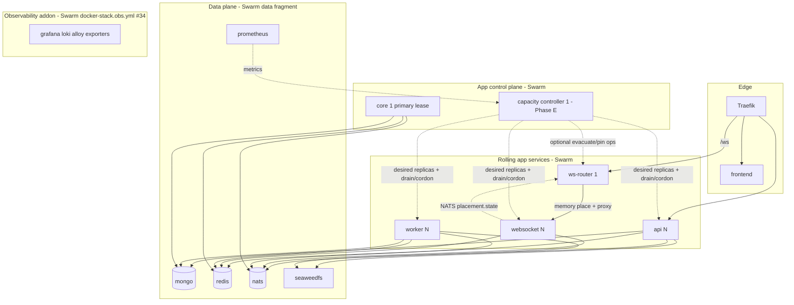

# Docker Swarm migration — roadmap & backlog

**Rules:** Read and following [`../documentation-rules.md`](../documentation-rules.md) and [`../technical-rules.md`](../technical-rules.md) (migration-plans). **Project closed (2026-08-14).** Live SoT is authoritative. This folder is history; [overlays](./overlay.md) do not win.

## Phase 1 — Project docs setup (gate)

**Status:** done (2026-08-02)

| Item | Status |
|------|--------|
| Named subfolder `swarm-stack/` (work name, not branch name) | done |
| Project [`contents.md`](./contents.md) | done |
| This roadmap + rules acknowledgement | done |
| Row in [`../contents.md`](../contents.md) | done |
| Overlay scaffold — [`overlay.md`](./overlay.md) index + [`overlays/`](./overlays/) one file per `#1`–`#36` | done |

Phase 1 gate cleared. Stub at [`../swarm-roadmap.md`](../swarm-roadmap.md) points here so older links still resolve.

> **Migration / backlog log — not live SoT.** Project home → [contents.md](./contents.md). Live stack docs → [stack/contents.md](../../stack/contents.md).
>
> **Handoff status (2026-08-14):** **Project closed.** Roadmap **#1–#36** + live SoT promote complete. Operator surface = Deployment Tool. Compose runtime retired. This folder is history. **Ship remaining (not this docs project):** merge `swarm/hard-cutover` → Development (PR #58). **Pin/move scrapped for now.** Census parked.

Tracks the single-host Swarm stack: **data fragment** (mongo/redis/nats/SeaweedFS) + **app fragment** (Traefik, api, websocket, worker, ws-router, core, frontend, capacity-controller); optional Swarm **observability** fragment (`docker-stack.obs.yml`, #34 — includes Prometheus). **Operator surface: [Deployment Tool](../../deployment/guide.md) ([`deployment-tool/`](../../../deployment-tool/) CLI + TUI; commands use `eip …`).

Later, Swarm’s fixed replica counts are driven by a **capacity controller** (not a naive CPU HPA). Swarm does not autoscale by itself. Prep for the controller is **woven into earlier items** so Phase E is mostly policy + Docker/Traefik ops, not inventing identity or metrics from scratch.

**Scope (intentional):** **one host forever** for this product (current design; multi-node HA / multi-manager are out of scope). Multi-node overlay, Mongo multi-host, K8s, replacing NATS stay out of scope.

**Non-goals for v1:** multi-active core scheduler/changestream (lease-gated single-primary is the design — see [core.md](../../backend/core/core.md)); letting every replica call the Docker API to scale itself; auto-scaling the data plane; polishing data-plane live swaps before a basic Swarm cutover works; **Redis on the changelog / JetStream hot path** (placement is in-memory + NATS — see [WS placement](#ws-placement-model-router--nats)); treating Phase E as a naive CPU “autoscaler” instead of a **capacity controller**; teaching public operators a Compose-vs-Swarm mental model; maintaining Compose as a runtime plane (retired — stub only); inventing a second host-ops surface beside the Deployment Tool.

**Dev vs prod (same product):** **`eip dev`** bakes and runs the app locally (images from Dockerfiles / bake). **Prod** uses **`eip up`** / **`eip update`** with the **same service set / same built images** and published tags — not a different architecture. Staging ≃ local/dev shape; orchestration is **Swarm fragments** (same manifests; scale/addons via `eip.config.yaml` + **`eip sync`**).

---

## Start here for a new session

1. **This project is closed.** Do not start new swarm-stack slices here. History: [contents.md](./contents.md). Live behaviour: [stack/contents.md](../../stack/contents.md).

2. **Pickup order:** none in this project. [Recommended pickup order](#recommended-pickup-order) records what landed. Optional later remainders that were never the close gate → Follow-ups.

3. **WS placement (locked):** in-memory **tenant → container_id** on Swarm **`eip_ws_router`**; soft/full/clients/draining via NATS `ws.placement.state` + `GET /placement`. Traefik routes `/ws` -> router. Cookie `eip_tenant_affinity` is the key. Sticky = fallback. Mid-roll **prefer newest bake**; place-miss picks **lowest live clients**. Drain: [websocket.md](../../backend/websocket/websocket.md). Planned evacuate via **`eip capacity`** / `ws.command.*` (landed). **Pin/move — out of scope for now.**

4. **Auth** rolls **in parallel** - account-key cookie now; widen when corp/alliance claims exist.

5. **Related roadmaps:** [document-lock](../../backend/api/document-lock/roadmap.md) (multi-tenant locks — separate project), [auth hardening](../auth-hardening/contents.md), [guide.md](../../deployment/guide.md), [cli/contents.md](../../deployment/deployment-tool/cli/contents.md), stack YAML in project home / kit.

6. **Code anchors already in tree:** `services/shared/container` (`container.ID()`), `services/core/singleton` + `redis/lease`, websocket JetStream durables, `tenant_affinity_cookie.go`, `services/ws-router/` (memory place + NATS placement), stack Traefik `/ws` → `eip_ws_router` labels, **`deployment-tool/`** (deploy/sync/secrets/rebuild/update/cli).

7. **Testing:** **#25 done** — live map [testing/contents.md](../../testing/contents.md) ([overview](../../testing/overview.md) § CI, [services](../../testing/services/contents.md), [Deployment Tool testing](../../deployment/deployment-tool/cli/testing.md)); path-filtered [`test.yml`](../../../.github/workflows/test.yml) with aggregate **`ci`**; ruleset requires **`ci`** on Public/Development. Capacity dry-run / management sim **#27 / #29 done** ([capacity-controller.md](../../testing/services/capacity-controller.md)); **#26** soak done.

Companion context:

- Current prod path: **eip-bootstrap** → **`eip init`** → **`eip up`** ([guide.md](../../deployment/guide.md))
- Deployment Tool: [deploy.md](../../deployment/deployment-tool/cli/deploy.md) (Ready / Ensure*) · [verbs.md](../../deployment/deployment-tool/cli/verbs.md) (sync / secrets / update) · [engineering.md](../../deployment/deployment-tool/cli/engineering.md)
- Shared network contract: [network.md](../../stack/network.md) (`eip-core` mesh + `eip-public` edge + `eip-obs` / `eip-docker-*`)
- Replica identity: [stack.md](../../stack/stack.md) § Replica identity + `services/shared/container` → JetStream durables / OTLP `service.instance.id`
- Elastic Swarm stack (live): [stack.md](../../stack/stack.md) + `docker-stack.yml` — Traefik + api/websocket/worker/ws-router/**core**/**frontend**
- Entry points: **`eip up` / `eip dev` / `eip rebuild` / `eip secrets` / `eip sync` / `eip update` / `eip cli` / `eip logs` / `eip shutdown` / `eip repair`**
- Edge: [traefik.md](../../stack/traefik.md) — Swarm `eip_traefik` (ingress); `/ws` → [ws-router.md](../../backend/ws-router/ws-router.md); frontend via swarm provider
- WS placement: [ws-router.md](../../backend/ws-router/ws-router.md) — memory tenant→container_id; NATS soft/full/draining; sticky fallback; prefer-newest bake mid-roll
- App images / day-2 rolls: [verbs.md](../../deployment/deployment-tool/cli/verbs.md) — **`eip update`** (pull+digest-reconcile) / **`eip rebuild`** (bake)
- Secrets / apply: [secrets.md](../../stack/secrets.md) — **`.env` = secrets** → **`eip secrets`**; [config.md](../../stack/config.md) — **`eip.config.yaml`** → **`eip sync`**; FE public knobs via `x-frontend-public-env`; **`eip ensure-s3`** / **`eip ensure-mongo`**
- Core control plane: [core.md](../../backend/core/core.md) — `lease:core:primary` + `servicemanager`; nested singleton leases; changestream resume in `core/primaryhandoff`
- **Multi-tenant product:** [document-lock ROADMAP Strategic direction](../../backend/api/document-lock/roadmap.md#strategic-direction--multi-tenant-locks-account--corporation--alliance)
- Public deploy: day-2 YAML via **`eip sync`**, secrets via **`eip secrets`** (not full bring-up)


> Per item: **status** - **size** (S/M/L) - **where** - **why** - **how** - optional **acceptance**.  
> Add **new** open items at the bottom **without renumbering** existing ids.  
> All backlog items are **open / not started** unless marked otherwise.

---

## How to use this document

| Section | Purpose |
|---------|---------|
| [Start here](#start-here-for-a-new-session) | Handoff entry for a new agent/session |
| [Current state](#current-state) | What runs today and remaining pains |
| [Target shape](#target-shape-single-host) | What “done” looks like on one machine |
| [WS placement model](#ws-placement-model-router--nats) | How connections reach the right websocket (memory place + NATS + ws-router) |
| [Multi-tenant fit](#multi-tenant-fit-account--corp--alliance) | How Swarm/scale/placement anticipates product direction |
| [Changelog delivery](#changelog-delivery-core--jetstream--ws) | How Mongo changes reach containers (today vs #20) |
| [Principles](#principles) | Guardrails while migrating |
| [Phases](#phases) | Ordered delivery |
| [Capacity controller build-up](#capacity-controller-build-up-woven) | How earlier work feeds Phase E |
| [Testing & simulation](#testing--simulation) | How we prove cutover, affinity, scale, and management |
| [Backlog](#backlog) | Numbered work items **#1–#36** |
| [Impact map](#impact-map) | What improves vs what breaks |
| [Pickup order](#recommended-pickup-order) | Suggested sequencing |
| [Follow-ups](#follow-ups-detail-later) | Design notes still to write |
| [Decisions log](#decisions-log) | Locked decisions from planning |

---

## Current state

| Layer | Today | Pain |
|-------|--------|------|
| Deploy | **`eip up`** / **`eip dev`** — two-pass stack deploy + Ready (`EnsureS3` ‖ `EnsureMongo`) via [deploy.md](../../deployment/deployment-tool/cli/deploy.md) | Day-2: **`eip sync`**, **`eip secrets`**, **`eip rebuild`**, **`eip update`** ([verbs.md](../../deployment/deployment-tool/cli/verbs.md); #32 / #33 / #23) |
| Operator UX | Host **`eip`** binary (TUI + CLI); bootstrap installs it | #17 done — keep verbs in Deployment Tool catalogue / TUI |
| api / websocket / worker / ws-router / Traefik / **core** / **frontend** / **capacity-controller** | Swarm `docker-stack.yml` | #2/#4/#7/#8/#16/#20 done; capacity Phases A–D done; **WS soak signed off**; pin/move **scrapped for now** |
| websocket identity | `container.ID()` (`HOSTNAME` / ContainerID[:12]); OTel `service.instance.id` only | **#2 done** — no slot-stable SoT; graceful durable delete + InactiveThreshold backstop |
| core | Swarm `eip_core` (`replicas: 1`, `start-first`); probes `:19100`; primary lease + Redis changestream resume | Optional warm `replicas: 2` parked; **#28** dual-publisher failover tests done |
| Edge | Swarm `eip_traefik` (docker + swarm providers); `/ws` -> **ws-router** | #4 done; memory place + NATS flags (#2); sticky fallback; mid-wave **prefer newest bake** |
| Capacity / YAML | `eip sync` + Swarm config `eip_config_yaml` mount for controller; worker Scale when managed | **#19 done** (mount/Load + promote); optional soak on #18; pin/move **scrapped**; [18-capacity-controller/](./18-capacity-controller/) |
| Observability | Optional Swarm fragment `docker-stack.obs.yml` (#34 **done** — toggle via YAML / `eip up`/`dev`) | Default **off**; **Prometheus on obs** (dual-home `eip-obs`+`eip-core`); data fragment lean |
| Dev | **`eip dev`** — bake local images + deploy; day-2 **`eip rebuild`** | Same app as prod; cache bake; no data-plane bounce by default |

Elastic / dynamic process set (by design): **api**, **websocket**, **worker**, **ws-router**.  
Control plane: **core** — Swarm singleton with lease-gated hot-swap (`lease:core:primary`); scheduler/changestream run on the primary only (not multi-active).

---

## Target shape (single host)



| Service | Replicas | Update order (target) | Identity |
|---------|----------|----------------------|----------|
| api | ≥1 (later capacity-controlled; defaults in operator config) | `start-first` | `container.ID()` / `service.instance.id` |
| ws-router | **1** (v1; `start-first` handover; scale to 2 later OK) | `start-first` | `container.ID()` / `service.instance.id` |
| websocket | ≥1-2 (capacity-controlled + drain; lean default 1) | `start-first` | `container.ID()` (place / JetStream / OTel) |
| worker | ≥1 (first capacity-control target) | `start-first` | `container.ID()` / `service.instance.id` |
| core | 1 | `start-first` (primary lease handoff) | `container.ID()` (single replica) |
| capacity-controller | 1 (Phases A–D landed; managed gate) | `start-first` (lease-gated; same spirit as core Phase C) | singleton; owns desired shape (replicas, drain, optional pins) - Swarm executes |
| prometheus | 0 unless obs enabled | Swarm **obs** fragment (`eip-obs`+`eip-core`) | gated by addon; not Evaluate SoT |
| frontend | 1-2 | `start-first` | optional |
| mongo / redis / nats | 1 | rare / manual | stable DNS on Swarm data fragment |
| observability addon | 0 unless enabled | Swarm `docker-stack.obs.yml` (toggle = omit) | Grafana, Loki, Alloy, exporters, asynqmon, **Prometheus**, node_exporter (#34) |

**Current topology:** Swarm **data** + **app** + optional **obs** fragments on external **`eip-core`** (stack namespace still `eip_*` services). Frontend + capacity-controller on Swarm. Data-plane desired state via deployment-tool **`EnsureS3`** / **`EnsureMongo`**. Operator UX is the **Deployment Tool only** (CLI / TUI). Obs addon (#34) done — `addons.observability.enabled` merges `docker-stack.obs.yml` (includes Prom). Compose runtime retired (stub `docker-compose.yml` for leftover cleanup only).

---

## WS placement model (router + NATS)

Traefik **already** terminates TLS and can load-balance `/ws`, but Traefik v3 **cannot hash cookie values** (sticky + IP `hrw` only). Opaque sticky cookies group **browsers**, not **corps**. Org co-location needs a tenant-aware balancer.

### Default (locked — memory place + NATS flags; #2)

1. At login / session create, set cookie **`eip_tenant_affinity`** whose **value** is the primary affinity key: `alliance:{id}` -> else `corporation:{id}` -> else `account:{id}` (app already sets `account:{id}`).
2. Traefik routes `PathPrefix(/ws)` to Swarm service **`eip_ws_router`** (not directly to websocket tasks).
3. Router holds an **in-memory** place map `tenant → container_id`. Soft/full/clients/draining come from NATS `ws.placement.state` and refresh `GET /placement`. Miss / dead / full / draining → reassign (prefer newest bake, then non-soft, then lowest live clients). See [ws-router.md](../../backend/ws-router/ws-router.md).
4. Router reverse-proxies the WebSocket upgrade to the chosen task IP:4001. Session auth still runs on the websocket process (Redis session / handoff — not the placement signal plane).

Sticky (`eip_ws_affinity`) is **fallback** when the affinity cookie is missing — not the steady-state org model. Place map is router-process memory (lost on router restart → clients re-place).

### Why Swarm for the router

Compose recreate of a singleton proxy would drop every live `/ws` tunnel. Router uses `start-first`, **replicas: 1** (handover on roll; dual replicas optional later), same class as other elastic Swarm services.

### Ops / scale-in (#21 — controller evacuate / pin / cordon)

Instant reassign on connect keeps the balancer correct when a backend dies; planned evacuate keeps **safe scale-in** (do not cold-kill a hot alliance). Placement acceptance **done** (#4); identity + signal plane **done** (#2). SIGTERM roll drain (#2 / #8) unchanged. **Phase C landed:** `ws.command.*` + `eip capacity` cordon/drain/uncordon/evacuate against live container ids. **WS managed soak signed off** (2026-08-09). **Pin/move scrapped for now.** Census parked.

Capacity controller (#18) later may write pins / desired replicas; it does not replace the router.

### Separation of concerns

- **Swarm** schedules containers.
- **Traefik** TLS + `/ws` -> router (CORS labels live on the router with `/ws`).
- **ws-router** tenant→`container_id` memory place + proxy (NATS soft/full/clients/draining).
- **Capacity controller** (Phase E) desired cluster shape (replica counts, cordon/drain, reserve, optional pin/evacuate ops).

### Not the design

- Waiting for Traefik native hash-on-cookie-value (unavailable in v3).
- Per-browser Traefik sticky as the long-term model.
- Placement scout / core Redis SCAN to derive live occupancy.
- Redis on the **changelog** hot path (#20: JetStream filters from each replica’s local `HostedTenants` query view; cross-replica census via NATS / internal API if needed).
- Live TCP teleport of sockets between containers (reconnect + existing `ws:session_handoff` instead).
- Compose-hosted router in hybrid mode (Compose-hosted router is out of scope (hybrid only)).

---

## Changelog delivery (core -> JetStream -> WS)

**Landed (#20):** core publishes `doc.update.{tenantString}.{collection}.{docID}`. Each websocket replica keeps one durable with a **mutable FilterSubjects** set from local `HostedTenants` (#8 — never mirrored to Redis). Live SoT: [websocket.md](../../backend/websocket/websocket.md) / [core.md](../../backend/core/core.md). Cross-replica “who hosts what” for capacity/ops (#18) remains **NATS census and/or internal HTTP API** (parked). Dead slots: JetStream `InactiveThreshold` + reconcile. Update widen uses `DeliverNew` (miss → refetch/resume); lock durables use `DeliverLast` (latest message for a newly filtered account subject may still arrive).

**Core hot-swap:** core is the publisher leader (`lease:core:primary` + `start-first`; scheduler/changestream leader-only). Websocket consumers do not move with core.

**Publisher scale (follow-on project):** collection groups isolate domains, not tenants. Corp/alliance collection growth → [changestream-tenant-scale/](../changestream-tenant-scale/contents.md) (per-tenant publish queues + metrics; dedicated Watch auto-detect left open).

---

## Multi-tenant fit (account | corp | alliance)

Product direction (locks, docs, WS fan-out) is **one planner** that serves **personal**, **corporation**, and **alliance** scopes together - not three separate apps. Infra choices here must not paint us into an account-only corner.

| Concern | Implication for Swarm / Traefik / capacity controller |
|---------|------------------------------------------|
| Tenants chatty on the same docs/locks | Prefer **placing clients that share a corp/alliance on the same WS replica within reason** so in-process fan-out hits more of that org’s tabs |
| **JetStream WS path (#20)** | One durable per replica; **FilterSubjects** from local `HostedTenants` (inert when empty). Core publishes tenant-keyed `doc.update`; locks filter hosted accounts only (`doc.lock.{accountID}`). In-process indexes still decide who gets the frame. |
| Selective fan-out + affinity | Co-location (#4) + selective pull (#20) cut NATS/CPU for hosted tenants |
| Personal + corp + alliance open at once | A session may need **multiple tenant subscriptions**; placement key is a **primary affinity** (e.g. largest/most-active org for that session), not “only one tenant forever”; each replica’s local hosted-tenant query view must cover **all** tenants with live sockets (account + corp + alliance) — in-process only |
| Cookie sticky (`eip_ws_affinity`) | Pins a **browser**, not an **org** - random relative to corp mates. **Fallback only** (#4 router owns steady-state placement) |
| Scale signals | Global client/queue depth first; later add **hot-tenant** pressure (clients or backlog attributed to `corporation:*` / `alliance:*`) in #8 / #19 / metrics so one large alliance cannot silently soak a replica without scale-up |
| Workers | Today personal/Asynq queues; leave policy room for **per-tenant or per-queue-family** triggers when corp/alliance job pipelines exist (#7 / #19) |
| Core changestream publish | Collection groups today; **per-tenant publisher isolation + metrics** tracked in [changestream-tenant-scale](../changestream-tenant-scale/plan.md) (not this backlog) |
| Drain / scale-down | Must consider **tenant concentration** - do not shrink away the only replica hosting a hot alliance without drain (#8 / #21); local hosted set empties as sockets leave; census/API consumers must see the slot go cold |
| **Move / rebalance tenants** | Memory place is sticky until reassigned; **#21** evacuate landed (Phase C). **Pin/move scrapped for now.** Prefer reconnect over live teleport |

**Affinity key (target):** `alliance:{id}` -> else `corporation:{id}` -> else `account:{id}` (same encoding as lock tenants). **Default routing = memory place via ws-router (#4 / #2).** Controlled overrides / evacuate = **#21** (deepen on #18).

**Rebalance model (target):** ops / capacity controller change pin or cordon (#21), signal clients to reconnect, router updates place / eligibility. Session handoff/resume already exists. Scale-in always **drains** first (#21).

**Why selective fan-out matters with affinity:** Co-location alone would not cut NATS/CPU if every replica still pulled the firehose. #20 landed selective pull; see [Changelog delivery](#changelog-delivery-core--jetstream--ws).

Placement can ship with **account-key affinity** before corp collections exist, then widen the key as membership claims land in session/auth - without going back to per-browser sticky as the primary model. Corp/alliance **lock** subjects are document-lock product work (not this roadmap).

---

## Principles

1. **Single host is the product** - design for one machine; no multi-node volume/network designs.
2. **Instance identity = container id** (`container.ID()` / `service.instance.id`) — not slot-stable names; stale place → reassign (#2 **done**).
3. **Never run two core leaders** until scheduler + changestream are lease-gated.
4. **Same app, two run modes** - `eip dev` builds/runs locally; prod uses `eip up` / `eip update` with the same images and live env. Keep topology/env contracts aligned so staging isn’t a different animal.
5. **Product safety over clever rollouts** - never run two primary publishers; standby may overlap under `start-first` while waiting on `lease:core:primary`.
6. **Deep-dive before coding each phase** - detailed designs land in follow-ups / ADRs as items are picked up.
7. **Centralise capacity decisions** - a singleton **capacity controller** (or operator) owns desired replica counts, drain/cordon, reserve capacity, and optional placement overrides. App replicas must not call the Docker API to scale themselves.
8. **Lay capacity-controller groundwork early** - metrics, Traefik, drain, YAML policy feed Phase E (see [Capacity controller build-up](#capacity-controller-build-up-woven)).
9. **Operator-owned policy file** - ceilings, targets, reserve %, cooldowns in mounted YAML (#19), including **host resource headroom**.
10. **Design for multi-tenant from day one** - tenant-shaped placement/scale keys; auth claims roll in parallel.
11. **Org-aware WS placement over sticky** - memory tenant→container_id via **ws-router** (#4 / #2); Traefik only terminates `/ws` to the router. Sticky is fallback. **#21** evacuate for safe scale-in (landed). Pin/move **scrapped for now**.
12. **Selective WS bus delivery follows affinity** - #20; no Redis on changelog hot path; one durable per live instance + mutable filters.
13. **Tenant placement is movable** - #21 evacuate/move against live container ids; lock UX during moves with doc-lock corp/alliance work.
14. **Hard cutover, then deepen** - minimal Swarm first; then GHCR day-2 rolls (#23), affinity depth, capacity controller.
15. **Two public config surfaces** - **`.env` = secrets**; separate **operator config YAML** (`eip.config.yaml`) = replicas, capacity, addon toggles, non-secret tunables (#19 / #24 / #34). Day-2: **`eip sync`** (YAML) / **`eip secrets`** (`.env`) (#32), not full `eip up`.
16. **This roadmap is the handoff** - implement from here; don’t re-derive from chat.
17. **Test as we build** - every major capability gets automated coverage and a **simulation/harness** path (affinity, connections, scale, evacuate/move, core failover). Prefer dry-run / fake Docker / load generators over “try it in prod.” Weave tests into PRs; live map → [testing/contents.md](../../testing/contents.md); sims **#26 / #27 / #29** done.
18. **Bring-up vs apply** - `eip up` / `eip dev` create the world; **`eip sync` / `eip secrets` / `eip rebuild` / `eip update`** mutate it. Do not use full bring-up as the config apply hammer.
19. **Public UX hides orchestration internals** - operators learn **`eip`** + config files; NETWORK/STACK are implementer docs.
20. **Same `eip` experience on Windows, Linux, and macOS** - one Go binary (TUI + CLI); bootstrap `.sh` / `.ps1` only places the binary (#17 / #32 / #33 / #35). No OS-specific public command set.
21. **Observability is an optional addon** - default off for lean self-hosts (#34 **done**). **No separate metrics toggle.** Prometheus lives on the Swarm **obs** fragment (with Grafana/Loki/…); data fragment is lean. Apps must run with observability off.
22. **Host ops = Deployment Tool** - verbs in catalogue / TUI only: [guide.md](../../deployment/guide.md) / [verbs.md](../../deployment/deployment-tool/cli/verbs.md).

---

## Phases

### Phase 0 - Prep (**closed**)

Prepare files/network/identity for the **hard cutover**. Defer ordered multi-service roll sophistication, data-plane live swaps, and full corp affinity until after cutover is boring.

- Pin / document replica env vars ([stack.md](../../stack/stack.md) § Replica identity) - **done**.
- Inventory bind mounts -> configs/volumes plan (#3) - **done** ([secrets.md](../../stack/secrets.md) § Remaining host binds); adminSDK binds removed; Swarm secrets + narrow Go config landed.
- External attachable **`eip-core`** (#1) - mesh overlay for Swarm stack - **done** (rename from `eip`; polish **#36**).
- Minimal stack file (#5) + Traefik swarm (#4/#31) + **ws-router** - **done**; account-key **cookie** done; sticky is router fallback only.
- Document `.env` → Swarm secrets + day-2 apply (#24) - **done** ([secrets.md](../../stack/secrets.md), [config.md](../../stack/config.md), [guide.md](../../deployment/guide.md)); operator verbs now **`eip secrets`** / **`eip sync`**.

**Phase 0 exit:** prep artifacts + smoke + tenant affinity cookie + bind-mount inventory. Met. (ws-router + Swarm Traefik + Swarm secrets + day-2 apply + obs fragment toggle landed.)

### Phase A - Hard cutover: basic Swarm for elastic path

**Hard cutover** to Swarm for **Traefik + api / websocket / worker / ws-router**. Data plane on Swarm **data fragment** (mongo/redis/nats/SeaweedFS/Prometheus); app fragment owns Traefik + elastic + core + frontend.

**Landed (local / branch `swarm/hard-cutover`):** bring-up via **`eip up` / `eip dev`** (deployment-tool), data+app(+optional obs) Swarm fragments, Traefik ingress (#31), api/websocket/worker + ws-router + core + frontend (#4/#5/#16), affinity cookie, placement path (now memory + NATS per **#2**), Desktop localhost publish. Compose runtime retired (stub only); host ops = Deployment Tool (#17 / #34).

- Replica identity + placement signal (#2) — **done** (promote 2026-08-07); soak limits evidence recorded.
- `start-first` rolls for elastic services - in stack config; day-2 ship **#23** / #6 absorbed (`eip update` / `eip rebuild`).
- Traefik swarm + **ws-router placement** (#4) - **done** (incl. same-tenant acceptance); sticky = fallback only; signal plane cut over under #2.
- Capacity envelope drafted (#7 / #19) — **#7 done** (50 concurrency; worker max 2); **#8** drain + soak **done**.

**Exit criteria:** Swarm fragments are the working prod/dev shape; recover with **`eip up` / `eip dev`**. Day-2 image rolls are **#23** (+ #6 absorbed), not a hard-cutover gate. (Stay inside the #7 envelope — do not scale workers blindly.)

**Then build outward:** day-2 rolls (**#23**), selective fan-out (**#20**), core Phase B/C, and capacity **Phases A–D** (live SoT + WS soak sign-off) are **done**. Pin/move **scrapped for now**.

### Phase B - Core as Swarm singleton — **done**

Goal: **replace core without bouncing the whole stack**.

- Core in app fragment; orchestration probes on `:19100`; graceful SIGTERM cleanup.
- Compose `depends_on: core healthy` replaced by HTTP `/ready` (#10).
- Interim used `stop-first`; superseded by Phase C.

### Phase C - Core hot-swap / active-passive — **done**

Goal: **new core becomes handoff-ready before old releases**, then takes `lease:core:primary`.

| Workload | Landed |
|----------|--------|
| `singleton/*` | Nested Redis leases on every replica |
| Scheduler / changestream | `primarycontroller` + `servicemanager` — leader only |
| In-flight cron | gocron job `context.Context` cancelled on lose-primary / Shutdown (market-prices micro-batch stops early) |
| Changestream resume | Redis tokens `eip:core:handoff:v1:cs:resume:{groupID}` + Mongo `StartAfter`; cancel watch on lose-primary; at-least-once |
| Soft reports (schema lag / keyring) | Standby OK; not primary-gated. App Mongo indexes: deployment-tool `EnsureMongo`, not core. |
| Swarm roll | `order: start-first`; healthcheck `/ready` = standby handoff (not `is_leader`) |

JetStream **consumers** stay on websocket slots; only the **publisher** (core) moves.

**Exit criteria (met):** core image roll with resume-bounded handoff (no intentional cold Watch gap); no dual watchers; mid-publish lose-primary cancels scheduler work without gocron stop timeout; rollback if new never Healthy. **#28** done — unit/miniredis + dual-replica Managed publisher harness (`core/leadership`).

### Phase D - Remainder (optional)

- Alloy/label mapping for swarm tasks (#15) — **done** with Swarm obs/data move.
- ~~Fold mongo/redis/nats into Swarm~~ **done** (data fragment).
- ~~Observability addon as Swarm fragment (#34)~~ **done** — `docker-stack.obs.yml` + YAML toggle via deployment-tool.
- **Capacity-controller prep:** app/Asynq series Prometheus scrapes (and #15 labels); host headroom / node-exporter later. Full Grafana stack is **not** required for the controller.

Frontend on Swarm (**#16**) **done** — stack service + bake/train; public knobs only (`x-frontend-public-env`). Compose runtime retired.

### Phase E - Capacity controller (optional)

Swarm does **not** autoscale and does not understand org co-location. **Capacity controller** (#18) is a dedicated singleton Swarm service driven by operator YAML (#19) - **its own container**, not a sidecar of core/api/worker. Phases A–D landed (service/proxy/lease/Observe+Scale/evacuate/`eip capacity`/#29 sim + live SoT promote; managed gate). **Prometheus is on the obs fragment** (#34) — not required for Evaluate. The **observability addon** remains optional (omit `docker-stack.obs.yml`).

**Roll / swap:** same class of problem as core. From day one use **lease-gated hot-swap** (core Phase C pattern): `replicas: 1` (or 2 with warm standby), `order: start-first`, Redis lease so only one controller mutates Docker; new task acquires lease -> becomes active -> old loses lease / SIGTERM -> exits. Brief dual-process overlap is fine; **dual armed mutators are not**. A stop-first gap is acceptable only as an emergency fallback, not the design target.

It is **not** a simple CPU watcher. It manages **cluster shape**:

| Decision | Examples |
|----------|----------|
| Replica counts | worker / websocket / api min-max from queue depth, client load, host headroom |
| Spare capacity | e.g. keep ~20% WS headroom (`reserve_capacity`) before average utilisation forces scale-up |
| Soft vs cutoff | `target_clients` vs `client_cutoff` per WS slot |
| Scale-up | raise desired replicas; wait healthy; optionally prefer **new** slot for new tenants (pin / cordon policy) |
| Scale-down | **never** instant kill - cordon -> drain (#21) -> when empty `service scale` down |
| Migrate / evacuate | which tenant leaves which slot under imbalance or deploys |
| Kill switches | per-service `capacity_controller_managed: false` in YAML |

**Division of labour**

- **Swarm** - schedules/runs the desired task count  
- **Traefik** - routes `/ws` -> **ws-router**; router owns **in-memory** tenant→`container_id` place + NATS flags (#2 / #4)  
- **Capacity controller** - decides what the cluster *should* look like (replicas, drain/evacuate, optional pin ops)  

Similar spirit to K8s splitting scheduler vs HPA vs cluster-autoscaler, without adopting Kubernetes.

**Exit criteria:** capacity-controller service rolls via Swarm hot-swap with single lease holder; worker and WS desired state converge under policy without hand-scaling; scale-down always drains; dry-run (#27) proven before armed Docker mutations; operators edit YAML not code.

---

## Capacity controller build-up (woven)

Do not wait for Phase E to invent signals. Each earlier item owns a slice:

| When doing… | Also leave behind… | Feeds |
|-------------|-------------------|--------|
| **#2** replica identity | **done** — `container.ID()` / `service.instance.id`; NATS placement flags; memory place | WS utilisation + eligibility without slot inheritance |
| **#4** Traefik swarm + **ws-router placement** | Tenant affinity → backend; sticky fallback; no per-browser sticky as end state (signal plane → #2) | WS scale-up + co-located orgs; **prerequisite for #20 / #21** |
| **#5** stack file | Mount point for policy YAML; optional label mirrors | #18 / #19 |
| **#6** roll playbook | Manual `service scale`; note affinity impact on reconnect | Operator + controller parity |
| **#7** worker capacity | **done** — 50 concurrency default+cap; replicas max 2; [worker.md](../../backend/worker/worker.md); draft `worker:` in `yamldefaults.DefaultConfig` | #19 worker section |
| **#8** WS reconnect / drain | **done** — drain + soak + live SoT promote ([overlay](./overlays/08-websocket-drain.md)) | #19 WS; feeds #20 / #21 |
| **#15** Swarm metric/log labels | Trustworthy series for Prom scrapes + addon dashboards | #18 inputs; #34 when addon on |
| **#17** Operator surface (`eip`) | `eip sync` / `secrets` / `rebuild` / `update`; YAML edit/reload (scale via YAML; auto = #18) | Ops path (#32 / #33) — **done** |
| **#11-#13** core leases | Same lease-election pattern reused by capacity controller (#18) | #18 hot-swap |
| **#19** operator YAML (sync + controller schema) | Sync-applied knobs landed; controller policy keys (`managed`, reserve, timing, drain) feed #18 | #18 + #34 source of truth |
| **#30** cluster abstraction | Observe/Apply API hiding Docker; fake impl for #27 | #18 packages |
| **#20** selective fan-out | **done** — tenant-scoped JetStream filters | Honest per-slot pull cost |
| **#21** controller evacuate / pin / cordon | Evacuate/cordon/drain/`eip capacity` landed (Phase C); **pin/move scrapped for now** | Management under affinity |
| **#25-#29** testing harness | #25/#26/#27/#28/#29/#30 done | Confidence for #18 / #21 |

Phase E (#18) should **evaluate cluster health periodically** from metrics + policy (#19), then call Swarm/Traefik-facing ops (scale, cordon, drain, optional pins) - not react to a single CPU sample. Prefer **dry-run** (#27) before armed mutations.

---

## Testing & simulation

Swarm, affinity, and capacity control are easy to get subtly wrong. Build a **layered suite** as features land - not a single big-bang QA project at the end.

### Layers

| Layer | What | Examples |
|-------|------|----------|
| **Unit** | Pure logic | Affinity key selection; placement pick_slot / TTL refresh; capacity-controller policy decisions from fake cluster state; lease acquire/release; filter-set reconcile; YAML schema validate |
| **Integration** | Real Redis/NATS/Mongo in CI (or testcontainers) | Session handoff; JetStream durable create + InactiveThreshold; hosted-tenant census/API (#20); core lease failover for #11/#12 |
| **Contract / component** | HTTP/WS against running services (`eip dev` / local Swarm) | Traefik routes `/ws` -> router; two clients same affinity key -> same WS slot; sticky fallback when cookie/Redis missing; digest-reconcile / roll drills (#29) |
| **Simulation / load** | Generators + harnesses | N concurrent WS clients with corp/account keys; queue depth fake for Asynq; capacity dry-run printing `would scale websocket 2->3` then `drain WS-3`; evacuate/move without prod Docker socket |
| **Chaos / failover drills** | Scripted fault injection | Kill websocket slot; kill core leader; assert recover within SLA; orphan durable cleanup |

### What must be simulatable (management surface)

Operators and CI should be able to exercise without hoping traffic appears:

1. **Connections** - spawn many WS clients with chosen affinity keys; assert co-location / reconnect / handoff.
2. **Capacity control** - feed synthetic per-slot metrics into the policy engine; assert full decisions (scale, drain, reserve headroom, optional pins); **dry-run mode** that never calls Docker until explicitly armed (#27).
3. **Manual scale** - `eip sync` / Moby `ServiceUpdate` paths covered by integration or documented drills.
4. **Evacuate / move / cordon (#21)** - controller/`eip` ops (when armed) to move a fake tenant between slots; assert reconnect + interest map.
5. **Core leadership** - two core processes in test; kill leader; assert single changestream/scheduler.
6. **`.env` apply (#24)** - `eip secrets` recreate path in CI smoke where feasible.
7. **Selective fan-out (#20)** - publish tenant-keyed messages; assert non-hosting slot pull count ≈ 0.

### Woven into other items

When implementing #4, #6-#8, #11-#13, #18-#21, #23: add/extend tests in the same PR when practical. **#25 done** — live suite map under [testing/contents.md](../../testing/contents.md); CI SoT [`test.yml`](../../../.github/workflows/test.yml) (path-filtered; aggregate **`ci`**). Grow sims (**#27/#29**) as features land (**#26** done). Host unit tests: `deployment-tool` + `services/` Go packages + frontend Vitest.

### Dev mirror

**`eip dev`** should be able to run (or invoke) the same harnesses against local stacks so prod Swarm behaviour isn’t only testable on the live box.

---

## Backlog

Per-ticket detail overlays → [overlay.md](./overlay.md) (one file under `overlays/` per `#N`). Roadmap keeps status / size / acceptance; overlays hold design depth and land notes.

### Prep & platform

#### #1 - External attachable mesh network (`eip-core`)

- **overlay:** [overlays/01-eip-core.md](./overlays/01-eip-core.md)
- **status:** **done** (2026-07-19; renamed `eip` → **`eip-core`**, Compose hybrid retired) — attachable overlay; data + app (+ dual-homed obs) resolve by name
- **size:** S
- **where:** fragment `networks:` + `engine.Ready` / `stack.ExternalNetworks`; [network.md](../../stack/network.md) (single SoT; former `NETWORK_MAP.md` folded in)
- **why:** Data + app (+ obs) Swarm fragments need shared DNS on one mesh overlay
- **how (landed):** External attachable **`eip-core`**; stack-owned **`eip-public`** / **`eip-docker-*`** / optional **`eip-obs`**. Ready creates external nets from YAML.
- **acceptance:** `api` resolves `mongo` / `redis` / `nats` by name — verified; all data-plane services on Swarm data fragment.
- **follow-ups:** see **#36** (doc/code polish — prometheus/`eip-obs`, grafana websecure, capacity proxy net stays on #18).

#### #2 - Replica identity contract (prod)

- **overlay:** [overlays/02-replica-identity.md](./overlays/02-replica-identity.md)
- **decision pack:** [02-replica-identity/](./02-replica-identity/) — per-consumer Outcomes (all locked)
- **status:** **done** (2026-08-07) — `container.ID()` SoT; OTel `service.instance.id` only; JetStream durables / leases / probes on container id; placement signal cutover (memory place + NATS `ws.placement.state` + `GET /placement`); `DrainForRoll` flush + draining publish; limits soak evidence; live SoT promoted ([promote/](./promote/README.md))
- **size:** M
- **where:** `services/shared/container`; `services/shared/wsplacement`; `services/ws-router/`; `services/websocket/`; [stack.md](../../stack/stack.md) § Replica identity; [ws-router.md](../../backend/ws-router/ws-router.md); [websocket.md](../../backend/websocket/websocket.md)
- **why:** Slot-stable ids incorrectly inherited soft/full/cordon/place across replace; capacity and ops need instance-keyed backends
- **how (landed):**
  1. Identity helper `container.ID()` from `HOSTNAME`; retire stack `OTEL_SERVICE_INSTANCE_ID` / `ws_instance_id` as SoT
  2. JetStream durable suffix = container id; delete on graceful drain; `InactiveThreshold` crash backstop
  3. Placement signal plane = memory place + NATS/`PlacementState` (+ `GET /placement`)
  4. Place-miss = lowest live clients; hard-skip full/draining; prefer newest bake / non-soft
  5. `DrainForRoll`: draining publish → delete durables → stop intake → flush outbound → kick → stop workers
  6. Env `WS_TARGET_CLIENTS` / `WS_CLIENT_CUTOFF`; soak via `connected.container_id` + NATS flags
- **acceptance:** Outcomes locked; no slot-across-replace ops vocab in live SoT; limits soak soft divert + full hard-skip — **met**
- **capacity-controller build-up:** per-instance OTel series + live placement flags (not slot inheritance)
- **follow-on:** armed evacuate/pin ops → **#21 / #18** (live container ids)

#### #3 - Secrets / configs instead of fragile bind mounts

- **overlay:** [overlays/03-secrets-configs.md](./overlays/03-secrets-configs.md)
- **status:** **done** (2026-07-23) — inventory/adminSDK/mesh; narrow Go loaders + `swarmsecret`; real Swarm `docker secret` objects + per-service attach (no `env_file`); **#16** FE on Swarm. Root/app mongo users + indexes: `EnsureMongo` (done). App roles share `MONGO_USERNAME` / `MONGO_PASSWORD` and `REDIS_PASSWORD`.
- **size:** L
- **where:** [secrets.md](../../stack/secrets.md) (§ Remaining host binds); `docker-stack.yml`; deployment-tool `swarm` secrets + **`eip secrets`**; `services/shared/core/swarmsecret`; `services/shared/core/config`
- **why:** Swarm stacks handle bind mounts poorly; full `.env` on every elastic task over-shares secrets; a god `LoadConfig()` that requires every credential fights per-service Swarm secrets; frontend build/runtime env is part of the same attachment story
- **how (landed):**
  - Dropped `./adminSDK*.json` from stack/Compose (migration-only).
  - **Mesh networking from stack** (required): `x-mongo-env` / `x-redis-env` / `x-nats-env` / `x-objectstore-env`.
  - **Narrow loaders + `swarmsecret`:** env then `/run/secrets/<name>`; no god `LoadConfig()`. Shared DB creds for all app roles.
  - **Swarm secrets:** **`eip secrets`** / stack deploy → versioned `eip_<KEY>_<hash>` + per-service attach (Moby Secret*). Elastic services dropped `env_file`.
  - **#16 frontend on Swarm:** `x-frontend-public-env` (public knobs only); no docker secrets for FE.
- **acceptance:** Secrets attach + mesh resolution + FE on Swarm — **met**. Root/app mongo users via EnsureMongo — **met**.
- **acceptance:** App services deploy without `./file` host binds for secrets; **`eip secrets`** rotates without teaching raw `docker secret`; frontend on stack — **met**. Shared app DB creds for all app roles — **met**.
- **pairs with:** #16 (done), #24 (apply UX), #32 (day-2 verbs)
#### #4 - Traefik swarm provider cutover + ws-router tenant placement

- **overlay:** [overlays/04-traefik-ws-router.md](./overlays/04-traefik-ws-router.md)
- **status:** **done** (2026-07-19): swarm provider; affinity cookie; Swarm `eip_ws_router` + Traefik `/ws` cutover ([ws-router.md](../../backend/ws-router/ws-router.md); replicas **1**, `start-first`); sticky fallback; acceptance proven on local smoke. **Placement store cut over under #2** (memory place + NATS flags).
- **size:** L
- **where:** `docker-stack.yml` Traefik + `deploy.labels`; `services/ws-router/`; [traefik.md](../../stack/traefik.md); [ws-router.md](../../backend/ws-router/ws-router.md); `services/api/helper/auth/tenant_affinity_cookie.go`
- **why:** Stack tasks need swarm provider; opaque sticky groups browsers not orgs; Traefik cannot hash cookie values so a thin router is the placement path
- **how:**
  1. Enable `providers.swarm`; network `eip-public`; `/api` + frontend via swarm provider (#16) - **done**
  2. App affinity cookie `account:{id}` (widen to corp/alliance later) - **done** (Phase 0)
  3. **Default placement:** Swarm `eip_ws_router` (replicas **1**, `start-first` handover); Traefik `/ws` -> router; dead backend -> reassign on connect; sticky fallback; CORS labels on router with `/ws` - **done** (local smoke: stack healthy, `/ws` reaches router, placement backends=2). Store evolved under **#2** to memory + NATS.
  4. Remove opaque sticky as steady-state (emergency / escape-hatch fallback only)
  5. Redis session handoff / SPA resume when reconnect moves backends - handoff exists
  6. Track local hosted-tenant set for future #20 - **done under #8** as in-process query view (`HostedTenants` / `HostsTenant` over existing connection indexes). **Locked: do not mirror that set into Redis.** Cross-replica visibility / gauges → #20 / #18 via NATS census or internal API.
  7. **#21** - evacuate/cordon/`eip capacity` landed (Phase C); **pin/move scrapped for now**
- **acceptance:** Swarm routing works - **verified locally**. Cookie set at session - **done**. Two clients same affinity key -> same WS replica - **done**. No Compose-elastic escape hatch - recover with **`eip up` / `eip dev`**.
- **capacity-controller build-up:** lean router `/metrics` + later WS occupancy gauges; scale-down uses #21 evacuate (Phase C landed; soak sign-off for confidence)

### Elastic services (Phase A)

#### #5 - Stack file for api / websocket / worker

- **overlay:** [overlays/05-stack-file.md](./overlays/05-stack-file.md)
- **status:** **done** for data+app Swarm fragments (mongo/redis/nats on data fragment; `EnsureMongo` for mongo). Historical note: 2026-07-19 smoke was hybrid Compose data plane. Day-2 roll playbook (#6) with #23.
- **size:** M
- **where:** `docker-stack.yml`; [stack.md](../../stack/stack.md); deployment-tool `stack` / `dockercli.StackDeploy` (two-pass deploy via **`eip up` / `eip dev`**)
- **why:** Need Swarm-honoured `deploy.update_config` and slot templates
- **how:** Extract elastic services; pin images via `APP_VERSION`; wire volumes (`api_data`, `worker_data`); SDE in SeaweedFS (`objectstore`); reserve `capacity_config` volume for `#19`; optional `eip.capacity.*` deploy labels. Deploy expands `.env` via compose-go (`deployment-tool` Expand) and strips top-level `name:` for Swarm.
- **acceptance:** `docker stack deploy` runs Traefik + elastic + ws-router beside data plane - **verified local smoke** (stack.md). `/ws` -> ws-router - **done** (#4). Remaining: durable continuity / ops polish.
- **capacity-controller build-up:** config mount path + optional label mirrors for #18 / #19

#### #6 - Rolling update playbook (api / ws / worker)

- **overlay:** [overlays/06-rolling-update.md](./overlays/06-rolling-update.md)
- **status:** **absorbed into #23** (2026-07-19) — operator path **`eip update`** / **`eip rebuild`**
- **size:** S
- **where:** [verbs.md](../../deployment/deployment-tool/cli/verbs.md); pairs with **#23**
- **why:** Operators need a release path that is not `eip up` sledgehammer
- **how (landed):** Day-2 via **`eip rebuild`** (dev bake) / **`eip update`** (binary + stacks + images); Swarm roll order from stack YAML; WS scale-in stays on #21 evacuate
- **acceptance:** Day-2 ship without data-plane bounce — **met** under #23
- **capacity-controller build-up:** controller later automates the same scale/drain path operators already practice

#### #7 - Worker replica vs Asynq concurrency policy

- **overlay:** [overlays/07-worker-concurrency.md](./overlays/07-worker-concurrency.md)
- **status:** done (2026-07-19) — cap **50** for now; raise later with evidence
- **size:** S
- **where:** `services/worker/asynq` (`MaxConcurrency` / `WORKER_ASYNQ_CONCURRENCY`); stack `eip.capacity.max=2`; [worker.md](../../backend/worker/worker.md); `kit/templates/yamldefaults.DefaultConfig`
- **why:** Each process already uses a large concurrency pool; N replicas can overwhelm Redis/ESI; this envelope is the capacity controller’s ceiling; corp/alliance workloads will add more queue families later
- **how (landed):** Default + hard-cap **50** per process; Swarm replicas **1** (labels min 1 / max **2**); cluster inflight ≈ `replicas × concurrency`; document that raising both multiplies ESI pressure; draft `worker.concurrency: 50` + lean max in example YAML; day-2 via **`eip sync`** → Moby `ServiceUpdate` (not sync-env / not `.env`)
- **acceptance:** Written min/max replicas and concurrency; YAML draft includes extensibility notes for multi-tenant queues. (asynqmon/Grafana soak = optional ops follow-up, not blocking the envelope lock)
- **capacity-controller build-up:** **primary** worker section for #19 -> #18

#### #8 - Websocket rollout, affinity reconnect, and drain

- **overlay:** [overlays/08-websocket-drain.md](./overlays/08-websocket-drain.md) — **done** (code + soak + promote 2026-08-04)
- **status:** **done** — lifecycle + SIGTERM drain/refuses + soft divert + hosted-tenant **query view** + Integration + `testing/ws_soak` + live SoT promote ([promote/](./promote/README.md)). Evacuate CLI → #21/#18.
- **size:** M
- **where:** live SoT [websocket.md](../../backend/websocket/websocket.md) / [ws-router.md](../../backend/ws-router/ws-router.md); [`docker-stack.yml`](../../../docker-stack.yml) `x-app-stop-grace`; websocket + ws-router; config sync
- **why:** Replica rolls and scale-down still drop sockets; org co-location makes “which replica we drain” product-sensitive (do not evaporate the alliance’s home replica carelessly)
- **how (landed):** start-first **`stop_grace_period: 60s`**; process cleanup budget 60s; `DrainForRoll` + `Shutdown(ctx)`; NATS soft/full/draining + Ready/refuses on drain/cutoff; soft prefer-non-soft on miss/reassign; `target_clients` via **eip.config.yaml** / sync → `WS_TARGET_CLIENTS`; hosted-tenant **query view** (`HostedTenants` / `HostsTenant` — **in-process only**); Integration + soak + live testing map promoted.
- **lock (hosted-tenant):** #8 owns the local query view only (in-process). Cross-replica census for capacity/ops remains **parked** on **#18 / #21** (NATS census and/or internal API) — not required for #20 selective pull.
- **how (still open on #8):** none for this ticket’s SoT. Armed evacuate CLI → #21/#18.
- **acceptance:** Drain slice + hosted-tenant query view + Integration + `testing/ws_soak` divert evidence + live SoT promote — **met**
- **capacity-controller build-up:** WS section for #19 -> #18; local hosted-tenant query view feeds #20/#21 census/API; no automatic scale-down until drain + affinity rules are real

### Core (Phase B / C) - switching core on the fly

Core is the **control plane** (changestream -> JetStream, scheduler -> tasks, singleton jobs). It is not scaled like websocket. “Switch on the fly” means **safe ownership transfer**, not N active cores.

#### #9 - Core Swarm singleton (Phase B)

- **overlay:** [overlays/09-core-singleton.md](./overlays/09-core-singleton.md)
- **status:** done
- **size:** M
- **where:** `docker-stack.yml` `core`; graceful SIGTERM via lifecycle group
- **why:** Ship core image bumps without whole Compose reconcile
- **how (landed):** `replicas: 1` in app fragment; `stop_grace_period: 60s`; probes on `:19100` (was `:4010`). Interim `stop-first` superseded by #13.
- **acceptance:** Core rolls alone; dependents survive

#### #10 - Ready signal without Compose `depends_on`

- **overlay:** [overlays/10-core-ready.md](./overlays/10-core-ready.md)
- **status:** done
- **size:** M
- **where:** `shared/orchestrationprobes`; all app roles `:19100`; Traefik `healthcheck.port=19100` for api/ws-router
- **why:** Swarm lacks Compose health depends_on; probes must stay off traffic ports
- **how (landed):** Thin HTTP probes on dedicated listener. Core `/ready` = **handoff-ready standby** (deps + election loop + managed changeover) — **not** “holds primary.” Gated NATS health census bus scaffolded (`health.command.ping`, Enabled=false).
- **acceptance:** api/worker start order-independent; Swarm can Healthy a standby core during `start-first`

#### #11 - Lease-gate scheduler (leader only)

- **overlay:** [overlays/11-scheduler-lease.md](./overlays/11-scheduler-lease.md)
- **status:** done — validated on live roll
- **size:** L
- **where:** `core/scheduler` + `core/servicemanager` + `core/primarycontroller`
- **why:** Two cores would double-fire gocron / duplicate schedule publishes
- **how (landed):** Follow `lease:core:primary` state channel; start/stop under leader only; sticky Ready fail on bad leader start. Cron/one-time jobs take `context.Context` so gocron cancels in-flight work on Shutdown (e.g. market-prices micro-batch).
- **acceptance:** Two core processes may overlap; exactly one runs scheduler; kill/release leader -> standby takes over; mid-publish lose-primary stops early (no sustained dual publishers)

#### #12 - Lease-gate changestream watcher

- **overlay:** [overlays/12-changestream-lease.md](./overlays/12-changestream-lease.md)
- **status:** done — lease gate validated live; Redis resume + cancel-on-stop landed
- **size:** L
- **where:** `core/changestream` + `servicemanager` / `primarycontroller` + `core/primaryhandoff`
- **why:** Two watchers duplicate `doc.update` publishes; cold Watch on handoff misses oplog
- **how (landed):** Same primary gate as #11. Resume tokens in Redis (`eip:core:handoff:v1:cs:resume:{groupID}`) + `StartAfter` on acquire; cancel watch on lose-primary. At-least-once (rare dups OK). #20 remains separate (selective fan-out).
- **acceptance:** Kill leader -> standby resumes without sustained dual-watcher storm; bounded gap closed via resume

#### #13 - Core `start-first` / warm standby (Phase C hot-swap)

- **overlay:** [overlays/13-core-hot-swap.md](./overlays/13-core-hot-swap.md)
- **status:** done — validated on live roll
- **size:** M
- **where:** core `deploy.update_config` in `docker-stack.yml`
- **why:** Remove intentional dark window for live fan-out and schedules
- **how (landed):** `order: start-first`; healthcheck `/ready`; explicit primary lease release on Stop + unhealthy grace. Optional `replicas: 2` warm standby still parked.
- **acceptance:** Core image roll with resume-bounded handoff; no dual watchers; rollback if new never Healthy

#### #14 - Core CLI / one-shot job ops under Swarm

- **overlay:** [overlays/14-core-cli.md](./overlays/14-core-cli.md)
- **status:** done — validated mid-roll wait + one-shot
- **size:** S
- **where:** **`eip cli`** → `deployment-tool/internal/ops/core_cli.go`; TUI More → Command / `:`; [verbs.md](../../deployment/deployment-tool/cli/verbs.md); core `tasks` wrapper unchanged
- **why:** `docker exec` + Compose `container_name: core` breaks under Swarm task IDs
- **how (landed):** Core-only (no api/worker/websocket CLI). Resolve sole running `eip_core` via Swarm service label; on `UpdateStatus=updating` (or multiple tasks) announce mid-roll, snapshot baseline, wait until the **new** task is sole owner; fail on pause/rollback/timeout. One-shots: `eip cli list` → container `tasks list` (no typed `tasks` prefix). Bare `eip cli` = interactive shell (terminal). TUI: Command session in OUTPUT pane (host verbs + core tasks).
- **acceptance:** Common migrations/tasks runnable without Compose container names; safe during `start-first` overlap

### Observability & edge (Phase D-ish)

#### #15 - Alloy / Loki / Prom label compatibility for Swarm tasks

- **overlay:** [overlays/15-obs-labels.md](./overlays/15-obs-labels.md)
- **status:** **done** (2026-07-24) — with Swarm obs/data stack move (`docker-stack.obs.yml` / Alloy on `eip-core`)
- **size:** M
- **where:** [`observability/alloy/config.alloy`](../../observability/alloy/config.alloy); Loki OTLP index labels; Prom scrape notes; Grafana log dashboards (`compose_service`)
- **why:** Compose label `com.docker.compose.service` missing on Swarm tasks broke LogQL filters
- **how (landed):** Alloy `discovery.docker` status filter + relabel: Swarm `eip_<role>` → `compose_service` / `swarm_service` / `task_slot` / `swarm_stack`; keep Compose labels during hybrid; drop Go OTLP services + socket proxies from docker-log scrape; Loki indexes `compose_service` (+ swarm labels); apps already set OTLP `compose_service` via telemetry
- **acceptance:** Stack task logs filter as `{compose_service="traefik"|"frontend"|…}`; Go services stay OTLP-only; Prom still scrapes Traefik + obs exporters when addon is up
- **capacity-controller build-up:** Prom + Asynq/Traefik series ready for #18; independent of full Grafana UI

#### #16 - Frontend on Swarm (with #3 secrets/config track)

- **overlay:** [overlays/16-frontend-swarm.md](./overlays/16-frontend-swarm.md)
- **status:** **done** (2026-07-23) — Swarm service in `docker-stack.yml` / `docker-stack.dev.yml`; bake group `swarm` includes frontend; public runtime env only
- **size:** M (env/secret attachment + bake/release path; not just a YAML service block)
- **where:** frontend in app fragment `docker-stack.yml`; `x-frontend-public-env`; [secrets.md](../../stack/secrets.md) (FE public knobs note); #23 / [verbs.md](../../deployment/deployment-tool/cli/verbs.md); deployment-tool images bake / **`eip dev`** / **`eip rebuild`**
- **why:** Same rolling-deploy story as api; FE needs public client knobs at start — under the Swarm env model, not a second Compose-only path
- **how (landed):** `frontend` on stack (`start-first`, Traefik swarm labels); `x-frontend-public-env` (public knobs only — no docker secrets for FE); bake/promote like other app roles; **`eip dev`** bakes then two-pass deploy; **`eip rebuild`** / **`eip update`** roll FE with other app services
- **acceptance:** Frontend on Swarm; rolls with app images without data-plane bounce; required boot env from stack public env attachment (not a full shared god `.env` dump) — **met**
- **pairs with:** #3 (done), #23/#33/#35 (ship/bake), #24/#32 (apply verbs)

#### #17 - Operator surface (Deployment Tool / `eip`)

- **overlay:** [overlays/17-operator-surface.md](./overlays/17-operator-surface.md)
- **status:** **done** (2026-07-23; scripts cleanup 2026-08-02) — operator surface is the **Deployment Tool** only (CLI + TUI).
- **size:** M
- **where:** [`deployment-tool/`](../../../deployment-tool/); eip-bootstrap; `scripts/deployment-tool/build-host.*`; [guide.md](../../deployment/guide.md); [deploy.md](../../deployment/deployment-tool/cli/deploy.md); [verbs.md](../../deployment/deployment-tool/cli/verbs.md); [engineering.md](../../deployment/deployment-tool/cli/engineering.md)
- **why:** Public users need one bring-up story and clear day-2 apply/rebuild - without learning hybrid internals or OS-specific commands
- **how (landed):** Bootstrap + `eip` (up/dev/sync/secrets/rebuild/update/logs/cli/shutdown/repair/init/ensure-*). Scale = YAML + **`eip sync`** (automatic = **#18**). Cross-platform = one Go binary.
- **acceptance:** Docs teach Deployment Tool bring-up vs apply vs rebuild; no Compose-elastic product path — **met**
- **capacity-controller build-up:** #18 will own automatic scale; operators use YAML + `eip sync` as the manual path

### Capacity controller (Phase E)

#### #18 - Capacity controller (singleton Swarm service)

- **overlay:** [overlays/18-capacity-controller.md](./overlays/18-capacity-controller.md)
- **decision pack:** [18-capacity-controller/](./18-capacity-controller/) — Phase 0 locked; **Phases A–D landed** (2026-08-09) incl. promote
- **status:** **done** — Phases A–D **landed** + live SoT + **WS managed soak signed off** (2026-08-09; underutilised down-pressure fix). **Pin/move scrapped for now.**
- **size:** L
- **where:** `services/capacity-controller` + Swarm `capacity-controller` / `capacity-docker-proxy` on `eip-docker-capacity`; lease `lease:capacity:primary`; cooldown `eip:capacity:cooldown:v1`; policy `/etc/eip/eip.config.yaml`; Evaluate SoT = Moby + Redis Asynq + NATS health (no Prom). **Prometheus on obs fragment.** Apply gated by managed YAML. Operator: **`eip capacity`** → Moby exec → ctl.
- **why:** Swarm only holds a desired replica count. Something still must decide **cluster shape**: how many worker/WS/api replicas, when to drain/remove a slot, how much spare capacity to keep, and (later) which replica should receive a new or migrated tenant. That is richer than watching CPU. Own container keeps Docker privileges and scale loops out of core/api/worker, and lets Swarm replace it like other singletons.
- **how:** Dedicated **capacity controller** service only (no app replica calls Docker to scale itself). **Docker socket pattern (locked with Traefik/ws-router):** one `tecnativa/docker-socket-proxy` per trust boundary on its **own** overlay (`eip-docker-traefik` / `eip-docker-ws` / `eip-docker-capacity`) — never mount the sock on the controller, never put proxies on `eip-core`, never share docker nets across consumers, and never widen `traefik-docker-proxy` / `ws-docker-proxy` for Apply. Controller proxy is the only one that may enable `POST` (scale/update) after **#27** dry-run + **#30** executor. **Swap model (locked):** lease-gated **hot-swap from day one** - same spirit as core Phase C (`start-first`, single leader via Redis lease; optional warm standby). New task acquires lease before arming mutations; old task releases lease on SIGTERM. Cooldown/hysteresis state may live in Redis so a roll does not forget recent scale decisions.

  **Internal shape (same binary, three packages - not three services):**

  ```text
  capacity-controller/
    policy/     // "what should happen?" - pure Evaluate(state, yaml) -> desired
    cluster/    // "what exists?" - read observations + Apply mutations via #30
    executor/   // "make reality match desired" - ordered scale/drain/pin ops
  ```

  **Reconciliation loop (golden rule):** `Observe -> Evaluate -> Apply -> Wait`. Policy evaluation is **deterministic and side-effect free**; Docker (and later drain/pin side effects) live only behind the cluster/executor boundary (#30). That keeps #18 coherent as one product owner without one undifferentiated blob.

  Periodically evaluate the cluster against YAML (#19), not a single metric sample. Responsibilities:
  1. **Desired replica counts** - worker / websocket / api within min-max from queue depth, client load, host headroom.
  2. **Reserve / spare capacity** - e.g. keep `reserve_capacity` headroom before average WS utilisation forces scale-up.
  3. **Scale-up sequence** - raise desired replicas -> wait healthy -> optionally prefer the new slot for **new** tenants (soft pin / cordon policy).
  4. **Scale-down sequence** - cordon -> drain/evacuate (#21) -> when empty `docker service scale` down (never instant kill of a hot slot).
  5. **Optional placement overlays** - evacuate / pin / cordon ops for #21 against **live container ids** (via controller/`eip`); default placement remains ws-router memory place + NATS flags (#4 / #2).
  6. **Kill switches & lease** - per-service `capacity_controller_managed: false`; only the lease holder mutates Docker; hot-reload config.
  7. **Human ops CLI** - When #18 is armed, evacuate/cordon/pin verbs live on the **capacity controller** (and `eip`); single write path.
  
  Signals: Asynq queue depth/age; per-slot WS clients / hot-tenant; optional API latency/CPU. **Prometheus is on the obs fragment** (#34) — not an Evaluate dependency. **node-exporter / host headroom later** - not v1. Observability addon not required for the controller. Introduce order: **worker -> websocket (up first, down only with drain) -> api**.

  Illustrative loop: two WS slots at ~90% of `target_clients` -> decide scale to 3 -> wait WS-3 healthy -> place new tenants on WS-3; later average ~30% -> drain WS-3 -> when empty scale to 2.
- **acceptance:** Controller is its own Swarm service and rolls via `service update` without bouncing the stack; hot-swap transfers lease with no dual Docker mutators; packages keep policy pure (fixture-tested) and Docker confined to cluster/executor; worker and WS desired state converge under YAML without hand-scaling; operators can disable/clamp via YAML; scale-up respects host ceilings when configured; WS scale-down always drains; no replica stampede; **#27 dry-run** + **#30** fake cluster proven before arming Docker mutations in any environment

#### #19 - Operator YAML: `eip sync` apply + controller policy schema

- **overlay:** [overlays/19-operator-yaml-sync-controller-schema.md](./overlays/19-operator-yaml-sync-controller-schema.md)
- **status:** **done** 2026-08-09 — **`eip sync` apply** + controller Load + Swarm config **`eip_config_yaml`** mount/reload + Observe merge + live config docs promote. Armed Apply path = #18.
- **size:** M
- **where:** [`yamldefaults.DefaultConfig`](../../../deployment-tool/internal/kit/templates/yamldefaults/default.go); `eip.config.yaml` (project home); Swarm config mount on `capacity-controller`; deployment-tool `config.Sync` / Expand; [config.md](../../stack/config.md); [verbs.md](../../deployment/deployment-tool/cli/verbs.md)
- **why:** One operator YAML for day-2 sync knobs **and** capacity-controller policy — ceilings, reserve %, drain timeouts, kill-switches, addons — without rebuilding images; secrets stay in `.env`
- **how (landed — `eip sync` / expand):** Versioned defaults; Go validate; ephemeral SyncEnvMap. Applied today: `services.*.min`→replicas + `eip.capacity.min/max` labels; `services.worker.concurrency`; `services.websocket.client_cutoff` → `WS_CLIENT_CUTOFF`; **`services.websocket.target_clients` → `WS_TARGET_CLIENTS` (soft divert)**; `ports.*` / `paths.*` / `proxy.*`; file-config hash rolls; obs fragment merge on rematerialise (#34). Live SoT → [config.md](../../stack/config.md).
- **how (landed — controller consume):** mirrored YAML load/validate; Swarm config mount `/etc/eip/eip.config.yaml`; Observe merges RoleState; Evaluate uses managed/min/max, worker thresholds, WS reserve, scale_timing/cooldown (Redis live).
- **acceptance (partial):** **`eip sync`** + obs toggle + soft `target_clients` + controller mount/Load + promote — **met** for schema path.

### Multi-tenant realtime efficiency (after affinity)

#### #20 - Selective JetStream / WS fan-out (interest-based)

- **overlay:** [overlays/20-selective-fanout.md](./overlays/20-selective-fanout.md)
- **decision pack:** [20-selective-fanout/](./20-selective-fanout/)
- **status:** **done** — product + live SoT promote 2026-08-08 ([promote/](./promote/)). Prerequisites: affinity (#4), local `HostedTenants` (#8), durable naming (#2).
- **size:** L
- **where:** websocket JetStream consumers; `HostedTenants`; `shared/core/nats` filter helper; core changestream publish subjects; lock filter phase-1 (account subjects)
- **why:** Was firehose (`doc.update.>` / `doc.lock.>`) on every replica; now each durable pulls only locally hosted tenants
- **how (landed):**
  1. **Local interest = #8 query view** — filter updates read `HostedTenants` only (in-process).
  2. **Cross-replica census** — **parked** (not needed for selective pull; revisit #18 / #21).
  3. **Subjects:** `doc.update.{tenantString}.{collection}.{docID}`; lock filters = `doc.lock.{accountID}` for hosted accounts (publish subject unchanged).
  4. **One durable per `container.ID()`** — mutable `FilterSubjects` via shared `UpdateConsumerFilterSubjects`; inert when empty hosted set.
  5. **Empty / miss:** no catch-all (inert `__none__`); updates `DeliverNew` widen gap accepted (refetch/resume); locks `DeliverLast`; debounce storms.
  6. **Cleanup:** graceful durable delete (#2) + `InactiveThreshold` + name-based reconcile (filters not reconcile SoT).
  7. **Evidence:** unit + embedded JetStream E2E; live stack host/non-host FilterSubjects + deliveries. Formal Grafana pull gauges optional follow-on.
- **acceptance:** met for product path — see pack + live [websocket.md](../../backend/websocket/websocket.md)
- **capacity-controller build-up:** honest hot-tenant pull metrics later; census still parked for #18

#### #21 - Controller evacuate / pin / cordon ops (via #18 / `eip`)

- **overlay:** [overlays/21-controller-evacuate-ops.md](./overlays/21-controller-evacuate-ops.md)
- **status:** **done** for evacuate/cordon/drain/`eip capacity` + WS soak sign-off. **Pin/move scrapped for now.** Census **parked**.
- **size:** M
- **where:** capacity-controller executor/ctl + `eip capacity`; websocket `StartWSCommandBus`; [ws-router.md](../../backend/ws-router/ws-router.md)
- **why:** Router **instant-reassigns** dead backends on connect (balancer stays correct). Safe **scale-in** / rebalance needs controller-driven evacuate so a hot alliance is not cold-killed when shrinking or migrating.
- **how (landed — prefer reconnect over live TCP migrate):**
  1. **Default placement** stays memory place + NATS flags via ws-router (#4 / #2). Controller ops target **live container ids** (no slot-across-replace).
  2. **#18 owns the write path:** cordon → drain → scale (Evaluate playbook); ctl/`eip capacity` for operator evacuate. **`eip`** is Moby-exec front door (not host NATS).
  3. Instant reassign on connect remains the crash/miss fallback - not a substitute for planned evacuate.
  4. **Pin/move scrapped for now** (do not implement until explicitly reopened).
  5. Template/live default `capacity_controller_managed: true` for websocket; soak **sign-off** remains optional ops evidence (not a flip gate).
- **acceptance:** Controller/`eip` evacuate without cold-kill + scale-in before `service scale` down — **met** for evacuate/cordon/drain path; pin/move **out of scope**
- **capacity-controller build-up:** this ticket *is* the WS management ops surface #18 calls on scale-in / rebalance

### Release / ops (after basic cutover)

#### #22 - Data-plane container updates (mongo / redis / nats)

- **overlay:** [overlays/22-data-plane-updates.md](./overlays/22-data-plane-updates.md)
- **status:** **done** — absorbed into **`eip update`** / **#23** (2026-08-02). No separate verb.
- **size:** M (closed as nothing-burger)
- **where:** `images.LiveImageRefs` (app + data + obs); kit `docker-stack.data.yml` pins; [verbs.md](../../deployment/deployment-tool/cli/verbs.md)
- **why (was):** Intentional mongo/redis/nats image bump without inventing a second ship path
- **how (landed):** Kit stack YAML sync includes the data fragment; **`eip update`** pulls `LiveImageRefs` and digest-reconciles drifted services (data `stop-first` / volumes already in YAML).
- **acceptance:** Operator bumps data image pins in kit → **`eip update`** — **met** by #23 path

#### #23 - Day-2 image ship (Swarm rolls via `eip update` / `eip rebuild`)

- **overlay:** [overlays/23-app-image-ship.md](./overlays/23-app-image-ship.md)
- **status:** **done** — day-2 ship is **`eip update`** (GHCR pull + digest-reconcile) / **`eip rebuild`** (local bake + rematerialise); absorbs **#6** and **#22**. Standard Swarm `start-first` / `stop-first` from stack YAML
- **size:** M
- **where:** deployment-tool `update` / `rebuild` / `images.ReconcileLive`; [verbs.md](../../deployment/deployment-tool/cli/verbs.md) (§ Day-2 images); pairs with #33 rebuild
- **why:** Day-2 must ship images from kit stack YAML without inventing a second orchestration surface
- **how (landed):** **`eip update`** — binary / stack YAML / pull live images (`LiveImageRefs`: app + data + obs when on) + digest-reconcile. **`eip rebuild`** — bake + rematerialise app fragment (no Ready). Swarm owns rolling replacement. ws-router **prefers newest bake** mid-roll; FE snackbar does not block WS reconnect.
- **acceptance:** Day-2 ship via **`eip update`** / **`eip rebuild`** — **met**. **Removed:** Redis advertised-version PUBLISH / WS fan-out (`eip:app:advertised_version:v1`) — not used; version surfaces stay bake / `GET /api/v1/app-config` / WS `connected.app_version` ([verbs.md](../../deployment/deployment-tool/cli/verbs.md)). Dead FE `{type: app_version}` handler → Follow-ups § frontend realtime polish. Controller soft-cutover remains **#18**.

#### #24 - Secrets apply + day-2 config refresh (public deploy)

- **overlay:** [overlays/24-secrets-day2.md](./overlays/24-secrets-day2.md)
- **status:** **done** (2026-07-23; operator verbs **`eip secrets` / `eip sync`** after #17) — mechanics + public docs; guide / secrets / config / stack aligned (`.env` schema = `EnvFields` Go SoT).
- **size:** M
- **where:** [secrets.md](../../stack/secrets.md); [config.md](../../stack/config.md); #32; [guide.md](../../deployment/guide.md); `docker-stack.yml`; deployment-tool `swarm` + `config.Sync`; operator config YAML (#19)
- **why:** Public tool - operators edit secrets and config. Swarm tasks do not auto-reload; need a clear apply path that is not full `eip up`
- **how (landed):** **`.env` = secrets** → **`eip secrets`** (versioned Swarm secrets + `/run/secrets/<KEY>` + rematerialise); non-secrets in operator YAML (#19) via **`eip sync`** (ephemeral sync-env + ServiceUpdate). Mesh hosts/URLs from stack anchors. Frontend public knobs via `x-frontend-public-env` (#16). Operators taught day-2 verbs, not raw `docker secret` / stack-deploy.
- **acceptance:** Following the doc, a user changes a documented secret via **`eip secrets`** or config via **`eip sync`** without bouncing the data plane unnecessarily — **met**.
- **acceptance detail (rescued from former env.md):** Operator can (1) change an elastic secret in `.env` → **`eip secrets`** → confirm `/run/secrets/<KEY>` remount on `eip_api` (etc.) without bouncing mongo/redis/nats; (2) edit `eip.config.yaml` → **`eip sync`** → capacity / ports / paths update without a data-plane bounce. Do not teach raw `docker secret`; rematerialise is internal to `eip up` / `eip secrets`.
- **out of #24 (rescued):** Obs addon toggle is **#34** (done).
- **pairs with:** #3, #16, #32 (done); #17 (operator surface)

### Testing & simulation harnesses

#### #25 - Swarm test suite foundation

- **overlay:** [overlays/25-test-suite-foundation.md](./overlays/25-test-suite-foundation.md)
- **status:** **done** (2026-08-02) — live testing map + unified path-filtered CI; capacity sims **#27 / #29 done** (**#26** done)
- **size:** M
- **where:** [testing/contents.md](../../testing/contents.md); [overview.md](../../testing/overview.md) § CI; [services/contents.md](../../testing/services/contents.md); [deployment-tool CLI testing](../../deployment/deployment-tool/cli/testing.md); [`.github/workflows/test.yml`](../../../.github/workflows/test.yml); [github-actions](../../deployment/github-actions/contents.md)
- **why:** Need one place for unit/integration entrypoints so features don’t ship untestable
- **how (landed):** Cross-cutting testing section (contents + overview + services + deployment-tool depth + frontend placeholder); Deployment Tool unit / `enginetest` / Swarm `integration`; `services/` `go test ./…`; frontend Vitest (`APP_VERSION=0.0.0-ci` in CI — root `.env` gitignored); core leadership (#28); ws-router / websocket cordon-drain units. **CI:** single [`test.yml`](../../../.github/workflows/test.yml) path-filters services / frontend / deployment-tool; aggregate job **`ci`**; auto on push/PR to Public + Development, `workflow_dispatch` elsewhere; Public ship workflows gate on green tip via [`require-test-green.sh`](../../../.github/scripts/require-test-green.sh); repo ruleset requires **`ci`** on Public/Development. Retired always-on `services.yml`; Deployment Tool workflow is Public CLI ship (manual) only.
- **acceptance:** Documented entrypoints + live suite map linked from Start here; CI reports **`ci`** for selected suites — **met** (green on draft PR / dispatch). Affinity soak **#26 done**; capacity dry-run / management drills **#27 / #29 done**.

#### #26 - WebSocket connection / affinity simulator

- **overlay:** [overlays/26-ws-affinity-sim.md](./overlays/26-ws-affinity-sim.md)
- **status:** **done** — hold + limits + co-location fail-on-split (`-require-coloc`, default true)
- **size:** M
- **where:** `testing/ws_soak` (`main` + `lib`/`soaklib`); [testing/services/websocket.md](../../testing/services/websocket.md) § Ops soak; harness parent → [testing/harness.md](../../testing/harness.md)
- **why:** Cannot validate place co-location or divert behaviour with a handful of manual browsers
- **how (landed):** Configurable N clients; hold + limits + **pressure** (multi-group account/corp/alliance hold while fill corp drives soft→full + divert asserts; scale via `-clients`/`-groups`/`-group-size`); place via `connected.container_id` + NATS flags; **fail if shared affinity splits backends**. Read-idle false reconnects fixed. Runnable against local stack via **`eip dev`** / `eip-core`.
- **acceptance:** “N clients with key K → same backend” — **met** (`-require-coloc`). Combined soft/hard + multi-group allocation — **met** (`-profile pressure`). Scripted kill/evacuate recovery → **#29** (needs #21 ops).

#### #27 - Capacity controller dry-run / simulation

- **overlay:** [overlays/27-capacity-dry-run.md](./overlays/27-capacity-dry-run.md)
- **status:** **done** 2026-08-09 — Phase A Evaluate/Fake fixtures; Phase B live Apply (managed gate); Phase C `eip capacity plan`; Phase D management sim + testing topic promote  
- **size:** M
- **where:** `services/capacity-controller/policy` + `cluster` Fake + `executor` management sim; Swarm binary armed by default; [testing/services/capacity-controller.md](../../testing/services/capacity-controller.md)
- **why:** Must simulate full **cluster-shape** decisions (queue spikes, client floods, reserve headroom, drain-then-scale-down, host ceiling) without mutating prod Swarm
- **how:** Golden fixtures for pure `Evaluate`; Fake records Apply; unmanaged roles skip Apply
- **acceptance:** Full policy suite without Docker; documented sims of worker scale-up/down, WS reserve/scale/drain cycle — **met**; management playbook → #29 (also done)

#### #28 - Core leadership / failover tests

- **overlay:** [overlays/28-core-failover-tests.md](./overlays/28-core-failover-tests.md)
- **status:** done (2026-07-22)
- **size:** M
- **where:** `core/primarycontroller`, `core/servicemanager`, `core/scheduler`, `core/health`, `core/changestream`, **`core/leadership`** (cross-package dual-publisher)
- **why:** Dual changestream/scheduler is catastrophic; must prove single-leader and takeover SLA
- **how (landed):** Dual-replica election + standby Ready; Managed lose-primary stop; scheduler in-flight cancel; `/ready` handoff HTTP; changestream resume + cancel-on-stop; **`leadership.TestDualReplica_exactlyOnePublisherAndTakeover`** (two controllers + Managed fake publishers on shared miniredis — never dual `IsLeader`, steady-state one armed publisher, Stop→takeover republish, no sustained dual arm); **`TestDualReplica_takeoverBoundOnStop`** (clean Stop SLA). Crash/TTL takeover covered by `lease.TestRunWhileHeld_TakeoverAfterLeaderDies`. Full OS dual-binary smoke not required — property is the mutual-exclusion gate.
- **acceptance:** Automated test fails on dual leader / sustained dual publisher; clean-Stop takeover within bound; in-flight cron cancel — **met**
- **run:** `go test ./core/leadership/ ./core/primarycontroller/ ./core/servicemanager/ ./core/health/ ./core/changestream/ ./core/scheduler/ ./core/primaryhandoff/` (from `services/`)

#### #29 - Management ops simulator (evacuate / move / cordon / roll)

- **overlay:** [overlays/29-management-ops-sim.md](./overlays/29-management-ops-sim.md)
- **status:** **done** 2026-08-09 — Fake cordon→drain→scale management sim in CI; operator `eip capacity` drills documented; pin/move **scrapped for now** (was deferred with #21)
- **size:** M
- **where:** `services/capacity-controller/executor/management_sim_test.go`; `eip capacity` + optional #26 soak; [testing/services/capacity-controller.md](../../testing/services/capacity-controller.md); [overlays/29-management-ops-sim.md](./overlays/29-management-ops-sim.md)
- **why:** Ops paths must be rehearsable without waiting for a real hot alliance incident
- **how (landed):** CI Fake playbook; `eip capacity status|plan` dry-run; armed cordon/drain/evacuate against live `container_id`; reconnect evidence via #26 when desired
- **acceptance:** Documented drill + CI subset without live Swarm — **met** for evacuate playbook; pin/move **scrapped for now** (not a follow-on)

#### #30 - Cluster state abstraction (capacity controller)

- **overlay:** [overlays/30-cluster-abstraction.md](./overlays/30-cluster-abstraction.md)
- **status:** **done** (Phase C 2026-08-09) — Fake + Swarm Observe/Scale + Cordon/Drain/Uncordon via `ws.command.*`; do **not** let Docker SDK types leak into `policy/`
- **size:** S
- **where:** `services/capacity-controller/cluster` (interface + Fake + `Swarm` via capacity-docker-proxy + NATS)
- **why:** Before the Docker API leaks everywhere. Policy must not import Swarm client types; dry-run (#27) and future API/orchestrator churn stay confined. Not a bet on leaving Swarm - a seam for testability and executor hygiene.
- **how (landed):** `Cluster` Observe/Scale/Cordon/Drain/Uncordon; Fake for fixtures; `Swarm` Observe = Moby + Redis Asynq + NATS health + cooldown; Scale via proxy; planned WS commands via NATS Request.
- **acceptance:** `policy` package has **zero** Docker imports; #27 runs Evaluate + Apply against fake cluster; Swarm impl is the only production adapter — **met**

#### #31 - Docker Desktop host publish for Traefik (ingress)

- **overlay:** [overlays/31-traefik-ingress.md](./overlays/31-traefik-ingress.md)
- **status:** **done** (2026-07-19) - Swarm Traefik + **ingress** publish
- **size:** M
- **where:** `docker-stack.yml` service `traefik` -> `eip_traefik`; [traefik.md](../../stack/traefik.md); **`eip up` / `eip dev`**
- **why:** Compose Traefik `ports:` on attachable overlay hung from Windows Desktop (`SYN_SENT` to overlay IP). Blocked localhost app + Grafana `/grafana`.
- **how (landed):** Run Traefik as a Swarm service with `mode: ingress` publish for `80`/`443`/`81`. Dual providers: docker on **`eip-core`**, swarm on **`eip-public`**. DNS alias `traefik` on mesh for Prom. No Compose Traefik fallback. No permanent `eip-edge` nginx.
- **acceptance:** From Windows host, `curl http://127.0.0.1/ping`, `/`, and `/grafana/login` (dev) return timely HTTP; in-Docker path still works; no Compose Traefik fallback. **Follow-on (#19/#32):** configurable `ports` / `paths` applied by **`eip sync`**.

#### #32 - `eip sync` / `eip secrets` (day-2 config + secrets)

- **overlay:** [overlays/32-eip-sync-secrets.md](./overlays/32-eip-sync-secrets.md)
- **status:** **done** (2026-07-20; ephemeral sync-env 2026-07-23; operator surface Deployment Tool after #17) — YAML targeted apply + secrets-only path; Swarm `secret` objects under **#3**; public docs under **#24**
- **size:** M
- **where:** deployment-tool `config.Sync` / `swarm` secrets / `Rematerialise`; [verbs.md](../../deployment/deployment-tool/cli/verbs.md); [secrets.md](../../stack/secrets.md); [config.md](../../stack/config.md); [traefik.md](../../stack/traefik.md)
- **why:** Full `eip up` is a sledgehammer for config/secrets edits while the stack is running; secrets and YAML must not share one easy-to-mistype verb
- **how (landed):** **`eip sync`** validate + ephemeral sync-env + Moby ServiceUpdate; **`eip secrets`** → versioned Swarm secrets + rematerialise (no YAML; no data-plane bounce); adminSDK binds removed; cross-platform via Go `eip`
- **acceptance:** Edit `eip.config.yaml` → **`eip sync`**; edit `.env` → **`eip secrets`** without mongo/redis/nats bounce — **met**. Minor rematerialise UX polish can land without reopening.

#### #33 - `eip rebuild` (dev scoped image rebuild + roll)

- **overlay:** [overlays/33-eip-rebuild.md](./overlays/33-eip-rebuild.md)
- **status:** **done** (2026-07-20; FE on Swarm default 2026-07-23; CLI scope nuance 2026-08-02) for **dev day-2** — full bakeable app group (incl. frontend), Docker cache, rematerialise; prod GHCR path still with #23 / **`eip update`**
- **size:** M
- **where:** deployment-tool `Rebuild` / `images` bake (`parseBakeArgs`); [verbs.md](../../deployment/deployment-tool/cli/verbs.md)
- **why:** Local code changes should not require full down/up of mongo/redis/nats
- **how (landed):** **`eip rebuild`** bakes the full app group to `:bake`, promotes per-role `TAG_*` **only on digest change**, rematerialises stack (no Ready). Public CLI: **`Args: cobra.NoArgs`** + opt-in `--no-cache` only (TUI same). Local-dev only — prod day-2 images stay **`eip update`**.
- **acceptance:** Cached rebuild of full app fragment without bouncing healthy data plane; unchanged digests do not roll — **met**. Per-role bake CLI **dropped** (full-group bake + digest promote is enough for local dev).

#### #34 - Observability addon (optional; default off)

- **overlay:** [overlays/34-obs-addon.md](./overlays/34-obs-addon.md)
- **status:** **done** (Swarm fragment + toggle + **Prom on obs** + live docs promote 2026-08-09) — pairs with #15 / #19
- **size:** M
- **where:** [`docker-stack.obs.yml`](../../../docker-stack.obs.yml) (includes Prometheus, dual-home `eip-obs`+`eip-core`); `addons.observability.enabled` in [`yamldefaults`](../../../deployment-tool/internal/kit/templates/yamldefaults/default.go); deployment-tool `deploy` materialise / rematerialise / recipe; [deploy.md](../../deployment/deployment-tool/cli/deploy.md)
- **why:** Lean self-hosts should not pay for Grafana/Loki/Alloy/exporters/asynqmon/Prom; controller Evaluate does not need Prom (#18)
- **how (landed):** Toggle = include/omit Swarm obs fragment. Addon = Grafana, Loki, Alloy, exporters, asynqmon, node_exporter, **Prometheus**. **`eip up` / `eip dev` / rematerialise** merge or prune obs when YAML enabled. Apps soft-fail OTLP / run with addon off. Data fragment lean (no Prom).
- **acceptance:** Default install runs core app path with obs off; enabling via config + bring-up starts only that fragment; apps healthy without Alloy; Prom scrapes when obs on — **met**

---

#### #35 - Buildx local bake for Swarm app images (`eip up` vs `eip dev`)

- **overlay:** [overlays/35-buildx-bake.md](./overlays/35-buildx-bake.md)
- **status:** **done** (2026-07-20; frontend in bake group 2026-07-23; path/tag flow clarified 2026-08-02) — bake group `swarm` = api/websocket/worker/ws-router/core/**frontend**
- **size:** M
- **where:** [`deployment-tool/internal/images/docker-bake.hcl`](../../../deployment-tool/internal/images/docker-bake.hcl) (`//go:embed`, stdin `-f -`); `images.Bake` → in-memory `TAG_*` into stack expand; `docker-stack.dev.yml`; [deploy.md](../../deployment/deployment-tool/cli/deploy.md); [verbs.md](../../deployment/deployment-tool/cli/verbs.md)
- **why:** Swarm does not build images. Compose `--profile build-elastic` coupled bring-up and stamped Compose ownership on Swarm tasks.
- **how (landed):** buildx bake group `swarm` → stable `:bake`, then per-role promote to `${APP_VERSION}-<timestamp>` only when digest changes; digests via `docker image inspect`. **`TAG_*` are process/expand env** from `Bake()` / `TagsFromStack` — **not** written to a durable `.eip-local-build.env` (that name remains gitignored only). **`eip dev`** bakes then two-pass deploy; **`eip up`** pulls GHCR (no bake); **`eip rebuild`** bake + rematerialise. No `stack-force-local` (unique tags roll without `--force`). No repo-root `docker-bake.hcl`.
- **acceptance:** Local Swarm images build without Compose service definitions for app roles; `eip up` and `eip dev` diverge (pull vs bake); Desktop no longer implies app tasks are Compose-owned; Win/Linux/macOS via Go `eip` — **met**
- **pairs with:** #17 (operator surface), #33 (rebuild), #16 (frontend on Swarm)

#### #36 - Network plane polish (post-`eip-core` rename)

- **overlay:** [overlays/36-network-plane-polish.md](./overlays/36-network-plane-polish.md)
- **status:** **done** — sections 1–3 + live SoT promote (`network.md` / `config.md` / `traefik.md` / `eip sync` in [verbs.md](../../deployment/deployment-tool/cli/verbs.md)).
- **size:** S
- **where:** `docker-stack*.yml`; deployment-tool obs on/off attach/detach; grafana Traefik labels + YAML; [network.md](../../stack/network.md) / [traefik.md](../../stack/traefik.md) / [config.md](../../stack/config.md)
- **why:** Obs toggle must cleanly own overlay membership; Grafana edge exposure must be explicit before #18 adds another proxy island
- **locked (implement):**
  1. **Prom + Alloy when obs on** — Alloy from obs YAML on mesh+obs; Deployment Tool attaches/detaches **Prom ↔ `eip-obs`**.
  2. **Grafana** — obs-only in fragment; `grafana.public` drives edge + web/websecure via `eip sync` / deploy.
  3. **Network name SoT** — fragment YAML anchors (`x-net-*`); labels carry the name; Go resolves, does not invent.
- **already cleared:** phantom `EIP_NETWORK_NAME` / `engine.NetworkName`; legacy net rename. **`eip-docker-capacity`** stays on **#18**.
- **acceptance:** Obs on/off leaves Prom/Alloy membership correct; Grafana private by default; public requires path + websecure; live network / traefik / config match YAML + tool behaviour.

---

## Impact map

| Area | Swarm effect |
|------|----------------|
| JetStream WS durables / instance series | **Done (#2)** — container-id durables + OTel `service.instance.id`; graceful delete on drain |
| Live doc/lock during **ws/api** roll | **Better**; brief reconnect (#8 / #2 drain) |
| Live doc/lock during **core** roll | **Bounded** — #11–#13 + #28 lease handoff / resume (brief dual-process overlap OK; dual publishers not) |
| Document locks / Redis sessions | Neutral -> better with more API replicas; tenant locks ([doc-lock #30+](../../backend/api/document-lock/roadmap.md)) need tenant-aware WS fan-out |
| Corp/alliance co-located WS | **Done path** via ws-router memory place (#4 / #2); sticky fallback only |
| Full JetStream firehose to every WS replica | **Retired by #20** (per-replica FilterSubjects from HostedTenants) |
| Asynq / ESI workers | Better throughput; overscale risk (#7); later capacity-controlled (#18); schema room for org queues (#19) |
| Websocket capacity | Affinity + manual/capacity control; drain must respect hot tenants (#8 -> #18); **moves** via #21 |
| Tenant pins stuck on one slot | Fixed by **#21** rebalance/evacuate; needed for scale-in |
| Alloy/`compose_service` logs | **Done (#15)** — Swarm → `compose_service` relabel |
| Observability footprint | **Done (#34):** addon off by default (Swarm obs fragment **includes Prom**); data fragment lean |
| `docker exec core` / fixed names | **Done (#14)** — **`eip cli …`** / TUI Command |
| Traefik `/ws` routing | Swarm provider -> **ws-router**; not opaque sticky as end state |
| `eip dev` vs prod | Same app/images; day-2 **`eip sync` / `eip rebuild` / `eip update`** (#32 / #33 / #23) vs full bring-up |
| Mongo/Redis/NATS data | One DB; touch rarely; image pins ride kit YAML + **`eip update`** (#22 absorbed into #23) |
| Version bumps | Kit stack YAML + pull/reconcile via **`eip update`** (#23; app + data + obs); Traefik rare/separate |
| Public secrets / config edits | `.env` → **`eip secrets`**; YAML → **`eip sync`** (#24 / #32) |
| Testing / sims | **#25 / #26 / #27 / #28 / #29 / #30 done** |
| Local Desktop host -> Traefik | **Done (#31)** - Swarm ingress `eip_traefik` |
| Cross-platform `eip` | Same Go binary on Win/Linux/macOS (#17 / #32 / #33 / #35) |

---

## Recommended pickup order

**Already landed (do not re-open):** Phase 0; Compose→Swarm migrate (data + app + obs fragments); **#2/#3/#4/#5/#7/#8/#9–#17/#19/#20/#22–#36**; **#15/#34** obs (+ Prom on obs); **#32** day-2 verbs; **capacity Phases A–D** (controller/proxy/lease/Observe+Scale/health/worker Apply + `ws.command.*` + Evaluate scale-in + api←WS clients + `eip capacity` + #29 Fake sim + live SoT aligned to code). Testing map + unified CI → [testing/contents.md](../../testing/contents.md) / [`test.yml`](../../../.github/workflows/test.yml). Code-verified: capacity service in `docker-stack.yml`; no arm env; managed default **true**; Apply gated by managed.

**Project closed (2026-08-14).** Do not re-open unless deliberately revisiting a decision. Git merge of `swarm/hard-cutover` is separate shipping.

**Not this project (optional later):** pin/move (scrapped); durable local-tag file only if wanted (#35 uses in-memory `TAG_*`); auth affinity widen; frontend realtime polish; API ObjectStore on `apideps.Deps` — Follow-ups.

---

## Follow-ups (detail later)

1. **#4 done** - placement + acceptance ([ws-router.md](../../backend/ws-router/ws-router.md)); store/signal plane → **#2**.
2. **Controller evacuate / cordon (#21)** - evacuate/`eip capacity` + soak sign-off done; **pin/move scrapped for now**.
3. **Hard cutover ops polish** - stack live; secrets/config day-2 (#24/#32 done); roll playbook (#6) absorbed into #23 (Swarm digest-reconcile / bake).
4. **Core readiness (#10)** — done.
5. **Scheduler lease (#11)** — done (incl. in-flight cancel).
6. **Changestream lease / resume (#12)** — done (Redis resume + cancel on lose-primary).
7. **Observability addon (#34) done** — Swarm `docker-stack.obs.yml` + YAML toggle; labels (#15) done.
8. **Worker + host capacity (#7 done / #19)** - node-exporter later.
9. **Operator runbooks** - **day-2 ship** ([verbs.md](../../deployment/deployment-tool/cli/verbs.md) / #23); **`eip rebuild`** (#33); **`eip sync` / `eip secrets`** (#24/#32); **`eip cli`** (#14); controller evacuate (#21 via #18 / `eip`).
10. **Capacity controller (#18/#19/#30)** - Phases A–D + WS soak signed off; live SoT aligned; managed default true. **Pin/move scrapped for now.** #19/#27/#29/#30 done.
11. **Multi-tenant infra sync** - locks + auth + placement.
12. **Selective WS fan-out (#20)** — **done** (promote 2026-08-08). Census parked (#18 / #21).
13. **Core hot-swap (#9/#13) + failover tests (#28) + CLI (#14)** — done (core boxed off).
14. **Data-plane update (#22)** — **done** / absorbed into **`eip update`** (#23).
15. **Ensure — mongo/redis** — root/app mongo users + indexes via `EnsureMongo`. App roles use shared `MONGO_*` / `REDIS_PASSWORD`.
16. **Testing architecture (#25-#29)** - **#25 / #26 / #27 / #28 / #29 / #30 done**.
17. **Operator config split + `eip sync` / `eip rebuild`** — done (#17/#32/#33).
18. **Companion docs** - secrets.md / config.md / stack.md / guide.md / deploy.md / verbs.md / engineering.md / **network.md** aligned for Deployment Tool ops (**#36** promoted).
18a. **Docs cleanup (later — after swarm migration work)** — stack + guide + CI/channels + **Deployment Tool CLI/TUI** live-SoT pass landed; **Cursor Phase 3** landed (SoT in `technical-rules.md` / `documentation-rules.md`; thin `.mdc` pointers; `deployment-tool-*.mdc`). Remaining: backend/frontend large-doc breakdown when touching those services.
19. **Buildx local bake (#35) done** - embedded [`deployment-tool/internal/images/docker-bake.hcl`](../../../deployment-tool/internal/images/docker-bake.hcl) → `:bake` + per-role `${APP_VERSION}-<timestamp>` as **in-memory `TAG_*`** into expand / `docker-stack.dev.yml` (group `swarm` includes **frontend**); **`eip up`** pull vs **`eip dev`** bake (no force-local). `.eip-local-build.env` is gitignored only — not written by current code.
20. **`.eip-sync.env` bridge — done/closed (2026-07-23)** — durable file retired. Capacity/ports/paths bridges are **ephemeral** at stack expand and **`eip sync`** (deployment-tool Expand / SyncEnv).
21. **Operator-config package cleanup (defer)** — stack discovery + advertise + YAML apply live in **deployment-tool** (`config` / `stack` / deploy). Keep yaml.v3 as the only YAML parser; clarify public vs internal surfaces. Do **not** start a big rename while still reshaping fragments. **Public ops target:** host **`eip` / `eip.exe`** from [`deployment-tool/`](../../../deployment-tool/) — TUI + CLI. See [cli/contents.md](../../deployment/deployment-tool/cli/contents.md).
22. **Auth affinity widen** — helper formats alliance→corp→account; login/refresh still set **`account:{id}` only** (`SetTenantAffinityCookieAccount`). Widen when corp/alliance claims are ready (parallel to #8/#20).
23. **Frontend realtime polish (later — not #8)** — `realtimeClient.js`: review reconnect after close-first WS force-close; tidy `{type: please_reconnect}` (best-effort / DevTools today) and its handler; remove dead `{type: app_version}` advertise handler (backend fan-out already gone under #23; keep `connected.app_version` / `app-config`). Pair with other FE polish when touching realtime — not a websocket-service ticket.
24. **API ObjectStore on `apideps.Deps`** — leave as-is for now. `stackservices.Connect` already opens ObjectStore (`ObjectStore: true`), but `apideps.FromClients` does not copy it and nothing uses `clients.ObjectStore`; `sdecache` / static-data open a second backend via `objectstore.OpenStaticData`. Fix: put `objectstore.Backend` on `apideps.Deps`, wire `FromClients`, and have static-data / cache warmer take that handle instead of opening again. Pairs with mongo-driver-v2 deps shape (Mongo/Redis/NATS/JetStream already on `Deps`).

---

## Rescued from former stack.md (live-doc split)

Material removed from live [stack.md](../../stack/stack.md) so history/checklists are not lost. Live topology SoT is stack / secrets / config / network.

### Not yet (open)

- Optional controller soft-cutover / HTTP train cookie (later); capacity controller (**#18**)
- Proven affinity acceptance in CI (operator verifies locally; `#4` smoke is local)
- Durable continuity after `service scale` / recreate (acceptance still open below)
- Auth affinity cookie still **`account:{id}`** at login/refresh (helper supports alliance→corp→account) — see Follow-ups §22
- API ObjectStore not on `apideps.Deps` (composition root opens it; `sdecache` opens a second backend) — see Follow-ups §24
- ~~`eip rebuild` per-role CLI args~~ **dropped** — full-group bake + digest promote is enough for local dev (#33)
- ~~Explicit data-plane image bump playbook — #22~~ **done** (absorbed into `eip update` / #23)

### Acceptance checklist (local smoke / history)

- [x] `eip` is overlay + attachable (smoke 2026-07-19) — mesh is **`eip-core`** today
- [x] Swarm data-fragment mongo/redis/nats healthy on `eip-core` (`EnsureMongo` for mongo desired state)
- [x] `eip up` / `eip dev` succeeds (`eip_traefik` 1/1, `eip_api` 1/1, `eip_websocket` 2/2, `eip_worker` 1/1, `eip_ws-router` 1/1, `eip_core` 1/1, `eip_frontend` 1/1)
- [x] Frontend on Swarm (#16) — public env via `x-frontend-public-env`; rolls with app images
- [x] From an `eip_api` task: resolve `mongo`, `redis`, `nats` by name
- [x] Websocket / app tasks use distinct `container.ID()` / `service.instance.id` (#2)
- [x] Traefik swarm provider routes `/api` to stack; `/ws` → **ws-router**
- [x] Tenant affinity cookie set at login (`account:{id}`)
- [x] ws-router on stack (`replicas: 1`, start-first); memory place + NATS placement flags (#4 / #2)
- [x] **#31** — Traefik on Swarm ingress; Windows `http://127.0.0.1/` and `/grafana/login` (dev)
- [x] Same tenant → same backend (#4 acceptance, 2026-07-19; #2 container ids)
- [x] Core `start-first` primary lease handoff + Redis changestream resume (#9–#13)
- [x] Core dual-publisher failover tests (#28 — `go test ./core/leadership/…`)
- [x] #2 — replica identity + placement signal cutover + promote + limits soak (2026-08-07)
- [~] #21 — controller evacuate/pin/cordon via #18 / `eip` still open
- [x] Bind-mount secrets cutover (#3 — Swarm secrets + narrow loaders; [secrets.md](../../stack/secrets.md) § Remaining host binds)
- [x] Day-2 apply docs (#24 — `eip secrets` / `eip sync`; secrets.md / config.md / guide.md)

### Network acceptance notes (rescued from former network.md)

- Services on `eip-core` resolve mesh names (`mongo`, `redis`, `nats`, `seaweedfs`, `prometheus`, `traefik`, …).
- Traefik swarm provider reaches frontend / api / ws-router on `eip-public`; docker provider network is `eip-core`.
- Socket proxies are unreachable from random `eip-core` app tasks.
- With obs on: Alloy on `eip-core` + `eip-obs` + `eip-docker-alloy`; Prometheus on mesh always and attached to **`eip-obs`** while addon on (labelled membership — [network.md](../../stack/network.md)).

---

## Decisions log

Locked from planning (2026-07-19+). Keep unless deliberately revisited:

| # | Decision |
|---|----------|
| 1 | **Single host** is the permanent product topology. |
| 2 | One DB per deploy remains; data image pins bump via kit YAML + **`eip update`** (#22 absorbed into #23). |
| 3 | **Host resources** / node-exporter factor into capacity policy when aggressive control is real - **not v1**. |
| 4-6 | **Release model (#23)** - app images (`APP_VERSION`) ship via **standard Swarm rolls**: **`eip update`** (pull + digest-reconcile) / **`eip rebuild`** (bake). OLD SPA may use NEW backends; FE snackbar does not block WS reconnect. |
| 5 | Public operators use **`.env` for secrets** and a separate **operator config YAML** for replicas/addons/tunables; day-2 apply via **`eip secrets`** (`.env`) and **`eip sync`** (YAML) (#24 / #19 / #32). |
| 29 | **Edge vs app vs data** - Traefik = upstream image, rare, **first when changed**. App images = **GHCR library** (or local bake via **`eip rebuild`**). Data pins live in kit `docker-stack.data.yml` and refresh on **`eip update`** with other `LiveImageRefs` (touch rarely). |
| 7 | **Auth rollout runs alongside** Swarm; affinity widens as claims exist. |
| 8 | Lock behaviour during tenant moves factored with **doc-lock corp/alliance** work. |
| 9 | JetStream retention/replay under #20 (filters ≠ storage; define MaxAge / new-only). |
| 10 | **Hard cutover** to Swarm fragments (this branch) first; deepen afterward - not a multi-PR phase-0-only deliverable. Compose runtime retired. |
| 11 | `eip dev` = build/run local same app; prod = `eip up` / `eip update` with same images + live secrets/config. |
| 12 | Multi-node / K8s / multi-DB / replacing NATS remain **out of scope**. |
| 13 | **WS placement default = memory tenant→container_id via Swarm ws-router (#4 / #2)** - Traefik terminates `/ws` to the router only. Soft/full/draining via NATS. Sticky is fallback (missing cookie). Traefik v3 cannot hash cookie values - do not block on native hash. **#21** armed evacuate/pin next (safe scale-in via #18). See [ws-router.md](../../backend/ws-router/ws-router.md). |
| 14 | **Changelog hot path:** no Redis; selective fan-out via JetStream filters (#20), one durable per live instance. |
| 15 | **Phase 0 closed (2026-07-19)** - **#1** eip network, **#5** stack, Traefik swarm **basic**, **#24** day-2 apply path, companion docs, **`eip_tenant_affinity` cookie**, **#3 inventory**. **#2 identity** completed 2026-08-07 (promote). **Hard cutover branch** landed ws-router + Swarm Traefik (#4/#31); operator surface **Deployment Tool** (#17). |
| 27 | **WS affinity cookie bridge** - App sets `eip_tenant_affinity=account:{id}` (format prefers alliance->corp->account). Key for memory place via ws-router; Traefik sticky `eip_ws_affinity` is router fallback only. |
| 28 | **ws-router on Swarm (replicas 1, start-first handover)** - not Compose in hybrid path. Occupancy balance metrics from websocket in-memory maps (#8), not a placement scout. |
| 16 | **Full testing + simulation track** (#25-#29): #25/#26/#27/#28/#29/#30 done — live map under `technical-documentation/testing/` + unified path-filtered [`test.yml`](../../../.github/workflows/test.yml) (aggregate **`ci`**; ruleset on Public/Development). Capacity depth → [testing/services/capacity-controller.md](../../testing/services/capacity-controller.md). |
| 17 | **Name it a capacity controller, not an “autoscaler.”** It owns replica counts, spare capacity, drain/remove, migrate targets, and optional pins - Swarm schedules; Traefik routes; the controller decides cluster shape (lightweight app control plane, not Kubernetes). |
| 18 | **Capacity controller is its own singleton Swarm container** (not inlined into core). Swap it like core: **lease-gated hot-swap from day one** (`start-first`; only lease holder mutates Docker). Stop-first gap is emergency-only, not the design target. |
| 19 | **Bring-up vs apply** - `eip up`/`dev` create the world; `eip sync`/`secrets`/`rebuild`/`update` mutate it. Stack deploy is an internal deployment-tool primitive — day-2 operator verb is **`eip sync`** (YAML) / **`eip secrets`** (`.env`). |
| 20 | **Bring-up** — **`eip up` / `eip dev`** (data → Ready/`EnsureS3`‖`EnsureMongo` → app [+ obs if enabled]). Compose runtime retired (stub only). Data / app / optional obs = Swarm fragments. See [deploy.md](../../deployment/deployment-tool/cli/deploy.md). |
| 36 | **Frontend on Swarm (#16) done** — stack service + bake/train; runtime via `x-frontend-public-env` (public knobs only; no docker secrets for FE). |
| 21 | **#31 done via Swarm Traefik + ingress** - no permanent `eip-edge` nginx. No Compose Traefik / Compose-elastic escape hatch - recover with **`eip up` / `eip dev`**. |
| 22 | **Public UX hides orchestration internals** - teach **`eip`** + config files; NETWORK/STACK are implementer docs. |
| 23 | **Same `eip` experience on Windows, Linux, and macOS** - one Go binary (TUI + CLI); bootstrap `.sh`/`.ps1` only places the binary; no OS-specific public command set. |
| 24 | **Observability is an optional addon** (default **off**). Toggle only in operator config (#34 **done**). **No separate metrics toggle.** Toggle = omit Swarm `docker-stack.obs.yml`. |
| 25 | **Prometheus placement (superseded):** Originally on Swarm **data** fragment so #18 could query without obs addon. **#18 decision pack** locks Evaluate SoT without Prom; **Phase B moved Prom → obs fragment** — see [18-capacity-controller/prometheus-placement.md](./18-capacity-controller/prometheus-placement.md). Live stack docs promoted Phase D 2026-08-09. |
| 26 | **Apps must run correctly with observability off** (no hard Alloy/Grafana/Loki/exporter dependency for core behaviour). |
| 30 | **WS place mid-wave** - `preferNewestSlots` on eligible backends; reassign sticky off older bake; affinity key / pin / cordon / full still apply. Exact client bake match filter removed. |
| 31 | **`APP_VERSION` SoT is `.env`** (non-secret). `eip.config` capacity/ports/paths bridges are **ephemeral sync-env** at expand / **`eip sync`** (no durable `.eip-sync.env`). Local Swarm tags are per-role `${APP_VERSION}-<timestamp>` via bake → **in-memory `TAG_*`** + `docker-stack.dev.yml` (no `stack-force-local`; no durable `.eip-local-build.env` writer). |
| 32 | **Core is single-primary** — Redis `lease:core:primary` + Swarm `start-first` health gate; `/ready` = handoff-ready standby (not lease holder). Changestream resume tokens in Redis (`eip:core:handoff:v1:`). Multi-active scheduler/changestream and peer-HTTP handoff on `:19100` are **rejected**. See [core.md](../../backend/core/core.md). |


When an item above is explored, link the resulting note from the related backlog id and keep this roadmap as the index.
)
